# RAG Overview

**RAG = Retrieval-Augmented Generation — letting LLMs use retrieved data to generate better, grounded answers.**

## What is RAG?
- **RAG** = Retrieval-Augmented Generation
- Lets LLMs use **external data** (not in training set) to answer questions
- Like ChatGPT/Claude "searching the web" before answering

## Why RAG?
| Problem | RAG Solution |
|---------|-------------|
| LLM only knows training data | RAG adds private/current documents |
| Hallucinations | Grounds answers in retrieved facts |
| Can't access internal docs | RAG retrieves from company KB |

## Course Covers
**Foundations:**
- How search systems work
- How LLMs reason
- Combining both effectively

**Practical:**
- Data prep + chunking
- Prompting for grounded answers
- Evaluating real traffic
- Tuning hyperparameters
- Building production RAG pipelines

## RAG Evolution
| Trend | Impact |
|-------|--------|
| Better LLMs | Hallucinate less, reason better over context |
| Larger context windows | Less aggressive chunking needed |
| Multi-modal RAG | RAG over PDFs, images, slides |
| **Agentic RAG** | AI agents decide what to search, query multiple DBs, re-retrieve on failure |

## Agentic RAG (Key Highlight)
Instead of humans deciding retrieval — **agents** do it:
- Choose what to search
- Pick which database
- Multiple rounds of retrieval
- Self-correct mistakes

## RAG in Agentic Workflows
- RAG is often **one step** in a multi-step agent pipeline (e.g. step 5 of 7)
- It feeds the agent the info it needs to continue reasoning

---


---

## RAG Architecture

### Normal LLM Usage
```
User -> Prompt -> LLM -> Response
```

### RAG System (Same UX, More Steps Inside)
```
User -> Prompt -> Retriever -> Augmented Prompt -> LLM -> Response
                   |
              Knowledge Base
              (database of useful documents)
```

### Step-by-Step Flow
1. **User submits prompt** — same as normal LLM usage
2. **Retriever queries knowledge base** — finds most relevant documents
3. **System creates augmented prompt** — combines original prompt + retrieved docs
4. **LLM processes augmented prompt** — responds using both training data + retrieved context
5. **User gets response** — same UX, but more accurate

### Augmented Prompt Example
```
Answer the following question:
Why are hotels in Vancouver so expensive this coming weekend?

Here are five relevant articles that may help you respond:
[insert text from articles]
```

---

## RAG Advantages (5 Key Benefits)

| Advantage | Explanation |
|-----------|-------------|
| **1. Makes info available** | Company policies, personal data, breaking news — RAG is often the ONLY way |
| **2. Reduces hallucinations** | Grounds responses in retrieved docs — less generic/misleading text |
| **3. Easy to update** | Just update knowledge base entries (like any DB) — no retraining needed |
| **4. Better citations** | Can add citation info to augmented prompt — LLM includes sources in response |
| **5. LLM focuses on generation** | Retriever handles fact-finding/filtering, LLM just writes the response |

> Each component is assigned to work on the area of its greatest strength.
> Retriever = fact-finding and filtering. LLM = text generation and reasoning.

---

## Simple Code Demo

### Step 1: Retrieve
```python
retrieved_documents = retrieve(prompt)
print(retrieved_documents)
```

### Step 2: Augment + Generate
```python
augmented_prompt = f"""Respond to the following prompt: {prompt}
using the following retrieved information to help you answer {retrieved_documents}"""
generate(augmented_prompt)
```

| Without RAG | With RAG |
|-------------|----------|
| LLM guesses from training data | LLM has relevant documents |
| Likely wrong about specific events | Accurate because docs provide context |
| No citations | Can cite retrieved sources |

---

## Summary

| Concept | Key Point |
|---------|-----------|
| **Core mechanism** | Add retrieved context to prompt before LLM |
| **User experience** | Identical to normal LLM usage |
| **Main advantage** | Makes unavailable information available |
| **Update mechanism** | Update knowledge base, not retrain LLM |
| **Component separation** | Retriever = find info, LLM = generate response |

## Course Roadmap (Module 1 Overview)

### What You'll Learn This Module
- Foundational RAG concepts
- RAG system components (retriever + LLM)
- Build a **simple functional RAG system** (first programming assignment)

### RAG Architecture (Mental Model)
```
User Query
    │
    ▼
┌──────────────┐
│   Retriever   │  ← Searches knowledge base for relevant info
│  (finds docs) │
└──────┬───────┘
       │ Retrieved context
       ▼
┌──────────────┐
│     LLM      │  ← Generates answer grounded in retrieved context
│ (generates)  │
└──────┬───────┘
       │
       ▼
   Grounded Answer
```

### What This Course Covers (Full Roadmap)
| Module | Topic |
|--------|-------|
| 1 | Foundations + Build simple RAG |
| 2 | Robust retriever |
| 3 | Vector database |
| 4 | Sophisticated LLM usage |
| 5+ | Monitoring & evaluation techniques |

### Key Insight
RAG = **Retriever** + **LLM** paired together. The retriever finds relevant information from a trusted knowledge base, then the LLM generates a response grounded in that information.

---

## Why LLMs Need RAG

### What Are LLMs?
- **Mathematical models** trained on massive datasets from the open internet
- Training: model learns information contained in training data
- Capabilities: answer questions, summarize, rewrite, give feedback, generate code
- Think of them like a person who read huge chunks of the internet — broad general knowledge

### The Problem
- When you prompt an LLM, it relies on **what it learned during training**
- You're hoping the info it needs was in the training data (ideally many times)
- But lots of info **won't be included**:
  - Private company databases
  - Hidden or hard-to-access information
  - Breaking news (published after training cut-off)
- Unreasonable to expect LLMs to be experts on everything
- They give **much better responses with access to better information**

### The RAG Solution
- RAG improves LLM performance by giving them access to info they **don't know from training**
- Same reason humans look things up before answering

### Three Levels of Questions

| Level | Example | Info Needed |
|-------|---------|-------------|
| **General knowledge** | "Why are hotels expensive on weekends?" | None — LLM already knows |
| **Recent/specific** | "Why are Vancouver hotels expensive THIS weekend?" | Need to search (Taylor Swift concert) |
| **Deep research** | "Why doesn't Vancouver have more downtown hotel capacity?" | Need specialized documents |

### The Core Idea
**Put the information in the prompt.**

A RAG system modifies the prompt before sending it to the LLM:

```
User question + Retrieved context → Augmented prompt → LLM → Grounded answer
```

### How It Works
| Step | What Happens |
|------|-------------|
| 1. User asks question | "Why are hotels expensive this weekend?" |
| 2. **Retrieval** | Retriever searches knowledge base for relevant info |
| 3. **Augmentation** | Retrieved info + original question = new prompt |
| 4. **Generation** | LLM responds using the augmented prompt |

### Retriever (Key Component)
- Manages a **knowledge base** of trusted, relevant, private information
- When a query comes in, it finds the most relevant documents
- Passes those documents to the LLM as context

### Why "Retrieval-Augmented Generation"?
```
Retrieval:  Find relevant info from knowledge base
Augmented:  Add that info to the prompt
Generation: LLM generates answer using the augmented prompt
```

---

## RAG Applications

### 1. Code Generation
| Aspect | Detail |
|--------|--------|
| **Problem** | LLM trained on public Git repos, but project-specific code needs specialized info |
| **Solution** | Use your own codebase as knowledge base |
| **What it retrieves** | Classes, functions, definitions, coding style |
| **Result** | LLM generates code/questions relevant to YOUR project |

### 2. Enterprise Chatbots
| Use Case | Knowledge Base | Result |
|----------|---------------|--------|
| **Customer service** | Products, inventory, troubleshooting | Bot knows your products, not generic info |
| **Internal knowledge** | Company policies, documentation | Answers questions about YOUR policies |

**Why it works**: Knowledge base grounds LLM in company-specific info → minimizes generic/misleading responses

### 3. Healthcare & Legal
| Aspect | Detail |
|--------|--------|
| **Knowledge base** | Legal case docs, medical journals, private records |
| **Why needed** | Precision is imperative, vast niche/private info |
| **RAG is critical** | Might be the ONLY way to deploy LLMs in these domains |

### 4. AI-Assisted Web Search
- Search engines = old retriever (return relevant websites)
- Modern search engines = AI summaries of search results
- **Key insight**: These AI web summaries ARE a RAG system — knowledge base = entire internet

### 5. Personalized Assistants
| Use Case | Knowledge Base | Result |
|----------|---------------|--------|
| **Text messages** | Text messages, contacts | Context-aware suggestions |
| **Email client** | Emails | Draft replies, organize |
| **Word processor** | Documents | Relevant completions |
| **Calendar** | Schedule, contacts | Smart scheduling |

**Key insight**: Small knowledge bases (texts, emails, contacts) can be extremely powerful

---

## Key Takeaways

1. RAG applies to **any context** where info wasn't in training data
2. Knowledge bases range from massive (entire internet) to tiny (your text messages)
3. Even small, personal knowledge bases produce significantly better results
4. RAG can enable LLM use in contexts that were previously impossible

---

## RAG Architecture — Deep Dive

### End-to-End Flow
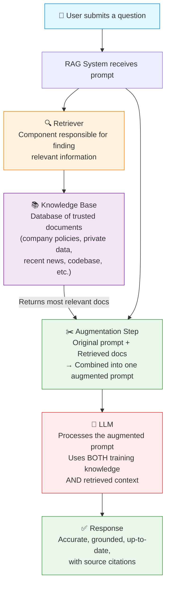
```mermaid
flowchart TB
    U["📝 User submits a question"] --> ROUTE["RAG System receives prompt"]
    ROUTE --> RET["🔍 Retriever<br/>Component responsible for finding<br/>relevant information"]
    RET --> KB["📚 Knowledge Base<br/>Database of trusted documents<br/>(company policies, private data,<br/>recent news, codebase, etc.)"]
    KB -->|"Returns most relevant docs"| AUGM
    
    ROUTE --> AUGM["✂️ Augmentation Step<br/>Original prompt + Retrieved docs<br/>→ Combined into one augmented prompt"]
    AUGM --> LLM_PROC["🧠 LLM<br/>Processes the augmented prompt<br/>Uses BOTH training knowledge<br/>AND retrieved context"]
    LLM_PROC --> RESP["✅ Response<br/>Accurate, grounded, up-to-date,<br/>with source citations"]
    
    style U fill:#e1f5fe,stroke:#0288d1
    style RET fill:#fff3e0,stroke:#f57c00
    style KB fill:#f3e5f5,stroke:#7b1fa2
    style AUGM fill:#e8f5e9,stroke:#388e3c
    style LLM_PROC fill:#ffebee,stroke:#d32f2f
    style RESP fill:#e8f5e9,stroke:#388e3c
```

### Normal LLM vs RAG System — Side by Side
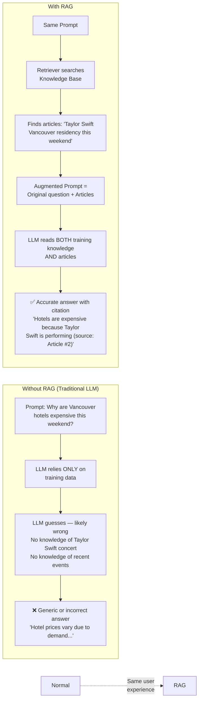
```mermaid
flowchart LR
    subgraph Normal_BOX["Without RAG (Traditional LLM)"]
        direction TB
        N1["Prompt: Why are Vancouver<br/>hotels expensive this weekend?"] --> N2["LLM relies ONLY on<br/>training data"]
        N2 --> N3["LLM guesses — likely wrong<br/>No knowledge of Taylor Swift concert<br/>No knowledge of recent events"]
        N3 --> N4["❌ Generic or incorrect answer<br/>'Hotel prices vary due to demand...'"]
    end
    
    subgraph RAG_BOX["With RAG"]
        direction TB
        R1["Same Prompt"] --> R2["Retriever searches<br/>Knowledge Base"]
        R2 --> R3["Finds articles: 'Taylor Swift<br/>Vancouver residency this weekend'"]
        R3 --> R4["Augmented Prompt =<br/>Original question + Articles"]
        R4 --> R5["LLM reads BOTH training knowledge<br/>AND articles"]
        R5 --> R6["✅ Accurate answer with citation<br/>'Hotels are expensive because Taylor<br/>Swift is performing (source: Article #2)'"]
    end
    
    Normal -.->|"Same user<br/>experience"| RAG
```

### The Augmented Prompt — What It Actually Looks Like
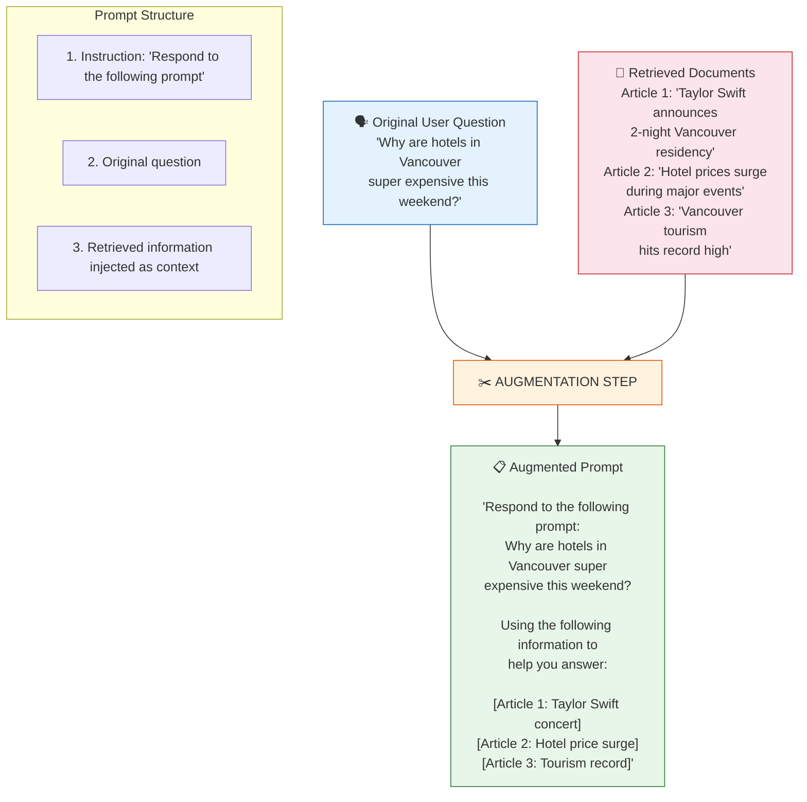
```mermaid
flowchart TB
    Q["🗣️ Original User Question<br/>'Why are hotels in Vancouver<br/>super expensive this weekend?'"] --> MERGE
    
    DOCS["📄 Retrieved Documents<br/>Article 1: 'Taylor Swift announces<br/>2-night Vancouver residency'<br/>Article 2: 'Hotel prices surge<br/>during major events'<br/>Article 3: 'Vancouver tourism<br/>hits record high'"] --> MERGE
    
    MERGE["✂️ AUGMENTATION STEP"] --> FINAL
    
    FINAL["📋 Augmented Prompt<br/><br/>'Respond to the following prompt:<br/>Why are hotels in Vancouver super<br/>expensive this weekend?<br/><br/>Using the following information to<br/>help you answer:<br/><br/>[Article 1: Taylor Swift concert]<br/>[Article 2: Hotel price surge]<br/>[Article 3: Tourism record]'"]
    
    subgraph Structure_BOX["Prompt Structure"]
        S1["1. Instruction: 'Respond to the following prompt'"]
        S2["2. Original question"]
        S3["3. Retrieved information injected as context"]
    end
    
    style Q fill:#e3f2fd,stroke:#1565c0
    style DOCS fill:#fce4ec,stroke:#c62828
    style MERGE fill:#fff3e0,stroke:#e65100
    style FINAL fill:#e8f5e9,stroke:#2e7d32
```

### Component Responsibilities — Who Does What
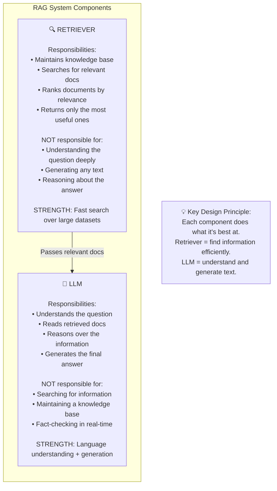
```mermaid
flowchart TB
    subgraph Components_BOX["RAG System Components"]
        direction TB
        RETR["🔍 RETRIEVER<br/><br/>Responsibilities:<br/>• Maintains knowledge base<br/>• Searches for relevant docs<br/>• Ranks documents by relevance<br/>• Returns only the most useful ones<br/><br/>NOT responsible for:<br/>• Understanding the question deeply<br/>• Generating any text<br/>• Reasoning about the answer<br/><br/>STRENGTH: Fast search over large datasets"]
        
        LLM_COMP["🧠 LLM<br/><br/>Responsibilities:<br/>• Understands the question<br/>• Reads retrieved docs<br/>• Reasons over the information<br/>• Generates the final answer<br/><br/>NOT responsible for:<br/>• Searching for information<br/>• Maintaining a knowledge base<br/>• Fact-checking in real-time<br/><br/>STRENGTH: Language understanding + generation"]
    end
    
    RETR -->|"Passes relevant docs"| LLM_COMP
    
    note["💡 Key Design Principle:<br/>Each component does what it's best at.<br/>Retriever = find information efficiently.<br/>LLM = understand and generate text."]
```

### Three Levels of Questions — Decision Flow
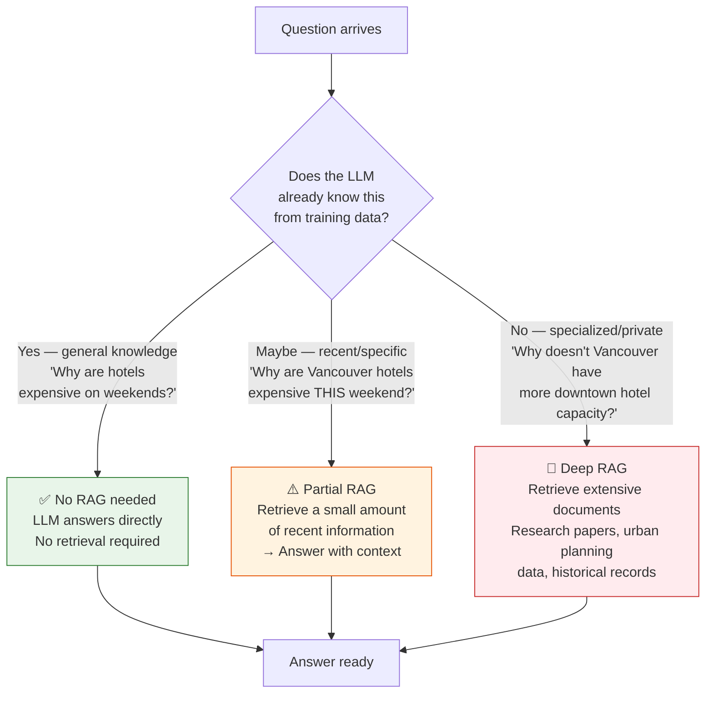
```mermaid
flowchart TD
    START["Question arrives"] --> CHECK{"Does the LLM<br/>already know this<br/>from training data?"}
    
    CHECK -->|"Yes — general knowledge<br/>'Why are hotels<br/>expensive on weekends?'"| NO_RAG["✅ No RAG needed<br/>LLM answers directly<br/>No retrieval required"]
    
    CHECK -->|"Maybe — recent/specific<br/>'Why are Vancouver hotels<br/>expensive THIS weekend?'"| SOME_RAG["⚠️ Partial RAG<br/>Retrieve a small amount<br/>of recent information<br/>→ Answer with context"]
    
    CHECK -->|"No — specialized/private<br/>'Why doesn't Vancouver have<br/>more downtown hotel capacity?'"| DEEP_RAG["🔴 Deep RAG<br/>Retrieve extensive documents<br/>Research papers, urban planning<br/>data, historical records"]
    
    NO_RAG --> RESULT["Answer ready"]
    SOME_RAG --> RESULT
    DEEP_RAG --> RESULT
    
    style NO_RAG fill:#e8f5e9,stroke:#2e7d32
    style SOME_RAG fill:#fff3e0,stroke:#e65100
    style DEEP_RAG fill:#ffebee,stroke:#c62828
```

---

## Retrieval Process — What Happens Inside

### Step-by-Step: How a Query Becomes a Result
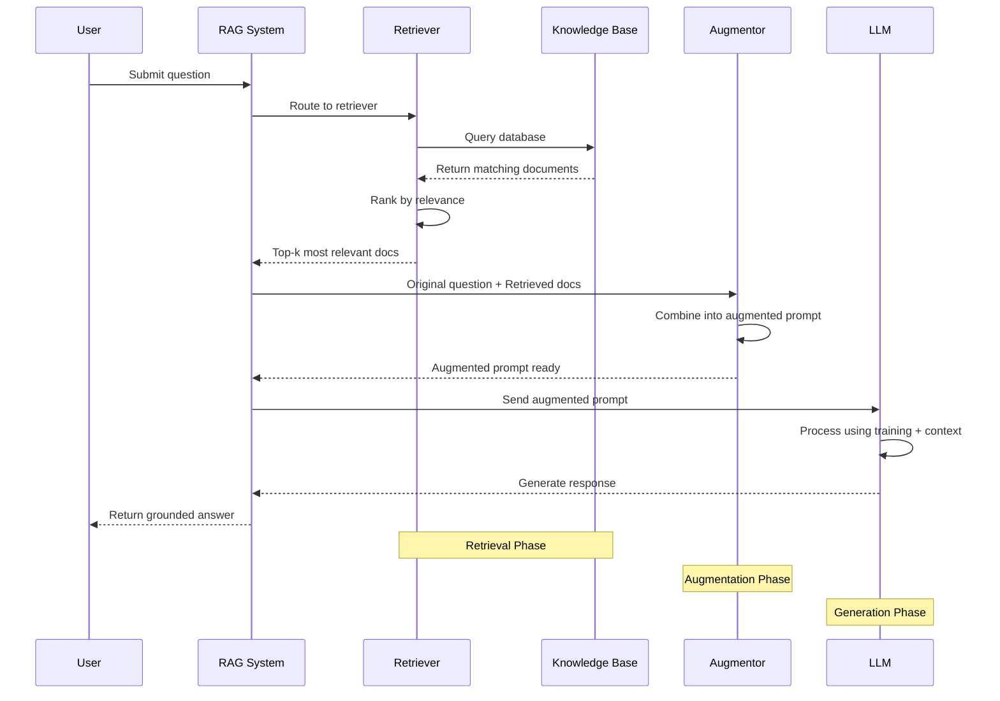
```mermaid
sequenceDiagram
    participant U as User
    participant RAG as RAG System
    participant RET as Retriever
    participant KB as Knowledge Base
    participant AUG as Augmentor
    participant LLM as LLM
    
    U->>RAG: Submit question
    RAG->>RET: Route to retriever
    RET->>KB: Query database
    KB-->>RET: Return matching documents
    RET->>RET: Rank by relevance
    RET-->>RAG: Top-k most relevant docs
    RAG->>AUG: Original question + Retrieved docs
    AUG->>AUG: Combine into augmented prompt
    AUG-->>RAG: Augmented prompt ready
    RAG->>LLM: Send augmented prompt
    LLM->>LLM: Process using training + context
    LLM-->>RAG: Generate response
    RAG-->>U: Return grounded answer
    
    Note over RET,KB: Retrieval Phase
    Note over AUG: Augmentation Phase
    Note over LLM: Generation Phase
```

### How Knowledge Bases Work
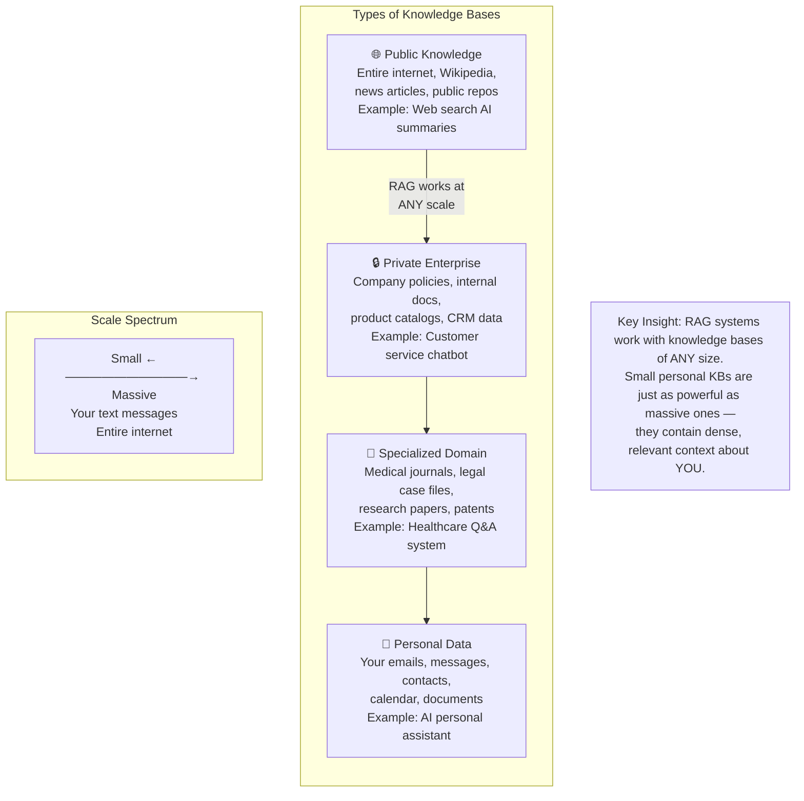
```mermaid
flowchart TB
    subgraph Types_BOX["Types of Knowledge Bases"]
        direction TB
        PUBLIC["🌐 Public Knowledge<br/>Entire internet, Wikipedia,<br/>news articles, public repos<br/>Example: Web search AI summaries"]
        PRIVATE["🔒 Private Enterprise<br/>Company policies, internal docs,<br/>product catalogs, CRM data<br/>Example: Customer service chatbot"]
        PERSONAL["👤 Personal Data<br/>Your emails, messages, contacts,<br/>calendar, documents<br/>Example: AI personal assistant"]
        SPECIALIZED["📘 Specialized Domain<br/>Medical journals, legal case files,<br/>research papers, patents<br/>Example: Healthcare Q&A system"]
    end
    
    subgraph Scale_BOX["Scale Spectrum"]
        S1["Small ←——————————→ Massive<br/>Your text messages      Entire internet"]
    end
    
    PUBLIC -->|"RAG works at<br/>ANY scale"| PRIVATE
    PRIVATE --> SPECIALIZED
    SPECIALIZED --> PERSONAL
    
    note["Key Insight: RAG systems work with knowledge bases of ANY size.<br/>Small personal KBs are just as powerful as massive ones —<br/>they contain dense, relevant context about YOU."]
```

---

## 5 Advantages of RAG — Detailed Breakdown

### Advantage 1: Makes Unavailable Information Available
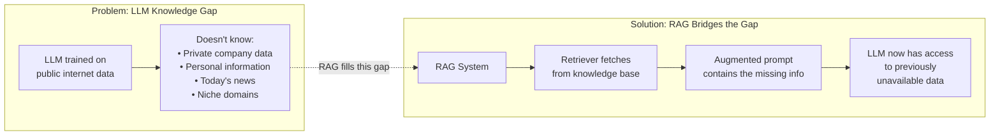
```mermaid
flowchart LR
    subgraph Problem_BOX["Problem: LLM Knowledge Gap"]
        P1["LLM trained on<br/>public internet data"] --> P2["Doesn't know:<br/>• Private company data<br/>• Personal information<br/>• Today's news<br/>• Niche domains"]
    end
    
    subgraph Solution_BOX["Solution: RAG Bridges the Gap"]
        S1["RAG System"] --> S2["Retriever fetches<br/>from knowledge base"]
        S2 --> S3["Augmented prompt<br/>contains the missing info"]
        S3 --> S4["LLM now has access<br/>to previously<br/>unavailable data"]
    end
    
    P2 -.->|"RAG fills this gap"| S1
```

### Advantage 2: Reduces Hallucinations
| Cause of Hallucination | How RAG Fixes It |
|------------------------|-----------------|
| LLM was asked about a topic rarely seen in training | Retrieved docs provide the facts — LLM doesn't need to guess |
| LLM was asked about recent events after training cutoff | Knowledge base can be updated instantly with new info |
| LLM was asked about private/niche data it never saw | RAG retrieves from the private KB — LLM reads it directly |
| LLM is uncertain and "hedges" with generic text | Retrieved context forces specificity — answer is grounded |

### Advantage 3: Easy to Update
```
Without RAG:
  Training data (cutoff date: Jan 2024)
      ↓
  Retrain entire model ($10M+, months of work)
      ↓
  New training data (cutoff date: Jan 2025)
  
With RAG:
  Knowledge Base entry (created today)
      ↓
  Index the new document (minutes)
      ↓
  LLM can answer based on it immediately
```

### Advantage 4: Source Citations
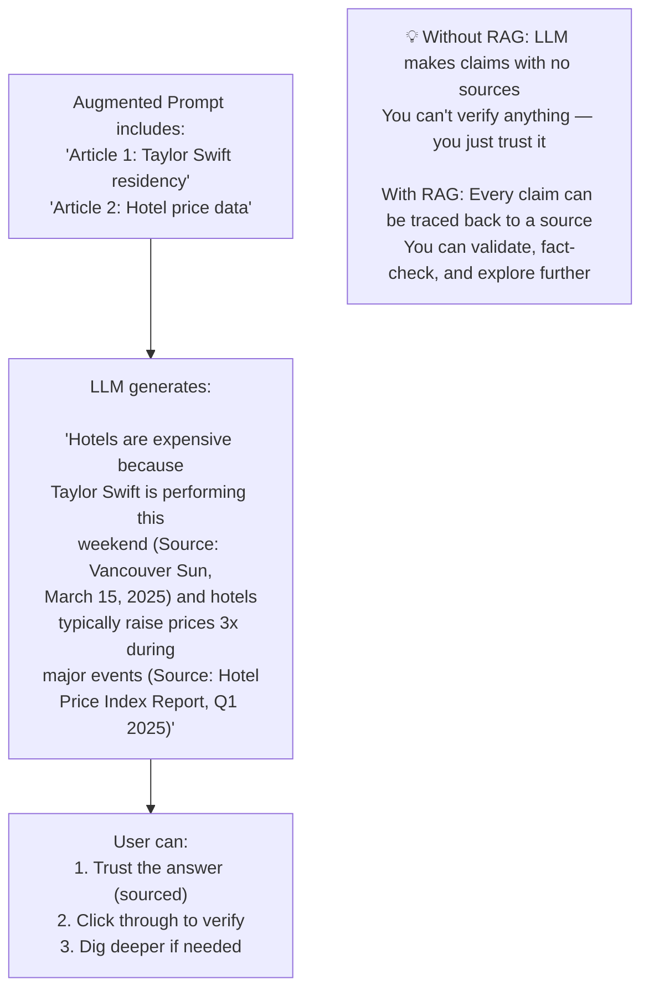
```mermaid
flowchart TB
    AUG["Augmented Prompt includes:<br/>'Article 1: Taylor Swift residency'<br/>'Article 2: Hotel price data'"] --> LLM_CITE["LLM generates:<br/><br/>'Hotels are expensive because<br/>Taylor Swift is performing this<br/>weekend (Source: Vancouver Sun,<br/>March 15, 2025) and hotels<br/>typically raise prices 3x during<br/>major events (Source: Hotel<br/>Price Index Report, Q1 2025)'"]
    
    LLM_CITE --> USER["User can:<br/>1. Trust the answer (sourced)<br/>2. Click through to verify<br/>3. Dig deeper if needed"]
    
    note["💡 Without RAG: LLM makes claims with no sources<br/>You can't verify anything — you just trust it<br/><br/>With RAG: Every claim can be traced back to a source<br/>You can validate, fact-check, and explore further"]
```

### Advantage 5: Component Separation
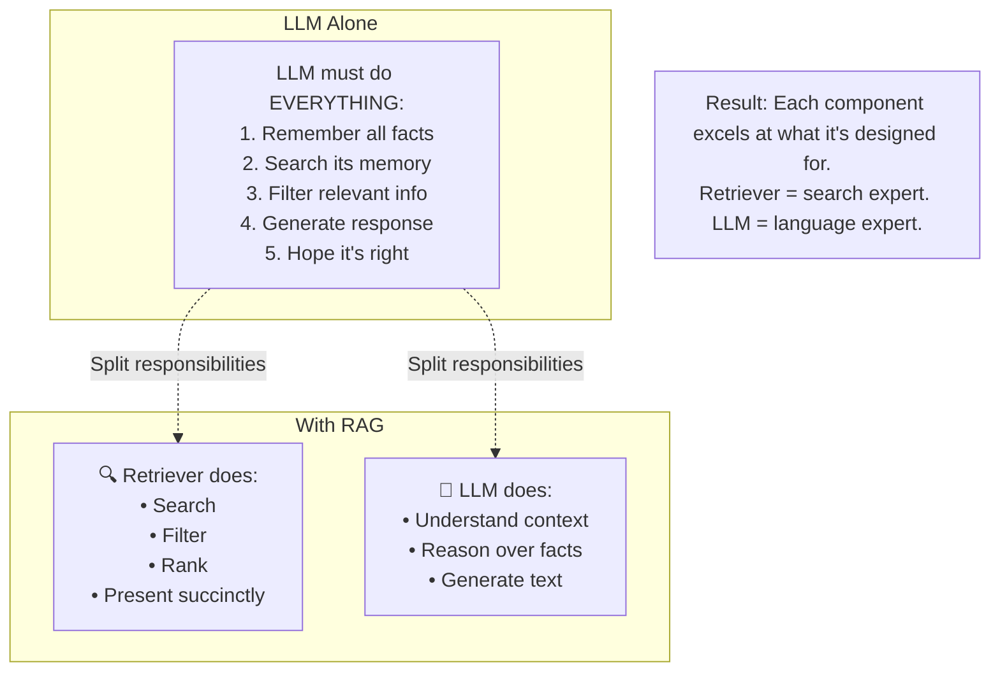
```mermaid
flowchart TB
    subgraph Without_BOX["LLM Alone"]
        W1["LLM must do EVERYTHING:<br/>1. Remember all facts<br/>2. Search its memory<br/>3. Filter relevant info<br/>4. Generate response<br/>5. Hope it's right"]
    end
    
    subgraph With_BOX["With RAG"]
        R1["🔍 Retriever does:<br/>• Search<br/>• Filter<br/>• Rank<br/>• Present succinctly"]
        R2["🧠 LLM does:<br/>• Understand context<br/>• Reason over facts<br/>• Generate text"]
    end
    
    W1 -.->|"Split responsibilities"| R1
    W1 -.->|"Split responsibilities"| R2
    
    note["Result: Each component excels at what it's designed for.<br/>Retriever = search expert. LLM = language expert."]
```

---

## Applications in Detail — Architecture Deep Dive

### Code Generation RAG
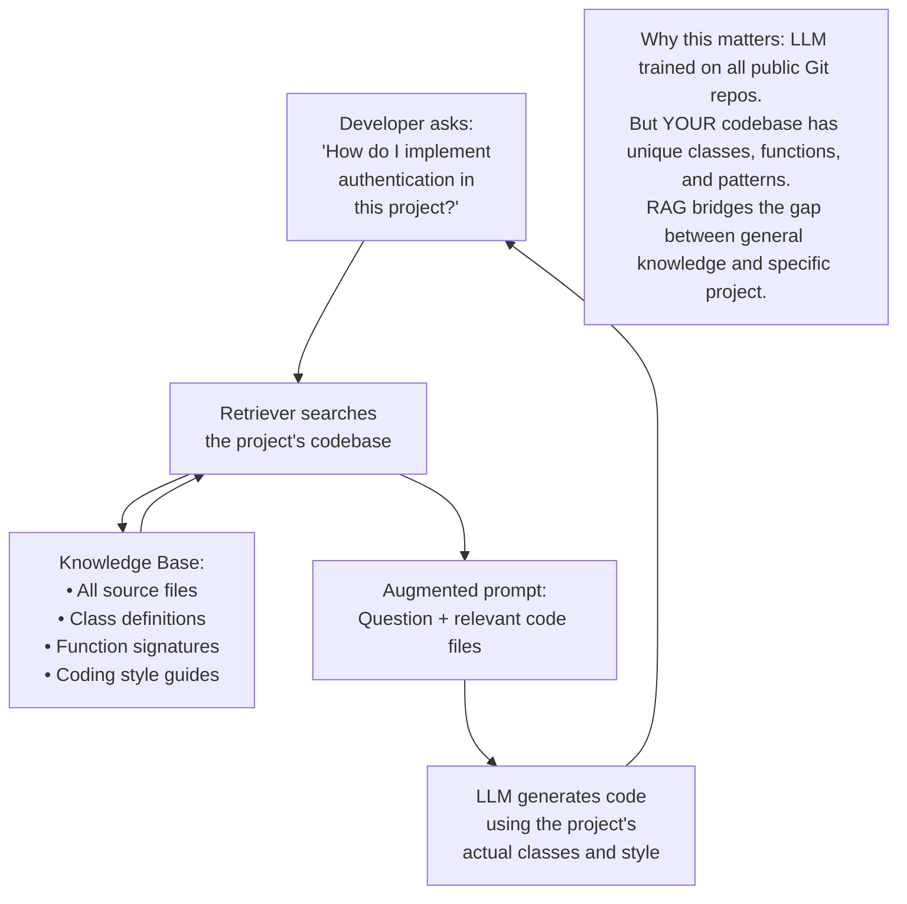
```mermaid
flowchart TB
    DEV["Developer asks:<br/>'How do I implement<br/>authentication in<br/>this project?'"] --> RET_CODE["Retriever searches<br/>the project's codebase"]
    RET_CODE --> CODE_KB["Knowledge Base:<br/>• All source files<br/>• Class definitions<br/>• Function signatures<br/>• Coding style guides"]
    CODE_KB --> RET_CODE
    RET_CODE --> AUG_CODE["Augmented prompt:<br/>Question + relevant code files"]
    AUG_CODE --> LLM_CODE["LLM generates code<br/>using the project's<br/>actual classes and style"]
    LLM_CODE --> DEV
    
    note["Why this matters: LLM trained on all public Git repos.<br/>But YOUR codebase has unique classes, functions, and patterns.<br/>RAG bridges the gap between general knowledge and specific project."]
```

### Enterprise Chatbot RAG
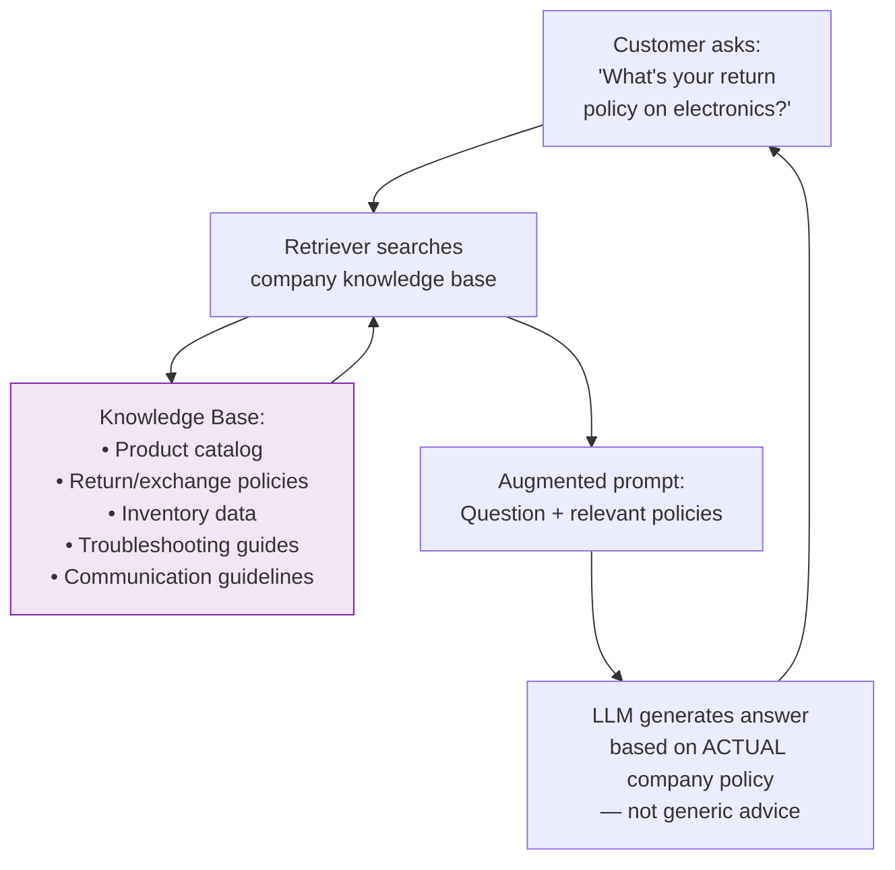
```mermaid
flowchart TB
    CUST["Customer asks:<br/>'What's your return<br/>policy on electronics?'"] --> RET_ENT["Retriever searches<br/>company knowledge base"]
    RET_ENT --> ENT_KB["Knowledge Base:<br/>• Product catalog<br/>• Return/exchange policies<br/>• Inventory data<br/>• Troubleshooting guides<br/>• Communication guidelines"]
    ENT_KB --> RET_ENT
    RET_ENT --> AUG_ENT["Augmented prompt:<br/>Question + relevant policies"]
    AUG_ENT --> LLM_ENT["LLM generates answer<br/>based on ACTUAL company policy<br/>— not generic advice"]
    LLM_ENT --> CUST
    
    style ENT_KB fill:#f3e5f5,stroke:#7b1fa2
```

### Healthcare/Legal RAG
```
Why RAG is CRITICAL in these domains:
┌─────────────────────────────────────────────────────────────┐
│  Without RAG: "I'm not a doctor, but based on my training   │
│  data, I think the treatment for X is Y."                   │
│  → Can't cite specific medical journals                     │
│  → Can't reference the patient's private records            │
│  → Liability risk if wrong                                  │
├─────────────────────────────────────────────────────────────┤
│  With RAG: "According to the New England Journal of         │
│  Medicine (2024, Vol. 382, p. 145-152), the recommended    │
│  treatment for X is Y. Here are the relevant excerpts..."   │
│  → Cites specific sources                                   │
│  → Grounded in peer-reviewed research                       │
│  → Verifiable by medical professionals                     │
└─────────────────────────────────────────────────────────────┘
```

---

## Key Design Principles

| Principle | Explanation | Why It Matters |
|-----------|-------------|----------------|
| **Separation of concerns** | Retriever searches, LLM generates | Each component optimized for one task |
| **Knowledge as a service** | KB is independent of the LLM | Update data without retraining |
| **Grounding** | Responses must be traceable to sources | Builds trust, enables verification |
| **Freshness** | KB can be updated in real-time | LLM always has current info |
| **Scope control** | Retriever limits what the LLM sees | Prevents LLM from going off-topic |

---

## Module 1 Recap — Everything Covered

| Topic | Key Takeaway |
|-------|-------------|
| **What is RAG** | LLM + Retriever + Knowledge Base working together |
| **Why LLMs need it** | Training data has gaps — private, recent, specialized info |
| **How it works** | Retrieve → Augment → Generate |
| **Architecture** | Retriever queries KB → Augmented prompt → LLM responds |
| **5 Advantages** | Info access, less hallucinations, easy updates, citations, separation |
| **Applications** | Code gen, chatbots, healthcare, web search, personal assistants |
| **Key insight** | Same UX as normal LLM — but far more accurate |

---

## What Comes Next
- Module 2: Building a **robust retriever**
- Module 3: **Vector databases** for efficient similarity search
- Module 4: **Sophisticated LLM usage** with retrieved context
- Module 5+: **Monitoring, evaluation, and optimization** techniques

---

## How LLMs Work — Deep Dive

### LLMs = Fancy Autocomplete

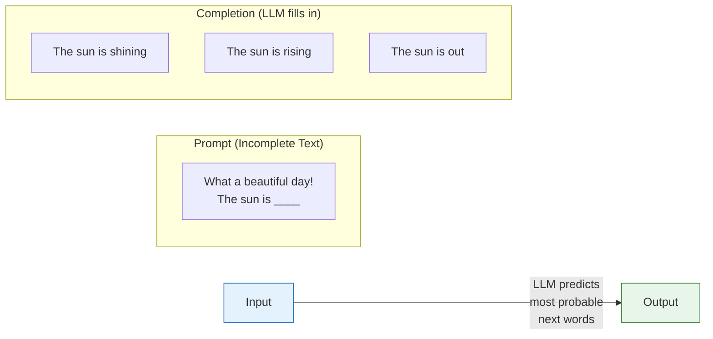
```mermaid
flowchart LR
    subgraph Input_BOX["Prompt (Incomplete Text)"]
        I["What a beautiful day!<br/>The sun is ____"]
    end
    
    subgraph Output_BOX["Completion (LLM fills in)"]
        O1["The sun is shining"]
        O2["The sun is rising"]
        O3["The sun is out"]
    end
    
    Input -->|"LLM predicts<br/>most probable<br/>next words"| Output
    
    style Input fill:#e3f2fd,stroke:#1565c0
    style Output fill:#e8f5e9,stroke:#2e7d32
```

| Term | Definition | Example |
|------|-----------|---------|
| **Prompt** | The incomplete text you give the LLM | `"What a beautiful day! The sun is "` |
| **Completion** | The text the LLM generates to continue the prompt | `"shining in the sky."` |
| **Token** | A piece of a word or punctuation | `"un"` + `"happy"` = `"unhappy"` |
| **Vocabulary** | All tokens the LLM knows | 10,000 to 100,000+ tokens |

### Tokenization — How Text Becomes Tokens

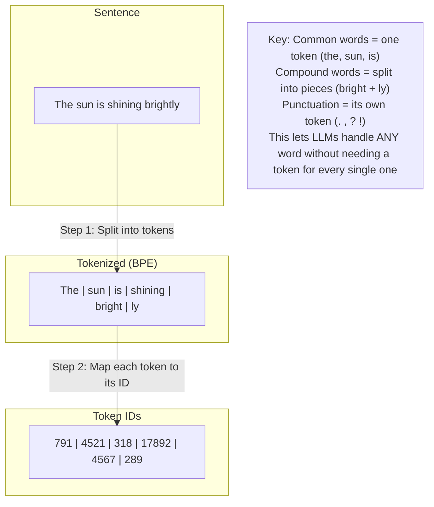
```mermaid
flowchart TB
    subgraph Words_BOX["Sentence"]
        W["The sun is shining brightly"]
    end
    
    subgraph Tokens_BOX["Tokenized (BPE)"]
        T["The | sun | is | shining | bright | ly"]
    end
    
    subgraph IDs_BOX["Token IDs"]
        ID["791 | 4521 | 318 | 17892 | 4567 | 289"]
    end
    
    W -->|"Step 1: Split into tokens"| T
    T -->|"Step 2: Map each token to its ID"| ID
    
    note["Key: Common words = one token (the, sun, is)<br/>Compound words = split into pieces (bright + ly)<br/>Punctuation = its own token (. , ? !)<br/>This lets LLMs handle ANY word without needing a token for every single one"]
```

### How Generation Works — Step by Step

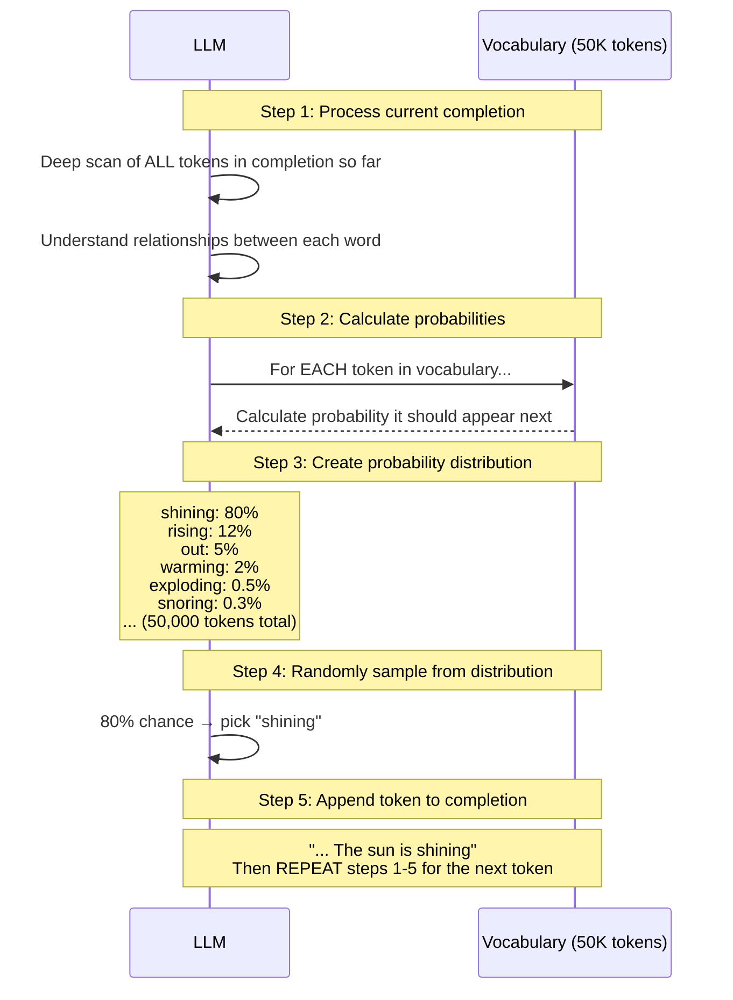
```mermaid
sequenceDiagram
    participant LLM as LLM
    participant VOCAB as Vocabulary (50K tokens)
    
    Note over LLM,VOCAB: Step 1: Process current completion
    LLM->>LLM: Deep scan of ALL tokens in completion so far
    LLM->>LLM: Understand relationships between each word
    
    Note over LLM,VOCAB: Step 2: Calculate probabilities
    LLM->>VOCAB: For EACH token in vocabulary...
    VOCAB-->>LLM: Calculate probability it should appear next
    
    Note over LLM,VOCAB: Step 3: Create probability distribution
    Note over LLM: shining: 80%<br/>rising: 12%<br/>out: 5%<br/>warming: 2%<br/>exploding: 0.5%<br/>snoring: 0.3%<br/>... (50,000 tokens total)
    
    Note over LLM,VOCAB: Step 4: Randomly sample from distribution
    LLM->>LLM: 80% chance → pick "shining"
    
    Note over LLM,VOCAB: Step 5: Append token to completion
    Note over LLM,VOCAB: "... The sun is shining"<br/>Then REPEAT steps 1-5 for the next token
```

### Probability Distribution — What the LLM Sees

```python
# Simplified: What the LLM calculates internally
token_probabilities = {
    "shining":   0.80,    # Most probable — makes most sense
    "rising":    0.12,    # Possible but less likely
    "out":       0.05,    # Could work
    "warming":   0.02,    # Unlikely but grammatically valid
    "exploding": 0.005,   # Very unlikely (the sun doesn't explode)
    "snoring":   0.003,   # Almost never — makes no sense
    # ... 49,994 more tokens with tiny probabilities
}

# LLM randomly samples from this distribution
# 80% of the time → "shining"
# 12% of the time → "rising"  
# 0.5% of the time → "exploding" (rare but possible!)
```

**Key insight**: The LLM doesn't "think" or "reason" — it calculates probabilities for every single token in its vocabulary, then randomly picks one. Even improbable words have a non-zero chance.

### Autoregressive Generation — Each Choice Affects Future Choices

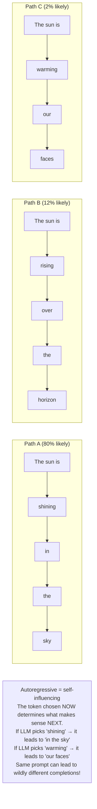
```mermaid
flowchart LR
    subgraph Path1_BOX["Path A (80% likely)"]
        A1["The sun is"] --> A2["shining"]
        A2 --> A3["in"]
        A3 --> A4["the"]
        A4 --> A5["sky"]
    end
    
    subgraph Path2_BOX["Path B (12% likely)"]
        B1["The sun is"] --> B2["rising"]
        B2 --> B3["over"]
        B3 --> B4["the"]
        B4 --> B5["horizon"]
    end
    
    subgraph Path3_BOX["Path C (2% likely)"]
        C1["The sun is"] --> C2["warming"]
        C2 --> C3["our"]
        C3 --> C4["faces"]
    end
    
    note["Autoregressive = self-influencing<br/>The token chosen NOW determines what makes sense NEXT.<br/>If LLM picks 'shining' → it leads to 'in the sky'<br/>If LLM picks 'warming' → it leads to 'our faces'<br/>Same prompt can lead to wildly different completions!"]
```

| Concept | Explanation | Example |
|---------|-------------|---------|
| **Autoregressive** | Each new token depends on ALL tokens generated before it | `shining` → `in` → `the` → `sky` makes sense because `shining` was chosen first |
| **Randomness** | Same prompt → different completions each time | Run it 10 times, get 10 different (but similar) responses |
| **Accumulation** | Early choices constrain later possibilities | If you pick `warming`, you can't go back to `in the sky` |

### Training — How LLMs Learn

```mermaid
flowchart TB
    subgraph Data_BOX["Training Data"]
        D1["Trillions of tokens<br/>from the open internet"]
        D2["Books, articles, code,<br/>social media, forums"]
    end
    
    subgraph Model_BOX["Before Training"]
        M1["Random parameters<br/>(billions of numbers)"]
        M2["Output: pure gibberish"]
    end
    
    subgraph Training_BOX["Training Process"]
        T1["Show incomplete text<br/>from training data"]
        T2["LLM predicts next token"]
        T3["Compare prediction to<br/>ACTUAL next token"]
        T4["Update internal parameters<br/>to make better predictions"]
    end
    
    subgraph Result_BOX["After Training"]
        R1["Learned parameters<br/>(billions of numbers)"]
        R2["Output: coherent text<br/>in a variety of styles"]
    end
    
    Data --> Training
    Model --> Training
    Training --> Result
    
    loop["Repeat billions of times"]
        T1 --> T2 --> T3 --> T4 --> T1
    end
```

```python
# Simplified training step
def training_step(training_text):
    # Training text: "The sun is shining brightly today"
    
    # Step 1: Show incomplete text
    prompt = "The sun is"
    actual_next_word = "shining"  # From training data
    
    # Step 2: LLM predicts
    prediction = llm.predict(prompt)  # Current best guess
    
    # Step 3: Calculate error
    error = abs(prediction - actual_next_word)  # How wrong was it?
    
    # Step 4: Update parameters
    for param in llm.parameters:  # Billions of parameters
        param.adjust(error)  # Tiny adjustment to be more correct next time
    
    # Repeat for EVERY position in EVERY text in the training data
```

**What the model learns:**
- Which words commonly appear together (`sun` → `shining`)
- In what order they typically appear (adjective before noun)
- What words mean in context (`bank` = river bank vs financial bank)
- Writing styles and genres (academic, casual, technical)

### Hallucinations — Why LLMs Make Things Up

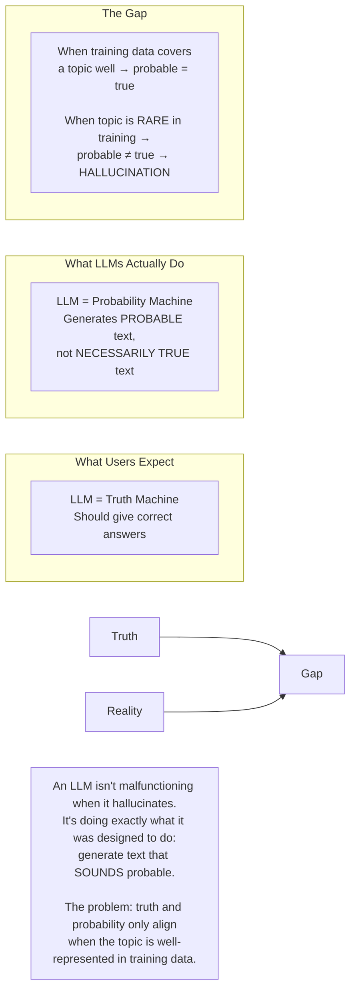
```mermaid
flowchart LR
    subgraph Truth_BOX["What Users Expect"]
        T["LLM = Truth Machine<br/>Should give correct answers"]
    end
    
    subgraph Reality_BOX["What LLMs Actually Do"]
        R["LLM = Probability Machine<br/>Generates PROBABLE text,<br/>not NECESSARILY TRUE text"]
    end
    
    subgraph Gap_BOX["The Gap"]
        G["When training data covers<br/>a topic well → probable = true<br/><br/>When topic is RARE in training →<br/>probable ≠ true → HALLUCINATION"]
    end
    
    Truth --> Gap
    Reality --> Gap
    
    note["An LLM isn't malfunctioning when it hallucinates.<br/>It's doing exactly what it was designed to do:<br/>generate text that SOUNDS probable.<br/><br/>The problem: truth and probability only align<br/>when the topic is well-represented in training data."]
```

| Cause of Hallucination | Why It Happens | How RAG Fixes It |
|------------------------|----------------|------------------|
| **Topic not in training** | LLM never saw this info → generates closest match | RAG retrieves the actual info → LLM reads it |
| **Topic rarely seen** | Only a few examples in training → statistical noise | RAG provides multiple relevant docs → grounds the response |
| **Recent events** | Happened after training cutoff → LLM has no data | RAG KB can be updated instantly |
| **Private data** | Company intranet, personal documents → never on the public internet | RAG KB contains the private docs |

### Context Windows — The LLM's Working Memory

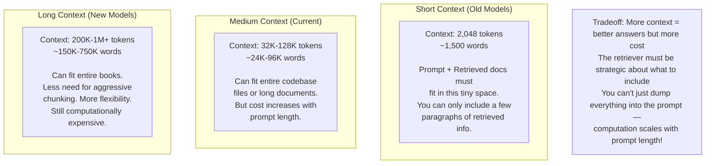
```mermaid
flowchart TB
    subgraph Short_BOX["Short Context (Old Models)"]
        S1["Context: 2,048 tokens<br/>~1,500 words<br/><br/>Prompt + Retrieved docs must<br/>fit in this tiny space.<br/>You can only include a few<br/>paragraphs of retrieved info."]
    end
    
    subgraph Medium_BOX["Medium Context (Current)"]
        M1["Context: 32K-128K tokens<br/>~24K-96K words<br/><br/>Can fit entire codebase<br/>files or long documents.<br/>But cost increases with<br/>prompt length."]
    end
    
    subgraph Long_BOX["Long Context (New Models)"]
        L1["Context: 200K-1M+ tokens<br/>~150K-750K words<br/><br/>Can fit entire books.<br/>Less need for aggressive<br/>chunking. More flexibility.<br/>Still computationally expensive."]
    end
    
    note["Tradeoff: More context = better answers but more cost<br/>The retriever must be strategic about what to include<br/>You can't just dump everything into the prompt —<br/>computation scales with prompt length!"]
```

| Concern | Explanation |
|---------|-------------|
| **Computation cost** | Before generating each token, LLM scans EVERY token in the prompt. Longer prompts = slower generation. |
| **Context window limit** | Hard limit on total tokens. Retrieved docs + original prompt + completion must fit. |
| **Diminishing returns** | Adding more retrieved docs helps up to a point, then plateaus. Retriever must pick the MOST relevant. |
| **Open-source models** | This course uses TogetherAI + open-source models to look "under the hood" |

### Why This Matters for RAG

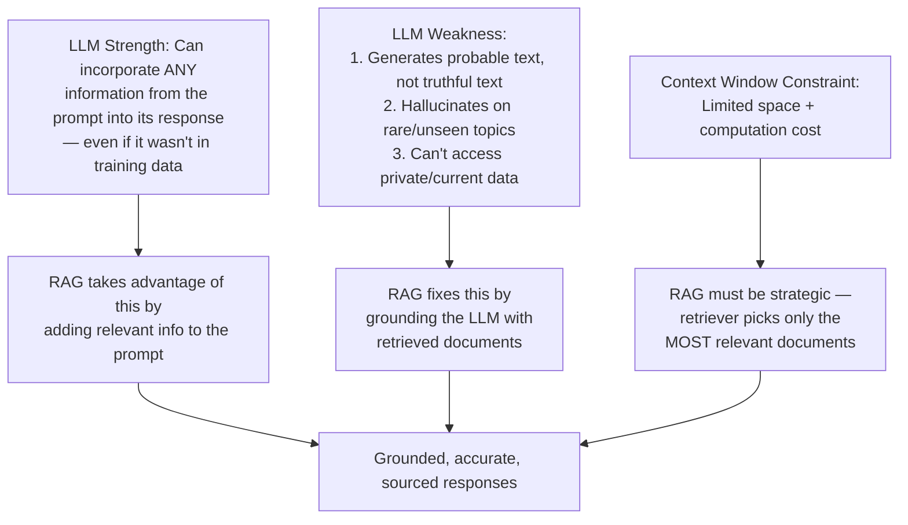
```mermaid
flowchart TB
    LLM["LLM Strength: Can incorporate ANY<br/>information from the prompt into its response<br/>— even if it wasn't in training data"] --> RAG1["RAG takes advantage of this by<br/>adding relevant info to the prompt"]
    
    LLM_WEAK["LLM Weakness:<br/>1. Generates probable text, not truthful text<br/>2. Hallucinates on rare/unseen topics<br/>3. Can't access private/current data"] --> RAG2["RAG fixes this by<br/>grounding the LLM with<br/>retrieved documents"]
    
    CTX["Context Window Constraint:<br/>Limited space + computation cost"] --> RAG3["RAG must be strategic —<br/>retriever picks only the<br/>MOST relevant documents"]
    
    RAG1 --> RESULT["Grounded, accurate, sourced responses"]
    RAG2 --> RESULT
    RAG3 --> RESULT
```

### Module 1 Key Takeaway on LLMs

> An LLM is a probability machine, not a truth machine. It generates text that **sounds right** based on its training data. RAG bridges the gap between "sounds right" and "IS right" by providing relevant documents in the prompt. The retriever's job is to find those documents efficiently within the context window limits.

---

## How Retrievers Work — Deep Dive

### The Library Analogy

```mermaid
flowchart TB
    subgraph Library_BOX["🏛️ A Library"]
        L_COLLECTION["📚 Collection of Books<br/>Organized by topic, genre, author"]
        L_INDEX["📇 Card Catalog (Index)<br/>Maps topics → shelf locations"]
        L_LIBRARIAN["👩‍💼 Librarian<br/>Understands your question<br/>Knows where to look"]
    end
    
    subgraph Retriever_BOX["🔍 A Retriever"]
        R_KB["📄 Knowledge Base<br/>Collection of documents"]
        R_INDEX["⚡ Index<br/>Organizes documents for fast search"]
        R_RET["⚙️ Retriever Logic<br/>Processes prompt meaning<br/>Searches index by relevance"]
    end
    
    Library -->|"Maps directly to"| Retriever
    
    Q1["You ask: How to make<br/>NY-style pizza at home?"] --> L_LIBRARIAN
    L_LIBRARIAN -->|"Looks in: Cooking,<br/>Italian Cuisine, New York"| L_COLLECTION
    
    Q2["User prompt arrives"] --> R_RET
    R_RET -->|"Searches index for:<br/>matching concepts"| R_INDEX
    R_INDEX --> R_KB
    R_KB -->|"Returns best matches"| R_RET
    
    style L_COLLECTION fill:#f3e5f5,stroke:#7b1fa2
    style L_INDEX fill:#e8eaf6,stroke:#283593
    style L_LIBRARIAN fill:#fff3e0,stroke:#e65100
    style R_KB fill:#f3e5f5,stroke:#7b1fa2
    style R_INDEX fill:#e8eaf6,stroke:#283593
    style R_RET fill:#fff3e0,stroke:#e65100
```

### What a Retriever Does — Step by Step

```mermaid
sequenceDiagram
    participant USER as User
    participant RAG as RAG System
    participant RET as Retriever
    participant INDEX as Index
    participant KB as Knowledge Base
    
    USER->>RAG: Submit prompt
    RAG->>RET: Route to retriever
    
    Note over RET: Step 1: Process the prompt
    RET->>RET: Analyze meaning of the question<br/>Identify key concepts and intent
    
    Note over RET: Step 2: Search the index
    RET->>INDEX: Query with processed understanding
    INDEX-->>RET: Find candidate documents
    
    Note over RET: Step 3: Score by relevance
    RET->>RET: Calculate similarity score<br/>for each candidate document<br/>Score = numerical measure of<br/>how relevant the doc is to the prompt
    
    Note over RET: Step 4: Rank and filter
    RET->>RET: Sort by score descending<br/>Decide how many to return<br/>(top-k strategy)
    
    RET->>KB: Fetch top-k documents
    KB-->>RET: Return full document text
    
    RET-->>RAG: Return ranked relevant documents
    RAG-->>USER: Generate grounded response
```

### The Retrieval Challenge — Precision vs Recall

```mermaid
flowchart TB
    subgraph TooMany_BOX["❌ Too Many Docs Retrieved"]
        TM1["Retriever returns ALL documents<br>that might be relevant"]
        TM2["Problem:<br/>• Expensive prompts (more tokens)<br/>• May exceed context window<br/>• Relevant info DROWNED in noise"]
        TM1 --> TM2
    end
    
    subgraph TooFew_BOX["❌ Too Few Docs Retrieved"]
        TF1["Retriever returns only the<br/>top 1 document"]
        TF2["Problem:<br/>• May miss relevant info in rank #2, #3, #4<br/>• LLM has incomplete context<br/>• Answer may be wrong"]
        TF1 --> TF2
    end
    
    subgraph JustRight_BOX["✅ Optimal Retrieval"]
        JR1["Retriever returns top-k documents<br/>where k is carefully tuned"]
        JR2["Result:<br/>• All relevant info included<br/>• Minimal noise<br/>• Fits in context window<br/>• Cost-efficient"]
        JR1 --> JR2
    end
    
    TooMany -.->|"Find the balance"| JustRight
    TooFew -.->|"Find the balance"| JustRight
```

| Term | Definition | Library Analogy |
|------|-----------|-----------------|
| **Knowledge Base** | Collection of all documents the retriever can search | The library's entire book collection |
| **Index** | Data structure that organizes documents for fast search | The card catalog telling you which shelf a book is on |
| **Query Processing** | Understanding the prompt's meaning and intent | The librarian interpreting your question |
| **Relevance Score** | Numerical measure of how relevant a document is to the prompt | How closely a book matches what you're looking for |
| **Top-k** | The k highest-scoring documents returned | The librarian handing you the 3 best books |

### Vector Databases — The Production-Scale Retriever

```mermaid
flowchart TB
    subgraph Options_BOX["Retriever Implementation Options"]
        OPT1["🗄️ Traditional Database<br/>(SQL/NoSQL)<br/><br/>Most companies already<br/>have data here<br/>Works but NOT optimized<br/>for similarity search"]
        OPT2["🔢 Vector Database<br/>(Pinecone, Chroma, Weaviate)<br/><br/>OPTIMIZED for finding<br/>similar documents<br/>Built for RAG at scale"]
    end
    
    OPT1 -->|"Good for small scale"| RESULT
    OPT2 -->|"Essential for production"| RESULT
    
    RESULT["RAG System with relevant<br/>documents fetched quickly"]
    
    note["Key Insight: Vector databases are specialized tools.<br/>Like using a dedicated search engine vs grep on a filesystem.<br/>Both can find things, but one is MUCH faster at scale."]
```

| Approach | Pros | Cons | Best For |
|----------|------|------|----------|
| **Traditional DB** | Already has your data, no migration needed | Slow for similarity search, not designed for text matching | Small-scale, prototyping |
| **Vector Database** | Purpose-built for similarity search, fast at scale | Requires embedding pipeline, extra infrastructure | Production RAG systems |

### Scoring Relevance — How It Works

```python
# Simplified: How a retriever scores documents
query = "How to make New York style pizza at home?"

documents = [
    "The history of pizza in Naples, Italy dates back to the 18th century...",
    "New York style pizza is characterized by its large, thin slices...",
    "The best pizza dough requires a high-gluten flour and proper fermentation...",
    "The Brooklyn Bridge was opened in 1883 and connects Manhattan...",
]

scores = []
for doc in documents:
    score = calculate_similarity(query, doc)  # Numerical measure
    scores.append((doc, score))

# Sorted by score descending:
# 1. "New York style pizza..." → score: 0.92  ← Most relevant
# 2. "The best pizza dough..." → score: 0.74  
# 3. "The history of pizza..." → score: 0.51
# 4. "The Brooklyn Bridge..."  → score: 0.03  ← Correctly low score!

# Return top-k (e.g., k=2):
return documents[0:2]  # Best 2 docs
```

**Key challenge**: The retriever must rank ALL documents and return only the most relevant. It needs to:
- Push relevant docs to the top (high score)
- Keep irrelevant docs at the bottom (low score)
- Choose the right cutoff point (how many to return)

### Retrieval vs Other Search Technologies

```mermaid
flowchart TB
    subgraph All_BOX["Information Retrieval (Broad Field)"]
        WEB["🌐 Web Search<br/>Google, Bing, DuckDuckGo<br/>Retrieves web pages<br/>matching a search query"]
        DB["🗄️ Database Query<br/>SQL: SELECT * FROM table<br/>WHERE condition<br/>Retrieves exact matches"]
        RAG_RET["🔍 RAG Retriever<br/>Retrieves documents<br/>most SIMILAR to prompt<br/>(not exact match)"]
    end
    
    note["All three are forms of information retrieval.<br/>The RAG retriever was INSPIRED by decades of research<br/>in web search and database systems."]
```

### What Makes a Good Retriever?

| Quality | What It Means | Why It Matters |
|---------|---------------|----------------|
| **Relevance** | Returns docs actually related to the prompt | LLM needs accurate context to generate good answers |
| **Precision** | Doesn't return irrelevant docs | Irrelevant docs waste context window and increase cost |
| **Recall** | Doesn't miss relevant docs | Missing relevant docs leads to incomplete answers |
| **Speed** | Returns results quickly | Users don't wait long for responses |
| **Scalability** | Works with millions of documents | Real-world knowledge bases can be massive |

### Summary — Retriever's Role in RAG

```mermaid
flowchart TB
    PROMPT["User Prompt"] --> RETRIEVER["🔍 RETRIEVER<br/><br/>1. Process prompt meaning<br/>2. Search knowledge base index<br/>3. Score documents by relevance<br/>4. Return top-k results"]
    RETRIEVER --> AUGMENT["AUGMENTATION<br/>Combine prompt + retrieved docs"]
    AUGMENT --> LLM_PROC["🧠 LLM<br/>Generate grounded answer"]
    
    RETRIEVER -.-> KB["📚 Knowledge Base<br/>(all available documents)"]
    
    style RETRIEVER fill:#fff3e0,stroke:#e65100,stroke-width:3px
```

> **The retriever's job**: Find the needle (relevant info) in the haystack (knowledge base) without bringing the whole haystack with it. Retrieve too little → LLM lacks context. Retrieve too much → wasted cost and context window overflow. The art of RAG is finding the balance.
