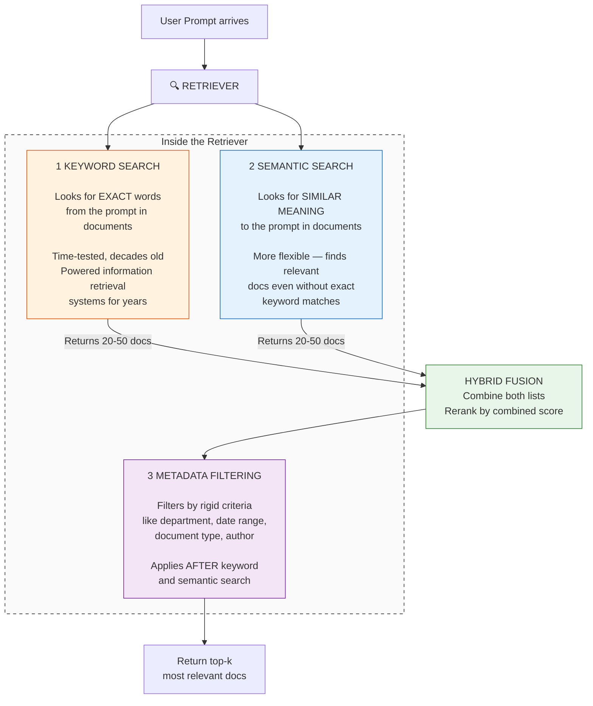
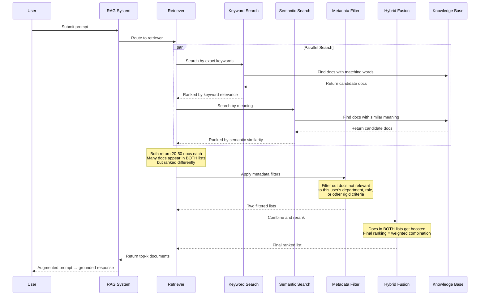
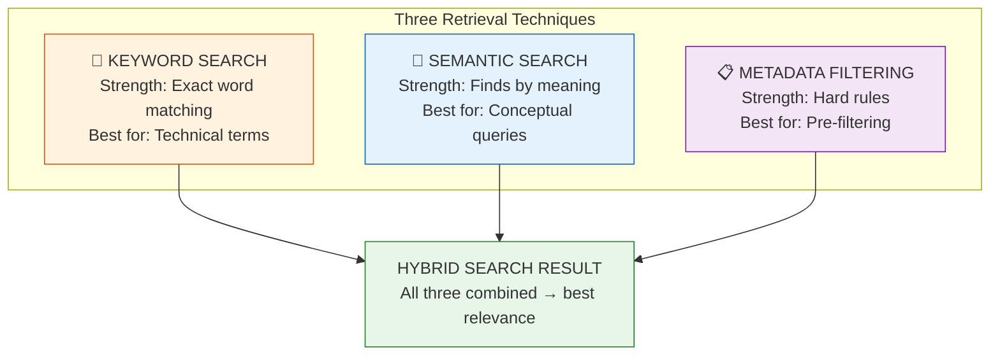
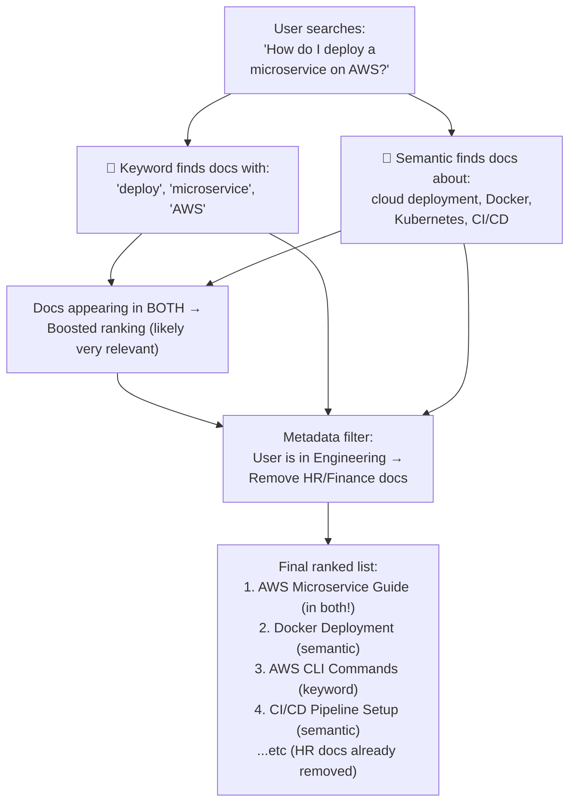

# Module 2: Robust Retriever

## Retriever Architecture — High Level

### Three Search Techniques in One Retriever



### Step-by-Step Retrieval Flow



### How the Three Techniques Compare



### Why All Three?

| Technique | What It Does | What It Catches | What It Misses | Why We Need It |
|-----------|-------------|-----------------|----------------|----------------|
| **Keyword Search** | Exact word match | "Python", "API", "GDPR" | Synonyms ("Python" → "scripting language") | Ensures precision for technical terms |
| **Semantic Search** | Meaning match | "How do I code?" → "programming tutorials" | Exact technical names | Adds flexibility — catches paraphrases |
| **Metadata Filtering** | Rigid criteria | Department, date, type, author | Doesn't measure relevance — just includes/excludes | Enforces business rules (e.g., "Engineering only") |

### How They Work Together



### Hybrid Search — The Key Insight

```python
# Simplified: What hybrid search does internally

keyword_results = [
    ("AWS Microservice Guide", 0.92),    # Has exact words "deploy", "microservice", "AWS"
    ("AWS CLI Commands", 0.78),           # Has "AWS" but not "microservice"
    ("EC2 Pricing Guide", 0.45),          # Has "AWS" loosely
]

semantic_results = [
    ("Docker Deployment Guide", 0.88),    # Similar meaning to "deploy microservice"
    ("AWS Microservice Guide", 0.85),     # Also semantically relevant
    ("Kubernetes Best Practices", 0.72),  # Related concept
]

# Hybrid fusion: Docs in BOTH lists get boosted
final_ranking = hybrid_fuse(keyword_results, semantic_results)
# 1. "AWS Microservice Guide" ← appears in BOTH lists → highest score
# 2. "Docker Deployment Guide" ← semantic only but high score
# 3. "AWS CLI Commands" ← keyword only
# ...

# Then apply metadata filter:
if user.department != "Engineering":
    final_ranking = remove_engineering_docs(final_ranking)
```

### Key Design Principles

| Principle | Explanation |
|-----------|-------------|
| **Complementary strengths** | Keyword catches exact terms, semantic catches meaning, metadata enforces rules |
| **Parallel execution** | Keyword + semantic search run simultaneously — one doesn't wait for the other |
| **Fusion boosts overlap** | Docs found by BOTH techniques are likely more relevant → get higher ranking |
| **Metadata as hard gate** | Metadata filtering is a PASS/FAIL gate, not a ranking signal |
| **Tunable balance** | You can weight keyword vs semantic importance based on your use case |

### What's Next

| Topic | What You'll Learn |
|-------|------------------|
| Metadata Filtering | Simplest technique — start here |
| Keyword Search | Next video — time-tested approach |
| Semantic Search | Most flexible — meaning-based retrieval |
| Hybrid Fusion | Combining all three for best results |

---

*Notes continue as transcripts are provided.*
