# LLMs, RAG & Agentic AI — Master Overview

> **Target**: Complete beginner who wants to understand the big picture before diving deep.
> **Flow**: Top-down. We start with WHAT RAG and Agentic AI are (so you know where we're going), then go UNDER THE HOOD into transformers, attention, probability, vector search — everything that makes them work.

---

# PART 0: THE BIG PICTURE (Read This First)

## 0.1 What is RAG? (30-Second Answer)

RAG = Retrieval-Augmented Generation. It means: before answering, the LLM looks up relevant information in a database.

```
User asks: "What's the company policy on remote work?"
                    │
                    ▼
     ┌─────────────────────────────┐
     │  SEARCH: Find relevant docs │
     │  "remote work policy.docx"  │
     └─────────────────────────────┘
                    │
                    ▼
     ┌─────────────────────────────┐
     │  LLM reads the doc + answers│
     │  "According to policy X..." │
     └─────────────────────────────┘
```

**Without RAG**: LLM guesses. Makes stuff up (hallucination).
**With RAG**: LLM reads the actual document. Answers from facts.

This is the SINGLE most common production pattern. ROAST, SYNAPSE, SuperOwl — all use RAG.

## 0.2 What is Agentic AI? (30-Second Answer)

An AI Agent is an LLM that can **use tools** and **make decisions** in a loop.

```
User: "Book me a flight to Mumbai next Friday"
                    │
                    ▼
     ┌─────────────────────────────────┐
     │  Agent REASONS: Need to:        │
     │  1. Search flights              │
     │  2. Check calendar              │
     │  3. Book if price < ₹8000       │
     └─────────────────────────────────┘
                    │
         ┌──────────┼──────────┐
         ▼          ▼          ▼
     SearchFlights CheckCal  BookFlight
      (tool)      (tool)     (tool)
```

The agent doesn't follow a script. It **thinks, acts, observes, adapts** — just like a human would.

## 0.3 How They Fit Together

RAG = LLM + Search (knowledge)
Agent = LLM + Tools (action)

Most production systems = RAG + Agentic combined.

```
SYNAPSE: User question → RAG (search KG + web) → Agent (analyze, reason) → Answer
ROAST: Resume → RAG (market intelligence) → Multi-agent pipeline → Review
SuperOwl: Call → RAG (KB search) → Agent (tools: notify, escalate, end call) → Response
```

**This whole document is about understanding every piece in that pipeline.**

---

# PART 1: WHY PROBABILITY IS THE FOUNDATION OF LLMs

## 1.1 An LLM is Just a Probability Machine

At its core, an LLM does ONE thing:

> Given a sequence of words, predict the **most probable next word**.

```python
Input:  "The capital of France is"
Output: "Paris"    (probability: 0.85)
        "Lyon"     (probability: 0.05)
        "known"    (probability: 0.03)
        ...
```

The model assigns a **probability** to every word in its vocabulary. It picks the most likely one.

```
P( next_word | "The capital of France is" ) = {
    "Paris": 0.85,
    "Lyon": 0.05,
    "known": 0.03,
    "a": 0.02,
    ...
}
```

This is why probability is THE most important math concept for LLMs. Not calculus. Not linear algebra. **Probability.**

## 1.2 Where Probability Appears in LLMs

| Concept | Probability Connection |
|---------|----------------------|
| **Softmax** | Converts raw scores into probabilities (all sum to 1.0) |
| **Temperature** | Controls how "peaky" the probability distribution is |
| **Top-P sampling** | Cut off low-probability words |
| **Cross-entropy loss** | Measures how wrong the predicted probabilities are |
| **Attention scores** | Softmax over relevance scores = probability distribution over tokens |
| **Hallucination** | Low-probability but plausible-sounding token sequences |

## 1.3 Softmax — The Most Important Function

Softmax turns any list of numbers into probabilities:

```python
import numpy as np

def softmax(scores):
    # scores: [2.0, 1.0, 0.1]
    exp_scores = np.exp(scores)  # [7.39, 2.72, 1.11]
    total = exp_scores.sum()     # 11.22
    probabilities = exp_scores / total  # [0.66, 0.24, 0.10]
    return probabilities

raw_scores = [2.0, 1.0, 0.1]
probs = softmax(raw_scores)
# Result: [0.66, 0.24, 0.10]
# Word A has 66% chance, Word B has 24%, Word C has 10%
```

**Why `exp`?** It amplifies differences. Score of 2.0 vs 1.0 becomes 66% vs 24% — a clear winner.

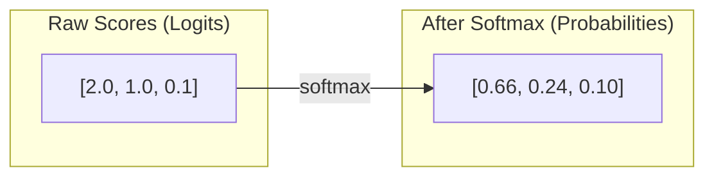

## 1.4 Temperature — Controlling Randomness

Temperature adjusts how "confident" the probability distribution is:

```python
def softmax_with_temperature(scores, temperature):
    scores = scores / temperature
    exp_scores = np.exp(scores)
    return exp_scores / exp_scores.sum()

# Low temp (0.5): sharp distribution, predictable
scores = [2.0, 1.0, 0.1]
softmax_with_temperature(scores, 0.5)
# [0.88, 0.12, 0.01]  ← very confident in top choice

# High temp (2.0): flat distribution, creative
softmax_with_temperature(scores, 2.0)
# [0.41, 0.33, 0.26]  ← all words plausible
```

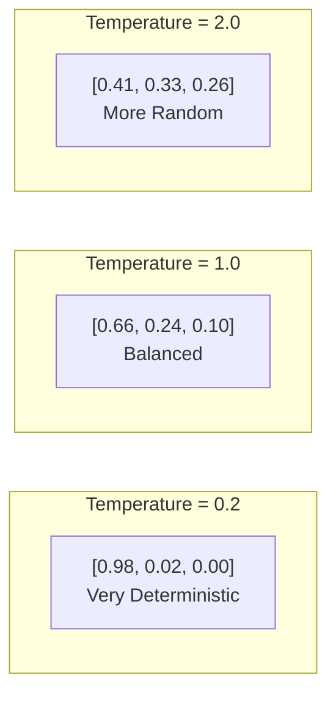

**In practice**: Code generation → temp 0.1-0.2 (deterministic). Creative writing → temp 0.7-0.9.

## 1.5 Why This Matters for Interviews

When someone asks "Why does temperature matter?" or "What does softmax do?" — they're testing whether you understand that **LLMs are probability machines**. Everything else (attention, embeddings, training) is in service of predicting the most probable next token.

---

# PART 2: FROM RNNs TO TRANSFORMERS — THE EVOLUTION

## 2.1 The Problem: Processing Sequences

Language is sequential. "The cat sat on the mat." You can't understand "sat" without knowing "cat" is the subject.

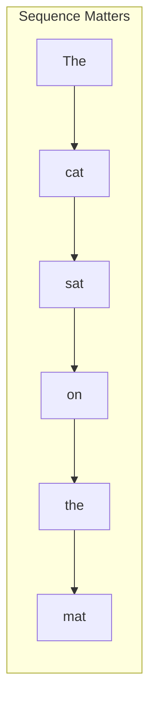

**Before 2017**, the best way to handle sequences was RNNs (Recurrent Neural Networks).

## 2.2 RNNs — How They Work

An RNN processes one word at a time, carrying a "memory" (hidden state) forward:

```python
# RNN pseudocode
hidden_state = [0, 0, 0]  # initial memory

for word in ["The", "cat", "sat"]:
    hidden_state = rnn_step(word, hidden_state)
    # After "The":  hidden = [0.1, 0.3, 0.2]  ← vague memory of "The"
    # After "cat":  hidden = [0.4, 0.8, 0.1]  ← remembers "The cat"
    # After "sat":  hidden = [0.9, 0.5, 0.3]  ← remembers all three
```

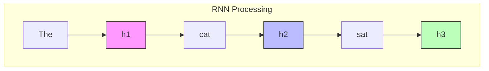

**The fatal problem**: Each step is sequential. Word #1000 needs 1000 steps. And by word #1000, the model has forgotten word #1.

### Three Fatal Flaws of RNNs

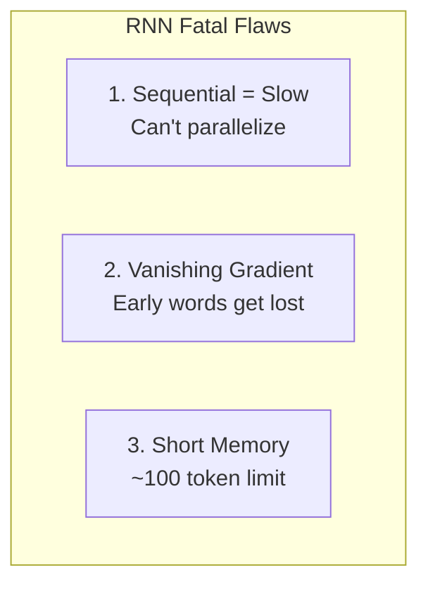

1. **Sequential = Slow**: Word #500 depends on word #499, which depends on #498... You MUST wait. No parallelism.
2. **Vanishing Gradient**: During training, the math signal (gradient) gets multiplied by small numbers each step. After ~100 steps, it's essentially zero — the model can't learn long-range patterns.
3. **Short Memory**: Practical limit of ~100 tokens. "The cat... [500 words later] ... sat" — the model forgot it was a cat.

## 2.3 How Transformers Fixed Everything

The 2017 paper "Attention Is All You Need" introduced a radical idea:

> Why process sequentially? Process ALL words at once and let each word look at every other word.

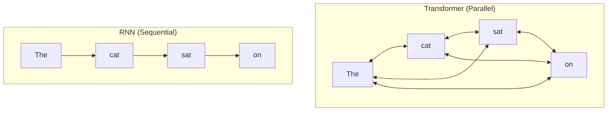

**Key breakthrough**: Any word can directly "attend" to any other word in **one step**. O(1) connection between word #1 and word #1000, not O(1000).

**Tradeoff**: O(n²) memory (each of n words attends to all n words). For GPT-4 with 100K tokens, that's 10 billion attention scores.

## 2.4 Visual Timeline

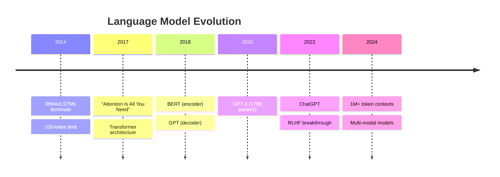

---

# PART 3: ATTENTION — THE CORE IDEA

## 3.1 What is Attention?

**In one sentence**: Attention lets each word look at every other word and decide "what matters to me."

When you read "The bank of the river was muddy" — you know "bank" means river bank because of "river." That's attention.

```
"The bank of the river was muddy"
                        │
                        ▼
Word "bank" pays attention to:
  "The"   → relevance 0.1  (not useful)
  "river" → relevance 0.8  (very useful! this disambiguates "bank")
  "was"   → relevance 0.05 (not useful)
  ...

Result: "bank" updates its meaning to "river bank" (not "financial bank")
```

## 3.2 Query, Key, Value — The Mechanism

Attention uses 3 vectors for every word:

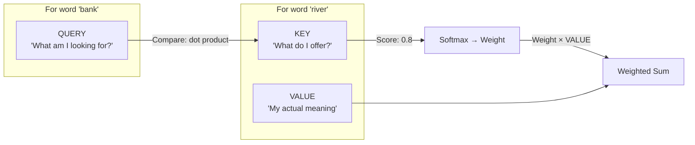

**The analogy** (again):

| Role | In the Party Analogy | In Math |
|------|---------------------|---------|
| **Query** | What you're looking for | "Is this conversation relevant to me?" |
| **Key** | What each conversation is about | "We're talking about sports" |
| **Value** | The actual information | The details of the conversation |
| **Attention Score** | How relevant you found it | Dot product of Q and K |
| **Weighted Sum** | What you remember from all conversations | Combined information |

## 3.3 Computing Attention — Step By Step

```python
import numpy as np

# Step 1: Each word has Q, K, V vectors (learned during training)
words = {
    "bank":  {"q": [0.5, 0.2], "k": [0.3, 0.4], "v": [0.1, 0.8]},
    "river": {"q": [0.1, 0.9], "k": [0.7, 0.2], "v": [0.9, 0.3]},
}

# Step 2: For word "bank" — compute attention to ALL words
query = words["bank"]["q"]

for target_word, target_data in words.items():
    key = target_data["k"]
    value = target_data["v"]
    
    # Score = dot product of query and key
    score = query[0] * key[0] + query[1] * key[1]
    
    # Weight = softmax over scores (simplified)
    # Value × Weight = information pulled from this word
    
    print(f"bank → {target_word}: score={score:.2f}")

# Output:
# bank → bank: score=0.23  (self-attention: looking at itself)
# bank → river: score=0.53 (river is more relevant!)
```

**Why Q, K, V?** Why not just use the word's meaning directly?

Because separating them lets the model ask "what am I looking for?" (Q) independently from "what information do I contain?" (V). You might be looking for location information (Q) but the word itself is a verb (V).

## 3.4 Multi-Head Attention — Thinking in Parallel

One attention layer is one "perspective." Multi-head attention runs 8-96 attention layers in parallel:

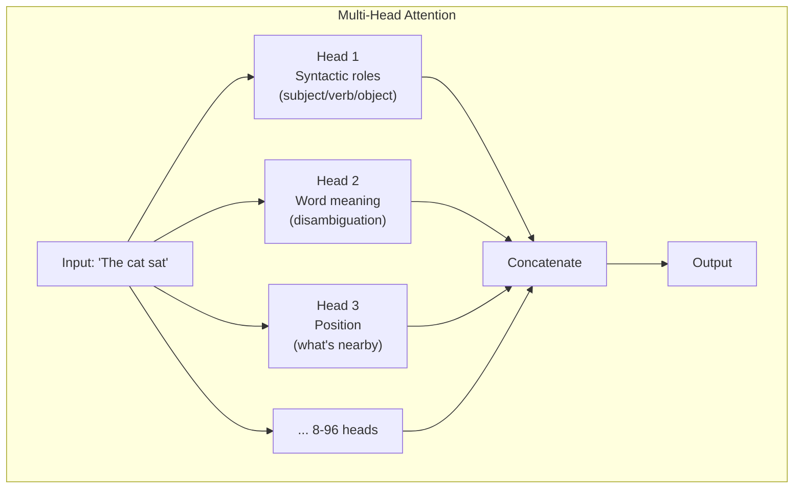

**Why multiple heads?** A word has many relationships. "bank" needs to:
- Head 1: Know "river" is nearby (disambiguation)
- Head 2: Know "was" is the verb (grammar)
- Head 3: Know "the" is its determiner (syntax)

One attention layer can't track all these at once. Multiple heads = multiple perspectives.

## 3.5 Attention in One Diagram

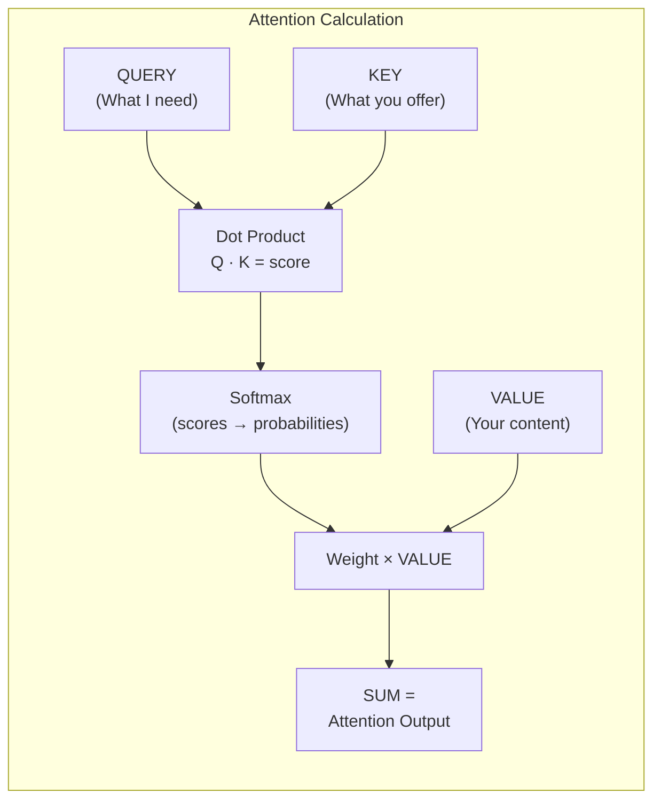

**Formula**: `Attention(Q, K, V) = softmax(Q × K^T / √d) × V`

The √d is a scaling factor. Without it, large dot products push softmax into extreme territory (one word gets all the attention).

---

# PART 4: TRANSFORMER ARCHITECTURE

## 4.1 The Full Transformer

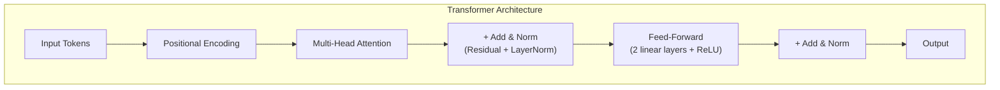

**Every transformer block = Attention → Add&Norm → FeedForward → Add&Norm**

This block repeats 6-96 times depending on model size.

## 4.2 Positional Encoding — Why Words Need Position Numbers

Attention sees all words at once. It doesn't know word order:

```
"The dog bit the man" = "The man bit the dog"  ← attention sees the SAME bag of words
```

Solution: Add a position number to each word's meaning vector.

```python
# Simplified positional encoding
word_meaning = [0.5, 0.2, 0.8]  # for "man"
position_2 = [0.1, 0.3, 0.0]    # position 2 encoding
combined = word_meaning + position_2  # [0.6, 0.5, 0.8]
```

Now the model knows WHERE each word is.

**Why sine/cosine functions?** (if asked in interview) — They create unique patterns for each position that the model can learn to detect. The pattern repeats in a way that helps the model understand relative distances ("word 5 and word 8 are 3 apart").

## 4.3 Residual Connections — Why Deep Networks Can Train

Without residual connections, adding more layers makes training WORSE (vanishing gradient):

```
Layer 1 → Layer 2 → Layer 3 → Layer 4 → Loss
  (gradient 0.1)    (0.01)    (0.001)   (0.0001)
```

With residual connections, each layer gets a "skip" or "shortcut":
```
Input → Layer → + Input → Output
  (identity bypass)
```

```
Output = Layer(Input) + Input
```

The gradient can flow directly through the bypass. Even with 96 layers, training works.

**Intuition**: It's like having express elevators in a skyscraper. Even if the stairs (layers) are slow, the gradient can take the express route.

## 4.4 Layer Normalization

Normalizes the values across the hidden dimension to have mean=0, variance=1.

```
Before: [5.2, -3.1, 0.7, 8.4]  ← wildly different scales
After:  [0.4, -0.8, -0.1, 0.9] ← all in similar range
```

**Why?** Stable training. Without normalization, values grow with each layer and eventually overflow or underflow.

## 4.5 Feed-Forward Network (FFN)

After attention, each word goes through a simple neural network:

```python
def FFN(x):
    # x = attention output for ONE word
    hidden = max(0, x @ W1 + b1)  # ReLU activation
    output = hidden @ W2 + b2
    return output
```

**Purpose**: Attention shares information BETWEEN words. FFN processes each word's information DEEPER (individually).

```
Attention: "bank" learns about "river" ← cross-word
FFN: "river-bank" refines its meaning internally    ← within-word
```

---

# PART 5: LLM ARCHITECTURES — ENCODER, DECODER, BOTH

## 5.1 Three Types of Transformers

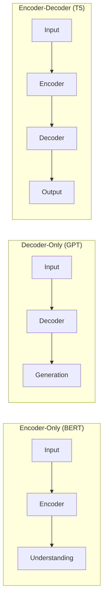

| Type | Example | What It Does | Best For |
|------|---------|-------------|----------|
| **Encoder-Only** | BERT | Reads all tokens | Classification, sentiment, NER |
| **Decoder-Only** | GPT, Claude | Predicts next token | Text generation, chat |
| **Encoder-Decoder** | T5 | Seq2seq | Translation, summarization |

**Encoder** = Bidirectional (sees left AND right context)
**Decoder** = Unidirectional (sees only LEFT context — because it can't cheat by looking ahead)

```
BERT: "The bank of the ___ was muddy"
      → Sees "The", "bank", "of", "the", "was", "muddy"
      → Predicts the masked word

GPT: "The bank of the"
      → Sees "The", "bank", "of", "the"
      → Predicts next: "river"
      (Can NOT look ahead at "was muddy")
```

## 5.2 Why Decoder-Only Won (For Chat)

GPT-style models generate one token at a time, feeding the output back as input:

```
Input: "What is the capital of France?"
Step 1: Predict "The"
Step 2: Input "What is the capital of France? The" → Predict "capital"
Step 3: Input "...France? The capital" → Predict "of"
Step 4: Predict "France"
Step 5: Predict "is"
Step 6: Predict "Paris"
```

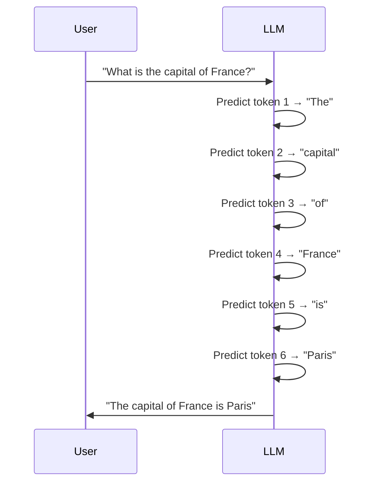

This **autoregressive** generation (output feeds back as input) is why chat works — it's just repeated next-token prediction.

## 5.3 The Mask — Why Decoders Can't Cheat

During training, the decoder uses a **causal mask**:

```python
# Causal mask: token at position i can only see positions 0 to i
# "The cat sat"
mask = [
    [1, 0, 0],  # "The" sees only "The"
    [1, 1, 0],  # "cat" sees "The cat"
    [1, 1, 1],  # "sat" sees all three
]
```

Without this mask, the model would cheat: "sat" would predict itself by looking at "sat." The mask forces next-token prediction.

---

# PART 6: HOW LLMs ARE BUILT (TRAINING PIPELINE)

## 6.1 The Three Stages

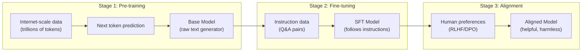

### Stage 1: Pre-training

- **What**: Feed the model trillions of tokens from the internet
- **Objective**: Predict the next token
- **Cost**: $10M-$100M (GPT-4), weeks on 10,000+ GPUs
- **Result**: A model that can complete text but doesn't follow instructions

```
Input: "The first step to bake a cake is to"
Output: "preheat the oven"  ← learned from internet recipes
```

### Stage 2: Supervised Fine-Tuning (SFT)

- **What**: Train on curated Q&A pairs
- **Objective**: Given instruction, produce good response
- **Cost**: $10K-$100K, small cluster, days
- **Result**: A model that follows instructions

```
Input: "How do I bake a cake?"
Output: "First, preheat the oven to 350°F..."  ← learned from SFT data
```

### Stage 3: RLHF / DPO (Alignment)

- **What**: Humans rate model outputs. Model learns to prefer highly-rated responses.
- **Objective**: Be helpful, honest, harmless
- **Result**: ChatGPT-like behavior

## 6.2 RLHF — How Humans Shape AI Behavior

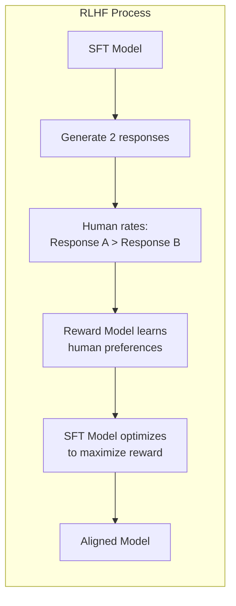

**The insight**: You can't write a formula for "helpful." But humans can recognize it. RLHF encodes human judgment into a reward signal the model can optimize.

## 6.3 DPO — A Simpler Alternative (2023)

Instead of training a separate reward model:

```
DPO: Directly optimize the model on preference pairs
     No reward model needed
     Simpler, cheaper, almost as effective
```

Both RLHF and DPO solve the same problem: aligning model behavior with human values.

## 6.4 Why This Matters for Interviews

| Question | What They're Testing |
|----------|---------------------|
| "How do LLMs learn?" | Pre-train → SFT → Alignment |
| "What's RLHF vs DPO?" | Both align models; DPO is simpler, no reward model |
| "Can I fine-tune an LLM?" | SFT is cheap; pre-training is expensive |

---

# PART 7: TOKENIZATION — HOW TEXT BECOMES NUMBERS

## 7.1 What is a Token?

A token is the basic unit an LLM processes. NOT a word. Not a character.

```python
"ChatGPT is amazing!"
→ ["Chat", "GPT", " is", " amazing", "!"]
→ 5 tokens
```

**Why not words?** There are 500K+ words in English. That's too many classes for softmax. Subword tokens compress rare words into common pieces.

**Why not characters?** 26 characters × 1000 tokens = very slow (each character has limited meaning)

## 7.2 BPE Tokenization (Byte-Pair Encoding)

BPE finds the most frequent character pairs and merges them iteratively:

```
Step 1: "l o w e r", "n e w e s t", "w i d e s t"
Step 2: Merge most frequent pair: "es" appears 2x → add "es" to vocabulary
Step 3: "l o w e r", "n e w es t", "w i d es t"
Step 4: Merge "est" → add to vocabulary
... repeat until desired vocab size (typically 32K-128K)
```

**Result**: Common words = 1 token. Rare words = multiple tokens.

```
"the" → 1 token
"ChatGPT" → 2 tokens ("Chat" + "GPT")
"pneumonoultramicroscopicsilicovolcanoconiosis" → 8 tokens
```

## 7.3 Context Window

The context window is the MAX number of tokens the model can process at once.

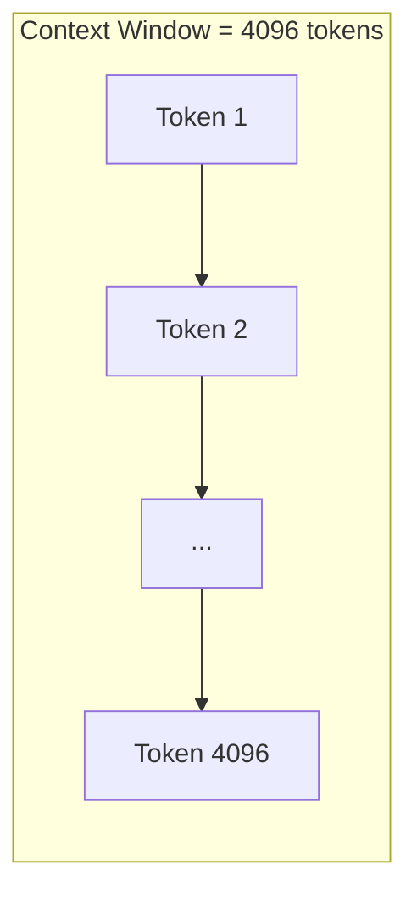

- GPT-3: 2048 tokens
- GPT-4: 8192 (32K for some variants)
- Claude: 200K
- Gemini: 1M

**KV Cache**: During generation, the model caches Key and Value vectors from previous tokens. Instead of recomputing attention for ALL tokens, it just computes for the NEW token.

---

# PART 8: VECTOR SEARCH — THE HEART OF RAG

## 8.1 What is an Embedding?

An embedding is a list of numbers (vector) that captures the MEANING of a piece of text.

```python
# Words with similar meanings → similar vectors
embedding("king")   = [0.5, 0.8, 0.2, 0.1, ...]  # 768 numbers
embedding("queen")  = [0.5, 0.7, 0.3, 0.1, ...]  # close to "king"
embedding("apple")  = [0.1, 0.2, 0.9, 0.4, ...]  # far from "king"
```

**Analogy**: Think of each word's location in a "meaning space." Similar words are nearby.

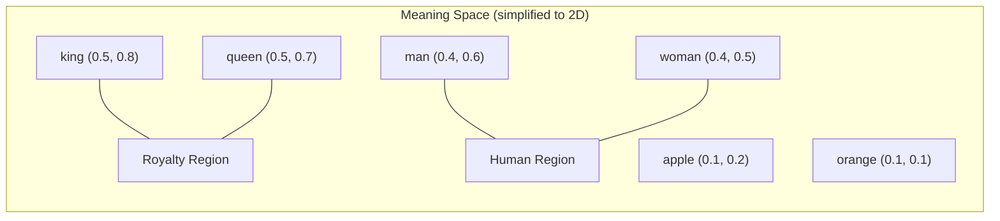

## 8.2 How Embeddings Are Created

An embedding model (like `text-embedding-3-small` or `all-MiniLM-L6-v2`) takes text → vector:

```python
# Pseudocode
def embed(text):
    # Tokenize → Transformer encoder → Pool → Normalize
    tokens = tokenize(text)           # ["cat", "sat"]
    hidden = transformer(tokens)      # [800 tokens → 800 vectors]
    pooled = mean_pool(hidden)        # average → 1 vector
    normalized = pooled / norm(pooled) # unit vector
    return normalized                  # [0.1, 0.5, 0.3, ...]
```

**Key property**: Unit vectors (length = 1). This makes cosine similarity = dot product.

## 8.3 Cosine Similarity — Measuring Distance

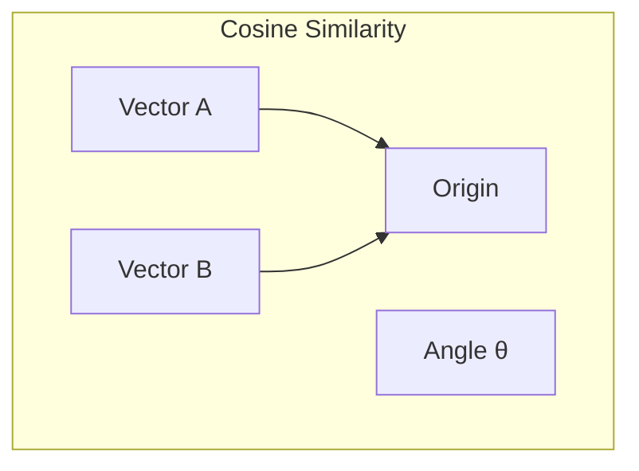

```python
import numpy as np

def cosine_similarity(a, b):
    # a and b are unit vectors (length = 1)
    return np.dot(a, b)  # Same as cos(angle between them)

# Similar concepts → high score
e1 = embed("dog")     # [0.2, 0.7, 0.1]
e2 = embed("puppy")   # [0.3, 0.6, 0.2]
cosine_similarity(e1, e2)  # ≈ 0.92  (very similar)

# Different concepts → low score
e3 = embed("car")     # [0.8, 0.1, 0.3]
cosine_similarity(e1, e3)  # ≈ 0.15  (very different)
```

| Score | Meaning |
|-------|---------|
| 0.9-1.0 | Nearly identical meaning |
| 0.5-0.9 | Related topics |
| 0.0-0.5 | Loosely related |
| < 0.0 | Opposite meanings |

## 8.4 Dense Retrieval (Vector Search)

Convert query to vector → find closest vectors in database:

```
Query: "What is remote work policy?"
  → embed → [0.4, 0.7, 0.2, ...]
  → Search vector DB for nearest neighbors
  → Return top 5 most similar documents
```

```python
# Simplified vector search
def search(query_embedding, all_document_embeddings, top_k=5):
    scores = []
    for doc_id, doc_embedding in enumerate(all_document_embeddings):
        score = cosine_similarity(query_embedding, doc_embedding)
        scores.append((doc_id, score))
    scores.sort(key=lambda x: x[1], reverse=True)
    return scores[:top_k]
```

**Pros**: Understands meaning, handles synonyms ("car" matches "automobile")
**Cons**: Misses exact keyword matches, needs GPU for embedding

## 8.5 Sparse Retrieval (BM25) — The Keyword Alternative

Before embeddings, we had **sparse retrieval**. It matches keywords:

```python
# BM25 intuition
query = "remote work policy"
# Scores based on:
# - How many query words appear in the doc
# - How RARE each word is (rare words matter more)
# - How LONG the doc is (normalize)
```

**BM25 formula intuition**: 

```
Score = how many query terms match × 
        how rare each term is (IDF) × 
        normalization for document length
```

**IDF (Inverse Document Frequency)**: A word that appears in 90% of docs ("the") carries little info. A word in 2% of docs ("remote") carries lots.

```python
# IDF intuition
# Word appears in 2% of documents → IDF = log(100/2) = 3.91  (high weight)
# Word appears in 50% of documents → IDF = log(100/50) = 0.69 (low weight)
# Word appears in 100% of documents → IDF = log(100/100) = 0   (zero weight)
```

**Pros**: Fast (inverted index), exact match, no GPU needed
**Cons**: Misses synonyms, can't understand meaning

## 8.6 Hybrid Search — Best of Both Worlds

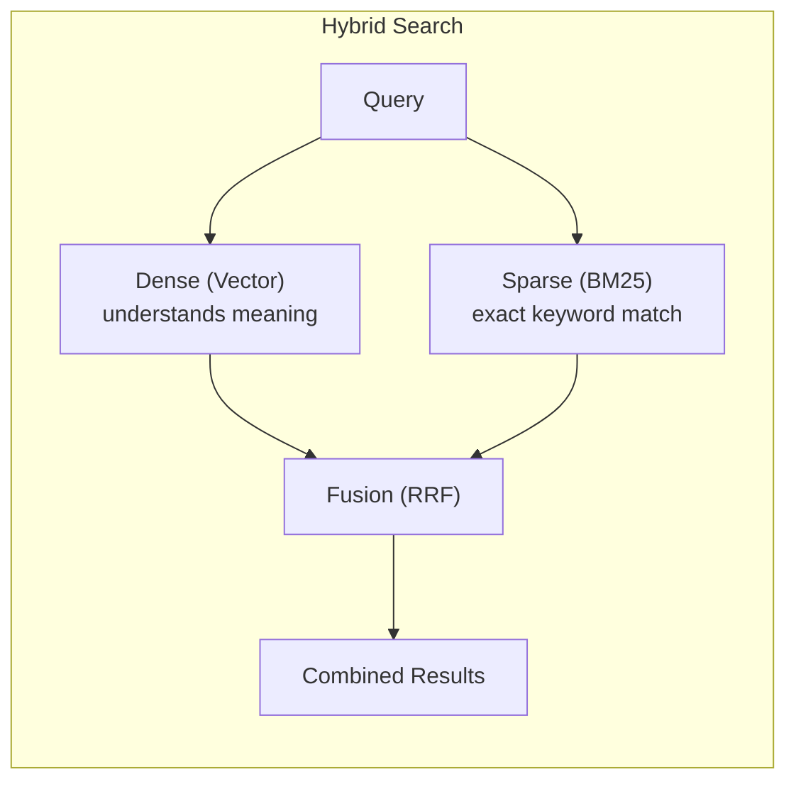

```python
def hybrid_search(query, vector_db, bm25_index, alpha=0.5):
    # Dense: semantic similarity
    query_vec = embed(query)
    dense_results = vector_db.search(query_vec, top_k=20)
    
    # Sparse: keyword match
    sparse_results = bm25_index.search(query, top_k=20)
    
    # Fusion: combine scores
    final_scores = {}
    for doc_id, score in dense_results:
        final_scores[doc_id] = alpha * score
    for doc_id, score in sparse_results:
        final_scores[doc_id] = final_scores.get(doc_id, 0) + (1-alpha) * score
    
    return sorted(final_scores.items(), key=lambda x: x[1], reverse=True)[:10]
```

**How ROAST uses it**: SYNAPSE uses dense + BM25 + knowledge graph + session cache. Four retrievers fused together.

## 8.7 RRF — Reciprocal Rank Fusion

A simple way to combine ranked lists:

```python
def rrf(ranked_lists, k=60):
    scores = {}
    for rank, doc_id in enumerate(ranked_lists):
        scores[doc_id] = scores.get(doc_id, 0) + 1 / (k + rank)
    return sorted(scores.items(), key=lambda x: x[1], reverse=True)

# Doc ranked #1 → score = 1/(60+1) = 0.016
# Doc ranked #10 → score = 1/(60+10) = 0.014
# Doc in BOTH lists gets DOUBLE the score
```

**Why RRF?** It doesn't need normalized scores (different retrievers produce different score ranges). RRF works on rank alone.

## 8.8 Vector Databases

| DB | Best For | Notes |
|----|----------|-------|
| **FAISS** | Local/embedded | Facebook's library, in-memory, very fast |
| **Pinecone** | Managed cloud | Serverless, pay-per-use |
| **Chroma** | Development | Easy to set up, for prototyping |
| **Qdrant** | Production | Written in Rust, fast |
| **Weaviate** | Production | Built-in vectorizer modules |

**How they work internally**: ANN (Approximate Nearest Neighbor) search. Instead of checking all N documents (exact but slow), they use index structures to find "close enough" neighbors in O(log N) or O(1).

---

# PART 9: FULL RAG PIPELINE (Complete Flow)

## 9.1 The Complete Pipeline

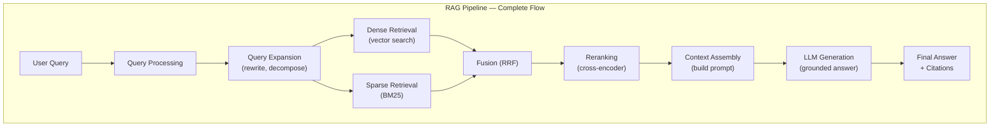

## 9.2 Step-by-Step Walkthrough

**Step 1: Query Processing**
```python
raw_query = "how do i reset my work laptop password?"
processed = [
    "How to reset work laptop password",  # cleaned
    "laptop password reset policy",       # expanded
    "IT support password recovery",       # alternative angle
]
```

**Step 2: Retrieval (Dual)**
```python
# Dense: find by meaning
query_vec = embed("how to reset work laptop password")
dense_hits = vector_db.search(query_vec)  
# → ["Laptop Setup Guide", "IT Security Policy"]

# Sparse: find by keywords
sparse_hits = bm25.search("reset laptop password")
# → ["Password Reset FAQ", "Laptop Setup Guide", "IT Support Contact"]
```

**Step 3: Fusion + Reranking**
```python
# RRF combines both lists
combined = rrf([dense_hits, sparse_hits], k=60)
# → 1. "Laptop Setup Guide" (ranked by both!)
# → 2. "Password Reset FAQ" (ranked high by BM25)
# → 3. "IT Security Policy" (ranked by vector)

# Reranking: cross-encoder scores each against query
reranked = cross_encoder_rerank(query, combined)
# → 1. "Password Reset FAQ" (most relevant after rereading)
```

**Step 4: Context Assembly**
```python
prompt = f"""
CONTEXT:
---Document 1---
[Password Reset FAQ content...]
---Document 2---
[Laptop Setup Guide relevant section...]

QUESTION: {query}

INSTRUCTIONS: Answer using ONLY the provided context.
If the context doesn't contain the answer, say "I don't know."
"""
```

**Step 5: Generation**
```python
response = llm.generate(prompt)
# "To reset your work laptop password, go to the IT portal...
# According to the Password Reset FAQ, you'll need your employee ID."
```

## 9.3 Chunking Strategy

Documents must be split into chunks before embedding. How you split matters:

```mermaid
graph LR
    subgraph "Chunking Strategies"
        D["Full Document"] --> FIX["Fixed-size<br/>256 chars, 32 overlap"]
        D --> SENT["Sentence-based<br/>split on periods"]
        D --> REC["Recursive<br/>paragraph → sentence → word"]
        D --> SEM["Semantic<br/>split when topic changes"]
        D --> PC["Parent-Child<br/>big + small chunks"]
    end
```

| Strategy | Best For | Tradeoff |
|----------|----------|----------|
| **Fixed-size** | Simple, fast | Can split mid-sentence |
| **Sentence** | Clean text | Awkward for long lists |
| **Recursive** | Mixed content | Most common in production |
| **Semantic** | Long docs | Computationally expensive |
| **Parent-Child** | RAG | Child retrieved, parent fed to LLM (more context) |

**Rule of thumb**: Chunk size = 256-1024 tokens. Overlap = 10-20%.

## 9.4 Reranking — The Most Underrated Step

First-stage retrieval (dense + sparse) is fast but imprecise. Reranking uses a **cross-encoder** that looks at query + doc TOGETHER:

```
Bi-encoder (retrieval): embed(query) separately from embed(doc), dot product → fast, lossy
Cross-encoder (rerank): feed [CLS] query [SEP] doc [SEP] → single score → slow, accurate
```

```mermaid
graph LR
    subgraph "Bi-encoder (Fast, Approx)"
        BE["Query → Embed Q<br/>Doc → Embed D<br/>cosine(Q, D) = score"]
    end
    subgraph "Cross-encoder (Slow, Exact)"
        CE["[CLS] Query [SEP] Doc [SEP]<br/>→ Single model → score"]
    end
```

**Production pattern**: Retrieve top 100 with bi-encoder. Rerank top 20 with cross-encoder. Keep top 5 for LLM.

## 9.5 RAGAS Evaluation Metrics

How do you MEASURE if your RAG is good?

```mermaid
flowchart LR
    subgraph "RAGAS Metrics"
        F["Faithfulness<br/>Did the answer use the context?"]
        AR["Answer Relevancy<br/>Does the answer address the question?"]
        CR["Context Recall<br/>Was all needed info retrieved?"]
        CP["Context Precision<br/>Was irrelevant info retrieved?"]
    end
```

| Metric | Measures | Your ROAST Benchmark |
|--------|----------|---------------------|
| **Faithfulness** | Does answer stay grounded in retrieved docs? | 0.889 |
| **Answer Relevancy** | Does answer actually answer the question? | 0.875 |
| **Context Recall** | Did we retrieve everything needed? | *measure this* |
| **Context Precision** | Did we avoid retrieving junk? | *measure this* |

**Faithfulness is the most important** — it catches hallucination. If faithfulness drops to 0.7, your RAG is making things up.

---

# PART 10: AGENTIC AI DEEP DIVE

## 10.1 What Makes an LLM an Agent?

An LLM becomes an agent when it can call tools and make decisions in a loop:

```
LLM alone: "I can't book flights, I'm just a model."
Agent: "Let me call the searchFlights tool... Now call bookFlight... Done!"
```

```mermaid
flowchart LR
    subgraph "Agent Loop"
        P["Perceive<br/>(user input)"] --> R["Reason<br/>(what to do next?)"]
        R --> A["Act<br/>(call tool or respond)"]
        A --> O["Observe<br/>(tool result)"]
        O --> R
    end
```

**The loop never stops** until the task is done or a limit is reached.

## 10.2 Agent Components

```mermaid
graph TD
    subgraph "Agent Components"
        COMP1["🧠 Reasoning Engine<br/>(the LLM itself)"]
        COMP2["🔧 Tools<br/>(functions it can call)"]
        COMP3["💾 Memory<br/>(conversation history)"]
        COMP4["🗺️ Planning<br/>(multi-step strategy)"]
        COMP5["🛡️ Guardrails<br/>(safety constraints)"]
    end
```

| Component | What It Does | In SuperOwl Terms |
|-----------|-------------|-------------------|
| **Reasoning** | Decides next action | LLM prompt + KB |
| **Tools** | Functions agent can call | `notify_owner()`, `endCall()`, `transferCall()` |
| **Memory** | Saves context | Session state, transcript |
| **Planning** | Multi-step strategy | Call flow: greet → verify → handle → end |
| **Guardrails** | Safety limits | Max retries, budget limits, escalation rules |

## 10.3 Tool Calling (Function Calling)

The agent receives a list of available functions as part of the prompt:

```python
tools = [
    {
        "name": "check_balance",
        "description": "Check account balance",
        "parameters": {
            "account_id": {"type": "string"}
        }
    },
    {
        "name": "transfer_money",
        "description": "Transfer money between accounts",
        "parameters": {
            "from": {"type": "string"},
            "to": {"type": "string"},
            "amount": {"type": "number"}
        }
    }
]

# The LLM's response might be:
# "I'll check your balance first."
# Then the LLM outputs a special JSON:
# → {"function": "check_balance", "args": {"account_id": "ACC-123"}}
# The SYSTEM executes check_balance("ACC-123") and returns the result
# The LLM reads the result and decides next step
```

## 10.4 ReAct Pattern (Reason + Act)

The most common agent pattern:

```
Thought: The user wants to book a flight. I need to check their calendar first.
Action: check_calendar("next Friday")
Observation: Free from 2 PM onwards
Thought: Good, they're free. Now search flights.
Action: search_flights("Mumbai", "next Friday")
Observation: Found 3 flights under ₹8000
Thought: Let me present the options.
Response: "Here are 3 flights under ₹8000..."
```

The "Thought → Action → Observation" loop is the ReAct pattern. The LLM literally outputs "Thought:" as text, and the system parses "Action:" to call tools.

## 10.5 Multi-Agent Systems

```mermaid
flowchart TD
    subgraph "Supervisor Pattern (ROAST)"
        USP["User"] --> SPR["Supervisor Agent<br/>(Receives request)<br/>(Decides which agent)"]
        SPR --> A1["Market Calibration Agent<br/>Analyzes industry context"]
        SPR --> A2["Red Flags Agent<br/>Checks concerns"]
        SPR --> A3["Six-Second Scan Agent<br/>Quick resume assessment"]
        SPR --> A4["Technical Depth Agent<br/>Deep technical review"]
        A1 --> SYN["Synthesis Agent<br/>Combines all analyses"]
        A2 --> SYN
        A3 --> SYN
        A4 --> SYN
        SYN --> RESP["Final Response"]
    end
```

| Pattern | How It Works | Example |
|---------|-------------|---------|
| **Supervisor** | One agent delegates to specialist agents | ROAST's 6-agent pipeline |
| **Hierarchical** | Parent agent spawns child agents | Each child has its own sub-tools |
| **Parallel** | All agents work simultaneously | ROAST's market + red flags + scan |
| **Debate** | Agents argue, consensus wins | SYNAPSE's Critic step |

## 10.6 Human-in-the-Loop (HITL)

```mermaid
flowchart LR
    subgraph "HITL Patterns"
        AP["Approval Gate<br/>Agent pauses, asks human"] --> DEC["Human approves/rejects"]
        EX["Exception Handling<br/>Agent hits limit → human"] --> DEC2["Human takes over"]
        MON["Monitoring<br/>Human watches, can intervene"] --> DEC3["Human interjects if needed"]
    end
```

**In SuperOwl**: When the AI assistant can't handle a request, it:
1. Sends a Slack notification to the owner
2. Owner can whisper instructions, takeover the call, or let it continue
3. This is HITL — the human is always in the loop

## 10.7 Memory Types

| Type | What It Remembers | Example |
|------|------------------|---------|
| **In-context** | Current conversation | Chat history in the prompt |
| **Episodic** | Past interactions | "This user called yesterday about X" |
| **Semantic** | Facts about the world | "Company policy on refunds is..." |
| **External** | Stored in a database | Vector DB, SQL, Redis |

```python
# In practice: memory is just MORE context
prompt = f"""
--- Previous conversation ---
User: I need help with my order
Assistant: Sure, what's your order number?
User: ORD-789
--- Current query ---
User: Where is it?
---
Response: Let me check order ORD-789 for you.
"""
```

---

## 10.8 Agent vs Chatbot — Clear Distinction

Many people use "agent" and "chatbot" interchangeably. They are NOT the same.

```
┌─────────────────────────────────────────────────────┐
│                    CHATBOT                           │
│                                                      │
│  User: "What's the weather in Mumbai?"               │
│  Chatbot: "It's 32°C and sunny."                     │
│                                                      │
│  → Responds based on training data                   │
│  → No memory between turns (or minimal)              │
│  → No ability to DO things                           │
│  → Single turn, single response                      │
└─────────────────────────────────────────────────────┘

┌─────────────────────────────────────────────────────┐
│                    AGENT                             │
│                                                      │
│  User: "Book me a hotel in Mumbai near the airport"  │
│  Agent: "Let me search..."                           │
│    Action: search_hotels("Mumbai", "airport")        │
│    Observation: Found 3 hotels                       │
│  Agent: "I found 3 options. Let me check rates..."   │
│    Action: get_rates(hotel_1)                        │
│    Observation: ₹4500/night                          │
│  Agent: "The Grand Hyatt is ₹4500/night. Book it?"   │
│                                                      │
│  → Takes actions, not just responds                  │
│  → Maintains state across steps                      │
│  → Can use tools to affect the world                 │
│  → Multi-turn reasoning loop                         │
└─────────────────────────────────────────────────────┘
```

| | Chatbot | Agent |
|---|---------|-------|
| **Primary action** | Respond | Act + Respond |
| **Tool use** | None | Can call functions |
| **State** | Stateless or simple context | Maintains complex state |
| **Decision making** | None (just generates text) | Thinks, plans, adapts |
| **Example** | FAQ bot, simple Q&A | Booking assistant, coding agent |

**When does a chatbot become an agent?** The moment it can call a tool and use the result to decide what to do next. That single capability changes everything.

---

## 10.9 Orchestration — Coordinating Multi-Agent Systems

When you have multiple agents working together, you need **orchestration** — the system that decides WHO does WHAT and WHEN.

```mermaid
flowchart TD
    subgraph "Orchestration Responsibilities"
        O1["1. Task Decomposition<br/>Split big goal into sub-tasks"]
        O2["2. Agent Assignment<br/>Which agent handles which sub-task"]
        O3["3. State Management<br/>Share context between agents"]
        O4["4. Sequencing<br/>What runs in parallel vs serial"]
        O5["5. Error Handling<br/>What happens when an agent fails"]
        O6["6. Result Aggregation<br/>Combine outputs into final answer"]
    end
```

### Orchestration vs Simple Tool Calling

```
Without Orchestration:
  Agent: "I need to search and analyze"
  → Searches itself
  → Analyzes itself
  → Single bottleneck, everything sequential

With Orchestration (ROAST style):
  Supervisor → assigns search to Search Agent
             → assigns analysis to Analysis Agent
             → runs both in parallel
             → Synthesis Agent combines results
             → 3 agents working simultaneously
```

### ROAST Orchestration Example

```mermaid
flowchart LR
    subgraph "ROAST Orchestration"
        S["Supervisor<br/>Receives resume"] -->|"parallel"| M["Market Calibration Agent"]
        S -->|"parallel"| R["Red Flags Agent"]
        S -->|"parallel"| T["Technical Depth Agent"]
        M --> SY["Synthesis Agent<br/>Waits for all 3<br/>Combines results"]
        R --> SY
        T --> SY
        SY --> OUT["Final Review"]
    end
```

**Key orchestration questions every system must answer:**
1. Do agents run in parallel or sequentially? (ROAST: parallel)
2. What happens if one agent times out? (ROAST: partial results with warning)
3. How does state flow between agents? (ROAST: shared analysis context)
4. Who decides the next step? (ROAST: Synthesis agent decides)

---

## 10.10 OASYS — SoundHound's Open Agent System

OASYS = Open Agent System. Launched May 2026 at SoundHound's "Bring Your Own Model" event.

### What It Is

OASYS is SoundHound's agent orchestration platform. It lets you **connect any LLM** to Amelia's enterprise capabilities:

```mermaid
graph LR
    subgraph "OASYS Architecture"
        LLM1["Any LLM<br/>GPT, Claude, Gemini,<br/>Open-source model"] --> OAS["OASYS Layer"]
        OAS --> AM["Amelia Capabilities<br/>Speech-to-Meaning<br/>Cognitive Functions<br/>Guardrails"]
        OAS --> ENTERPRISE["Enterprise Integrations<br/>CRM, ERP, APIs,<br/>Databases"]
    end
```

### Why OASYS Matters

| Problem | OASYS Solution |
|---------|---------------|
| **Locked to one LLM** | Bring your own model — any provider |
| **Can't use Amelia's voice** | Amelia's Speech-to-Meaning + your LLM |
| **Enterprise security concerns** | Amelia's guardrails apply to ANY model |
| **Expensive per-token costs** | OASYS supports cheaper specialized models |

### In Interview Terms

When they ask about OASYS: "OASYS is SoundHound's model-agnostic agent platform. It decouples the LLM from the enterprise infrastructure — you can use GPT-4 for reasoning, but route voice through Amelia's Speech-to-Meaning for latency. This gives enterprises flexibility without rebuilding their integration layer."

**Connection to your work**: SuperOwl's pluggable provider system (Groq primary, Gemini fallback, NIM, OpenRouter) is the same pattern — you abstracted the LLM layer so the system doesn't depend on any single provider.

---

## 10.11 MCP — Model Context Protocol (Detailed)

MCP = Model Context Protocol. Created by Anthropic. It's a **standard way for LLMs to connect to tools and data sources**.

### The Problem MCP Solves

Before MCP, every agent system had custom tool integration:

```
Without MCP:
  Every integration = custom code
  ┌─────────────────────────────┐
  │  Agent A: custom Slack code │
  │  Agent B: different Slack   │
  │           code              │
  │  Every tool = rewrite       │
  └─────────────────────────────┘

With MCP:
  One standard protocol
  ┌─────────────────────────────┐
  │  Agent → MCP Client → MCP   │
  │  Server (Slack)             │
  │         → MCP Server (DB)   │
  │         → MCP Server (API)  │
  │  Any MCP-compatible tool    │
  │  works with any agent       │
  └─────────────────────────────┘
```

### How MCP Works

```mermaid
flowchart LR
    subgraph "MCP Architecture"
        HOST["Host<br/>(Claude Desktop, IDE,<br/>any MCP client)"]
        CLIENT["MCP Client<br/>(inside the host)"]
        S1["MCP Server: Filesystem<br/>Read/write files"]
        S2["MCP Server: Database<br/>Query PostgreSQL"]
        S3["MCP Server: APIs<br/>Slack, GitHub, etc."]
        
        HOST --> CLIENT
        CLIENT -->|"Standard protocol"| S1
        CLIENT -->|"Standard protocol"| S2
        CLIENT -->|"Standard protocol"| S3
    end
```

### MCP vs Function Calling

| | Function Calling (Standard APIs) | MCP |
|---|--------------------------------|-----|
| **Scope** | Single function | Entire tool/resource |
| **Discovery** | Listed in the prompt | Dynamic tool listing |
| **State** | Stateless | Can maintain stateful connections |
| **Resources** | Parameters only | Full resource access (files, DBs) |
| **Protocol** | Ad-hoc JSON | Standardized spec |

### Simple MCP Interaction

```
Agent needs to check a file:

1. MCP Client sends: list_tools()
2. MCP Server responds: [read_file, write_file, search_files]
3. Agent decides: "I need to read /config/settings.json"
4. MCP Client sends: call_tool("read_file", {"path": "/config/settings.json"})
5. MCP Server responds with file content
6. Agent uses the content in its reasoning
```

**Why MCP matters for SoundHound**: Amelia 7.3 has first-class MCP support in its Agentic+ framework. Any MCP-compatible tool can be plugged into an Amelia agent without custom integration code. You build the MCP server once, and every Amelia agent can use it.

---

## 10.12 Agentic+ — SoundHound's 3-Layer Architecture

Agentic+ is SoundHound's multi-agent orchestration framework in Amelia 7. It has exactly **3 layers**:

```mermaid
flowchart TD
    subgraph "Agentic+ 3-Layer Architecture"
        L1["Layer 1: Entities<br/>Business domain nouns<br/>Account, Order, Device, Ticket"]
        L2["Layer 2: Cognitive Functions<br/>Atomic action verbs<br/>checkBalance(), resetPassword()"]
        L3["Layer 3: AI Agents<br/>Dynamic orchestrators<br/>Listens → Reasons → Acts → Adapts"]
        
        L1 --> L2
        L2 --> L3
    end
```

### Layer 1: Entities (The Nouns)

Entities represent the things in your business domain. Defined once, used everywhere:

```
Banking:    Account, Customer, Transaction, Loan, CreditCard
Telecom:    Device, Plan, Bill, Customer, ServiceTicket
Healthcare: Patient, Appointment, Claim, Provider, Prescription
```

Each entity has:
- **Fields/attributes** (Account: number, type, balance, status)
- **Relationships** (Customer has_many Accounts)
- **Validations** (Account balance cannot be negative)
- **Permissions** (Who can read/write each field)

### Layer 2: Cognitive Functions (The Verbs)

These are **atomic, reusable business actions**. NOT workflows — just single operations:

```
checkBalance(account_id)         → returns number
resetPassword(user_id)           → sends reset link
getShipmentStatus(order_id)      → returns tracking info
createTicket(customer_id, issue) → creates support ticket
blockCard(card_id)               → blocks card
```

| Property | What It Means |
|----------|--------------|
| **Atomic** | One action, one purpose |
| **Reusable** | Can be used by ANY agent |
| **Channel-independent** | Works in voice, chat, web |
| **Testable** | Each function can be tested alone |

### Layer 3: AI Agents (The Orchestrators)

This is where Agentic+ shines. Instead of rigid scripts ("if user says X, do Y"), the AI agent:

```
Customer: "I lost my credit card"

Agent's internal process:
1. LISTEN → Goal = "Get replacement card"
2. CHECK STATE → Account status, existing orders, fraud flags
3. REASON → "Need to: verify identity → check fraud → create replacement"
4. ACT → call verifyIdentity(customer_id)
5. INTERPRET → Identity verified
6. ACT → call checkFraudFlag(account_id)
7. INTERPRET → No fraud flag
8. ACT → call createReplacementOrder(account_id, "express")
9. INTERPRET → Order created, tracking: XYZ
10. RESPOND → "I've ordered a replacement card. Express delivery, XYZ."
```

**The agent figures out the path dynamically.** It doesn't follow a "lost card" script. It has the building blocks and decides the sequence based on real-time state.

### Why This Maps to Your Work

| Agentic+ Concept | Your SuperOwl Equivalent |
|-----------------|-------------------------|
| **Entities** | Business configs: prompt modes, routing rules |
| **Cognitive Functions** | Tools: `notify_owner()`, `endCall()`, `transferCall()` |
| **AI Agents** | Prompt engine + VAPI config + KB |
| **State-aware orchestration** | Session state: pending → connected → resolved |
| **Channel independence** | Same backend serves voice + Slack + mobile |

---

# PART 11: LANGGRAPH — THE AGENT ORCHESTRATION FRAMEWORK

## 11.1 What is LangGraph?

LangGraph is a framework for building stateful, multi-step agent workflows. Think of it as a **state machine for LLMs**.

```python
from langgraph.graph import StateGraph, State

class AgentState(State):
    messages: list     # chat history
    next_agent: str    # which agent to call next
    tools_called: list  # tools used so far
    final_output: str   # the result

# Define the graph
graph = StateGraph(AgentState)

graph.add_node("entry", entry_agent)
graph.add_node("retrieve", retrieval_agent)
graph.add_node("generate", generation_agent)

graph.add_edge("entry", "retrieve")
graph.add_conditional_edges(
    "retrieve",
    has_enough_context,  # function that decides
    {"yes": "generate", "no": "retrieve"}  # conditional routing
)
graph.add_edge("generate", "__end__")
```

## 11.2 Key Concepts

```mermaid
flowchart TD
    subgraph "LangGraph Concepts"
        ST["State<br/>(shared data that flows through all nodes)"]
        ND["Nodes<br/>(functions: agents, tools, retrievers)"]
        ED["Edges<br/>(connections between nodes)"]
        CE["Conditional Edges<br/>(decide which node next based on state)"]
    end
```

| Concept | In Plain English | In SYNAPSE |
|---------|-----------------|------------|
| **State** | The data every step shares | Query → Retrieved docs → Analysis → Answer |
| **Nodes** | Each step/agent | EntryGate → Decomposition → Retrieval → ... |
| **Edges** | Paths between steps | Entry → Decomposition → Retrieval |
| **Conditional** | Decisions | "Enough info? Generate. Not enough? Retrieve again" |

## 11.3 SYNAPSE's LangGraph Pipeline (Real Example)

```mermaid
flowchart TD
    ENTRY["1. Entry Gate<br/>Budget + rate limit check"] --> DECOMP["2. Decomposition<br/>Split complex queries"]
    DECOMP --> RETR["3. Hybrid Retrieval<br/>KG + vector + BM25 + web"]
    RETR --> ANAL["4. Analysis Crew<br/>Extractor → Analyzer → Contradiction"]
    ANAL --> SYNTH["5. Synthesis<br/>Llama 3.3 70B"]
    SYNTH --> CRIT["6. Critic<br/>Quality check"]
    CRIT -->|"Pass"| OUT["7. Output"]
    CRIT -->|"Fail (max 2 retries)"| SYNTH
```

**Key detail**: The Critic node is a conditional edge. If the synthesis is bad, it loops back. Max 2 retries prevents infinite loops.

---

## 11.4 LangGraph vs LangChain Chains

LangChain came first. LangGraph came after. They solve DIFFERENT problems.

```mermaid
graph TD
    subgraph "LangChain Chain (Linear)"
        LC1["Step 1"] --> LC2["Step 2"] --> LC3["Step 3"]
    end
    subgraph "LangGraph (Cyclic/Stateful)"
        LG1["Node A"] --> LG2["Node B"]
        LG2 --> LG3["Node C"]
        LG3 -->|"Condition"| LG2
        LG3 -->|"Done"| LG4["Output"]
    end
```

| | LangChain | LangGraph |
|---|-----------|-----------|
| **Flow** | Linear chain of steps | Graph with cycles |
| **State** | Simple pass-through | Shared, mutable state |
| **Branching** | Sequential only | Conditional edges (if/else) |
| **Loops** | Not possible | Loops (retry, refine, re-retrieve) |
| **Agents** | Basic (single tool call) | Native (observe → decide → loop) |
| **When to use** | Simple RAG, fixed pipelines | Multi-agent, decision-making, iterative refinement |

### When You'd Use Each

**Use LangChain when**: You have a fixed sequence. Query → Retrieve → Generate. No decisions needed.

```python
# LangChain: Simple chain (fine for basic RAG)
chain = query | retriever | prompt | llm | output_parser
result = chain.invoke("What is our refund policy?")
```

**Use LangGraph when**: You need decisions, loops, or parallel agents.

```python
# LangGraph: Stateful graph with conditional routing (needed for agents)
graph.add_conditional_edges(
    "retriever",
    has_enough_context,
    {"yes": "generator", "no": "retriever"}  # re-retrieve if not enough
)
graph.add_edge("generator", "critic")
graph.add_conditional_edges(
    "critic",
    is_quality_good,
    {"yes": "__end__", "no": "generator"}  # regenerate if poor quality
)
```

**The rule of thumb**: If your pipeline can be drawn as a straight line, use LangChain. If it has cycles, decisions, or multiple agents → LangGraph.

### Connection to SYNAPSE

SYNAPSE uses LangGraph because its pipeline has **3 decision points**:
1. Budget gate (entry → pipeline or reject)
2. Retrieval quality check (enough context? or re-retrieve?)
3. Critic evaluation (quality good? or re-synthesize?)

A LangChain chain couldn't handle this — it would need custom control flow. LangGraph makes these loops native.

---

# PART 12: PUTTING IT ALL TOGETHER

## 12.1 How Everything Connects

```mermaid
flowchart TD
    subgraph "Everything You've Learned — Connected"
        PROB["Probability<br/>(softmax, temperature<br/>next-token prediction)"] --> ATTN["Attention<br/>(QKV, multi-head)"]
        ATTN --> TRANS["Transformer<br/>(encoder/decoder blocks)"]
        TRANS --> LLM["LLM<br/>(pre-train → SFT → RLHF)"]
        LLM --> TOK["Tokenization<br/>(BPE, context window)"]
        LLM --> EMB["Embeddings<br/>(meaning → vectors)"]
        EMB --> VS["Vector Search<br/>(dense + BM25)"]
        VS --> RAG["RAG<br/>(retrieve → generate)"]
        RAG --> AGENT["Agent<br/>(ReAct loop + tools)"]
        TRANS --> AGENT
    end
```

**The chain**: Probability → Attention → Transformer → LLM → Embeddings → Vector Search → RAG → Agent

Everything builds on everything before it.

## 12.2 Where Your Projects Fit

```mermaid
flowchart LR
    subgraph "Your Projects Map to This"
        ROAST["ROAST<br/>RAG + Multi-agent pipeline<br/>BM25 + vector + WebSocket"]
        SYN["SYNAPSE<br/>LangGraph + KG + RAG<br/>8-node agent workflow"]
        OWL["SuperOwl<br/>Agentic AI + Voice + HITL<br/>(tools + memory + guardrails)"]
        ACR["ACARE<br/>Voice pipeline + Agentic planner<br/>SafetyKernel + FSM"]
    end
```

Each project is a different combination of the same building blocks:
- **ROAST**: Multi-agent (supervisor pattern) + RAG (market intelligence)
- **SYNAPSE**: LangGraph (state machine) + RAG (hybrid retrieval) + Agents (analysis crew)
- **SuperOwl**: Agent (tools + HITL) + Voice pipeline (ASR → intent → action)
- **ACARE**: Agent (safety-critical) + Voice (ECAPA-TDNN) + Deterministic fallback

## 12.3 Interview Answer Framework

When they ask you about ANY of these topics:

1. **Start with the "what"** — one sentence
2. **Connect to a project** — show you've built it
3. **Show depth** — mention tradeoffs

Example — "What is RAG?"

> "RAG is retrieval-augmented generation — giving the LLM relevant documents before it answers. I built this in ROAST where we retrieve market intelligence for resume analysis. The key tradeoff is chunking strategy: too small loses context, too large dilutes relevance. We used 512-token chunks with 64-token overlap."

## 12.4 Key Numbers to Remember

| Number | What It Is |
|--------|-----------|
| 2017 | Transformer paper ("Attention Is All You Need") |
| 175B | GPT-3 parameter count |
| 100K+ | GPT-4 context window |
| 200K | Claude context window |
| 768 / 1536 | Common embedding dimensions |
| 32K-128K | Typical vocabulary size |
| 0.5-0.9 | Good cosine similarity range |
| 60 | RRF constant (typical) |
| 256-1024 | RAG chunk size (tokens) |
| 0.889 | Your ROAST RAGAS faithfulness score |

---

*End of Master Overview. From here, dive into individual files for depth on any topic.*
