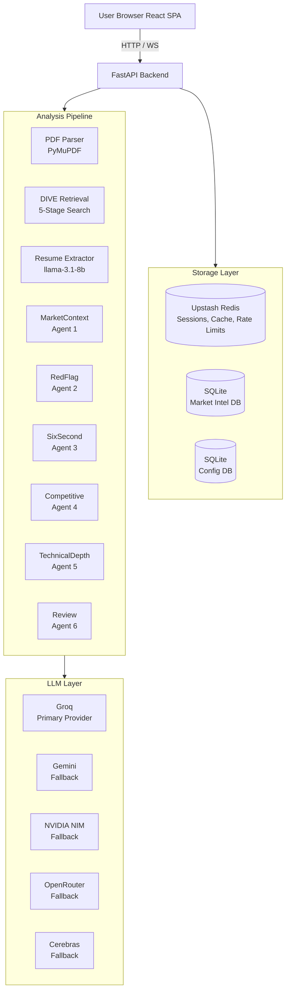
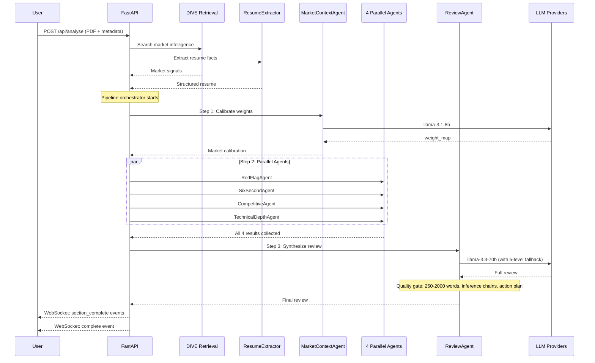
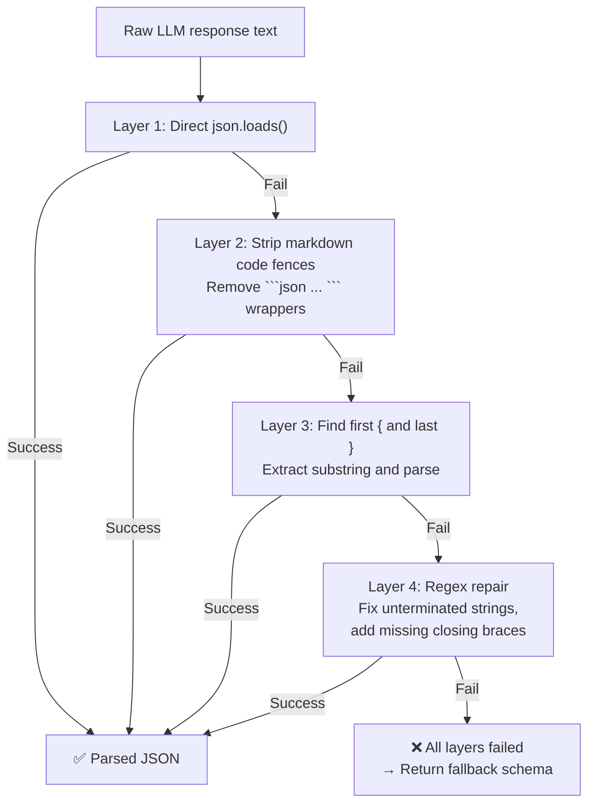
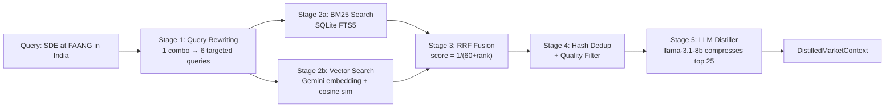
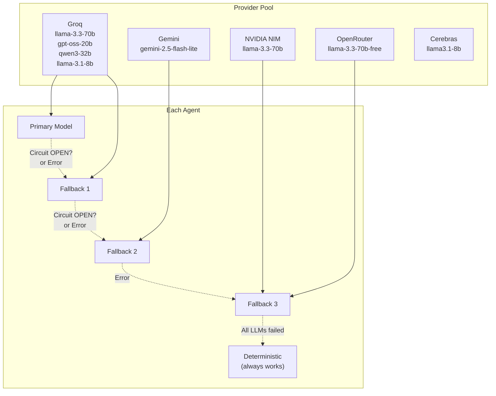
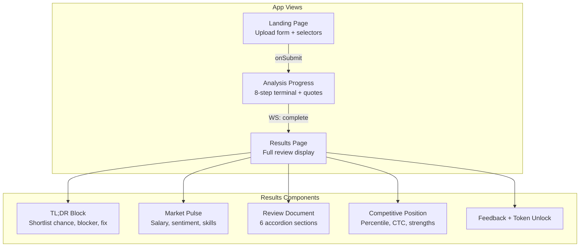
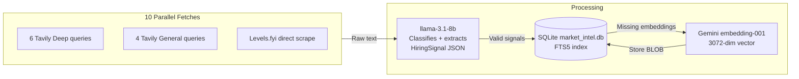

# ROAST — Resume Critic AI (Deep Dive)

> **For**: Complete refresher. Understand everything you built.
> **Goal**: Answer any interview question about ROAST architecture, agents, pipeline, or tradeoffs.

---

## What is ROAST?

A web app where users upload a resume → get a market-calibrated AI review. 6 agents analyze the resume in parallel, grounded in real market data.

**User flow**: Upload PDF → pick role/company/market → wait 2-3 min → get detailed review with TL;DR, market pulse, red flags, competitive position, action plan.

---

## High-Level Architecture



---

## Tech Stack

| Component | Technology | Why Chosen |
|-----------|-----------|------------|
| Backend | FastAPI | Async, native WebSocket, auto OpenAPI docs |
| Frontend | React 19 + Vite 8 + Tailwind v4 | Modern, fast HMR |
| LLM Primary | Groq (multi-key) | 14,400 RPD for 8B models, free tier |
| LLM Fallbacks | Gemini, NIM, OpenRouter, Cerebras | 5 providers = no single point of failure |
| Cache/Session | Upstash Redis | Serverless Redis, free tier, survives restarts |
| Market DB | SQLite (market_intel.db) | Pre-built via monthly ingestion. No external DB needed |
| Config DB | SQLite (market_config.db) | Company lists, salary bands, role weights |
| PDF | PyMuPDF (fitz) | Fast, extracts links from annotation layer |
| Embeddings | Gemini gemini-embedding-001 | 3072-dim. API-based, no GPU needed |
| Search | SQLite FTS5 + numpy | BM25 + vector. No external vector DB needed |
| Observability | Langfuse v4 | LLM call tracing, user feedback |
| Deployment | Docker → DigitalOcean App Platform | Full stack hosting (backend + frontend). $0 via GitHub Education $200 credit. Auto-deploy from GitHub branch. |

---

## Project Structure

```
roast/
├── ROAST_LLM_ROUTING.md       # 260-line LLM routing architecture doc
├── backend/
│   ├── main.py                # FastAPI entry, routers, startup/shutdown
│   ├── config.py              # Env vars: API keys, rate limits, thresholds
│   ├── market_data.py         # 982 lines. SQLite config DB CRUD + seed data
│   ├── pdf_reader.py          # Resume PDF → text + link extraction
│   ├── agents/                # 6 AI agents + support files
│   │   ├── resume_extractor.py
│   │   ├── market_context_agent.py
│   │   ├── red_flag_agent.py
│   │   ├── six_second_agent.py
│   │   ├── competitive_agent.py
│   │   ├── technical_depth_agent.py
│   │   ├── review_agent.py
│   │   ├── followup_agent.py
│   │   ├── tech_search.py     # 91 lines. DuckDuckGo lookup with 30-day Redis cache
│   │   ├── json_utils.py      # 51 lines. 4-layer JSON extraction
│   │   ├── schemas.py         # 168 lines. Pydantic models for all agents
│   │   └── prompts/           # 7 prompt files:
│   │       ├── template.py              # Base prompt builder
│   │       ├── review_prompt.py         # 356-line market+company-aware review
│   │       ├── red_flag_prompt.py       # 188-line 11-category hunting
│   │       ├── six_second_prompt.py     # Company-type-aware scan
│   │       ├── competitive_prompt.py    # Percentile + salary calibration
│   │       ├── market_context_prompt.py # Weight map synthesis
│   │       └── follow_up_prompt.py      # 100-200 word rule
│   ├── llm/                   # Provider clients + routing
│   │   ├── router.py          # Routes to providers with fallback chains
│   │   ├── groq_client.py     # Distributed key rotation via Redis
│   │   ├── gemini_client.py   # Gemini with asyncio lock key rotation
│   │   ├── openrouter_client.py
│   │   ├── nvidia_nim_client.py
│   │   ├── cerebras_client.py
│   │   ├── langfuse_client.py
│   │   └── circuit_breaker.py # 3-state per-provider breaker
│   ├── pipeline/
│   │   └── orchestrator.py    # 480 lines. Coordinates ALL agents
│   ├── retrieval/
│   │   └── dive.py            # 645 lines. 5-stage retrieval pipeline
│   ├── routes/
│   │   ├── analyse.py         # POST /api/analyse
│   │   ├── session.py         # POST /api/session-init
│   │   ├── websocket.py       # WS /api/ws/{session_id}
│   │   ├── followup.py        # POST /api/followup
│   │   ├── cron.py            # POST /refresh-market-intel
│   │   ├── token_feedback.py  # POST /api/token, /api/feedback
│   │   └── ws_manager.py      # 80 lines. WebSocket connection manager
│   ├── storage/
│   │   ├── session_store.py   # Redis session CRUD
│   │   ├── rate_limit.py      # IP-based, IST midnight reset
│   │   └── redis_client.py    # Upstash Redis singleton
│   └── corpus/                # Anonymized signal DB for calibration
│       ├── corpus_store.py
│       └── bullet_curator.py
├── ingestion/
│   ├── pipeline.py            # Orchestrator. 10 queries/combo
│   ├── extractor.py           # LLM signal classification
│   ├── search.py              # 133 lines. BM25 (FTS5) search
│   ├── embeddings.py          # 166 lines. Gemini embedding + vector search
│   ├── database.py            # 100 lines. SQLite schema + FTS5 virtual tables
│   ├── levels_scraper.py      # 100 lines. Levels.fyi direct httpx scrape
│   ├── tavily_client.py       # Budget-tracked Tavily search
│   ├── breaking_signal.py     # 24h breaking news layer
│   └── market_intel.db        # Pre-populated 30MB SQLite (committed in git)
├── frontend/                  # React SPA
│   ├── vite.config.js         # Vite config: React + Tailwind + proxy to :8000
│   └── src/
│       ├── App.jsx
│       ├── lib/api.js
│       ├── hooks/
│       │   ├── useWebSocket.js
│       │   └── useInferenceToggle.js
│       └── components/
│           ├── LandingPage.jsx
│           ├── AnalysisProgress.jsx
│           ├── ResultsPage.jsx
│           ├── TLDRBlock.jsx
│           ├── MarketPulse.jsx
│           ├── ReviewDocument.jsx
│           ├── Feedback.jsx
│           ├── ErrorBoundary.jsx  # 29 lines. Catches agent/WS failures
│           └── SkeletonLoader.jsx
├── pyproject.toml             # Python >=3.12, dependencies
├── uv.lock                    # 473KB lock file
├── tests/
│   ├── test_config.py
│   ├── test_levels_scraper.py
│   ├── test_pdf_reader.py
│   ├── test_phase1.py
│   ├── test_rate_limit.py
│   ├── test_session_store.py
│   ├── test_tavily_client.py
│   └── sample.pdf             # Test fixture
└── scripts/
    ├── prepopulate.py          # Ingestion for all 70 combos
    ├── reembed.py              # Regenerate missing embeddings
    └── perf_audit.py           # 129 lines. Performance audit tool
```

> **Note on committed DB files**: `backend/market_config.db` (90KB) and `ingestion/market_intel.db` (30MB) are intentionally tracked in git. The `.gitignore` explicitly allows them with a comment: *"Database — intentionally tracked, contains pre-populated market signals (no secrets)"*. This means the app works out-of-the-box without running the 1-hour ingestion script. The DB files contain only public market data (salary surveys, hiring signals) — no secrets or PII.

---

## Agent Pipeline



## The 6 Agents in Detail

### Agent 1: MarketContextAgent (runs FIRST)

**What it does**: Takes DIVE market signals + job description → produces a **weight_map** that tells every other agent what to focus on.

```
Example output for "SDE at Indian Startup":
{
  "dsa_weight": 0.30,
  "projects_weight": 0.25,
  "cgpa_weight": 0.15,
  "experience_weight": 0.20,
  "college_tier_weight": 0.10
}
```

**Why it runs alone**: Every other agent needs these weights. RedFlagAgent needs to know "is 7.5 CGPA concerning?" CompetitiveAgent needs weights to compute percentile.

**Key logic**: After LLM produces weights, `_enforce_weight_map()` cross-checks against DB rules (role overrides, company overrides, experience defaults). LLM can suggest, but DB rules are enforced.

**Fallback**: If LLM fails, returns DB defaults + LOW confidence. System still works.

### Agent 2: RedFlagAgent (parallel)

**What it does**: Hunts 11 categories of resume problems.

**11 categories**:
1. **Hedge words** ("familiar with," "exposed to") — shallow knowledge
2. **Unverifiable skills** — claims without evidence
3. **Missing contact** — no email/phone/LinkedIn
4. **CGPA consequences** — below role threshold
5. **Buried lead** — impressive fact in boring sentence
6. **Responsibility without outcome** — just listed duties
7. **Date arithmetic** — gaps/overlaps in timeline
8. **Hidden CGPA** — graduation year shown but GPA hidden
9. **Generic filler** — anyone could write this
10. **ATS keyword gaps** — missing terms for target role
11. **Role-specific mistakes** — wrong tech stack claims

**Quality gate**: Each flag needs: location_in_resume ≥ 10 chars, fix ≥ 20 chars, inference_chain ≥ 50 chars. Generic phrases like "could be improved" are rejected.

### Agent 3: SixSecondAgent (parallel)

**What it does**: Simulates a recruiter's F-pattern scan (eyes scan top → left → diagonal in 6 seconds). Also analyzes career trajectory.

**Input**: First 200 words (for scan) + full resume (for trajectory).

**Output**: First-impression score + career narrative + trajectory assessment.

### Agent 4: CompetitiveAgent (parallel)

**What it does**: Estimates where the candidate ranks in the applicant pool.

**Outputs**:
- Percentile range (e.g., "45th–55th percentile")
- Expected CTC range (e.g., "₹12-18 LPA")
- Strengths and weaknesses for THIS specific role

**Calibration**: If corpus has ≥30 similar profiles → "calibrated" (based on real data). If <30 → "based on market data" (uses salary bands from market_config.db).

### Agent 5: TechnicalDepthAgent (parallel, 90s timeout)

**What it does**: Evaluates projects with genuine technical understanding.

**Agentic ReAct loop**: This is ROAST's only true agent — it calls DuckDuckGo search to verify project claims:

```python
# Simplified ReAct loop for TechnicalDepthAgent
async def evaluate_project(project, role_level):
    context = f"Project: {project.description}\nRole: {role_level}"
    observation = ""
    for step in range(3):  # Max 3 search iterations
        # THINK: LLM decides if it needs more info
        decision = await llm_judge(context, observation)
        if decision == "sufficient":
            break
        # ACT: Search for verification
        search_query = decision["search_query"]
        results = await tech_search.search(search_query)
        # OBSERVE: Incorporate results
        observation += f"\nSearch for '{search_query}': {results}"
    # FINAL: LLM makes determination
    return await llm_classify(project, context, observation)
```

**Why only 3 iterations?** Each search takes ~2s. 3 iterations = ~6s. With a 90s timeout, this leaves 84s for the LLM call. The system prompt explicitly tells the LLM: *"You have at most 3 search attempts. Choose your searches carefully."*

**Difficulty levels**: Tutorial / Intermediate / Advanced / Exceptional (role-calibrated).

**Skip filter**: Known tech (100+ terms) bypasses web search to save time. Terms like "React", "Docker", "Python" are already well-understood — no need to search.

---

## JSON Validation Pipeline — 4-Layer Defense Against LLM JSON Failures

LLMs frequently output malformed JSON. The `json_utils.py` module implements a **4-layer extraction strategy** that tries increasingly aggressive parsing:



```python
def extract_json(text: str) -> dict | None:
    """4-layer JSON extraction. Returns None only if ALL strategies fail."""
    # Layer 1: Direct parse
    try:
        return json.loads(text)
    except json.JSONDecodeError:
        pass
    
    # Layer 2: Strip markdown code fences
    cleaned = re.sub(r'^```(?:json)?\s*', '', text.strip())
    cleaned = re.sub(r'\s*```$', '', cleaned)
    try:
        return json.loads(cleaned)
    except json.JSONDecodeError:
        pass
    
    # Layer 3: Find first { and last }
    match = re.search(r'\{.*\}', text, re.DOTALL)
    if match:
        try:
            return json.loads(match.group())
        except json.JSONDecodeError:
            pass
    
    # Layer 4: Aggressive repair
    # Try fixing unterminated strings and missing braces
    repaired = _repair_json(text)
    if repaired:
        try:
            return json.loads(repaired)
        except json.JSONDecodeError:
            pass
    
    return None  # All 4 layers failed
```

**Why this matters**: In benchmarks, ~40% of raw LLM responses from free-tier models have JSON formatting issues. Layer 2 alone catches 70% of these (markdown-wrapped responses). Layer 3 catches another 20%. Layer 4 handles the remaining 10% with regex repair. Without this, the pipeline would crash on 40% of calls.

---

## Pydantic Schema Layer — Structural Enforcement

Every agent output is validated against a Pydantic schema BEFORE any downstream code runs:

```python
class RedFlagOutput(BaseModel):
    red_flags: list[RedFlag]
    visual_scan_notes: str
    confidence: Literal["HIGH", "MEDIUM", "LOW"]

class RedFlag(BaseModel):
    category: str = Field(..., pattern=r"^(hedge_words|unverifiable_skills|missing_contact|"
                                        r"cgpa_consequences|buried_lead|responsibility_no_outcome|"
                                        r"date_arithmetic|hidden_cgpa|generic_filler|"
                                        r"ats_keyword_gaps|role_specific_mistakes)$")
    flag: str = Field(..., min_length=10)
    fix: str = Field(..., min_length=20)
    severity: Literal["LOW", "MEDIUM", "HIGH"]
    inference_chain: str = Field(..., min_length=50)
    location_in_resume: str = Field(..., min_length=10)
```

**Key design decisions:**
- `min_length=10` on `flag`: Prevents "Bad resume" — forces specific, actionable feedback
- `min_length=20` on `fix`: Prevents "Add more" — requires concrete suggestion
- `min_length=50` on `inference_chain`: Prevents "this is bad" — forces reasoning
- `category` has regex pattern: Only 11 predefined categories allowed — no hallucinated categories
- `severity` is enum: Must be LOW/MEDIUM/HIGH — forces prioritization

This is **defense in depth**: even if the JSON extraction succeeds, the Pydantic schema catches structural issues before any code processes them.

---

## Anti-Hallucination Prompt Architecture

The review prompts have three specific anti-hallucination mechanisms:

### 1. Grounding Rules (`review_prompt.py:247-253`)
```
- ALWAYS read the resume text before making any claim
- NEVER say 'no mention of X' before searching the resume text
- Every weakness claim must be VERIFIABLE against the resume text
- Every claim must be followed by "I see [evidence] in the resume"
```

### 2. Anti-Generic Guardrails (`red_flag_prompt.py:11-20`)
```python
BANNED_PHRASES = [
    "recruiters look for", "is important to", "this shows that",
    "lacks quantifiable", "should include metrics",
    "demonstrates that you", "will negatively impact"
]
```
Flags containing >1 banned phrase are rejected at parse time. This prevents meaningless generic feedback.

### 3. Inference Chain Enforcement (`review_prompt.py:311-314`)
```
"Recruiter sees [exact observation] → assumes [specific assumption] → decides [concrete outcome]"
```
The quality gate literally checks for `→` arrow characters. If missing, the review fails and retries with:
"Your review lacked inference chains. Each must follow: observation → assumption → decision."

---

## Langfuse Observability

Every LLM call is traced via Langfuse v4 with fire-and-forget logging:

```python
async def langfuse_trace(session_id, agent_name, model, 
                         prompt_tokens, completion_tokens, latency):
    trace = Langfuse().trace(
        name=f"roast_{agent_name}",
        session_id=session_id,
        metadata={"agent": agent_name, "model": model}
    )
    trace.generation(
        name=f"{agent_name}_call",
        model=model,
        usage={"input": prompt_tokens, "output": completion_tokens},
        latency=latency
    )
```

**What's tracked:**
- Per-agent: MarketContext, RedFlag, SixSecond, Competitive, TechnicalDepth, Review
- Per-model: Which provider/model was used (tracks fallback chain effectiveness)
- Token counts: prompt + completion (budget tracking)
- Latency: Time per call (identifies slow providers)
- Session_id: Links all calls in one analysis (debugging)

The trace is fire-and-forget — it runs in a background task so observability never blocks the pipeline.

### Agent 6: ReviewAgent (runs LAST)

**What it does**: Synthesizes ALL upstream outputs into a flowing English review.

**5-section review**:
1. What's Working
2. What's Hurting You
3. Career Story
4. Competitive Position
5. Action Plan

**Quality gate**: Word count 250-2000, inference chains present, specific follow-up questions, action plan has clear steps.

**Quality check retry logic**: If quality gate fails, the orchestrator sends a targeted retry instruction to the LLM without re-running upstream agents:

```python
RERUN_INSTRUCTION = """
Your previous review was rejected because it lacked specific inference chains.
Each section MUST follow this pattern:
"Recruiter sees [exact observation] → assumes [specific assumption] → decides [concrete outcome]"
Your review had: {validation_errors}
Please regenerate with specific evidence from the resume and market data.
"""
```

The retry runs with the SAME model but enriched instruction. Max 2 retries across 2 different providers before falling to `_assemble_partial_review()`.

**Fallback chain (5 levels)**: llama-3.3-70b → gpt-oss-20b → qwen3-32b → gemini-2.5-flash-lite → NIM → OpenRouter.

**Final fallback**: `_assemble_partial_review()` — deterministic Python synthesis. No LLM needed. Lower quality but NEVER fails.

```python
def _assemble_partial_review(six_second, red_flags, competitive, market_context):
    high_flags = [f for f in red_flags.red_flags if f.severity == "HIGH"]
    flag_text = " ".join([f.flag for f in high_flags[:3]]) if high_flags else "No critical issues found."

    return ReviewOutput(
        tldr_shortlist_chance=competitive.percentile_estimate.range,
        tldr_biggest_blocker=flag_text,
        tldr_fix_first=competitive.highest_leverage_change,
        confidence="LOW",
        whats_working_section=" ".join(competitive.strengths_vs_pool[:2]),
        whats_hurting_section=" ".join([f.inference_chain for f in high_flags[:2]]),
        career_story_section=six_second.career_story,
        competitive_position_section=competitive.percentile_estimate.reasoning,
        action_plan_section=competitive.highest_leverage_change,
        jd_alignment_section="",
        six_second_followups=["What can I improve about my first impression?"],
    )
```

**Trigger condition**: Called only after 2 LLM attempts with 2 different providers (with retry instructions) all fail. Copies upstream outputs directly — no LLM involvement.

---

## Orchestrator Deep Dive (`pipeline/orchestrator.py`)

The orchestrator is 480 lines. It's the brain of the entire analysis pipeline.

### Design Reasoning — Why 6 Agents?

```
Why not 1 agent that does everything?
  - Single agent with 2000+ token output → quality degrades
  - Harder to debug: which subsystem failed?
  - No parallelism: everything runs sequentially

Why these specific 6?
  - MarketContext: calibrates weights for everything downstream
  - RedFlag: pattern-matching, needs weight_map
  - SixSecond: first-impression, needs weight_map
  - Competitive: percentile calc, needs weight_map
  - TechnicalDepth: deep project analysis, independent
  - Review: synthesis, needs ALL upstream outputs
```

The separation follows the **Single Responsibility Principle** for LLM agents. Each agent has one job, one prompt, one output schema. This makes them independently testable and replaceable.

### Execution Order: 3 Stages, 6 Agents

```
Stage 1 (sequential): JD Parser → DIVE Retrieval → ResumeExtractor
Stage 2 (sequential): MarketContextAgent (runs alone, needs DIVE output)
Stage 3 (parallel):   ┌── RedFlagAgent
                      ├── SixSecondAgent
                      ├── CompetitiveAgent
                      └── TechnicalDepthAgent
Stage 4 (sequential): ReviewAgent (with fallback chain + quality gate)
Stage 5 (async):      Corpus store + bullet curation (fire-and-forget)
```

### Semaphore System — 4 Levels of Concurrency

```python
_groq_sem = asyncio.Semaphore(2)        # Max 2 concurrent Groq calls
_gemini_sem = asyncio.Semaphore(1)      # Max 1 concurrent Gemini call
_global_sem = asyncio.Semaphore(3)      # Max 3 simultaneous full pipelines
_tech_depth_sem = asyncio.Semaphore(3)  # gpt-oss-120b: 24K TPM with 3 keys
```

Each semaphore prevents resource exhaustion at a different level:
- **Groq sem (2)**: Multiple API keys share a pool-wide RPD. Limiting concurrency prevents daily quota burn.
- **Global sem (3)**: Prevents 100 concurrent users from overwhelming free-tier providers.
- **Tech depth sem (3)**: gpt-oss-120b has 24K TPM across 3 keys. Semaphore keeps bursts under limit.

### Design Reasoning — Semaphore Values

| Semaphore | Value | Why 2/3 and not 5 or 10 |
|-----------|-------|--------------------------|
| `_groq_sem` | 2 | Free-tier RPD: 14,400 for 8B, 1,000 for 70B. With 2 concurrent, each call averages 0.5s → 2 calls/s = 172K calls/day. Higher would burn RPD in hours. |
| `_global_sem` | 3 | Free-tier Cloud Run has 10 concurrent max. 3 leaves headroom for HTTP serving + health checks. |
| `_tech_depth_sem` | 3 | 3 API keys × 2 concurrent = 6 calls. Each TechnicalDepth call takes ~90s. 6 × 90s = 9min not counting other agents. At 3 concurrent, a full pipeline takes ~3min — acceptable UX. |

### Error Propagation — Never Crash

Every parallel agent is wrapped with `return_exceptions=True`:

```python
red_flags, six_second, competitive, tech_depth = await asyncio.gather(
    _run_red_flag(session, request, market_context, progress_callback),
    _run_six_second(session, request, resume_facts, progress_callback),
    _run_competitive(session, request, resume_facts, progress_callback),
    _run_tech_depth(session, request, resume_facts, progress_callback),
    return_exceptions=True
)
```

Each failure is caught and replaced with a fallback output:

```python
if isinstance(red_flags, Exception):
    red_flags = RedFlagOutput(red_flags=[], visual_scan_notes="", confidence="LOW")
```

**The pipeline NEVER crashes.** Every agent has a guaranteed fallback schema.

### Confidence Override

```python
if full_market_ctx.raw_signal_count >= 10 and market_context.confidence == "LOW":
    market_context.confidence = "HIGH"  # LLM is too conservative
```

When DIVE retrieves 10+ signals but the MarketContextAgent still says "LOW" confidence, the orchestrator overrides it. The LLM is inherently conservative; the orchestrator knows better.

### Prompt Versioning for A/B Testing

```python
def _compute_prompt_hash(session, request):
    all_prompts = "...".join([p1, p2, p3, p4, p5])
    return hashlib.sha256(all_prompts.encode()).hexdigest()[:8]

def _get_prompt_variant(session_id):
    return "A" if int(hashlib.md5(session_id.encode()).hexdigest()[-1], 16) % 2 == 0 else "B"
```

Every analysis records which prompt variant was used. Enables A/B testing prompt changes without separate deployments.

### Section-Level Streaming

```python
async def _emit_section(session_id, section_name, result):
    await ws_manager.emit(session_id, {
        "event": "section_complete",
        "data": {"section": section_name, "result": result}
    })
    # Also persist to Redis for reconnection recovery
    redis.setex(f"session:{session_id}:{section_name}", 3600, json.dumps(result))
```

Each completed section is emitted via WebSocket AND persisted in Redis. If the user disconnects and reconnects, `_get_completed_sections()` replays completed sections.

---

## DIVE Retrieval (5 Stages)

### Design Reasoning

**Why BM25 + Vector (hybrid) and not just one?**
```
BM25 only:  Exact keyword match. Misses "salary" when query is "compensation"
Vector only: Semantic match. Misses exact "Python 3.12" in favor of "programming language"
Hybrid:     Both. "senior software engineer salary" → BM25 catches "salary", vector catches "senior software engineer compensation"
```

**Why SQLite FTS5 over Elasticsearch?**
```
Elasticsearch:  Needs a server, ~2GB RAM, ops overhead
SQLite FTS5:    Built into Python stdlib (almost), zero config, zero cost
Tradeoff:       SQLite FTS5 is ~100x slower than ES on 100K+ docs.
                At ~10K signals, SQLite is fast enough (<100ms per query).
```

**Why RRF_K = 60?**
The RRF constant K controls how quickly rank position affects score:
```
K=1:   Rank #1 = 1.0, Rank #10 = 0.09 → extreme bias to top results
K=60:  Rank #1 = 0.016, Rank #10 = 0.014 → gentle decay
K=100: Rank #1 = 0.0099, Rank #10 = 0.0091 → almost uniform
```

K=60 is the standard from the original RRF paper. It provides gentle rank decay where docs appearing in BOTH lists are favored but top-ranked docs from one list still get credit.



### Stage 1 — Query Rewriting

One combo → 6 targeted queries:

```python
def _build_retrieval_queries(role, company_type, market, experience_level):
    return [
        f"{role} hiring sentiment {company_type} {market}",
        f"{role} required skills tools {company_type} {market}",
        f"{role} competitive pool applicants {market}",
        f"{role} definition expectations {experience_level} {market}",
        f"{role} red flags resume {company_type} {market}",
        f"{role} salary format norms {market}",
    ]
```

Each query targets a different aspect (salary, skills, hiring trends, company news, competition, market sentiment).

### Stage 2 — Parallel Search

BM25 and vector search run simultaneously:

```python
async def _parallel_search(queries, combo_id):
    bm25_results, vector_results = await asyncio.gather(
        asyncio.to_thread(_bm25_search, queries),     # SQLite FTS5
        asyncio.to_thread(_vector_search, queries),   # Numpy cosine similarity
    )
```

- **BM25**: SQLite FTS5 — runs all 6 queries against `market_signals` FTS5 index, deduplicates by signal `id`
- **Vector**: Gemini embedding (3072-dim) → numpy cosine similarity against stored BLOBs. Combined query string embedded once.

### Stage 3 — RRF Fusion

Standard Reciprocal Rank Fusion:

```python
RRF_K = 60
def _rrf_fusion(bm25_results, vector_results):
    scores = {}
    for rank, row in enumerate(bm25_results, start=1):
        scores[row["id"]] = scores.get(row["id"], 0) + 1 / (RRF_K + rank)
    for rank, row in enumerate(vector_results, start=1):
        scores[row["id"]] = scores.get(row["id"], 0) + 1 / (RRF_K + rank)
    sorted_ids = sorted(scores.keys(), key=lambda x: scores[x], reverse=True)
    return [rows_by_id[i] for i in sorted_ids]
```

Documents appearing in BOTH BM25 and vector results get double the score — they float to the top.

### Stage 4 — Hash Dedup + Quality Filter

```python
def _hash_dedup(results, limit=25):
    seen_hashes = set()
    filtered = []
    for row in results:
        content_hash = hashlib.md5(row["content"][:200].encode()).hexdigest()
        if content_hash not in seen_hashes:
            seen_hashes.add(content_hash)
            if len(row.get("content", "")) >= 30:  # quality filter
                filtered.append(row)
    return filtered[:25]
```

### Stage 5 — LLM Distiller

llama-3.1-8b compresses top 25 signals into a concise `DistilledMarketContext` for MarketContextAgent:

```python
DISTILLER_SYSTEM = """You are a market intelligence analyst. Given raw hiring signals,
extract: key salary ranges, in-demand skills, hiring sentiment, common red flags.
Output: concise JSON with fields: salary_range, top_skills, sentiment, key_insights, signal_count"""
```

On failure: returns DB defaults with `confidence="LOW"`.

### Caching Strategy (3-tier)

| Cache | Key Pattern | TTL | Purpose |
|-------|------------|-----|---------|
| **Snapshot** | `snapshot:{role}:{company}:{market}` | 15 days | Full DIVE result |
| **Previous snapshot** | `snapshot_prev:{role}:{company}:{market}` | 60 days | For diff comparison |
| **Breaking signal** | `breaking:{market}:{category}:{company}` | 24 hours | Fresh news layer |

### Warmup

On server startup, `warmup_cache()` refreshes top 15 combos (by historical `combo_count:` in Redis). Each stale (>24h) combo gets a fresh DIVE run. This ensures the first user of the day doesn't wait for retrieval.

---

## LLM Routing & Fallback

### Model Selection Reasoning

**Why Groq as primary?**
```
Free tier:  14,400 RPD for 8B models, 1,000 RPD for 70B models
Latency:    0.2-0.5s per call (LPU hardware vs GPU)
Models:     Llama, Qwen, GPT-OSS — diverse architecture coverage

Alternatives considered:
  OpenAI:    $0.15-1.00/1M tokens — too expensive for free-tier project
  Anthropic: $3/1M tokens — also too expensive  
  Together:  Good model variety but similar cost
  Replicate: Per-second billing, unpredictable costs
```

**Why 5 providers?**
```
Why not 2 or 3? At free tier, every provider has rate limits.
  Groq:  14,400 RPD → 1 analysis uses 6-12 calls → 1,200-2,400 analyses/day
  Gemini: 1,500 RPD → 125-250 analyses/day
  NIM:    40 RPM → ~400-800 analyses/day
  OpenRouter: 50 RPD → 4-8 analyses/day
  Cerebras: 1M tokens/day

With 5 providers and circuit breakers, total daily capacity = sum of all free tiers.
Losing any single provider reduces capacity but doesn't block users.
```

**Why different models per agent?**
```
Review Agent:     llama-3.3-70b (largest, most coherent synthesis)
RedFlag Agent:    llama-3.3-70b (needs nuanced judgment)
SixSecond Agent:  qwen3-32b (faster, good for impression)
Competitive:      gpt-oss-20b (good with numerical reasoning)
TechnicalDepth:   gpt-oss-120b (deepest technical knowledge)
MarketContext:    llama-3.1-8b (simple classification, fastest)
```



**Circuit breaker per provider**:
- CLOSED: Normal operation
- OPEN (after 3 failures): Fast-fail for 5 minutes
- HALF-OPEN (after 5 min): Allow 1 test call
- Success → CLOSED. Failure → OPEN again.

**Provider fallback chains per agent**:

| Agent | Primary | Fallback 1 | Fallback 2 | Fallback 3 |
|-------|---------|-----------|-----------|-----------|
| Review | llama-3.3-70b (Groq) | gpt-oss-20b | qwen3-32b | Gemini → NIM → OpenRouter |
| RedFlag | llama-3.3-70b (Groq) | llama-3.1-8b | — | — |
| SixSecond | qwen3-32b (Groq) | llama-3.1-8b | — | — |
| Competitive | gpt-oss-20b (Groq) | NIM | — | — |
| TechnicalDepth | gpt-oss-120b (Groq) | llama-3.1-8b | — | — |
| MarketContext | llama-3.1-8b (Groq) | — | — | — |

---

## Circuit Breaker Implementation (`llm/circuit_breaker.py`)

### Design Reasoning

**Why in-memory and not Redis?** Circuit breakers are per-instance by design. Each container should independently decide when to stop calling a provider. If all 3 containers open simultaneously (e.g., Groq is down), that's correct behavior. Redis persistence would add latency to every LLM call and complexity to the HALF-OPEN recovery logic.

**Why 3 failures and 5 minutes?**
```
3 failures:   One failure = transient (network glitch). Two = suspicious.
              Three = pattern. At 3, provider is likely degraded.
5 minutes:    Groq free tier recovers from rate limits in ~1-2 minutes.
              If 3 failures in a row, probably not a rate limit — give 5min.
              Long enough to avoid rapid open-close cycling.
```

**Why single success closes?** If a HALF-OPEN probe succeeds, the provider is healthy. No reason to keep it partially open. Immediate CLOSED minimizes false negatives.

### 3-State Machine

```python
class CircuitBreaker:
    def __init__(self, name, failure_threshold=3, cooldown_seconds=300):
        self.name = name
        self.state = "closed"        # closed → open → half_open
        self.failures = 0
        self.threshold = 3           # 3 consecutive failures → open
        self.cooldown = 300           # 5 minutes cooldown
        self.last_failure_time = 0

    def record_failure(self):
        self.failures += 1
        if self.failures >= self.threshold:
            self.state = "open"
            self.last_failure_time = time.time()

    def record_success(self):
        if self.state == "half_open":
            self.state = "closed"
            self.failures = 0

    def should_skip(self):
        if self.state == "open":
            if time.time() - self.last_failure_time > self.cooldown:
                self.state = "half_open"
                return False  # Allow 1 probe call
            return True  # Fast-fail
        return False  # Let the call through
```

| State | Behavior |
|-------|----------|
| **CLOSED** | Normal operation. Calls go through. |
| **OPEN** | Fast-fail for 5 minutes. No calls attempted. |
| **HALF-OPEN** | Allow 1 test call. Success → CLOSED. Failure → OPEN again. |

### Key Details

- **In-memory only** — NOT persisted to Redis. Restart resets all circuits.
- **Not distributed** — each worker/container has its own circuit breaker state.
- **Time-based recovery** — transitions HALF-OPEN after exactly 300s, not after a configurable interval.
- **Single success closes** — one successful call in HALF-OPEN resets to CLOSED immediately.

### 5 Singleton Breakers

```python
# Module-level singletons — one per provider
groq_cb = CircuitBreaker("groq")
gemini_cb = CircuitBreaker("gemini")
cerebras_cb = CircuitBreaker("cerebras")
openrouter_cb = CircuitBreaker("openrouter")
nvidia_nim_cb = CircuitBreaker("nvidia_nim")
```

---

## Groq Key Rotation (`llm/groq_client.py`)

### Distributed Round-Robin via Redis

```python
_keys = [k.strip() for k in GROQ_API_KEYS.split(",")]

async def _get_key_index():
    idx = await redis.incr("groq:round_robin_counter")
    return (idx - 1) % len(_keys)
```

Every API call atomically increments `groq:round_robin_counter` in Redis. The index is computed as `(counter - 1) % key_count`. This distributes evenly across all workers/containers since the counter lives in Redis.

### RPD Tracking Per Model Per Key

```python
RPD_LIMITS = {
    "llama-3.1-8b-instant":    14400,
    "llama-3.3-70b-versatile":  1000,
    "qwen/qwen3-32b":           1000,
    "openai/gpt-oss-20b":       1000,
    "openai/gpt-oss-120b":      1000,
}
```

Each model × each key has a counter at `groq:rpd:{model}:{key_index}`. TTL set with 0-300s random jitter to expire at midnight UTC (prevents thundering herd).

### 429 Handling

```python
except RateLimitError:
    key_idx = _rotate(key_idx)  # (current + 1) % len(_keys)
    client = AsyncGroq(api_key=_keys[key_idx])
    await asyncio.sleep(backoff[attempt])  # [2, 4, 8]
```

On 429: rotate to next key, retry with exponential backoff (2s, 4s, 8s).

### Proactive Fallback Warnings

RPM remaining is extracted from response headers and stored in Redis. If < 50 remaining, logged as warning for operator alerting.

### Qwen3 Thinking Mode Handling

```python
if "</think>" in text:
    text = text[text.index("</think>") + len("</think>"):].strip()
elif text.startswith("<think>"):
    raise RuntimeError("qwen3_thinking_truncated")  # triggers retry with higher temp
```

Qwen3 models wrap their reasoning in `<think>...</think>` tags. The client strips them. If the thinking is truncated (no closing tag), it retries with higher temperature.

### Langfuse Tracing

Fire-and-forget trace on every successful LLM call (if session_id + agent_name provided). Tracks: model, provider, prompt tokens, completion tokens, latency, and agent name.

---

## Rate Limiter (`storage/rate_limit.py`)

### Design Reasoning

**Why 3/day and not 5 or 10?**
```
Free-tier analysis costs:
  Each analysis: 6-12 LLM calls × $0 (free tier RPD-limited)
  With 3/day: ~36 LLM calls/day per IP → fits in Groq's 14,400 RPD
  With 10/day: ~120 calls/day → 1,200 analyses/day = 14% of Groq's daily budget
  
3/day is conservative. It prevents a single user from burning the entire free tier.
Token unlock extends this to 4/day for users who provide email.
```

**Why IST midnight reset?**
Users are in India (IST). Midnight reset aligns with daily free tier quota cycles. Also when users naturally expect a "fresh day" of credits.

### IP-Based, 3 Analyses/Day

```python
FREE_ANALYSES_PER_DAY = 3
IST = ZoneInfo("Asia/Kolkata")

def check_and_increment(ip):
    key = f"ratelimit:{ip}"
    count = redis.incr(key)
    if count == 1:
        ttl = _seconds_until_midnight_ist()
        redis.expire(key, ttl)
    allowed = count <= 3
    if not allowed:
        redis.decr(key)  # undo the atomic incr
    return {"allowed": allowed, "count": count, "remaining": max(0, 3 - count), "limit": 3}
```

### Midnight Reset (IST)

```python
def _seconds_until_midnight_ist():
    now = datetime.now(IST)
    midnight = datetime.combine(now.date(), time(0, 0, 0), tzinfo=IST)
    if midnight <= now:
        midnight += timedelta(days=1)
    return int((midnight - now).total_seconds())
```

### Token Unlock Override

In `analyse.py`: if rate limited AND `redis.get(f"token_unlocked:{session_id}")` exists, the rate limit is skipped and the token key is deleted (one-time use). Users can get an email token for an extra analysis.

### Anti-Bot Timing Gate

```python
if elapsed < 1.0:  # Reject requests faster than 1 second (likely a bot)
    raise HTTPException(429)
```

---

## Session Store (`storage/session_store.py`)

### Redis Key Pattern

```
session:{session_id}  # TTL: 3600s (1 hour)
```

### Fields Stored

```python
session = {
    "session_id": str(uuid.uuid4()),
    "role": str,                    # e.g. "SDE1"
    "market": str,                  # e.g. "India"
    "company_type": str,            # e.g. "Indian Product Company"
    "experience_level": str,        # e.g. "Junior"
    "created_at": int(time.time()),
    "status": "pending"             # pending → processing → completed / failed
}
```

After pipeline starts (`analyse.py`), additional fields are added: `resume_text`, `resume_links`, `page_count`, canonicalized `company_type`.

### Update Pattern

```python
def update_session(sid, updates):
    data = redis.get(f"session:{sid}")       # Get current
    data.update(updates)                      # Merge
    redis.setex(f"session:{sid}", 3600, data) # Set with TTL refresh
```

### Section-Level State (for Reconnection Recovery)

Each pipeline stage stores its output at:
```
session:{sid}:MarketContext
session:{sid}:RedFlag
session:{sid}:SixSecond
session:{sid}:Competitive
session:{sid}:TechnicalDepth
session:{sid}:Review
```

On WebSocket reconnect, `_get_completed_sections(sid)` reads all 6 keys and re-emits `section_complete` events for completed ones.

---

## Analyse Route Flow (`routes/analyse.py`)

### Multipart Upload → Pipeline Trigger

```
POST /api/analyse (multipart/form-data)
│
├── 1. Validate session exists (GET from Redis)
│
├── 2. Idempotency check — reject if status=processing or completed
│
├── 3. Anti-bot gate — reject if form filled in < 1.0s
│
├── 4. Rate limit check — IP-based, 3/day IST
│   └── Token unlock override for 4th analysis
│
├── 5. Extract PDF
│   ├── Content-type validation
│   ├── PyMuPDF extract text + links
│   ├── Validate: max 5MB, max 3 pages, min 200 chars, max 15K chars
│   ├── Temp file → extract → unlink immediately
│   └── track in _temp_files set for crash cleanup
│
├── 6. Update session → "processing"
│
├── 7. BackgroundTasks.add_task(_run_pipeline_and_stream, ...)
│   └── HTTP response returns immediately
│
└── 8. Return {session_id, status: "processing", pages: N, chars: N}
```

### Background Pipeline Task

```python
@router.post("/api/analyse")
async def analyse(...):
    ...
    background_tasks.add_task(_run_pipeline_and_stream, session_id, ...)
    return {"session_id": session_id, "status": "processing", ...}
```

FastAPI's `BackgroundTasks` ensures the HTTP response returns immediately while the pipeline runs asynchronously in the background. The **only** way to track progress is the WebSocket.

### IP Detection

```python
ip = request.headers.get("x-forwarded-for", request.client.host or "unknown")
# x-forwarded-for handles reverse proxies (Cloud Run)
```

### Temp File Cleanup

```python
_temp_files: set[str] = set()
atexit.register(_cleanup_temp_files)  # Clean up on crash
```

Every temp PDF file is registered for cleanup if the process crashes mid-extraction.

---

## WebSocket Handler Deep Dive (`routes/websocket.py`)

### Message Protocol

```
Server → Client: {"event": "section_complete", "data": {"section": str, "result": dict}}
Server → Client: {"event": "ping"}
Client → Server: "pong"
```

### Heartbeat Loop

```python
async def heartbeat_loop(session_id, ws, interval=10):
    while session_id in _connections:
        await asyncio.sleep(10)
        try:
            await ws.send_text(json.dumps({"event": "ping"}))
        except WebSocketDisconnect:
            break
```

30-second receive timeout. If no message in 30s, checks if session is completed/failed and breaks.

### Reconnection Recovery

On WebSocket connect:
1. Read all 6 section keys from Redis (`session:{sid}:*`)
2. For each completed section, re-emit `section_complete` event
3. If all 6 complete, emit `complete` event
4. If status is `failed`, emit `error` event

### Disconnect Handling

```python
except WebSocketDisconnect:
    pass
finally:
    heartbeat_task.cancel()
    _connections.pop(session_id, None)
```

Stale connections cleaned up by `cleanup_stale_connections()` after 5 minutes of inactivity.

### Share Preview

`GET /share/{session_id}` returns TL;DR block only (no resume text, no red flags). Cached 7 days in Redis.

---

## Prompt Engineering Patterns

### Prompt Architecture

All prompts go through `build_system_prompt()` in `agents/prompts/template.py`:

1. **Base persona**: `"You are an expert resume analyst specialising in {role} at {company_type} in {market}"`
2. **Market calibration** from DIVE (injected separately as context)
3. **Role calibration** from `market_config.db` (role weights, company lists)
4. **Company section**: Top 8 companies for this role+type+market (dynamically queried)
5. **Agent-specific task**: The actual instruction for THIS agent
6. **Universal constraints** (6 rules): generic advice ban, prompt injection resistance, JSON-only, edge cases
7. **Token budget warning**: 3000 token limit for responses
8. **Agent-specific constraints**: e.g., "do not contradict facts from earlier sections"

### Notable Patterns

**Role-Specific Calibration** (`review_prompt.py:108-171`):
- Fresher: judge projects/CGPA
- Junior: judge tech depth
- Mid: judge architectural decisions  
- Senior: judge org impact and leadership

**Company-Type-Aware Personas** (`review_prompt.py:8-105`):
Separate hiring manager personas for: service companies, FAANG, startups, MNC GCCs, semiconductor, consulting — each with specific city references (Whitefield for GCCs, Koramangala for startups).

**Inference chain enforcement, anti-generic guardrails, grounding rules, and the 4-layer JSON extraction pipeline** are detailed in the [Anti-Hallucination Architecture](#anti-hallucination-prompt-architecture) and [JSON Validation Pipeline](#json-validation-pipeline--4-layer-defense-against-llm-json-failures) sections above.

---

## 16 API Endpoints

| Method | Route | What It Does |
|--------|-------|-------------|
| POST | `/api/session-init` | Create session (role, company, market, experience) |
| POST | `/api/analyse` | Upload PDF resume (multipart) |
| WS | `/api/ws/{session_id}` | Real-time progress + results stream |
| GET | `/api/session/{id}/state` | Poll for reconnection after WS drop |
| GET | `/api/session/{id}` | Raw session data |
| POST | `/api/followup` | One-click follow-up Q&A |
| POST | `/api/feedback` | Useful/not-useful vote |
| POST | `/api/token` | Request email token for extra analysis |
| POST | `/api/token/verify` | Validate token |
| POST | `/refresh-market-intel` | QStash monthly cron (HMAC verified) |
| GET | `/health` | Liveness + total analysis count |
| GET | `/share/{session_id}` | Public TL;DR preview |

---

## Frontend Architecture



**Two views only** (manual `useState` switching — no router library):
1. **Landing**: Form with 4 selectors (role, experience, company, market), PDF dropzone (5MB max), optional context/JD/GitHub, consent checkboxes
2. **Analysis** → either Progress (streaming) or Results (complete)

**useWebSocket hook** (110 lines):
- Connects to `WS /api/ws/{session_id}`
- Processes: `ping` → reply `pong`, `section_complete` → accumulate results, `complete` → show results
- **Polling fallback**: If WS disconnects, poll `GET /api/session/{id}/state` every 5s
- **Heartbeat**: 3 missed pings (45s) → switch to polling

---

## Ingestion Pipeline (Monthly)



**What it does**: Every month, for each of ~70 role/company/market combos:
1. Fire 10 search queries (6 deep + 4 general) via `asyncio.gather`
2. Handle truncated results via Jina Reader fallback
3. Classify each result with llama-3.1-8b (is this a job posting? salary survey? blog? discard?)
4. Extract structured HiringSignal: signal_type, skills, salary_range, sentiment, trust_weight
5. Store in SQLite `market_signals` table with auto-synced FTS5 index
6. Generate Gemini embeddings (3072-dim), store as BLOB

**Optimization story**: Original was sequential — 70 combos took 10+ hours. After refactoring to async parallel with semaphore (3 concurrent), same work takes <1 hour. The lesson: start concurrent from day one.

---

## Key Architecture Decisions

1. **SQLite instead of vector DB**: A full Pinecone/Qdrant deployment was overkill. SQLite FTS5 + numpy cosine similarity handles the scale (~10K signals). No external service = zero cost, zero ops.

2. **5-provider fallback**: Free-tier LLM APIs are unreliable. Circuit breakers + fallback chains ensure no single provider failure blocks a user. The deterministic fallback guarantees something useful is always returned.

3. **Agent parallelism**: Agents 2-5 run in parallel (asyncio.gather). This cuts total analysis time from ~3 min to ~1.5 min. Agent 1 must run first (its output is needed by everyone). Agent 6 must run last.

4. **WebSocket + polling dual-mode**: WebSocket for real-time streaming during normal operation. HTTP polling fallback for reconnection. Heartbeat monitor detects silent disconnects.

5. **$0 infrastructure**: All services on free tiers (Groq, Gemini, Upstash, Tavily, Resend). Hosted on DigitalOcean App Platform via GitHub Education $200 credit — NOT Cloud Run.

6. **Committed SQLite DBs**: `market_config.db` (90KB) and `market_intel.db` (30MB) are intentionally tracked in git. The `.gitignore` explicitly permits this with documentation. This means the app works out-of-the-box on clone without running the 1-hour ingestion pipeline. Tradeoff: binary artifacts in git history (accepted for a portfolio project).

7. **Orphaned ROAST_LLM_ROUTING.md**: There's a standalone 260-line LLM routing architecture doc in the repo root covering provider fallback chains, circuit breaker patterns, and model selection reasoning — not linked from the README. Consider referencing it alongside this deep dive for the full routing picture.
