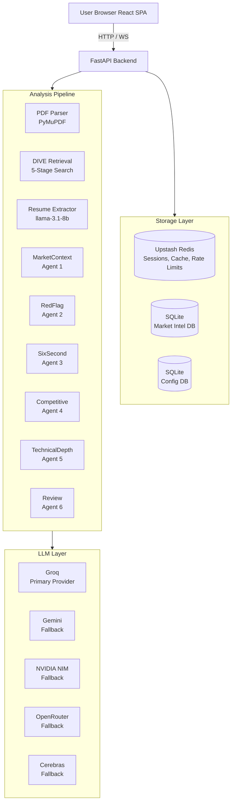
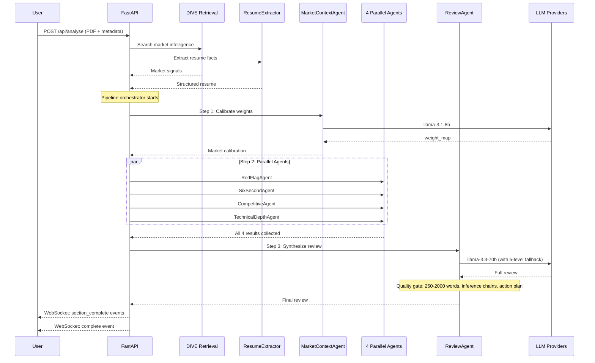
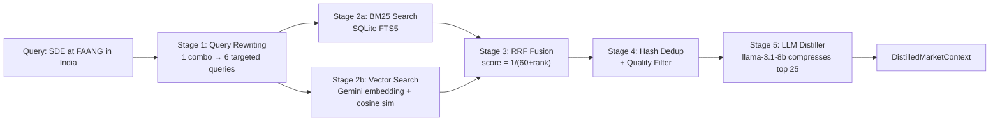
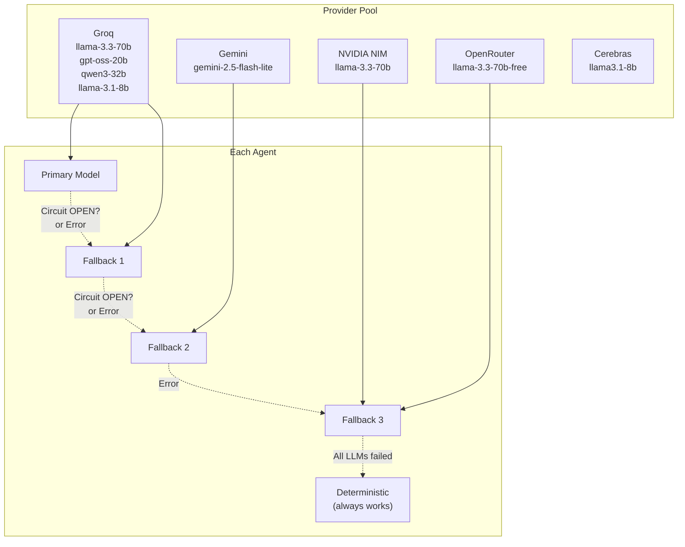
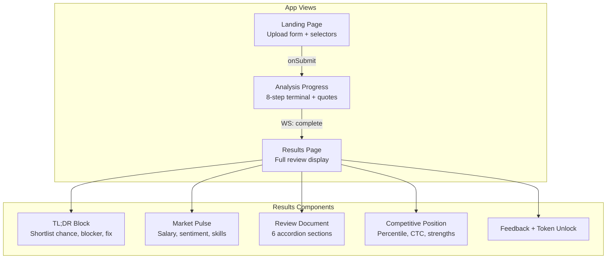
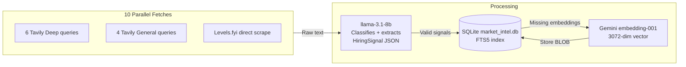

# ROAST — Resume Critic AI (Deep Dive)

> **For**: Complete refresher. Understand everything you built.
> **Goal**: Answer any interview question about ROAST architecture, agents, pipeline, or tradeoffs.

---

## What is ROAST?

A web app where users upload a resume → get a market-calibrated AI review. 6 agents analyze the resume in parallel, grounded in real market data.

**User flow**: Upload PDF → pick role/company/market → wait 2-3 min → get detailed review with TL;DR, market pulse, red flags, competitive position, action plan.

---

## High-Level Architecture



---

## Tech Stack

| Component | Technology | Why Chosen |
|-----------|-----------|------------|
| Backend | FastAPI | Async, native WebSocket, auto OpenAPI docs |
| Frontend | React 19 + Vite 8 + Tailwind v4 | Modern, fast HMR |
| LLM Primary | Groq (multi-key) | 14,400 RPD for 8B models, free tier |
| LLM Fallbacks | Gemini, NIM, OpenRouter, Cerebras | 5 providers = no single point of failure |
| Cache/Session | Upstash Redis | Serverless Redis, free tier, survives restarts |
| Market DB | SQLite (market_intel.db) | Pre-built via monthly ingestion. No external DB needed |
| Config DB | SQLite (market_config.db) | Company lists, salary bands, role weights |
| PDF | PyMuPDF (fitz) | Fast, extracts links from annotation layer |
| Embeddings | Gemini gemini-embedding-001 | 3072-dim. API-based, no GPU needed |
| Search | SQLite FTS5 + numpy | BM25 + vector. No external vector DB needed |
| Observability | Langfuse v4 | LLM call tracing, user feedback |
| Deployment | Docker → Cloud Run | Single container, auto-scaling to 0 |

---

## Project Structure

```
roast/
├── backend/
│   ├── main.py              # FastAPI entry, routers, startup/shutdown
│   ├── config.py            # Env vars: API keys, rate limits, thresholds
│   ├── market_data.py       # 982 lines. SQLite config DB CRUD + seed data
│   ├── pdf_reader.py        # Resume PDF → text + link extraction
│   ├── agents/              # 6 AI agents
│   │   ├── resume_extractor.py    # Pre-pipeline: structured resume facts
│   │   ├── market_context_agent.py # Agent 1 (runs first): weight calibration
│   │   ├── red_flag_agent.py      # Agent 2: 11 red flag categories
│   │   ├── six_second_agent.py    # Agent 3: recruiter scan + trajectory
│   │   ├── competitive_agent.py   # Agent 4: percentile + CTC estimation
│   │   ├── technical_depth_agent.py # Agent 5: project eval with web search
│   │   ├── review_agent.py        # Agent 6 (runs last): full review synthesis
│   │   ├── followup_agent.py      # Post-review: follow-up Q&A
│   │   └── prompts/               # System prompts per agent
│   ├── llm/                 # Provider clients + routing
│   │   ├── router.py              # Routes to providers with fallback chains
│   │   ├── groq_client.py         # Distributed key rotation via Redis
│   │   ├── gemini_client.py       # Gemini fallback
│   │   ├── openrouter_client.py   # Emergency fallback
│   │   ├── nvidia_nim_client.py   # NVIDIA NIM fallback
│   │   ├── cerebras_client.py     # Cerebras fallback
│   │   ├── langfuse_client.py     # Observability wrapper
│   │   └── circuit_breaker.py     # 3-state per-provider breaker
│   ├── pipeline/
│   │   └── orchestrator.py  # 480 lines. Coordinates ALL agents
│   ├── retrieval/
│   │   └── dive.py          # 645 lines. 5-stage retrieval pipeline
│   ├── routes/
│   │   ├── analyse.py       # POST /api/analyse
│   │   ├── session.py       # POST /api/session-init
│   │   ├── websocket.py     # WS /api/ws/{session_id}
│   │   ├── followup.py      # POST /api/followup
│   │   ├── cron.py          # POST /refresh-market-intel
│   │   └── token_feedback.py # POST /api/token, /api/feedback
│   ├── storage/
│   │   ├── session_store.py # Redis session CRUD
│   │   ├── rate_limit.py    # IP-based, IST midnight reset
│   │   └── redis_client.py  # Upstash Redis singleton
│   └── corpus/              # Anonymized signal DB for calibration
├── frontend/                # React SPA
│   └── src/
│       ├── App.jsx          # View routing: landing vs analysis
│       ├── lib/api.js       # 8 API functions + WebSocket creator
│       ├── hooks/
│       │   ├── useWebSocket.js    # WS with polling fallback + heartbeat
│       │   └── useInferenceToggle.js # localStorage toggle
│       └── components/
│           ├── LandingPage.jsx    # Upload form (440 lines)
│           ├── AnalysisProgress.jsx # 8-step progress (201 lines)
│           ├── ResultsPage.jsx    # Results orchestrator (229 lines)
│           ├── TLDRBlock.jsx      # Shortlist chance + fixes
│           ├── MarketPulse.jsx    # Salary, sentiment, signals
│           ├── ReviewDocument.jsx # 6-section accordion (266 lines)
│           ├── Feedback.jsx       # Thumbs + token unlock
│           └── SkeletonLoader.jsx
├── ingestion/               # Monthly market intel builder
│   ├── pipeline.py          # Orchestrator. 10 queries/combo
│   ├── extractor.py         # LLM signal classification
│   ├── search.py            # SQLite FTS5 CRUD
│   ├── embeddings.py        # Gemini embedding + vector search
│   ├── tavily_client.py     # Budget-tracked Tavily search
│   └── breaking_signal.py   # 24h breaking news layer
├── tests/                   # 7 test files
└── scripts/
    ├── prepopulate.py       # Ingestion for all 70 combos
    └── reembed.py           # Regenerate missing embeddings
```

---

## Agent Pipeline



## The 6 Agents in Detail

### Agent 1: MarketContextAgent (runs FIRST)

**What it does**: Takes DIVE market signals + job description → produces a **weight_map** that tells every other agent what to focus on.

```
Example output for "SDE at Indian Startup":
{
  "dsa_weight": 0.30,
  "projects_weight": 0.25,
  "cgpa_weight": 0.15,
  "experience_weight": 0.20,
  "college_tier_weight": 0.10
}
```

**Why it runs alone**: Every other agent needs these weights. RedFlagAgent needs to know "is 7.5 CGPA concerning?" CompetitiveAgent needs weights to compute percentile.

**Key logic**: After LLM produces weights, `_enforce_weight_map()` cross-checks against DB rules (role overrides, company overrides, experience defaults). LLM can suggest, but DB rules are enforced.

**Fallback**: If LLM fails, returns DB defaults + LOW confidence. System still works.

### Agent 2: RedFlagAgent (parallel)

**What it does**: Hunts 11 categories of resume problems.

**11 categories**:
1. **Hedge words** ("familiar with," "exposed to") — shallow knowledge
2. **Unverifiable skills** — claims without evidence
3. **Missing contact** — no email/phone/LinkedIn
4. **CGPA consequences** — below role threshold
5. **Buried lead** — impressive fact in boring sentence
6. **Responsibility without outcome** — just listed duties
7. **Date arithmetic** — gaps/overlaps in timeline
8. **Hidden CGPA** — graduation year shown but GPA hidden
9. **Generic filler** — anyone could write this
10. **ATS keyword gaps** — missing terms for target role
11. **Role-specific mistakes** — wrong tech stack claims

**Quality gate**: Each flag needs: location_in_resume ≥ 10 chars, fix ≥ 20 chars, inference_chain ≥ 50 chars. Generic phrases like "could be improved" are rejected.

### Agent 3: SixSecondAgent (parallel)

**What it does**: Simulates a recruiter's F-pattern scan (eyes scan top → left → diagonal in 6 seconds). Also analyzes career trajectory.

**Input**: First 200 words (for scan) + full resume (for trajectory).

**Output**: First-impression score + career narrative + trajectory assessment.

### Agent 4: CompetitiveAgent (parallel)

**What it does**: Estimates where the candidate ranks in the applicant pool.

**Outputs**:
- Percentile range (e.g., "45th–55th percentile")
- Expected CTC range (e.g., "₹12-18 LPA")
- Strengths and weaknesses for THIS specific role

**Calibration**: If corpus has ≥30 similar profiles → "calibrated" (based on real data). If <30 → "based on market data" (uses salary bands from market_config.db).

### Agent 5: TechnicalDepthAgent (parallel, 90s timeout)

**What it does**: Evaluates projects with genuine technical understanding.

**Unique capability**: Agentic loop. It calls DuckDuckGo search to verify project claims. "Claims to have built a transformer from scratch" → searches "transformer from scratch tutorial" → determines if it's tutorial-level or genuinely novel.

**Difficulty levels**: Tutorial / Intermediate / Advanced / Exceptional (role-calibrated).

**Skip filter**: Known tech (100+ terms) bypasses web search to save time.

### Agent 6: ReviewAgent (runs LAST)

**What it does**: Synthesizes ALL upstream outputs into a flowing English review.

**5-section review**:
1. What's Working
2. What's Hurting You
3. Career Story
4. Competitive Position
5. Action Plan

**Quality gate**: Word count 250-2000, inference chains present, specific follow-up questions, action plan has clear steps.

**Fallback chain (5 levels)**: llama-3.3-70b → gpt-oss-20b → qwen3-32b → gemini-2.5-flash-lite → NIM → OpenRouter.

**Final fallback**: `_assemble_partial_review()` — deterministic Python synthesis. No LLM needed. Lower quality but NEVER fails.

---

## DIVE Retrieval (5 Stages)



**Stage 1 — Query Rewriting**: One combo → 6 queries targeting different aspects (salary, skills, hiring trends, company news, competition, market sentiment).

**Stage 2 — Parallel Search**: BM25 and vector search run simultaneously via `asyncio.gather`.

**Stage 3 — RRF Fusion**: Combine ranked lists. Score = sum(1/(60 + rank_i)). Avoids comparing different score scales.

**Stage 4 — Dedup + Filter**: Remove duplicates by content hash. Remove low-quality signals.

**Stage 5 — LLM Distiller**: llama-3.1-8b compresses signals into concise context for MarketContextAgent.

**Caching**: Redis (15-day TTL for snapshots, 60-day for previous version, 24h for breaking signals).

**Warmup**: At startup, pre-warms top 15 combos so first user doesn't wait.

---

## LLM Routing & Fallback



**Circuit breaker per provider**:
- CLOSED: Normal operation
- OPEN (after 3 failures): Fast-fail for 5 minutes
- HALF-OPEN (after 5 min): Allow 1 test call
- Success → CLOSED. Failure → OPEN again.

**Provider fallback chains per agent**:

| Agent | Primary | Fallback 1 | Fallback 2 | Fallback 3 |
|-------|---------|-----------|-----------|-----------|
| Review | llama-3.3-70b (Groq) | gpt-oss-20b | qwen3-32b | Gemini → NIM → OpenRouter |
| RedFlag | llama-3.3-70b (Groq) | llama-3.1-8b | — | — |
| SixSecond | qwen3-32b (Groq) | llama-3.1-8b | — | — |
| Competitive | gpt-oss-20b (Groq) | NIM | — | — |
| TechnicalDepth | gpt-oss-120b (Groq) | llama-3.1-8b | — | — |
| MarketContext | llama-3.1-8b (Groq) | — | — | — |

---

## 16 API Endpoints

| Method | Route | What It Does |
|--------|-------|-------------|
| POST | `/api/session-init` | Create session (role, company, market, experience) |
| POST | `/api/analyse` | Upload PDF resume (multipart) |
| WS | `/api/ws/{session_id}` | Real-time progress + results stream |
| GET | `/api/session/{id}/state` | Poll for reconnection after WS drop |
| GET | `/api/session/{id}` | Raw session data |
| POST | `/api/followup` | One-click follow-up Q&A |
| POST | `/api/feedback` | Useful/not-useful vote |
| POST | `/api/token` | Request email token for extra analysis |
| POST | `/api/token/verify` | Validate token |
| POST | `/refresh-market-intel` | QStash monthly cron (HMAC verified) |
| GET | `/health` | Liveness + total analysis count |
| GET | `/share/{session_id}` | Public TL;DR preview |

---

## Frontend Architecture



**Two views only** (manual `useState` switching — no router library):
1. **Landing**: Form with 4 selectors (role, experience, company, market), PDF dropzone (5MB max), optional context/JD/GitHub, consent checkboxes
2. **Analysis** → either Progress (streaming) or Results (complete)

**useWebSocket hook** (110 lines):
- Connects to `WS /api/ws/{session_id}`
- Processes: `ping` → reply `pong`, `section_complete` → accumulate results, `complete` → show results
- **Polling fallback**: If WS disconnects, poll `GET /api/session/{id}/state` every 5s
- **Heartbeat**: 3 missed pings (45s) → switch to polling

---

## Ingestion Pipeline (Monthly)



**What it does**: Every month, for each of ~70 role/company/market combos:
1. Fire 10 search queries (6 deep + 4 general) via `asyncio.gather`
2. Handle truncated results via Jina Reader fallback
3. Classify each result with llama-3.1-8b (is this a job posting? salary survey? blog? discard?)
4. Extract structured HiringSignal: signal_type, skills, salary_range, sentiment, trust_weight
5. Store in SQLite `market_signals` table with auto-synced FTS5 index
6. Generate Gemini embeddings (3072-dim), store as BLOB

**Optimization story**: Original was sequential — 70 combos took 10+ hours. After refactoring to async parallel with semaphore (3 concurrent), same work takes <1 hour. The lesson: start concurrent from day one.

---

## Key Architecture Decisions

1. **SQLite instead of vector DB**: A full Pinecone/Qdrant deployment was overkill. SQLite FTS5 + numpy cosine similarity handles the scale (~10K signals). No external service = zero cost, zero ops.

2. **5-provider fallback**: Free-tier LLM APIs are unreliable. Circuit breakers + fallback chains ensure no single provider failure blocks a user. The deterministic fallback guarantees something useful is always returned.

3. **Agent parallelism**: Agents 2-5 run in parallel (asyncio.gather). This cuts total analysis time from ~3 min to ~1.5 min. Agent 1 must run first (its output is needed by everyone). Agent 6 must run last.

4. **WebSocket + polling dual-mode**: WebSocket for real-time streaming during normal operation. HTTP polling fallback for reconnection. Heartbeat monitor detects silent disconnects.

5. **$0 infrastructure**: All services on free tiers (Groq, Gemini, Upstash, Tavily, Resend, Cloud Run free quota). This constrains architecture (rate limits, budget tracking) but keeps operating cost at zero.
