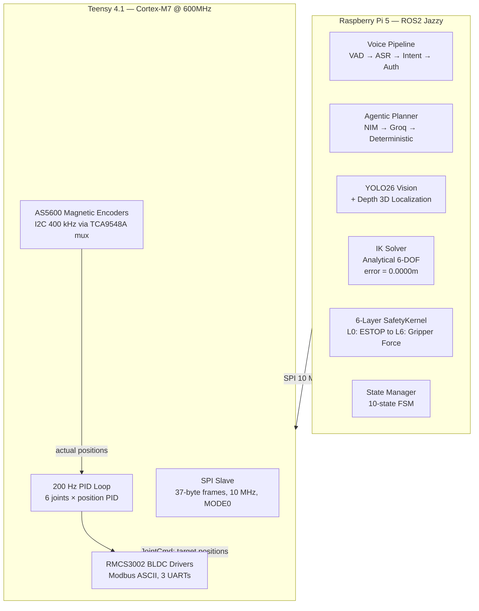
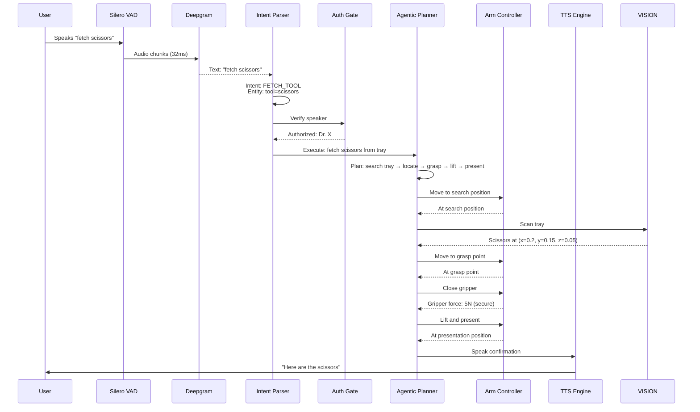
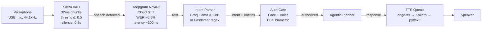
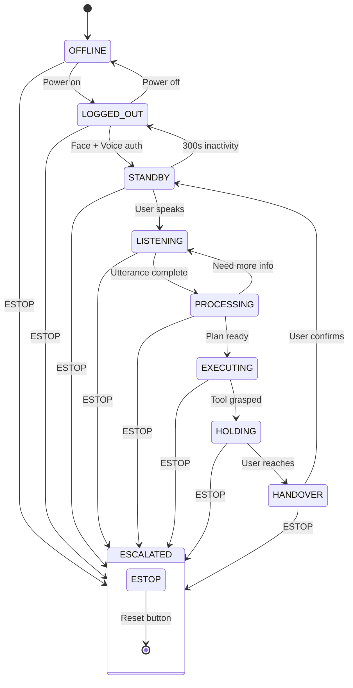
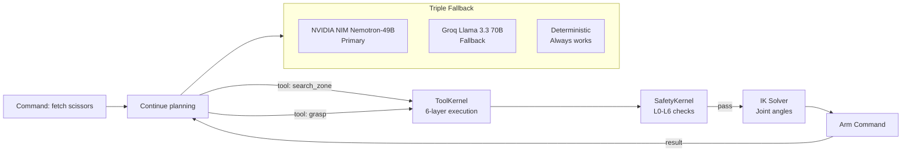
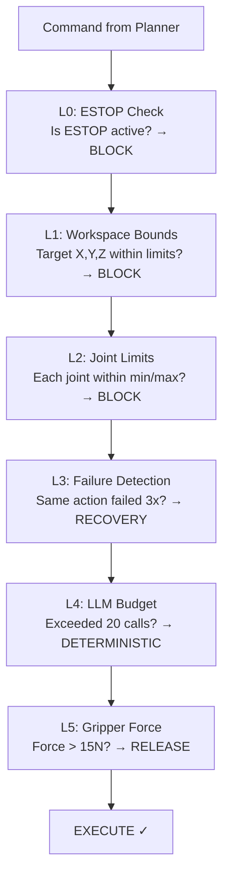
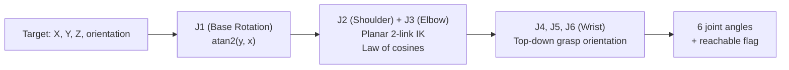
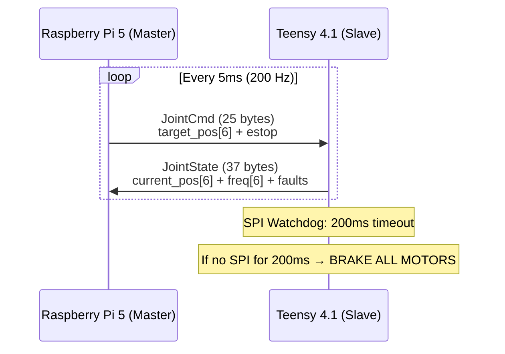
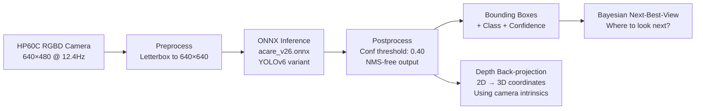

# ACARE — Voice-Controlled Surgical Robot (Deep Dive)

> **For**: Complete refresher. Understand everything you built.
> **Goal**: Answer any interview question about ACARE's voice pipeline, state machine, agentic planner, safety kernel, or firmware.

---

## What is ACARE?

A voice-controlled 6-DOF robotic arm that assists surgeons. The surgeon speaks commands ("fetch scissors," "hand me the scalpel"), and the robot understands, locates the tool on the tray, picks it up, and hands it over.

**Two-processor architecture:**
- **Raspberry Pi 5** (high-level): ROS2 Jazzy, voice pipeline, vision, planning, IK, safety
- **Teensy 4.1** (real-time): 200 Hz PID control, encoder reading, motor control, emergency stop

---

## High-Level Architecture



---

## System Overview



---

## Project Structure

```
acare_software_final/
├── acare_voice/           # Voice AI pipeline
│   ├── voice_node.py      # 471 lines. Master orchestrator
│   ├── voice_ros_node.py  # 225 lines. ROS2 wrapper
│   ├── vad.py             # 189 lines. Silero VAD
│   ├── tts.py             # 119 lines. edge-tts + pyttsx3
│   └── tts_queue.py       # 309 lines. Priority queue (urgent/normal/backchannel)
├── acare_planner/         # Task planning
│   ├── agentic_planner.py # 376 lines. LLM adapter, triple fallback
│   ├── state_manager.py   # 235 lines. 10-state FSM
│   ├── tool_kernel.py     # 307 lines. 6-layer safe tool execution
│   ├── safety_kernel.py   # 117 lines. 6-layer deterministic safety
│   ├── ik_solver.py       # 348 lines. Analytical 6-DOF IK
│   ├── hw_translator.py   # 75 lines. Position → coordinate mapping
│   ├── tool_registry.py   # 131 lines. 6 surgical tools + aliases
│   ├── agent_schema.py    # 23 lines. Pydantic LLM output validation
│   ├── task_memory.py     # 70 lines. SQLite task persistence
│   ├── state_snapshot.py  # 69 lines. Bounded LLM context builder
│   └── voice_sync.py      # 66 lines. TTS-planner sync bridge
├── docs/
│   ├── ACARE_Documentation.md  # 2463 lines. Full documentation
│   ├── AGENTIC_LAYER.md        # 206 lines. Agentic planner deep dive
│   └── HANDOVER.md             # 217 lines. 48 bugs fixed
├── sim_files/             # Gazebo simulation
│   ├── acare_sim.launch.py  # 243 lines. Staggered sim launch
│   ├── gz_bridge.yaml       # 32 lines. ROS-Gazebo bridge config
│   ├── gz_ros2_control.xacro # 96 lines. ros2_control plugin
│   └── setup_full_sim.sh    # 124 lines. One-time sim setup
├── Firmware (separate):
│   ├── ACARE_6DOF_Teensy41_v3.ino  # 889 lines. Main firmware
│   └── phase1_teensy_spi_slave.ino  # 98 lines. SPI bringup
└── Root scripts:
    ├── phase1_pi5_spi_master.py     # 208 lines. SPI bringup test
    ├── test_deepseek_nim.py         # 289 lines. Model benchmark
    ├── annotate_images.py           # 164 lines. YOLO26 annotation
    ├── groq_gpt_oss_stress_test.py  # 194 lines. Rate limit test
    └── demo_docs.md                 # 252 lines. Demo day run sheet
```

---

## Voice Pipeline



### Voice Node (`voice_node.py`)
Master orchestrator. Wires all voice components together.

**Processing loop**:
1. Start VAD listener (background thread)
2. When speech detected → stream audio to Deepgram ASR
3. On transcript received → run intent parser
4. If command detected → authenticate user → send to planner
5. While waiting → can barge-in (interrupt current processing with new command)
6. ESTOP keyword → immediate stop, bypasses all other processing

**Timeouts**:
- Initial silence: 8 seconds → prompt user
- Mid-speech gap: 5 seconds → end utterance
- Processing watchdog: 10 seconds → restart pipeline
- Conversation TTL: 10 minutes → end session

### VAD (`vad.py`)
Silero VAD (small neural network, runs on CPU).

```
Audio in (44.1kHz) → resample to 16kHz → 32ms frames → VAD score per frame
Speech threshold: 0.5 (probability)
Min speech duration: 0.5s (ignore clicks, coughs)
Silence timeout: 0.8s (after speech stops, wait this long to consider utterance complete)
```

**Edge cases handled**:
- Empty audio chunks (returns not-speech silently)
- Large chunks (truncated to expected size)
- NaN chunks (caught and replaced with zeros)

### TTS Queue (`tts_queue.py`)
Priority queue with 3-tier fallback:

```
Priority levels: URGENT (estop alerts) > NORMAL (responses) > BACKCHANNEL ("uh-huh")
```

**Fallback chain**:
1. **edge-tts** (cloud, Microsoft Neural voices, ~4.2 MOS) — primary, high quality
2. **Kokoro ONNX** (local, medium quality) — fallback if no internet
3. **pyttsx3** (offline, lower quality, always works) — final fallback

**Features**: Barge-in (new speech interrupts current TTS), echo avoidance (won't repeat same phrase within 5s), duplicate suppression.

---

## State Machine (10 States)



**Key rules**:
- ESTOP reachable from ANY state (hardware button + voice keyword + software watchdog)
- 300s inactivity in STANDBY → auto logout
- 7200s hard TTL → full system reset
- Login requires dual biometric (face + voice)
- Processing can return to Listening if LLM needs clarification

---

## Agentic Planner



### Triple Fallback Chain

```
1. NIM Nemotron-49B (primary)
   → Powerful, JSON mode, ~0.5s latency
   → But: JSON quality issues (~20% success rate)

2. Groq Llama 3.3 70B (fallback)
   → Less powerful, ~1s latency
   → More reliable JSON (~60% success rate)

3. Deterministic (final fallback)
   → Hard-coded logic, 2ms
   → Always works, lower quality
```

**Circuit breaker**: 3 consecutive NIM failures → skip NIM for 60 seconds. Try Groq. Same pattern for Groq.

### Recovery Ladders

Each failure mode has a specific recovery sequence:

```
VISION_FAILURE:
  1. Re-scan zone with different camera angle
  2. Adjust lighting/exposure
  3. Scan adjacent zone (tool might be misplaced)
  4. Ask user: "I can't find the scissors. Can you point?"

GRASP_FAILURE:
  1. Retry with firmer grip (increase force by 2N)
  2. Try different grasp angle (rotate wrist ±10°)
  3. Reposition approach point (move 5mm in each axis)
  4. Ask user: "I'm having trouble grasping. Can you hand it to me?"

ARM_UNREACHABLE:
  1. Adjust base position (move base ±50mm)
  2. Recompute IK with elbow-down configuration
  3. If still unreachable: "The tool is out of my reach"
```

### Tool Calling Budget

Max 20 LLM tool calls per task. After 20, switch to deterministic mode. Prevents runaway costs and infinite loops.

### Bounded Context

LLM only sees:
- Last 3 actions taken
- Current state (what was observed, what succeeded/failed)
- Task objective (what the user asked for)
- User preferences (preferred zone, handover height)

Total: ~1500 tokens. Keeps focused and fast.

---

## Safety Kernel (6 Layers — ALL Deterministic)



**Why deterministic**: AI can hallucinate. LLMs can ignore safety instructions. A safety layer controlled by an LLM is NOT safe. Every safety check is hard-coded, proven, and predictable.

**L0 — ESTOP**: If emergency stop is triggered (hardware button, voice keyword, or software signal), NO actions are allowed. Period.

**L1 — Workspace**: Predefined XYZ envelope. If a planned move would go outside, it's blocked. Prevents arm from hitting walls, people, or itself.

**L2 — Joints**: Each joint has software limits (less than hardware limits). Prevents over-rotation and cable damage.

**L3 — Consecutive Failures**: If same action fails 3 times in a row, switch to recovery mode (stop retrying the same failing action, try different approach). Prevents the robot from damaging itself by repeating the same mistake.

**L4 — LLM Budget**: After 20 tool calls, force deterministic mode. Prevents runaway costs and infinite LLM loops.

**L5 — Gripper Force**: Max 15N. If force exceeds threshold, release immediately. Includes slip detection (if grasped object moves unexpectedly, adjust grip).

---

## IK Solver (Analytical, 6-DOF)



**Robot geometry**:
```
Base height: 352mm
Upper arm: 400mm
Forearm: 400mm
Wrist: 236mm
Total reach: ~500mm (when fully extended)
```

**Method**: Analytical (closed-form). Pure geometry, no iteration, no neural network.

**FK verification**: Verified by self-test. Forward kinematics applied to IK output → error = 0.0000m (perfect round-trip).

**Never raises exceptions**: Returns a `reachable: bool` flag. If target is unreachable, caller handles. This is a design choice — errors shouldn't crash the control loop.

---

## SPI Communication (Pi5 ↔ Teensy)



**SPI spec**:
- Speed: 10 MHz
- Mode 0 (CPOL=0, CPHA=0)
- Full-duplex (both sides send and receive every cycle)
- Frame: 37 bytes fixed size (v3 firmware)
- Planned for future: 64 bytes with header, sequence number, CRC32

**Pi5 → Teensy (25 bytes)**:
- 6 × float32 target positions = 24 bytes
- 1 × uint8_t estop flag = 1 byte

**Teensy → Pi5 (37 bytes)**:
- 6 × float32 current positions = 24 bytes
- 6 × uint16_t frequency commands = 12 bytes
- 1 × uint8_t fault flags = 1 byte

**Optimizations**:
- Direction caching: only send Modbus direction write when sign changes (steady state: 1 write/joint instead of 2)
- Frequency caching: skip Modbus frequency write if value unchanged (converged position: 0 writes)
- Decoupled RMCS update: PID at 200 Hz, RMCS motor write at 50 Hz (every 4th tick)

---

## YOLO26 Vision



**Model**: Custom YOLOv6 ONNX model (acare_v26.onnx). Runs on Pi5 CPU via ONNX Runtime.

**6 classes**: cream, medical scissors, oxymeter, plaster, surgical forceps, thermometer.

**Depth-based 3D localization**:
- Camera intrinsics: fx=572.04, fy=571.49, cx=329.27, cy=242.09
- Converts 2D bounding box center + depth value → 3D world coordinates
- Sparse depth handled via median-of-window fallback

**Bayesian Next-Best-View**: If confidence is low, the system uses Bayesian reasoning to decide where to look next. "I saw object in zone C with 40% confidence. Most likely improvement: move 10cm left and scan again."

---

## Benchmark Results (Key Takeaway)

| Model | Test | Success Rate | Issue |
|-------|------|-------------|-------|
| Groq GPT-OSS 120B | 35 calls | 60% success | Rate limits + JSON errors |
| NIM Nemotron-49B | 35 calls | 100%* | *Test design flaw (abort loop after budget exhaustion) |
| NIM Nemotron-49B | Quick 10 | 20% | Bad JSON output (unterminated strings) |
| Groq generic | Quick 10 | 30% | JSON validation failures |
| DeepSeek V3.1 | 5 calls | 0% | HTTP 404 (model not found) |
| DeepSeek V4-flash | 5 calls | 0% | Timeout after 15s |

**The critical insight**: ALL LLM models fail frequently at producing valid JSON tool calls. This is not a bug — it's expected behavior. The agentic planner is DESIGNED to handle this. The deterministic fallback isn't a backup plan; it's the reality of how the system operates most of the time.

---

## 48 Bugs Fixed (from HANDOVER.md)

Key fixes by category:

**Motion/C2**: SPI framing issues, velocity scaling, IK singularity at workspace edge
**Vision/M**: YOLO confidence threshold tuning, depth camera intrinsics calibration
**Voice/V**: VAD noise floor adjustment, Deepgram endpointing timeout, TTS barge-in edge cases
**Planner/P**: Recovery ladder infinite loop, tool call budget not resetting between tasks
**Safety/S**: Dual ESTOP path testing, collision detection in singular configurations
**Build/B**: ROS2 package dependencies, colcon build ordering, ONNX runtime version mismatch

---

## Key Architecture Decisions

1. **Two-processor split**: Pi5 handles everything that can tolerate latency (voice, vision, planning). Teensy handles everything that can't (PID control, emergency stop, real-time safety). No single point of failure — if Pi5 crashes, Teensy brakes safely.

2. **Deterministic safety kernel**: Safety checks are NEVER handled by AI. No LLM decides "is this gripper force safe?" Hard-coded limits. Predictable behavior. Provably correct.

3. **Triple LLM fallback**: NIM → Groq → Deterministic. The system is designed for the primary and even secondary LLM to fail. The deterministic fallback guarantees the robot never stops working because of an API outage.

4. **Bounded LLM context**: The LLM doesn't see the full history. Only last 3 actions + current state + objective. This keeps prompts small (~1500 tokens), fast, and focused on the immediate task.

5. **Edge inference for vision**: YOLO26 ONNX runs on Pi5 CPU. No cloud dependency for object detection. Only deep LLM reasoning (planning) goes to the cloud. This means the robot can still "see" even without internet.
