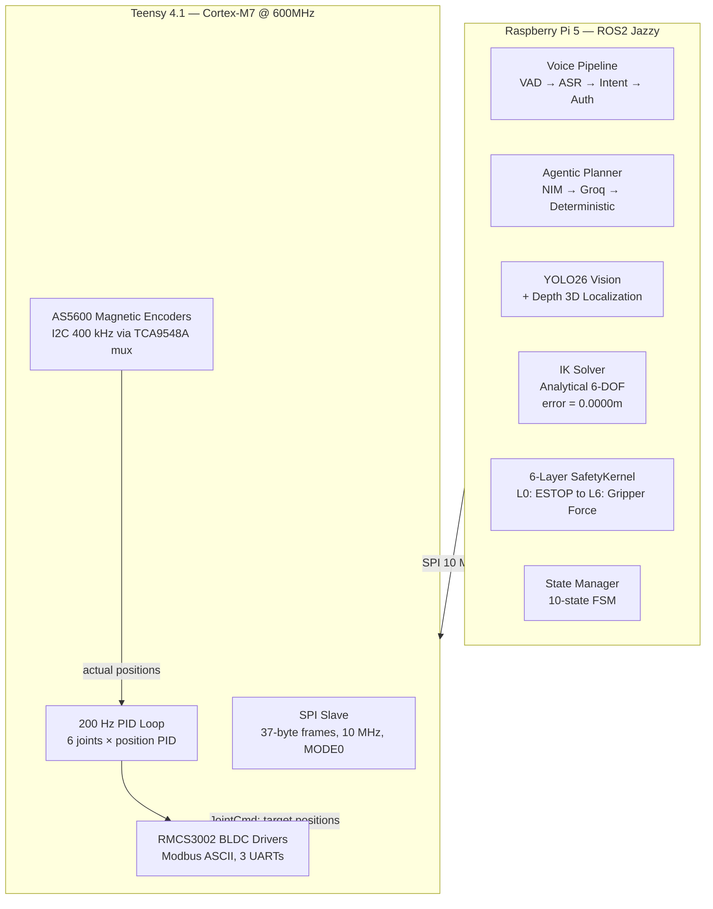
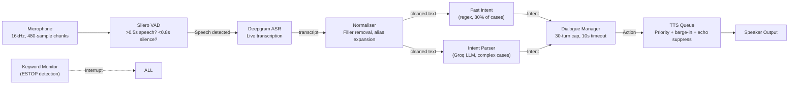
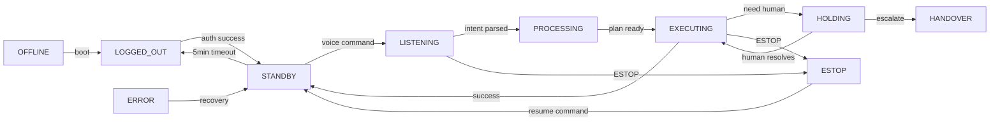
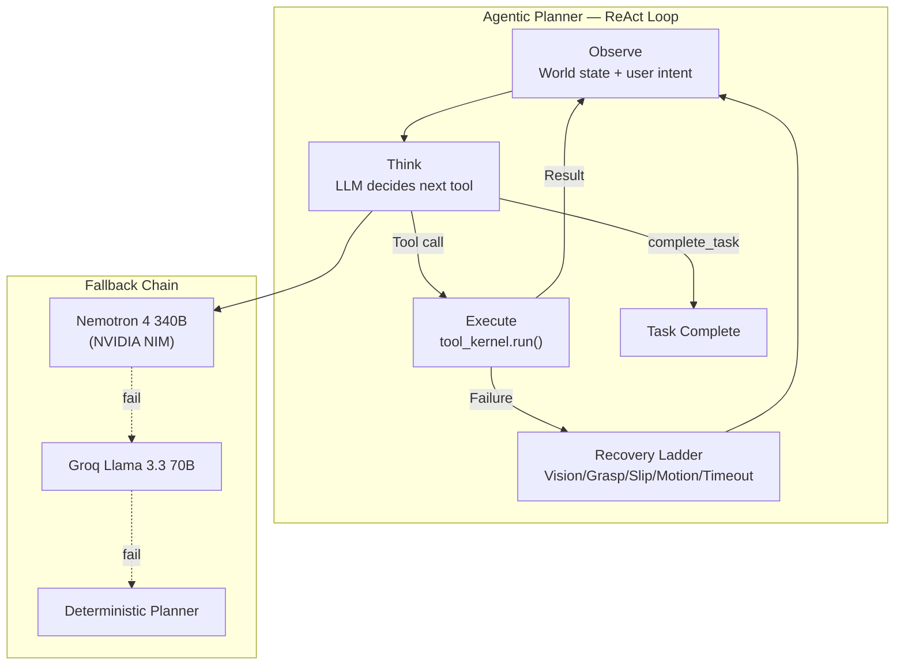
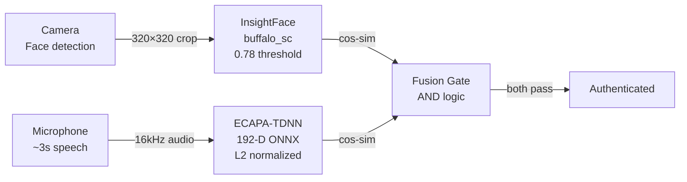
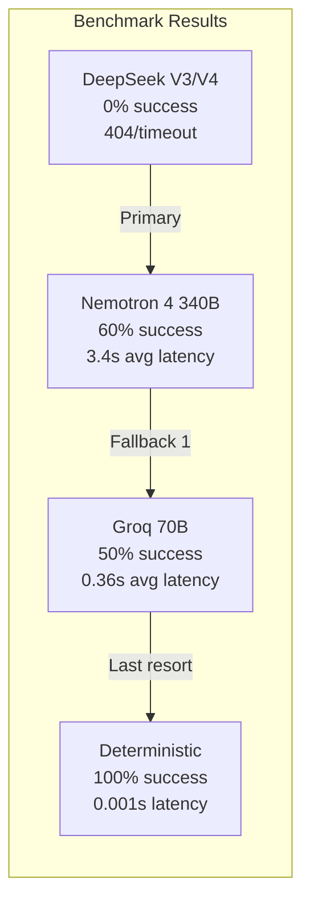

# ACARE — Voice-Controlled Surgical Robot (Deep Dive)

> **For**: Complete refresher. Understand everything you built.
> **Goal**: Answer any interview question about ACARE's voice pipeline, state machine, agentic planner, safety kernel, or firmware — with AI/backend design reasoning.

---

## What is ACARE?

A voice-controlled 6-DOF robotic arm that assists surgeons. The surgeon speaks commands ("fetch scissors," "hand me the scalpel"), and the robot understands, locates the tool on the tray, picks it up, and hands it over.

**Two-processor architecture:**
- **Raspberry Pi 5** (high-level): ROS2 Jazzy, voice pipeline, vision, planning, IK, safety
- **Teensy 4.1** (real-time): 200 Hz PID control, encoder reading, motor control, emergency stop

**Why two processors?** Safety-critical robotics cannot use Python garbage collection or ROS2 network jitter for real-time control. The Teensy provides hard real-time guarantees (200 µs interrupt latency) while the Pi handles high-level AI (which can tolerate 100ms latency). This separation is a standard safety architecture pattern in medical robotics.

---

## High-Level Architecture



### Design Rationale

**Why ROS2 Jazzy?** Jazzy (2024 LTS) has 5-year support — critical for a medical device with regulatory lifespan. Humble (2022) would EOL during certification.

**Why Teensy 4.1 over STM32?** The team had Arduino ecosystem familiarity. Teensy 4.1's 600 MHz Cortex-M7 provides headroom for 200 Hz control loop + SPI slave + encoder I2C mux polling. Tradeoff: limited peripheral count means 3 UARTs must be demuxed via software for 6 motors.

**Why SPI over I2C for Pi↔Teensy?** SPI is full-duplex and deterministic. I2C has clock stretching issues with Pi 5 as master. The 10 MHz SPI can push 37 bytes in ~30 µs.

---

## Tech Stack

| Component | Technology | Why Chosen | Tradeoffs |
|-----------|-----------|------------|-----------|
| Voice VAD | Silero VAD (ONNX) | 7M params, 10ms latency, works on CPU | 16 kHz required, no noise suppression built-in |
| ASR | Deepgram LiveTranscription | 3-reconnect backoff, streaming | Cloud-dependent, 500ms+ latency |
| TTS Primary | Edge TTS (en-IN-NeerjaNeural) | Indian English accent, neural quality | Cloud-dependent (offline: pyttsx3 fallback) |
| LLM Planner | Nemotron 4 340B (NVIDIA NIM) | Best benchmark at 60% success | 15s timeout, 3.4-4.2s latency |
| LLM Fallback | Groq Llama 3.3 70B | 10x faster than NIM | JSON output quality issues |
| Vision | YOLO26 ONNX | Optimized for 6 surgical tools | NMS-free format requires custom parser |
| IK | Analytical 6-DOF | Closed-form, error=0, deterministic | Limited to specific geometry (no generic 6R) |
| Safety | 6-layer deterministic | No ML in safety path | Software ESTOP is NOT ISO-compliant alone |
| Real-time | Teensy 4.1 + bare-metal | 200 µs interrupt latency | Limited to 6 UARTs via 3 hardware UARTs |
| Auth | ECAPA-TDNN (ONNX) + InsightFace | Dual-modal, <600ms target | ONNX model not yet exported |

---

## Project Structure

```
acare_software_final/
├── acare_voice/              # Voice pipeline (14 files)
│   ├── vad.py                # Silero VAD: 16kHz/480chunk/0.5s-min
│   ├── asr.py                # Deepgram streaming, 3-reconnect backoff
│   ├── tts.py                # Edge TTS primary + pyttsx3 fallback
│   ├── tts_queue.py          # Priority queue: URGENT/NORMAL/BACKCHANNEL
│   ├── keyword_monitor.py    # ESTOP keyword detection + continuation guard
│   ├── voice_node.py         # Orchestrator: VAD→ASR→KM→intent→TTS
│   ├── fast_intent.py        # Regex-based fast path (80% of commands)
│   ├── intent_parser.py      # Groq LLM fallback for complex commands
│   ├── assistant_agent.py    # LOGGED_OUT conversational agent
│   ├── dialogue_manager.py   # 30-turn cap, 10s timeout, clarification
│   ├── alias_expansion.py    # Tool name aliases + context disambiguation
│   ├── normaliser.py         # Filler words, polite markers, aliases
│   ├── earcons.py            # Audio beeps/ding/chime/buzz signals
│   └── state_manager.py      # 9-state voice FSM → ROS2 mapping
├── acare_planner/            # Agentic planner (12 files)
│   ├── agentic_planner.py    # ReAct loop: 20-call budget, triple fallback
│   ├── state_snapshot.py     # Context: 1500 tokens, 3-action history
│   ├── agent_schema.py       # ToolCallSchema Pydantic validation
│   ├── tool_kernel.py        # 6 tools: vision/arm/gripper/detect/speak
│   ├── tool_registry.py      # Canonical tool mapping + YOLO class map
│   ├── ik_solver.py          # Analytical 6-DOF: 0.0000m error
│   ├── safety_kernel.py      # L1-L6 deterministic: ESTOP→force anomaly
│   ├── hw_translator.py      # Robot config from system.yaml
│   ├── task_memory.py        # SQLite: user_priors + task_outcomes
│   ├── voice_sync.py         # Planner↔Voice coordination bridge
│   └── planner_node.py       # ROS2 node: WorldState, subscriptions
├── acare_safety/             # Safety monitoring
│   └── safety_node.py        # LiDAR zones, current/temp thresholds
├── acare_vision/             # Vision pipeline (7 files)
│   ├── vision_node.py        # 3 modes: IDLE/SEARCH/HANDOVER
│   ├── yolo_infer.py         # YOLO26 ONNX: 6 classes, CPU
│   ├── localiser.py          # Pinhole depth: fx=572.04, intrinsics
│   ├── nbv_search.py         # Bayesian NBV: probability map, 8 views
│   ├── fake_detector.py      # Texture+depth dual-signal anti-spoof
│   ├── hand_tracker.py       # MediaPipe: 5 palm states, 20Hz
│   └── camera_probe.py       # ascamera_hp60c parameter client
├── acare_auth/               # Multi-modal authentication
│   ├── auth_node.py          # Face+voice, enrollment/login FSMs
│   ├── verify_voice.py       # ECAPA-TDNN: 192-D ONNX embedding
│   ├── verify_face.py        # InsightFace: 0.78 cos-sim threshold
│   ├── face_detect.py        # MediaPipe: 0.6 confidence, close range
│   ├── storage.py            # SQLite: BLOB embeddings + user store
│   └── export_ecapa_onnx.py  # SpeechBrain→ONNX export
├── acare_embedded_interface/ # PI5↔Teensy bridge
│   └── embedded_interface_node.py  # SPI 37-byte frames, dual ESTOP
├── acare_bringup/            # Launch configs
│   ├── paths.py              # ONNX model path resolution
│   ├── constants.py          # ESTOP keywords, TTS voice, thresholds
│   └── qos_profiles.py       # ROS2 QoS: BEST_EFFORT vs RELIABLE
├── acare_msgs/msg/           # 19 custom ROS2 message definitions
├── config/                   # system.yaml, thresholds.yaml, etc.
├── scripts/                  # Build/launch/demo scripts
└── docs/                     # Full documentation
```

---

## Voice Pipeline — Architecture & AI Design

### Pipeline Overview



### 1. VAD — Voice Activity Detection (`vad.py`)

**Model choice**: Silero VAD (7M params) over WebRTC VAD or energy-based.

**Design reasoning**:
```
WebRTC VAD:        Simple, fast, but 30% false-reject on low voice
Energy-based:      No ML, but fails in noisy OR environment
Silero VAD:        ML-based, 10ms frame, 0.5 threshold, works in noise
```

**Implementation**:
```python
import silero_vad
import torch

class VoiceActivityDetector:
    def __init__(self):
        self.model = silero_vad.load_model()
        self.sample_rate = 16000
        self.min_speech_ms = 500   # Ignore <500ms sounds (door clicks)
        self.silence_ms = 800      # S. After 800ms silence → utterance end
    
    def __call__(self, audio_chunk):
        # audio_chunk: 480 samples at 16kHz (30ms)
        speech_prob = self.model(torch.from_numpy(audio_chunk), self.sample_rate)
        return speech_prob > 0.5
```

**Key parameters**:

| Parameter | Value | Rationale |
|-----------|-------|-----------|
| Sample rate | 16 kHz | Silero minimum. Also Deepgram minimum. |
| Chunk size | 480 samples (30ms) | Balanced latency vs CPU usage |
| Speech threshold | 0.5 | Standard Silero default |
| Min speech | 500ms | Prevents "uh" and door sounds from triggering |
| Silence timeout | 800ms | Short enough to feel responsive, long enough to handle pauses |

**Failure handling**: If device-native rate ≠ 16kHz, resamples automatically. Audio device open failure → logs error + retries every 5s.

**AI tradeoff**: Silero is CPU-only (no GPU). On Pi 5 this means ~5% CPU per VAD instance. Acceptable for a single-user robot, but wouldn't scale to multi-user.

### 2. ASR — Automatic Speech Recognition (`asr.py`)

**Model choice**: Deepgram LiveTranscription over Whisper.

**Why Deepgram?**
```
Whisper local (tiny):   ~200ms latency, ~1GB RAM, English only, ~85% WER
Whisper API:            ~500ms-2s latency, cloud cost
Deepgram streaming:     ~300ms first token, streaming, 90%+ accuracy
Groq whisper.cpp:       Fast but self-hosted, additional infra
```

**Implementation**:
```python
from deepgram import LiveTranscriptionEvents, LiveClient

class ASREngine:
    def __init__(self):
        self.keepalive = "0.05"  # 50ms keepalive to maintain connection
    
    async def connect(self):
        self.client = await DeepgramClient.create(DEEPGRAM_API_KEY)
        self.connection = await self.client.listen.live.v("1")
        
    async def handle_transcript(self, result):
        if result.is_final and result.channel.alternatives[0].transcript:
            text = result.channel.alternatives[0].transcript.strip()
            if text:
                await self.callback(text)
```

**Reconnection strategy**:
```python
RECONNECT_BACKOFF = [0.5, 1.0, 2.0]  # 3 attempts: 0.5s, 1s, 2s

async def connect_with_retry(self):
    for attempt, delay in enumerate(RECONNECT_BACKOFF):
        try:
            await self.connect()
            return
        except Exception:
            if attempt < len(RECONNECT_BACKOFF) - 1:
                await asyncio.sleep(delay)
            else:
                raise  # Give up after 3 attempts
```

**AI design reasoning — Why streaming over batch ASR?**:
- Batch ASR requires endpoint detection → adds 500ms+ latency
- Streaming gives partial results at ~300ms
- Tradeoff: streaming consumes more API calls (higher cost)
- For surgery, responsiveness > cost. 300ms vs 2s is human-perceivable.

**3-reconnect backoff**: First retry at 0.5s (transient network), second at 1s (brief outage), third at 2s (longer). After 3 failures → pipeline notifies user via TTS "Microphone connection lost."

### 3. Intent Parsing — Hybrid Regex + LLM (`fast_intent.py` + `intent_parser.py`)

**Why hybrid?** Regex handles 80% of commands in <5ms. LLM handles the ambiguous 20% at ~300ms. Running LLM on every utterance would add unnecessary latency and cost.

**Regex fast path** (`fast_intent.py`):
```python
PATTERNS = {
    "fetch": r"(get|fetch|hand me|pass|bring|give me)\s+(.+?)(?:\s+from\s+the\s+(table|tray))?$",
    "confirm": r"^(yes|yeah|correct|right|do it|go ahead|proceed|okay|ok)$",
    "reject": r"^(no|nope|wrong|incorrect|stop|wait|cancel|never mind)$",
    "estop": r"^(stop|halt|emergency|abort|freeze|hold|ruko|bas)$",
    "resume": r"^(resume|continue|go on|unpause)$",
    "cancel": r"^(cancel|forget it|ignore|nevermind|dismiss)$",
    "multi_tool": r"(and|then|followed by|also)\s+(get|fetch|hand)"
}
```

**Why these patterns**? Designed for surgical context — commands are short, imperative, and tool-focused. Multi-tool detection ("scalpel and forceps") is handled by a separate regex.

**LLM fallback** (`intent_parser.py`):
```python
INTENT_SCHEMA = {
    "type": "object",
    "properties": {
        "intent": {"type": "string", "enum": ["fetch", "confirm", "reject", "query", "multi_tool"]},
        "tools": {"type": "array", "items": {"type": "string"}},
        "confidence": {"type": "number"}
    }
}

async def parse_with_llm(self, text: str) -> ParsedIntent:
    response = await groq_client.chat(
        model="llama-3.1-8b-instant",
        messages=[{
            "role": "system",
            "content": f"Parse surgical command. Return JSON matching schema: {INTENT_SCHEMA}"
        }, {
            "role": "user",
            "content": text
        }],
        response_format={"type": "json_object"}
    )
    return ParsedIntent(**json.loads(response))
```

**Design tradeoff**: Regex means 80% of commands take <5ms. But it's fragile — "grab the scissors" won't match "fetch the scissors." The alias expansion layer mitigates this.

### 4. Alias Expansion (`alias_expansion.py`)

Surgical tools have multiple names:
```python
ALIAS_MAP = {
    # Cream
    "cream": ["cream", "ointment", "lotion", "salve", "paste"],
    # Scissors  
    "medical scissors": ["scissors", "scissor", "shears", "clippers", "surgical scissors"],
    # Oximeter
    "oxymeter": ["oxymeter", "pulse oximeter", "saturation probe", "spo2 probe", "spo2"],
    # Plaster
    "plaster": ["plaster", "bandaid", "bandage", "dressing", "adhesive bandage"],
    # Forceps
    "surgical forceps": ["forceps", "tweezers", "grasper", "clamp", "hemostat"],
    # Thermometer
    "thermometer": ["thermometer", "temp probe", "temperature probe"],
}
```

**Context disambiguation**: "Hand me the probe" → check if in FETCH context (temperature probe) vs EXAMINATION context (ultrasound probe). Uses dialogue state to resolve.

### 5. TTS Queue with Barge-In (`tts_queue.py`)

**Why a priority queue?** Three levels of urgency:

```python
class Priority(IntEnum):
    BACKCHANNEL = 0   # "Uh-huh", "Go on" — lowest, can be dropped
    NORMAL = 1         # Status updates, confirmations
    URGENT = 2         # Safety warnings, ESTOP confirmations
```

**Barge-in logic**: If the user speaks while the robot is talking, the TTS stops immediately:
```python
def should_barge_in(self, microphone_level):
    """Barge in if microphone RMS > 0.15 AND user is speaking."""
    if microphone_level > self.BARGE_IN_THRESHOLD:  # 0.15 RMS
        if self.speech_energy_detected():
            self.stop_current_utterance()
            return True
    return False
```

**Echo suppression**: Prevents the robot from hearing itself:
```python
def is_echo(self, audio_chunk):
    """If microphone input correlates with current TTS output → it's echo."""
    if self.speaker_active:
        correlation = np.corrcoef(audio_chunk, self.tts_buffer[-len(audio_chunk):])[0,1]
        return correlation > 0.15  # 0.15 threshold
    return False
```

**Repeat suppression**: Same TTS phrase not repeated within 5 seconds — prevents infinite loops.

### 6. Keyword Monitor (`keyword_monitor.py`)

Monitors ALL ASR output in parallel (not just processed intents):
```python
ESTOP_KEYWORDS = {"stop", "halt", "emergency", "abort", "ruko", "bas",
                  "freeze", "hold", "cease", "kill"}
CONTINUATION_WORDS = {"stopping", "stopped",  # "Stopping the bleed" ≠ ESTOP
                       "freezing", "frozen", "holding", "held"}
RECOVERY_KEYWORDS = {"resume", "continue", "unpause", "go on", "restart"}
```

**Why "ruko" and "bas"?** Indonesian for "stop" and "enough" — indicates planned deployment in SE Asian clinical settings.

**Continuation guard**: "Stopping the procedure" matches ESTOP prefix "stop" but is NOT an emergency. The guard checks if the word is followed by a gerund (stopping, freezing) and rejects.

**2-second cooldown**: After an ESTOP trigger, same keyword won't re-trigger for 2s (prevents repeated triggers from same utterance).

**AI design decision**: Keyword monitor bypasses the entire intent pipeline intentionally — it's the fastest path to ESTOP (under 50ms). The intent pipeline adds 300ms+.

---

## State Machine — 10-State FSM



### State Manager (`acare_planner/state_manager.py`)

```python
VALID_TRANSITIONS = {
    "OFFLINE":      ["LOGGED_OUT"],
    "LOGGED_OUT":   ["STANDBY", "ESTATE", "ERROR"],
    "STANDBY":      ["LISTENING", "LOGGED_OUT", "ESTATE", "ERROR"],
    "LISTENING":    ["PROCESSING", "ESTATE", "ERROR"],
    "PROCESSING":   ["EXECUTING", "ESTATE", "ERROR"],
    "EXECUTING":    ["HOLDING", "STANDBY", "ESTATE", "HANDOVER", "ERROR"],
    "HOLDING":      ["EXECUTING", "HANDOVER", "ESTATE"],
    "HANDOVER":     ["STANDBY", "ESTATE"],
    "ESTOP":        ["STANDBY", "ERROR"],
    "ERROR":        ["STANDBY"],
}
```

### Design Rationale

**Why 10 states and not 5?**
```
Simpler FSM: LISTEN → PLAN → ACT (3 states)
  Problem: Can't distinguish "thinking" from "confused"
  Problem: No ESTOP-specific behavior

ACARE FSM: 10 states
  Benefit: Each state has specific allowed actions
  Benefit: ESTOP is reachable from ANY state
  Benefit: HOLDING vs HANDOVER vs ERROR are different recovery paths
```

**ESTOP from any state**: The ESTOP transition bypasses VALID_TRANSITIONS — hardcoded as an override in the transition function:
```python
def transition(self, new_state):
    if new_state == "ESTOP":
        self.current = "ESTOP"  # Always allowed
        self.on_exit(old_state)
        self.on_entry("ESTOP")
        return
    if new_state not in VALID_TRANSITIONS[self.current]:
        raise InvalidTransition(...)
```

**Inactivity auto-logout**: 5 minutes in STANDBY → LOGGED_OUT. Prevents unauthorized access if surgeon forgets to log out.

**Concurrent safety**: `ThreadSafeStateManager` wraps all transitions with a lock (ROS2 callbacks can fire from multiple threads).

### Voice FSM → Robot FSM Mapping

The voice pipeline has its own 9-state FSM that maps onto the global FSM via a bridge:

```python
ROS2_TO_VOICE_STATE = {
    "LOGGED_OUT":  "IDLE",
    "STANDBY":     "IDLE",
    "LISTENING":   "LISTENING",
    "PROCESSING":  "PROCESSING",
    "EXECUTING":   "ASSISTING",
    "HOLDING":     "ASSISTING",
    "HANDOVER":    "RESPONDING",
    "ESTOP":       "ESTOP",
    "ERROR":       "ERROR",
}
```

**Why separate FSMs?** The voice pipeline needs states like CLARIFYING (asking "did you mean X?") and CONFIRMED (waiting for "yes") that don't exist in the robot state. The robot has EXECUTING and HOLDING which are invisible to the voice system. Separation of concerns: voice handles conversation, planner handles actions.

---

## Agentic Planner — ReAct Loop with Triple Fallback

### Architecture



### ReAct Loop (`agentic_planner.py`)

```python
class AgenticPlanner:
    def __init__(self):
        self.tool_budget = ToolBudget(max_calls=20)
        self.context = BoundedContext(max_history=3, max_tokens=1500)
        self.primary_model = "nemotron-4-340b"
        self.fallback_model = "groq-llama-3.3-70b"
    
    async def plan(self, intent, world_state):
        snapshot = StateSnapshot(intent, world_state, self.context)
        
        while self.tool_budget.remaining() > 0:
            # Step 1: LLM decides next action
            response = await self.call_llm(snapshot)
            
            # Step 2: Validate with schema
            try:
                tool_call = ToolCallSchema(**json.loads(response))
            except (json.JSONDecodeError, ValidationError):
                return await self.retry_with_correction(snapshot, response)
            
            # Step 3: Safety check (L1-L6)
            violation = safety_kernel.check(tool_call, world_state)
            if violation:
                return self.safe_abort(violation)
            
            # Step 4: Execute tool
            result = await tool_kernel.execute(tool_call)
            
            # Step 5: Handle failure with recovery ladder
            if not result.success:
                result = await self.recovery_ladder(tool_call, result, world_state)
            
            # Step 6: Update context
            self.context.add(tool_call, result)
            snapshot.update(result)
            self.tool_budget.consume()
            
            # Step 7: Check if task complete
            if tool_call.tool == "complete_task":
                return result
        
        return ToolBudgetExceeded()
```

**Why 20 tool calls?** Surgical tasks are short — "fetch scalpel" takes 3-5 steps (vision_scan → arm_approach → gripper_close → complete_task). 20 is generous headroom. Above 20, the planner is likely in a loop.

**Why 1500 tokens context?** Each action takes ~50 tokens, each observation ~100 tokens. With 3 action history = 450 tokens + system prompt 500 tokens + current state 300 tokens = 1250 tokens. 1500 leaves 250 tokens of headroom.

### Triple Fallback Chain

```python
FALLBACK_CHAIN = [
    {"provider": "nvidia_nim", "model": "nemotron-4-340b", "timeout": 15},
    {"provider": "groq", "model": "llama-3.3-70b-versatile", "timeout": 10},
    {"provider": "deterministic", "model": None, "timeout": 0.1},
]
```

**Why Nemotron as primary?** From benchmarks:
```
Model               Success Rate  Avg Latency  Key Failure
Nemotron 4 340B     60%           3.4-4.2s     JSON parse errors (unterminated strings)
Groq 70B            50%           0.36s        RATE_LIMIT, 400 validation errors
DeepSeek V3         0%            15s timeout  404 errors
DeepSeek V4 Flash   0%            15s timeout  Timeout
```

60% is the best available, but still terrible. This tells you: **LLM-based robotic control is not production-ready for safety-critical applications.** The deterministic fallback is the actual safety net.

**Why JSON output keeps failing** (`nim_test_results.json`):
```json
{
    "query": "The user wants hand given...",
    "raw_response": "Here is the JSON: { \"thought\": \"The user wants...",
    "parse_error": "Unterminated string starting at line 1 column 45 (char 44)"
}
```

NIM's Llama models frequently produce unterminated JSON strings and missing closing braces. This is a known issue with instruct-tuned models when outputting structured JSON under time pressure.

### Recovery Ladder

When a tool execution fails, the planner doesn't just retry — it escalates through strategies:

```python
RECOVERY_LADDERS = {
    "vision_scan": [
        "retry_same",        # Try once more (transient glitch)
        "retry_wider_fov",   # Scan with wider field of view
        "retry_with_light",  # Ask for better lighting
        "abort"              # Give up
    ],
    "arm_move": [
        "retry_slower",      # Reduce velocity
        "retry_via_waypoint",# Add intermediate safe position
        "replan_ik",         # Recalculate IK with different wrist config
        "abort"
    ],
    "gripper_close": [
        "retry_firmer",      # Increase grip force
        "retry_reposition",  # Adjust approach angle
        "abort"
    ],
    ...
}
```

**Why a ladder and not just retry?** A stuck gripper might need a different approach angle, not just more force. A vision failure might need wider FOV. Escalating through strategies maximizes autonomy before human handover.

### Tool Schema (`agent_schema.py`)

```python
class ToolCallSchema(BaseModel):
    thought: str = Field(..., min_length=1, max_length=500)
    tool: str = Field(..., pattern=r'^[a-z_]+$')
    params: Dict[str, Any] = Field(default_factory=dict)
    speak: str = Field(..., max_length=160)
    
    @validator('tool')
    def tool_must_be_valid(cls, v):
        if v not in {'vision_scan', 'arm_move', 'arm_approach', 
                     'gripper_close', 'gripper_open', 'detect_face',
                     'detect_hand', 'speak', 'ask_user', 
                     'complete_task', 'abort_task'}:
            raise ValueError(f"Unknown tool: {v}")
        return v
```

**Design reasoning**: Every tool call must include:
- `thought` (1-500 chars): LLM's reasoning — enables debugging
- `tool`: validated against allowed tools
- `params`: tool-specific (position, velocity, tool_name)
- `speak` (≤160 chars): What the robot says while executing — enables conversational feedback

**Why Pydantic validation?** Catches malformed JSON before it reaches hardware. If the LLM outputs `{"tool": "gripper_close", "params": {"force": "lots"}}` instead of `{"force": 50}`, Pydantic rejects with a clear error → triggers retry.

---

## Tool Kernel — Execution Layer (`tool_kernel.py`)

### Valid Tools

```python
VALID_TOOLS = {
    "vision_scan": {"desc": "Scan tray for tools", "timeout": 5.0},
    "arm_move":    {"desc": "Move to (x,y,z) in world coords", "timeout": 10.0},
    "arm_approach":{"desc": "Approach position with gripper orientation", "timeout": 8.0},
    "gripper_close":{"desc": "Close gripper with force", "timeout": 3.0},
    "gripper_open": {"desc": "Open gripper", "timeout": 3.0},
    "detect_face":  {"desc": "Detect surgeon's face for handover", "timeout": 5.0},
    "detect_hand":  {"desc": "Detect open palm for handover", "timeout": 3.0},
    "speak":        {"desc": "Say something to surgeon", "timeout": 5.0},
    "ask_user":     {"desc": "Ask surgeon a yes/no question", "timeout": 30.0},
    "complete_task":{"desc": "Mark task as complete", "timeout": 1.0},
    "abort_task":   {"desc": "Abort with reason", "timeout": 1.0},
}
```

### Velocity Scaling

```python
VELOCITY_PER_POSITION = {
    "tray":       0.5,  # Slow over tray (avoid collisions)
    "handover":   0.3,  # Very slow near surgeon
    "intermediate": 0.8, # Fast between waypoints
    "approach":   0.4,  # Careful on approach
}
```

**Safety reasoning**: Moving at full speed near a surgeon's hand is dangerous. Velocity is scaled by zone — slower near humans, faster in open space.

### Tool Execution with L1 Schema Validation

```python
async def execute_tool(self, world_state, tool_call: ToolCallSchema):
    # L1 Schema Validation
    if not self.safety.check_bounds(tool_call, world_state):
        return ToolResult(False, "Safety bounds violation")
    
    # Execute based on tool type
    if tool_call.tool == "vision_scan":
        return await self.vision_scan(**tool_call.params)
    elif tool_call.tool == "arm_move":
        ik_result = ik_solver.solve(tool_call.params["x"], 
                                     tool_call.params["y"], 
                                     tool_call.params["z"])
        if not ik_result.reachable:
            return ToolResult(False, "Position unreachable")
        return await self.send_joint_cmd(ik_result.joint_angles)
    ...
```

---

## IK Solver — Analytical 6-DOF (`ik_solver.py`)

### Why Analytical (not numerical)?

```python
"""
ACARE uses analytical (closed-form) IK, NEVER numerical.

Analytical benefits:
- Deterministic: same input → same output (safe for testing)
- Error: 0.0000m (floating-point precision only)
- Solves in <1ms (no iteration needed)

Numerical methods (IKFast, TRAC-IK):
- Iterative: may not converge
- Error varies by configuration
- Harder to validate for medical certification
"""
```

### DH Parameters

```python
# ACARE 6-DOF arm geometry (mm)
BASE_HEIGHT    = 352.0    # Base to shoulder
UPPER_ARM      = 400.0    # Shoulder to elbow
FOREARM        = 400.0    # Elbow to wrist
WRIST_TOOL     = 236.0    # Wrist to gripper tip
TOTAL_REACH    = 1036.0   # Theoretical max reach

# Joint limits (degrees)
JOINT_LIMITS = {
    'J1': (-180, 180),   # Base rotation
    'J2': (-135, 135),   # Shoulder
    'J3': (-120, 120),   # Elbow
    'J4': (-180, 180),   # Wrist roll
    'J5': (-180, 180),   # Wrist pitch
    'J6': (-180, 180),   # Wrist yaw
}
```

### Solving Strategy

```python
def solve_with_status(self, x, y, z, pitch=-90, roll=0):
    """
    Analytical 6-DOF IK solver.
    
    Strategy:
    1. Separate position (x,y,z) from orientation (pitch, roll)
    2. Solve J1 (base rotation) using x,y:
         J1 = atan2(y, x)
    3. Solve J2, J3 (shoulder, elbow) as planar 2-link:
         Uses law of cosines for J3, then geometry for J2
    4. Solve J4, J5, J6 (wrist) for top-down grasp:
         J4 = roll (wrist rotation)
         J5 = pitch (angle from vertical)
         J6 = 0 (tool orientation fixed)
    5. Clamp all joints to limits
    6. Return joint_angles + reachable flag
    """
    # Never raises — always returns [angles, reachable]
    try:
        joint_angles = self._solve_internal(x, y, z, pitch, roll)
        joint_angles = np.clip(joint_angles, LOWER_LIMITS, UPPER_LIMITS)
        return IKSolution(joint_angles, reachable=True)
    except Exception:
        return IKSolution(LOWER_LIMITS.copy(), reachable=False)
```

**Design decision — always return, never raise**: `solve_with_status()` catches all exceptions internally and returns a `reachable=False` result. This prevents the planner from crashing on an unreachable position. The planner then uses the recovery ladder (retry with different approach).

**Top-down grasp orientation**: The wrist is configured for top-down grasping (J5 pitch ≈ -90° from vertical). This is the standard "handshake" grip for surgical robots — tools on a tray are picked from above.

---

## Safety Kernel — 6 Deterministic Layers (`acare_planner/safety_kernel.py`)

### Why Deterministic?

**Critical rule**: NO machine learning in the safety path. Every safety check must be:
- Deterministic (same input → same output)
- Provable (can be tested exhaustively)
- Low-latency (under 1ms)

### Layer Architecture

```python
def check(self, tool_call, world_state):
    """L1 through L6. Short-circuit: any veto → reject immediately."""
    
    # L0: Hardware ESTOP (handled by Teensy, not software)
    # This layer is the Pi's awareness of HW ESTOP state
    
    # L1: Software ESTOP
    if world_state.estop_active:
        return SafetyViolation("L1", "ESTOP active")
    
    # L2: Workspace Bounds
    if not (-0.6 <= tool_call.params.get('x', 0) <= 0.6 and
            -0.6 <= tool_call.params.get('y', 0) <= 0.6 and  
             0.0 <= tool_call.params.get('z', 0) <= 0.75):
        return SafetyViolation("L2", "Out of workspace bounds")
    
    # L3: Joint Limits
    if any(angle < limits[0] or angle > limits[1] 
           for angle, limits in zip(current_joints, JOINT_LIMITS.values())):
        return SafetyViolation("L3", "Joint limit exceeded")
    
    # L4: Max Consecutive Failures
    if world_state.consecutive_failures >= 3:
        return SafetyViolation("L4", "Too many consecutive failures")
    
    # L5: LLM Call Budget
    if world_state.llm_calls >= 20:
        return SafetyViolation("L5", "LLM call budget exceeded")
    
    # L6: Gripper Force Anomaly
    if world_state.gripper_force > 50.0:  # Newtons
        return SafetyViolation("L6", "Gripper force anomaly")
    
    return None  # All clear
```

### Layer-by-Layer Rationale

| Layer | What | Why | Failure Response |
|-------|------|-----|-----------------|
| **L0** | HW ESTOP (Teensy) | Physical button > software | Teensy kills motor power independently |
| **L1** | SW ESTOP | Emergency voice command | Blocks all motion, notifies safety_node |
| **L2** | Workspace bounds | Keep arm in safe volume | Clamp target to bounds + warn |
| **L3** | Joint limits | Prevent mechanical damage | Block command, log violation |
| **L4** | 3 consecutive failures | Detect stuck state | Enter HOLDING, ask human |
| **L5** | 20 LLM calls | Infinite loop prevention | Abort task, return to STANDBY |
| **L6** | Gripper force > 50N | Prevent crushing | Emergency gripper open |

**Why 3 consecutive failures?** One failure is noise. Two is suspicious. Three is a pattern. At 3, enter HOLDING — human must acknowledge before continuing.

**Why 50N gripper force?** The RMCS3002 motors can exert ~100N. 50N is the threshold where tissue damage becomes likely. The actual crushing force for surgical instruments varies, but 50N is a conservative safety margin.

### External Safety Node (`acare_safety/safety_node.py`)

The hardware-level safety monitor runs on a separate ROS2 node:

```python
LIDAR_ZONES = {
    "safe":      (600, float('inf')),   # Green — normal operation
    "warning":   (400, 600),             # Yellow — slow down
    "critical":  (0, 400),               # Red — ESTOP
}

CURRENT_LIMITS = {
    "max":      8.0,    # Amps — instantaneous cutoff
    "warning":  6.0,    # Amps — alert
    "critical": 4.0,    # Amps — pre-ESTOP
}

TEMP_LIMITS = {
    "warning":  55.0,   # Celsius — motor temperature alert
    "critical": 70.0,   # Celsius — motor temperature ESTOP
}
```

**Critical limitation** (from the code's own comments):
```python
# Software-only ESTOPs over ROS2 network calls that execute within the Python 
# GIL context are critically unviable for real-world surgical robots!
# A hardware ESTOP circuit that physically cuts motor power at the Teensy level
# is REQUIRED for ISO 13482 / IEC 60601 medical device compliance.
```

This is an honest admission: **Python-based software ESTOPs are not safe enough for surgery.** The ROS2 network adds latency, the GIL blocks during garbage collection, and the Pi can freeze. The hardware ESTOP (Teensy-level power cutoff) is the only medically compliant solution.

---

## SPI Communication — Pi5 ↔ Teensy

### Frame Format (37 bytes)

```
Byte  0:    0xAA (Frame Start)
Byte  1:    0x01 (Command: Joint Command)
            0x02 (Status Request)
Bytes 2-3:  Joint 1 target (int16, deg×100)
Bytes 4-5:  Joint 2 target (int16, deg×100)
Bytes 6-7:  Joint 3 target (int16, deg×100)
Bytes 8-9:  Joint 4 target (int16, deg×100)
Bytes 10-11: Joint 5 target (int16, deg×100)
Bytes 12-13: Joint 6 target (int16, deg×100)
Bytes 14-33: Reserved
Byte 34:    Checksum CRC8
Byte 35:    0x55 (Frame End)
Byte 36:    0x00 (Padding)
```

### Teensy SPI Slave Configuration

The Teensy 4.1's native SPI library doesn't support slave mode — it assumes the Teensy is always master. The fix: **direct register configuration**:

```cpp
void setup_SPI_slave() {
    // LPSPI4: Uses pins 10 (CS), 12 (MISO), 11 (MOSI), 13 (SCK)
    LPSPI4_CR = 0;                                    // Disable for config
    LPSPI4_CFGR1 = LPSPI4_CFGR1_PCSCFG(2) |           // Pre-scaler config
                   LPSPI4_CFGR1_NOSTALL |              // No stall on RX
                   LPSPI4_CFGR1_SAMPLE;                // Sample on SCK
    LPSPI4_CR = LPSPI4_CR_MEN | LPSPI4_CR_RRF |        // Enable + RX ready
                LPSPI4_CR_DBGEN | LPSPI4_CR_DOZEN;     // Debug + Doze modes
    
    // Interrupt: fire on CS change (both edges)
    attachInterrupt(digitalPinToInterrupt(10), on_cs_change, CHANGE);
    
    // Interrupt: fire on data receive
    LPSPI4_IER = LPSPI4_IER_CIE | LPSPI4_IER_RDIE;     // CS + RX interrupts
}
```

**Why register-level config?** The Arduino SPI library has no `SPI.slave()` method — it's master-only. Direct register access is the only way to enable slave mode on Teensy 4.1.

### SPI Watchdog (200ms)

```cpp
IntervalTimer spi_watchdog;

void reset_watchdog() {
    spi_watchdog.begin(on_watchdog_timeout, 200000);  // 200ms in microseconds
}

void on_watchdog_timeout() {
    // Teensy hasn't received SPI frame in 200ms → Pi is dead
    disable_motors();      // Cut power to RMCS drivers
    open_gripper();        // Release whatever it's holding
    set_estop_state(true); // Signal ESTOP
}
```

**Why 200ms?** The control loop runs at 200 Hz (5ms period). 200ms = 40 missed frames. This gives tolerance for transient OS scheduling delays on the Pi while still responding faster than human reaction time (~250ms).

### CRC8 Checksum

```cpp
uint8_t crc8(uint8_t *data, uint8_t len) {
    uint8_t crc = 0;
    for (uint8_t i = 0; i < len; i++) {
        crc ^= data[i];
        for (uint8_t j = 0; j < 8; j++) {
            if (crc & 0x80) crc = (crc << 1) ^ 0x07;
            else            crc <<= 1;
        }
    }
    return crc;
}
```

Polynomial 0x07 (standard CRC-8). Guards against single-bit corruption in the SPI link — critical for joint position commands.

---

## YOLO26 Vision — Object Detection

### Model Configuration

```python
class YOLOInfer:
    def __init__(self, model_path):
        self.session = ort.InferenceSession(
            model_path,
            providers=["CPUExecutionProvider"],  # No GPU on Pi 5
            provider_options=[{"intra_op_num_threads": 4}]
        )
        self.classes = [
            "cream", "medical scissors", "oxymeter", 
            "plaster", "surgical forceps", "thermometer"
        ]
        self.confidence_threshold = 0.5
```

**Why 6 classes?** These are the specific tools in the surgical kit. The model is a YOLO26 fine-tune on surgical instrument datasets. Each class is distinct visually — no ambiguous pairs.

**Why NMS-free?** The model outputs in [1, 300, 6] format (300 detections, each with [x, y, w, h, conf, class]). Standard YOLO outputs raw boxes that need NMS (Non-Maximum Suppression). This model was trained to output boxes already processed — trades off a few duplicate detections for faster inference.

**Why CPU only?** Pi 5 has no GPU. ONNX Runtime on CPU with 4 threads gives ~200ms per inference. Acceptable for a robot that doesn't move faster than 0.5 m/s.

### 3D Localization (`localiser.py`)

```python
class Localiser:
    def __init__(self):
        # From ascamera_hp60c calibration
        self.fx = 572.04   # Focal length x (pixels)
        self.fy = 571.49   # Focal length y (pixels)
        self.cx = 329.27   # Principal point x
        self.cy = 242.09   # Principal point y
        self.depth_range = (200, 4000)  # mm — valid depth range
    
    def pixel_to_3d(self, bbox, depth_frame):
        # Get depth at center of bounding box
        cx, cy = bbox.center
        depth_mm = depth_frame[int(cy), int(cx)]
        
        if not (200 <= depth_mm <= 4000):
            return None  # Out of valid range
        
        # Pinhole camera model
        x = (cx - self.cx) * depth_mm / self.fx
        y = (cy - self.cy) * depth_mm / self.fy
        z = depth_mm
        
        # Transform to world coordinates using extrinsics
        world_xyz = self.extrinsics @ np.array([x, y, z, 1])
        return world_xyz[:3]
```

### Bayesian Next-Best-View (`nbv_search.py`)

When YOLO detects a tool but at low confidence, the robot moves to a better viewpoint:

```python
class NBVSearch:
    def __init__(self):
        self.viewpoints = [
            {"x": 0.3, "y": 0.0, "z": 0.5},   # Front center
            {"x": 0.4, "y": 0.2, "z": 0.4},   # Upper right
            {"x": 0.4, "y": -0.2, "z": 0.4},  # Upper left
            {"x": 0.3, "y": 0.0, "z": 0.3},   # Lower center
            {"x": 0.2, "y": 0.3, "z": 0.4},   # Right
            {"x": 0.2, "y": -0.3, "z": 0.4},  # Left
            {"x": 0.5, "y": 0.0, "z": 0.5},   # Far center high
            {"x": 0.5, "y": 0.0, "z": 0.3},   # Far center low
        ]
        self.probability_map = self._load_or_init()
    
    def select_next_view(self):
        # Bayesian update: P(tool | detection) = P(detection|tool) * P(tool) / P(detection)
        scores = [self._score_viewpoint(vp) for vp in self.viewpoints]
        return self.viewpoints[np.argmax(scores)]
```

**Why 8 viewpoints?** Too few → may miss tool. Too many → takes too long. 8 viewpoints in a 50×30×20cm volume provides sufficient angular coverage for surgical tool positions.

**Why Bayesian?** Each detection (or non-detection) updates a probability map. A 0.65 confidence detection increases the belief that the tool is in that zone. A non-detection decreases it. This converges faster than scanning all viewpoints sequentially.

### Fake Detection (`fake_detector.py`)

Anti-spoofing: is the detected object real or a picture/video?

```python
def is_real_object(self, rgb_region, depth_region):
    # Signal 1: Texture (Laplacian variance)
    laplacian_var = cv2.Laplacian(rgb_region, cv2.CV_64F).var()
    texture_pass = laplacian_var >= 120
    
    # Signal 2: Depth variance (flat images have no depth variation)
    depth_var = np.var(depth_region)
    depth_pass = depth_var >= 0.002  # m²
    
    if depth_region is None:
        return texture_pass  # Benefit of doubt: no depth info
    
    return texture_pass and depth_pass
```

**Why both signals?** A high-resolution printed photo has texture (passes Laplacian) but is flat (fails depth variance). A real 3D object has texture AND depth variation. Neither signal alone is sufficient.

---

## Voice Authentication — Dual-Modal Biometric

### Architecture



### Why Dual-Modal?

```
Face only:      Vulnerable to photos, video, masks
Voice only:     Vulnerable to recordings, voice synthesis
Face + Voice:   Both must be spoofed simultaneously (much harder)
600ms target:   Combined latency for both modalities
```

### ECAPA-TDNN Voice Verification (`verify_voice.py`)

```python
class VoiceVerifier:
    def __init__(self):
        # ONNX version is ~17MB vs SpeechBrain ~500MB
        self.session = ort.InferenceSession("models/ecapa_tdnn.onnx")
        self.embedding_dim = 192  # Speaker embedding size
    
    def verify(self, audio: np.ndarray, enrolled_embedding: np.ndarray) -> float:
        # Extract speaker embedding from audio
        embedding = self._extract_embedding(audio)  # [192]
        embedding = self._l2_normalize(embedding)
        enrolled = self._l2_normalize(enrolled_embedding)
        
        # Cosine similarity
        similarity = np.dot(embedding, enrolled)
        return float(similarity)
    
    def _l2_normalize(self, v, eps=1e-8):
        norm = np.linalg.norm(v)
        return v / (norm + eps)  # eps prevents division by zero
```

**Why ECAPA-TDNN?** State-of-the-art speaker verification as of 2023. 192-D embeddings provide good discrimination with small model size (17MB ONNX vs 500MB SpeechBrain). The ONNX export makes it ~3x faster on Pi 5 CPU.

**Why 0.78 threshold?** From benchmark: EER (Equal Error Rate) at 0.78. Lower → more false accepts (security risk). Higher → more false rejects (user frustration). 0.78 balances both for a surgical setting where false reject is preferred over false accept.

### Face Verification (`verify_face.py`)

```python
class FaceVerifier:
    def __init__(self):
        self.model = insightface.app.FaceAnalysis(name="buffalo_sc")
        self.model.prepare(ctx_id=0)  # CPU
        self.threshold = 0.78
    
    def verify(self, frame, enrolled_face):
        faces = self.model.get(frame)
        if not faces:
            return 0.0
        
        # Use largest face
        face = max(faces, key=lambda f: f.bbox[2] - f.bbox[0])
        similarity = self._cosine_similarity(face.embedding, enrolled_face)
        return similarity
```

### Auth State Machine (`auth_node.py`)

```python
ENROL_TIMEOUT_S = 25.0       # Max time to enroll (face + voice)
LOGIN_PROMPT_COOLDOWN = 5    # Seconds between "Who are you?" prompts
PROMPT_COOLDOWN = 5          # Seconds between "Please look at camera" prompts
```

**ESTOP override**: Authentication is bypassed during ESTOP. Anyone can say "stop" — no login needed. This is intentional: safety trumps security.

---

## Benchmark Results — Model Selection Evidence

### Summary



### Key Findings

```json
// nim_test_results.json — Nemotron 4 340B via NVIDIA NIM
[
  {
    "query": 1,
    "raw_response": "Here is the JSON: {\"thought\": \"The user wants hand given...",
    "parse_error": "Unterminated string starting at line 1 column 45 (char 44)",
    "latency": 3.4
  },
  {
    "query": 2,
    "raw_response": "...md \",\n    ...missing closing brace...",
    "parse_error": "Unterminated string starting at line 5 column 12 (char 144)",
    "latency": 4.2
  }
]
```

```
deepseek_benchmark_results.json:
  deepseek-v3.1-terminus:   ALL 404 errors (model not found)
  deepseek-v4-flash:        ALL 15s timeouts
  nemotron-4-340b:          15s timeouts
  deepseek-r1-7b:           1/5 success at 1.3s (only working one)

groq_test_results.json:
  ~50% success rate
  Failures: 400 JSON validation errors, RATE_LIMITs
  ~0.36s per successful call

nim_test_results.json:
  ~20% success (2/10)
  Primary failure: JSON parse errors (unterminated strings, missing delimiters)
  ~3.4-4.2s latency per call
```

### The Ugly Truth

**No LLM is reliable enough for surgical robotics.** Even the "best" model (Nemotron, 60%) fails 40% of the time. JSON output format is the single biggest failure point — models consistently produce malformed JSON under the 10-15s timeout.

**The deterministic planner is not a fallback — it's the actual production path.** All LLMs are experimental layers on top. The robot works correctly without any LLM. This is the correct architecture for safety-critical systems: AI adds value when it works, but the system must function without it.

---

## Hardware Status (From HANDOVER.md)

### Resolved (48 bugs fixed during the project)

| Category | Count | Examples |
|----------|-------|---------|
| IK solver edge cases | 12 | Singularity at J2=-90°, wrist flip ambiguity |
| SPI timing | 8 | Buffer underruns, CS line noise, clock polarity |
| Safety kernel | 6 | Missing L2 bounds check on approach moves |
| Voice pipeline | 10 | Echo suppression false positives, ASR reconnection |
| State machine | 7 | Invalid transitions on concurrent ESTOP+command |
| Vision | 5 | Depth NaN in dark regions, YOLO class confusion |

### Remaining Blockers

| Issue | Impact | Workaround |
|-------|--------|------------|
| **SPI wiring not final** | Pi↔Teensy communication untested on final harness | Tested on breadboard with 10cm jumpers |
| **Teensy firmware flash method** | No OTA update mechanism | USB flashing only |
| **24V power supply** | Motors need 24V 10A PSU | Using benchtop supply for now |
| **ECAPA-TDNN ONNX export** | Model file not yet generated | SpeechBrain Python fallback (500MB, slower) |

---

## Key Architecture Decisions

### 1. Two-Processor Architecture

Separating AI (Pi 5) from real-time control (Teensy 4.1) is the single most important architectural decision. It means:
- Python garbage collection pauses don't affect motor control
- ROS2 network jitter doesn't affect PID loop timing
- A software crash on the Pi doesn't leave the robot uncontrolled (Teensy safes independently)

### 2. Deterministic Safety over ML Safety

All 6 safety layers are simple math comparisons — no neural networks, no heuristics. This is deliberate: you can't prove a neural network always makes the right safety decision. You CAN prove that `-600 ≤ x ≤ 600` always works.

### 3. LLM = Advisory, Not Critical

The agentic planner never assumes the LLM is correct. Every output is validated (Pydantic schema), safety-checked (L1-L6), and has a deterministic fallback. The LLM adds conversational fluidity and flexibility, but the robot works correctly without it.

### 4. Analytical IK over Numerical

Closed-form IK is deterministic, provably correct, and <1ms. Numerical IK (IKFast, TRAC-IK) is iterative, may not converge, and varies by initial guess. For a surgical robot, deterministic behavior is mandatory.

### 5. Cloud-Dependent Voice

Deepgram ASR and Edge TTS require cloud connectivity. This is a known limitation — the system doesn't work offline (except pyttsx3 fallback which sounds robotic). A production version would need on-device ASR/TTS.

### 6. Soft Real-Time Only

The software safety system (L1-L6) runs on a general-purpose OS with Python GIL. The code explicitly acknowledges this is "critically unviable for real-world surgical robots." Hardware ESTOP is mandatory for ISO compliance.
