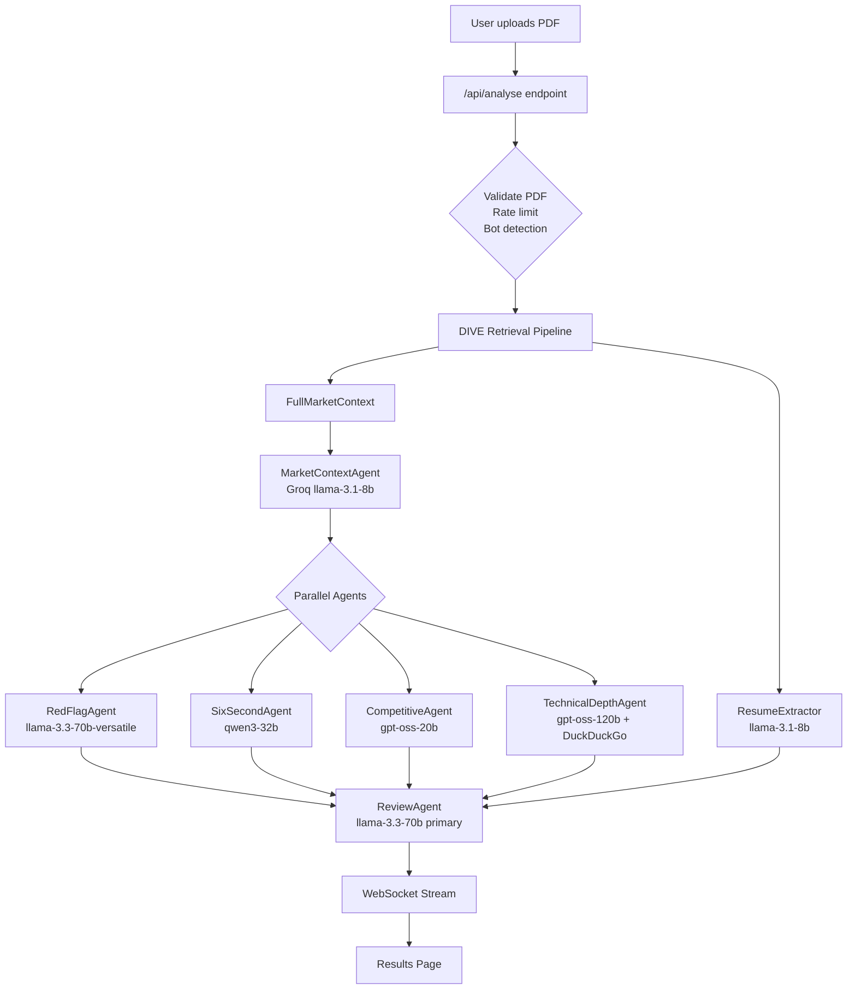
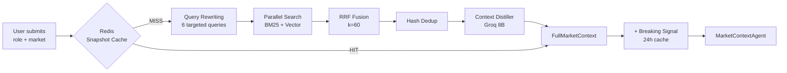
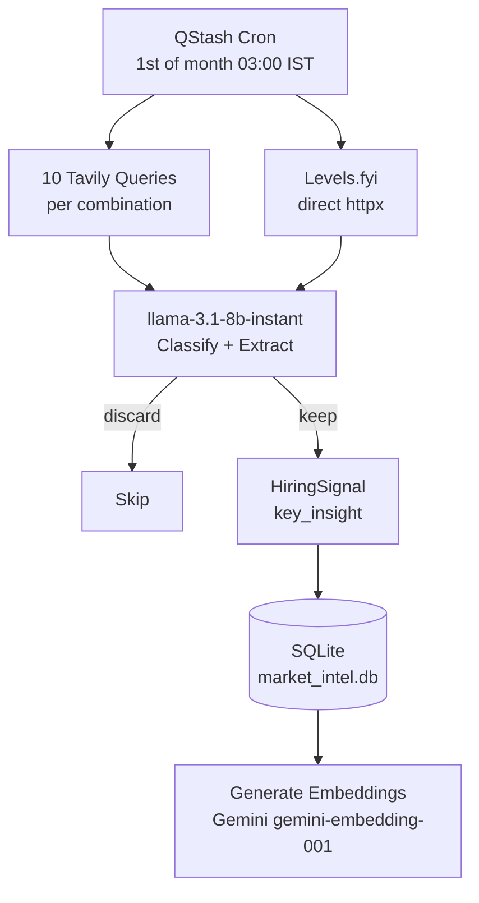
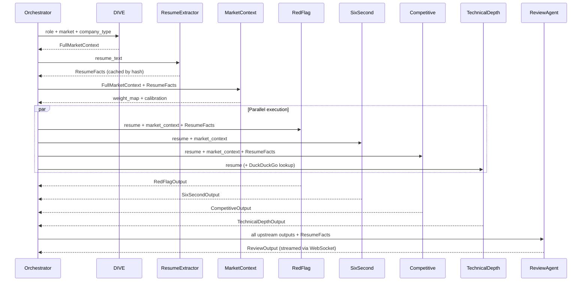

<div align="center">

# 🔥 ROAST
### Resume Intelligence System

**[🌐 Live Demo](https://roast-app-ckard.ondigitalocean.app)**

> Drop your resume. Get destroyed. Get better.

[](https://python.org)
[](https://fastapi.tiangolo.com)
[](https://react.dev)
[](LICENSE)
[](https://github.com)

</div>

---

## What is ROAST?

Most resume tools read your resume and say *"add more keywords."*

ROAST does something different. It pulls **live market intelligence for your exact role and city before reading your resume** — extracts structured facts from your resume, then runs six specialised agents to produce a brutally honest, market-calibrated review. Not generic advice. Not keyword stuffing. The actual thought process a recruiter runs when they read your resume, calibrated against what's being hired for *this week*.

**What ROAST does that no other tool does:**
- Live job posting data from Naukri, Wellfound, Reddit, Levels.fyi — scraped monthly, not training data
- `TechnicalDepthAgent` that actually understands what you built — evaluates projects technically, not just by keyword
- Inference chains on every weakness: *what the recruiter sees → what they assume → what they decide*
- Competitive positioning against real applicants at your experience level, not senior engineers
- Expected CTC range calibrated to your role, company type, and percentile position
- $0/month infrastructure — entirely on free tiers

---

## Demo


---

## Architecture

### High-Level Flow



### DIVE Retrieval Pipeline

The core innovation — market intelligence is **prebuilt offline**, not fetched at runtime.



### Monthly Ingestion Pipeline



### Agent Pipeline



---

## What Makes It Different

### TechnicalDepthAgent
Evaluates your projects with genuine technical understanding — not keyword matching. Uses DuckDuckGo search in real time to look up unfamiliar technologies (Bayesian NBV, d-vector speaker verification, RRF fusion) before evaluating them. Rates difficulty as tutorial / intermediate / advanced / exceptional calibrated to your experience level.

### Resume Fact Extractor
Before any analysis, an 8B LLM extracts structured facts from your resume (skills, projects, education, experience, key metrics). These facts are passed to RedFlagAgent, CompetitiveAgent, and ReviewAgent — preventing the LLM from hallucinating or contradicting your actual resume content.

### Key Metrics Extraction
Latency figures, throughput numbers, and quantified achievements are extracted from project descriptions and made visible to all analysis agents. If your resume says "95+ live analyses" or "reduced latency from 10s to 3s", the system sees it and uses it.

### Inference Chains
Every weakness comes with the recruiter's actual thought process:

```
"Every bullet reads as a responsibility, not an achievement.
A Zepto SDE2 hiring manager reads this and thinks: this person maintained
things, they did not build things. At SDE2 I need someone who owned outcomes.
Moving to next resume."
```

### Live Market Intelligence
Not training data. Actual job postings scraped every month.

```
Naukri: 20,880 AI Engineer openings in Bengaluru
Top required: LangChain, RAG, LLM fine-tuning, HuggingFace, FastAPI
Salary band: ₹15-30L base for experienced professionals of 1-2 years production experience
```

### Competitive Positioning
Percentile estimate + expected CTC range calibrated to your role, company type, and experience level — compared against real applicants at the same level, not all applicants.

---

## Tech Stack

### Backend
| Component | Technology | Why |
|---|---|---|
| API Framework | FastAPI + uvicorn | Async, fast, WebSocket support |
| Market Intelligence DB | SQLite + FTS5 + numpy vectors | BM25 + cosine similarity search, no external DB |
| Session / Cache | Upstash Redis | Cloud-hosted, survives container restarts |
| PDF Parsing | PyMuPDF (fitz) | Annotation-layer link extraction for LinkedIn/GitHub |
| Embeddings | Gemini gemini-embedding-001 (3072-dim) | No model in memory, API-based, free tier |
| Scheduling | Upstash QStash | Monthly cron, HMAC-verified |

### LLM Routing
| Agent | Model | Provider | Why |
|---|---|---|---|
| MarketContextAgent | llama-3.1-8b-instant | Groq | Lightweight, 14.4K RPD |
| RedFlagAgent | llama-3.3-70b-versatile → 8b | Groq | Reliable JSON |
| SixSecondAgent | qwen/qwen3-32b → 8b | Groq | Structured output |
| CompetitiveAgent | gpt-oss-20b → NVIDIA NIM | Groq / NIM | Better percentile reasoning |
| TechnicalDepthAgent | gpt-oss-120b (agentic loop) → 8b | Groq | Frontier quality, tool calling |
| ResumeExtractor | llama-3.1-8b-instant | Groq | Fast extraction, Redis cached |
| ReviewAgent (primary) | llama-3.3-70b-versatile | Groq | 32K output, handles full review |
| ReviewAgent (fallback A) | gpt-oss-20b | Groq | 1000 tok/s |
| ReviewAgent (fallback B) | qwen/qwen3-32b | Groq | Separate TPM bucket |
| ReviewAgent (fallback C) | gemini-2.5-flash-lite | Gemini | No TPM limit |
| ReviewAgent (fallback D) | llama-3.3-70b-instruct | NIM | No daily cap |
| ReviewAgent (fallback E) | llama-3.3-70b:free | OpenRouter | 50 RPD emergency |

### Data Sources
| Source | Method | What it gives |
|---|---|---|
| Naukri.com | Tavily Deep (site:naukri.com) | Active job postings, required skills |
| Reddit (r/indiancscareer) | Tavily Deep (site:reddit.com) | Real offer data, sentiment |
| Levels.fyi | Direct httpx | Verified salary data |
| LinkedIn posts | Tavily Deep (site:linkedin.com) | Hiring announcements |
| TeamBlind | Tavily Deep (site:teamblind.com) | Compensation discussions |
| LeetCode Discuss | Tavily Deep (site:leetcode.com) | Interview experiences |
| Jina Reader | r.jina.ai (no key needed) | Full page when Tavily truncates content |

### Frontend
| Component | Technology |
|---|---|
| Framework | React 19 + Vite |
| Styling | Tailwind CSS v4 |
| Animations | Framer Motion |
| Icons | Lucide React |
| Real-time | WebSocket with HTTP polling fallback |

---

## Project Structure

```
roast/
├── backend/
│   ├── agents/
│   │   ├── prompts/          # Versioned prompts per agent
│   │   ├── market_context_agent.py
│   │   ├── red_flag_agent.py
│   │   ├── six_second_agent.py
│   │   ├── competitive_agent.py
│   │   ├── technical_depth_agent.py  # Agentic — tool calling + DuckDuckGo
│   │   ├── review_agent.py
│   │   ├── resume_extractor.py  # 8B LLM extractor for structured resume facts
│   │   ├── followup_agent.py
│   │   ├── tech_search.py    # DuckDuckGo real-time tech lookup
│   │   └── schemas.py
│   ├── llm/
│   │   ├── groq_client.py    # Key rotation + RPD tracking
│   │   ├── gemini_client.py
│   │   ├── cerebras_client.py
│   │   ├── nvidia_nim_client.py
│   │   ├── openrouter_client.py
│   │   ├── circuit_breaker.py
│   │   └── router.py         # Fallback chain per agent
│   ├── pipeline/
│   │   └── orchestrator.py   # Full pipeline coordination
│   ├── retrieval/
│   │   └── dive.py           # DIVE: BM25 + vector + RRF + dedup + distil
│   ├── routes/
│   │   ├── analyse.py        # POST /api/analyse
│   │   ├── session.py        # POST /api/session-init
│   │   ├── websocket.py      # WS /api/ws/{id}, GET /api/session/{id}/state
│   │   ├── ws_manager.py     # WebSocket connection manager
│   │   ├── followup.py       # POST /api/followup
│   │   ├── cron.py           # POST /refresh-market-intel
│   │   └── token_feedback.py # POST /api/token, POST /api/feedback
│   ├── storage/
│   │   ├── redis_client.py
│   │   ├── rate_limit.py
│   │   └── session_store.py
│   ├── corpus/
│   │   ├── corpus_store.py   # Anonymised signal storage
│   │   └── bullet_curator.py # Bullet curation pipeline
│   ├── config.py
│   ├── pdf_reader.py
│   └── main.py               # FastAPI app + static file serving
├── ingestion/
│   ├── pipeline.py           # Monthly ingestion orchestrator
│   ├── extractor.py          # Classify + extract in one Groq call
│   ├── embeddings.py         # Gemini gemini-embedding-001 (3072-dim)
│   ├── search.py             # BM25 + vector search functions
│   ├── database.py           # SQLite schema + FTS5 + triggers
│   ├── tavily_client.py      # Two keys, budget tracking
│   ├── levels_scraper.py     # Direct httpx scraper
│   ├── groq_client.py        # Groq client for ingestion
│   └── breaking_signal.py    # Daily breaking signal layer
├── frontend/
│   └── src/
│       ├── components/       # React components
│       ├── hooks/            # useWebSocket, useInferenceToggle
│       └── lib/api.js        # All API calls
├── tests/
├── scripts/
│   ├── prepopulate.py        # Pre-populate SQLite before launch
│   └── reembed.py            # Regenerate embeddings after model change
└── Dockerfile                # Multi-stage: Node build + Python serve
```

---

## Key Engineering Decisions

| Decision | Choice | Rationale |
|---|---|---|
| Vector DB | SQLite + numpy vectors | Qdrant suspends after 7 days inactivity on free tier |
| Embeddings | Gemini API (gemini-embedding-001) | Removes PyTorch/CUDA from image — cuts Docker image from 3.5GB to ~300MB |
| Search | BM25 + vector + RRF | Neither alone is sufficient; RRF merges without score normalisation |
| Reranking | Hash dedup | MMR is O(N²); hash dedup is sufficient for duplicate removal |
| Scheduling | Upstash QStash | Talks directly to running server; no CI/CD setup needed |
| LLM routing | Custom fallback chain | 5 providers, circuit breakers, RPM tracked per model in Redis |
| Ingestion LLM | llama-3.1-8b-instant | Merged classify+extract = 1 call; 14,400 RPD, no thinking overhead |
| Session state | Upstash Redis | Survives container restarts; WebSocket reconnection via polling |
| PDF parsing | PyMuPDF (fitz) | Annotation-layer link extraction for LinkedIn/GitHub URLs |
| Deployment | Single Docker container | FastAPI serves both API and React static build — no separate frontend hosting |

---

## Running Locally

### Prerequisites
- Python 3.12+
- Node.js 20+
- [uv](https://docs.astral.sh/uv/) package manager

### Backend

```bash
# Clone
git clone https://github.com/sarv-projects/roast.git
cd roast

# Install dependencies
uv sync

# Copy env template and fill in your keys
cp .env.example .env

# Pre-populate market intelligence (takes ~45-60 minutes)
uv run python3 scripts/prepopulate.py

# Start backend
uv run uvicorn backend.main:app --reload --port 8000
```

### Frontend

```bash
cd frontend
npm install
npm run dev
```

Open `http://localhost:5173` — the Vite dev server proxies `/api/*` to the backend.

### Environment Variables

See `.env.example` for the full list. Required keys:

```bash
# LLM Providers (comma-separated for key rotation)
GROQ_API_KEYS=your_groq_key1,your_groq_key2
GEMINI_API_KEYS=your_gemini_key1,your_gemini_key2  # also used for embeddings

# Search (get free keys at tavily.com)
TAVILY_API_KEY_DEEP=your_tavily_key_1
TAVILY_API_KEY_GENERAL=your_tavily_key_2

# Storage (get free at upstash.com)
UPSTASH_REDIS_REST_URL=your_upstash_url
UPSTASH_REDIS_REST_TOKEN=your_upstash_token

# Observability (get free at cloud.langfuse.com)
LANGFUSE_PUBLIC_KEY=your_langfuse_public_key
LANGFUSE_SECRET_KEY=your_langfuse_secret_key

# Security — generate with: python3 -c "import secrets; print(secrets.token_hex(32))"
HMAC_SECRET=your_hmac_secret

# App
ENVIRONMENT=development
```

---

## Supported Roles & Markets

**Roles:** SDE1, SDE2 / Senior SDE, Software Engineer / Associate, Full Stack Engineer, Backend Engineer, Embedded Systems Engineer, VLSI Design Engineer, Data Analyst, Data Scientist, Data Engineer, AI Agentic Engineer, DevOps / SRE, Platform Engineer, Product Manager, Business Analyst

**Markets:** India, USA, UAE, Singapore, UK

**Company Types:** Indian Product Company, Indian Service Company, FAANG / Big Tech, Startup, Consulting / IB, Semiconductor / Hardware, MNC India (Non-FAANG)

---

## API Reference

All API routes are prefixed with `/api`. WebSocket at `/api/ws/{id}`. Cron endpoint at `/refresh-market-intel` (no prefix — called by QStash externally).

| Method | Route | Description |
|---|---|---|
| `POST` | `/api/session-init` | Create session, returns `session_id` |
| `POST` | `/api/analyse` | Submit resume, launches pipeline |
| `WS` | `/api/ws/{session_id}` | Real-time progress streaming |
| `GET` | `/api/session/{id}/state` | Session recovery for reconnection |
| `GET` | `/api/session/{id}` | Raw session data |
| `POST` | `/api/followup` | FollowUpAgent — one per section per session |
| `POST` | `/api/feedback` | Useful/not useful vote |
| `POST` | `/api/token` | Request third-analysis email token |
| `POST` | `/api/token/verify` | Verify token, unlock extra analysis |
| `POST` | `/refresh-market-intel` | QStash cron trigger (HMAC verified) |
| `GET` | `/health` | Liveness check + total analyses count |

---

## Infrastructure Cost

| Service | Usage | Cost |
|---|---|---|
| DigitalOcean App Platform | Full stack hosting (backend + frontend) | $0 (GitHub Education $200 credit) |
| Upstash Redis | Session + cache | $0 (free tier, 500K commands/month) |
| Upstash QStash | Monthly cron | $0 (free tier) |
| Groq | LLM inference | $0 (free tier) |
| Gemini API | ReviewAgent fallback + embeddings | $0 (free tier) |
| Tavily | Web search (2 keys, 2K searches/month) | $0 (free tier) |
| Resend | Email tokens (3K emails/month) | $0 (free tier) |
| **Total** | | **$0/month** |

---

## Built By

**Sarvesh Bhattacharyya** — [LinkedIn](https://linkedin.com/in/sarvesh-bhattacharyya-485360270)

---

<div align="center">
<sub>Built with $0/month infrastructure · Deployed on DigitalOcean App Platform · Total monthly cost: $0</sub>
</div>
