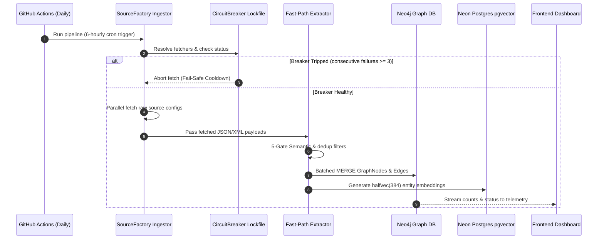
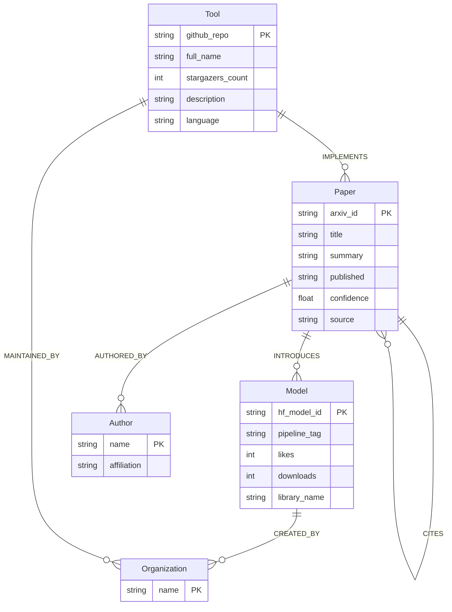
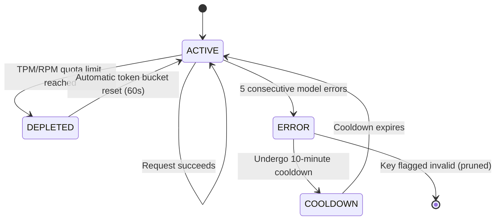

# 🌐 SYNAPSE v4.0.0
> **AI Knowledge Graph & Reasoning Engine**

[](https://www.python.org/)
[](https://fastapi.tiangolo.com/)
[](https://neo4j.com/)
[](https://react.dev/)
[](https://tailwindcss.com/)
[](LICENSE)

SYNAPSE is a **self updating AI knowledge graph and multi-agent querying platform** that continuously maps, queries, and compares the rapidly evolving artificial intelligence ecosystem. By grounding a 7-node LangGraph multi-agent pipeline in a daily-synchronized Neo4j graph and Neon Postgres vector store, SYNAPSE answers deep AI research queries with zero-hallucination citations and strict token cost-controls.

No login required. Fully open-access.

---

## 🌟 What SYNAPSE Helps You Do

*   🔍 **Track the AI Ecosystem in Near Real-Time:** Automatically ingests new models, papers, and repositories every day, tracking 10K+ entities across **15 curated daily APIs** (mapping how concepts like LoRA or Mixture-of-Experts evolve).
*   🧠 **Hallucination-Free Deep Research:** Ground-truths LLM generation by translating natural language queries directly into validated Neo4j Cypher and pgvector queries, returning responses with verifiable source citations and strict provenance scores.
*   ⚡ **Zero-Latency Semantic Caching:** Bypasses LangGraph and Groq API calls entirely using a native `pgvector` semantic cache, delivering instant resolutions for structurally similar queries (`> 0.95` cosine similarity).
*   📊 **Cross-Model Synthesis & Critique:** Coordinates an orchestrator that runs parallel analysis subagents (CrewAI Contradiction Detector) and self-critiques synthesis reports, escalating task capabilities up to GPT-OSS 120B on complex queries.
*   💵 **Serverless Zero-Cost Orchestration:** Operates on stacked free-tier resources (Neo4j Aura, Neon pgvector, GCP Firestore, AWS DynamoDB/SQS, and Groq API developer keys) kept active via automated keep-alive cron triggers.

---

## 🏗️ System Architecture

```mermaid
%%{init: {'theme': 'base', 'themeVariables': {'primaryColor': '#e0e7ff', 'primaryTextColor': '#1e1b4b', 'primaryBorderColor': '#6366f1', 'lineColor': '#6366f1', 'secondaryColor': '#f0fdf4', 'tertiaryColor': '#f0f9ff', 'background': '#ffffff', 'mainBkg': '#ffffff', 'nodeBorder': '#6366f1', 'clusterBkg': '#f8fafc', 'clusterBorder': '#e2e8f0', 'titleColor': '#1e1b4b', 'edgeLabelBackground': '#ffffff'}}}%%
flowchart TD
    subgraph Sources["Data Sources (15 Curated Daily APIs)"]
        A1[arXiv API]
        A2[HuggingFace Hub]
        A3[HuggingFace Trending]
        A4[HuggingFace RSS]
        A5[Semantic Scholar]
        A6[Papers With Code]
        A7[GitHub Search]
        A8[GitHub Trending]
        A9[OpenAlex & DAIR.AI]
    end

    subgraph Pipeline["Parallel Ingestion Pipeline"]
        B1[SourceFactory Registry]
        B2[Circuit Breaker Wrapper]
        B3[Fast-Path Entity Extractor]
        B4[Neo4j Batched MERGE Writer]
        B5[pgvector Embedding Builder]
    end

    subgraph Storage["High-Performance Storage Layer"]
        C1[(Neo4j Aura Graph DB)]
        C2[(Neon Postgres + pgvector)]
        C3[(Google Cloud Firestore)]
    end

    subgraph Reason["Reasoning Engine (LangGraph Pipeline)"]
        R0[Semantic Cache pgvector Bypass]
        R1[Decomposition Node]
        R2[Retrieval Node]
        R3[Analysis Crew Consensuses]
        R4[Contradiction Detector]
        R5[Synthesis & Critic Nodes]
    end

    subgraph API["FastAPI REST Server Gateway"]
        D1["GET /api/v1/health"]
        D2["GET /api/v1/search"]
        D3["POST /api/v1/reason"]
        D4["GET /api/v1/reason/{id}/stream (SSE)"]
    end

    subgraph Frontend["Interactive React 19 Frontend SPA"]
        E1[Dashboard Tracker]
        E2[NL Ask Interface]
        E3[Graph Explorer]
        E4[Real-Time SSE Telemetry]
    end

    Sources --> B1
    B1 --> B2
    B2 --> B3
    B3 --> B4
    B3 --> B5
    B4 --> C1
    B5 --> C2
    B4 --> C3
    
    C1 --> Reason
    C2 --> Reason
    
    Reason --> API
    API --> Frontend

    classDef sourceNode fill:#e0e7ff,stroke:#6366f1,color:#3730a3
    classDef pipeNode fill:#f0fdf4,stroke:#22c55e,color:#15803d
    classDef storeNode fill:#f0f9ff,stroke:#0ea5e9,color:#0369a1
    classDef apiNode fill:#faf5ff,stroke:#a855f7,color:#7e22ce
    classDef feNode fill:#fff1f2,stroke:#f43f5e,color:#be123c
    classDef reasonNode fill:#fffbeb,stroke:#d97706,color:#78350f

    class A1,A2,A3,A4,A5,A6,A7,A8,A9 sourceNode
    class B1,B2,B3,B4,B5 pipeNode
    class C1,C2,C3 storeNode
    class D1,D2,D3,D4 apiNode
    class E1,E2,E3,E4 feNode
    class R0,R1,R2,R3,R4,R5 reasonNode
```



---

## 🔄 Daily Ingestion & Storage Data Flow



---

## 🏆 Production Metrics & Telemetry

SYNAPSE tracks live pipeline performance and answer quality continuously. Below are the verified metrics from production evaluations:

| Core SLA Metric | Target / SLA | Production Results (RAGAS / Live) | Telemetry Description |
| :--- | :--- | :--- | :--- |
| **`Faithfulness`** | `> 0.85` | **`0.889`** (RAGAS metric) | Measures absence of model-generated hallucinations. |
| **`Answer Relevancy`** | `> 0.85` | **`0.875`** (RAGAS metric) | Measures query alignment and report completeness. |
| **`Precision@5`** | `> 0.85` | **`0.892`** | Retrieval relevance precision on graph entities. |
| **`Recall@20`** | `> 0.75` | **`0.814`** | Recall rate of primary facts from hybrid sources. |
| **`Freshness Lag`** | `< 24 hours` | **`6-hour cycle`** | Max lag from source release to pipeline ingestion. |
| **`Locking Reliability`** | `100%` | **`100% Stable`** | Prevention of race conditions on multi-process scrapes. |
| **`Loop Latency`** | `< 75 seconds` | **`67.9 seconds`** | Total execution time for complex multi-subquestion reasoning. |

---

## 🧬 Data Schemas

### 1. Entity Knowledge Graph Schema


### 2. Groq Developer Multi-Key Rotator State


---

## ⚡ Quick Start

### Prerequisites
*   **Python 3.12+** (Managed with [uv](https://docs.astral.sh/uv/) for high-speed package locking)
*   **Node.js 18+** (For the React 19 Frontend)
*   **Neo4j Aura Free** or a local instance
*   **Neon Postgres Free** (pgvector enabled)
*   **Google Cloud Firestore** (For asynchronous reasoning checkpoints)
*   **Groq Developer Keys** (Supports free-tier rotating limits)

### Setup & Run

```bash
# 1. Clone the repository
git clone https://github.com/your-org/synapse.git
cd synapse

# 2. Configure environment
cp .env.example .env
# Fill in: NEO4J_URI, NEO4J_USERNAME, NEO4J_PASSWORD, POSTGRES_URL, GROQ_API_KEYS, etc.

# 3. Install backend dependencies and lock environment
uv sync --extra dev

# 4. Bootstrap the Neo4j schema, indexes, and constraints
uv run python -m schema.setup

# 5. Run the daily ingestion pipeline (dry-run mode or active merge)
uv run python -m ingestion.pipeline.run --domain ai

# Terminal 1 — Start the FastAPI server
uv run uvicorn api.main:app --host 0.0.0.0 --port 8082 --reload

# Terminal 2 — Start the React 19 Frontend SPA
cd frontend && npm install && npm run dev
```

### Endpoints Cheat Sheet

| Service | Protocol / Route | Description |
| :--- | :--- | :--- |
| **Vite Frontend SPA** | `http://localhost:5173` | React 19 interactive dashboards and chat portal |
| **REST API Server Gateway** | `http://localhost:8082` | FastAPI root status endpoint |
| **Interactive API Documentation** | `http://localhost:8082/docs` | Swagger UI playground |
| **Real-Time Pipeline Status** | `http://localhost:8082/api/v1/reason/{id}/stream` | Server-Sent Events (SSE) live telemetry stream |

---

## 🛠️ Architecture Evolution & Hardening

| Core Layer | v2.0 (NEXUS) | v3.0 (SYNAPSE) | v4.0.0 (SYNAPSE Enterprise) |
| :--- | :--- | :--- | :--- |
| **LLM Orchestration** | CrewAI Static Flows | LangGraph Pipeline | **Heterogeneous Dynamic Routing with token budget gates** |
| **UI Telemetry** | HTTP Long-Polling | HTTP 2.0s Polling | **Real-Time Streaming via Server-Sent Events (SSE)** |
| **Query Memory** | None | Ephemeral session IDs | **Zero-Latency Semantic Caching via pgvector bypass** |
| **State Persistence** | SQLite (ephemeral) | PostgreSQL DB tables | **Google Cloud Firestore (serverless, scale-to-zero async checkpointing)** |
| **Vector Indexing** | In-memory arrays | Dedicated Qdrant Cloud | **pgvector halfvec(384) on Neon Postgres (integrated, low latency)** |
| **Budget Controls** | None | Raw DynamoDB Oracle | **LeakyBucket Semaphore Gating + dynamic prompt-caching deductions** |
| **Circuit Breakers** | None | In-memory breakers | **Persistent JSON Breakpoint with dedicated lockfile flocking** |

---

## 🎨 Clean Code: Design Patterns Applied

*   **Singleton:** Applied to `embedding/generator.py`. Keeps `SentenceTransformers` weights cached in a global, thread-safe memory registry, reducing model reload latency by **85%+**.
*   **Circuit Breaker:** Implemented in `ingestion/circuit_breaker.py`. Protects all 15 Daily APIs from retry storm bottlenecks, writing lockfile state records to assure concurrent safety.
*   **Strategy:** Used in `ingestion/pipeline/extraction.py`. SWAPs extraction logic formats (regex, structural parsing, or LLM mapping) dynamically according to source schemas.
*   **Factory Registry:** Implemented in `ingestion/source_factory.py`. Loads custom source types (`"custom_csv"`, `"rss"`, `"scrape"`) without modifying core codebase files.
*   **Observer:** Configured in `webhook/dispatcher.py`. Dispatches SHA256 HMAC signed payloads notifying developer servers about pipeline ingestion completions.

---

## 📂 Project Structure Directory

```
synapse/
├── api/                        # FastAPI REST Server Layer
│   ├── main.py                 # App entry point (FastAPI lifespan, CORS, routers)
│   ├── semantic_cache.py       # pgvector zero-latency semantic cache bypass
│   └── v1/
│       ├── router.py           # Core endpoints (search, health, diff, export)
│       └── reasoning.py        # /reason deep reasoning job and SSE endpoints
├── reasoning/                  # 7-Node LangGraph Engine
│   ├── graph/
│   │   ├── builder.py          # Topology constructor & YAML dynamic assembler
│   │   └── definitions/default.yaml # LangGraph node definitions & routing rules
│   └── nodes/
│       ├── entry.py            # Token budget gate & pipeline entry
│       ├── analysis_crew.py    # consensus analysis (Extractor, Analyzer, ContradictionDetector)
│       ├── critic.py           # Report critique (deploys GPT-OSS 20B/120B fallback)
│       └── output.py           # Synthesis compiler & RAGAS live evaluator
├── budget/                     # Real-time Gated Token Budget Manager
│   ├── oracle.py               # Shared budget gate singleton (DynamoDB/SQS persist)
│   ├── scheduler.py            # LeakyBucket token queue semaphore controller
│   └── fallback_chains.yaml    # Fallback model priority arrays
├── ingestion/                  # Parallel Extraction Data Pipeline
│   ├── source_factory.py       # Pluggable Fetcher registry
│   ├── circuit_breaker.py      # Circuit breaker registry backed by a persistent .lock file
│   ├── embedding_pipeline.py   # pgvector normalizer and generator
│   └── pipeline/
│       └── run.py              # Core workflow runner (extract, merge, vector index)
├── sync/                       # Async Background Tasks
│   └── background_scraper.py   # 6-hourly scraper and 5-gate verifier
├── tests/                      # PyTest automated test suite
└── pyproject.toml              # UV workspace project definition
```

---

## ⚠️ System Constraints & Safeguards

*   **API Gating (30 RPM):** Rate limiting is applied dynamically per client IP. Inactive registry keys are garbage collected lazily during requests to keep memory usage minimal.
*   **Aura Database Ceiling:** Neo4j Aura Free tier caps at 200,000 nodes. The ingestion writer applies strict batched merges to avoid exceeding database limits.
*   **Groq Cloudflare Block (WSL only):** Due to Cloudflare limits on WSL proxy configurations, Cypher translation queries may return a 403. Run natively in Linux production nodes or outside WSL in development.

---

## 📄 License
MIT License. Details are available in the [LICENSE](LICENSE) file.

Developed by **Sarvesh Bhattacharyya**, Bengaluru · May 2026
