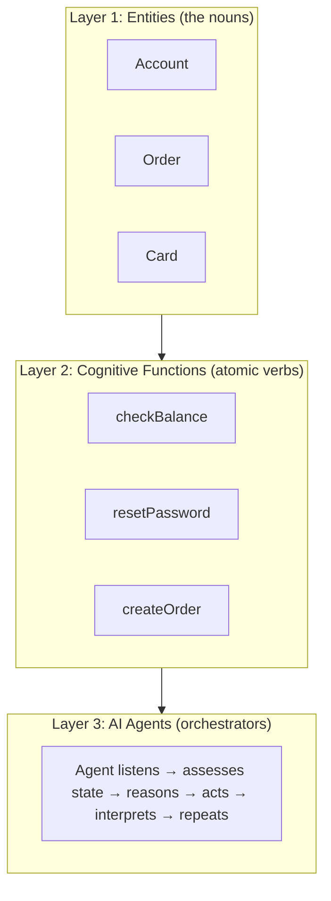

# Voice AI — Full Pipeline from Mic to Speaker

> **Target**: Complete beginner in voice AI.
> **Goal**: Understand every component of the voice AI pipeline, the metrics that matter, the platform innovations, and the the platform platform.

---

## 1. Full Voice AI Pipeline

### End-to-End Flow

```
User speaks → MICROPHONE
                 ↓
          VAD (Voice Activity Detection) — "is someone talking?"
                 ↓
          ASR (Automatic Speech Recognition) — "what words?"
                 ↓
          NLU (Natural Language Understanding) — "what intent?"
                 ↓
          DIALOGUE MANAGEMENT — "what to do next?"
                 ↓
          RESPONSE GENERATION — "what to say?"
                 ↓
          TTS (Text-to-Speech) — "speak the response"
                 ↓
User hears → SPEAKER
```

### Each Step in One Sentence

1. **VAD**: Detects when the user starts/stop speaking
2. **ASR**: Converts audio waveform to text
3. **NLU**: Understands the meaning and intent behind the text
4. **Dialogue Management**: Decides what to do (next question, action, etc.)
5. **TTS**: Converts the response text back to natural-sounding speech

### Why This Matters
This pipeline is what the platform builds. Every role at the platform involves some part of this pipeline. Even backend engineers need to understand how their APIs fit into this flow.

---

## 2. What is ASR (Automatic Speech Recognition)

### Plain Explanation

ASR converts speech audio into text. You speak → computer writes what you said.

### The Three Components

```
Audio waveform
    ↓
1. ACOUSTIC MODEL: Maps audio features → phonemes (basic sounds)
   "audio patterns" → /k/, /æ/, /t/ (sounds of "cat")
    ↓
2. LANGUAGE MODEL: Maps phonemes → words
   /k/+/æ/+/t/ → "cat"
    ↓
3. DECODER: Chooses the most likely word sequence
   "I see a cat" vs "I see a kat" → picks "cat"
```

### Why This Matters
Deepgram Nova-2 (used in ACARE) achieves WER ~5.5%. the platform direct audio-to-meaning bypasses the text step entirely.

---

## 3. How ASR Works (Detailed)

### Step 1: Audio to Spectrogram

```
Raw audio → Split into 25ms frames → FFT each frame → Spectrogram
```

A spectrogram is a picture of sound: x=time, y=frequency, color=intensity.

### Step 2: Acoustic Model (Spectrogram → Phonemes)

The acoustic model is a neural network (typically CTC or RNN-T) that maps spectrogram frames to phonemes.

```
Spectrogram frame ─→ Neural Network ─→ probability of each phoneme
                                          /a/: 0.8
                                          /e/: 0.1
                                          /i/: 0.05
                                          ...
```

### Step 3: Decoding (Phonemes → Words)

Combines acoustic model output with language model probabilities to find the most likely word sequence.

```
Best path: "What is the weather in Tokyo"
Not: "Watt is thee wea ther inn Toe key yo"
```

### Why This Matters
This is computationally expensive. Real-time ASR needs optimized models (like Deepgram's) or dedicated hardware. ACARE runs Deepgram on the cloud — latency is ~300ms for typical utterances.

---

## 4. Mel Spectrogram

### Plain Explanation

We don't process raw frequencies. We convert to **mel scale**, which matches how human ears perceive sound.

Human hearing is **logarithmic**: we can distinguish 100Hz from 200Hz easily, but NOT 10,000Hz from 10,100Hz. The mel scale accounts for this.

### Formula

```
mel = 2595 × log10(1 + f / 700)

Where f = frequency in Hz

Examples:
100 Hz → 150 mels
500 Hz → 643 mels
1000 Hz → 1000 mels
5000 Hz → 2577 mels
10000 Hz → 3330 mels
```

**Notice**: The first 1000 Hz spans 1000 mels, but the next 9000 Hz only spans 2330 mels. This reflects human hearing: we're much more sensitive to low-frequency differences.

### Why This Matters
Every ASR system uses mel spectrograms as input. The conversion from raw audio to mel spectrogram is the first step in the acoustic model pipeline.

---

## 5. WER — Word Error Rate

### The Metric

WER measures ASR accuracy. It's the percentage of words the system got wrong.

### Formula

```
WER = (Substitutions + Insertions + Deletions) / Reference Word Count

Reference (what was actually said):   "I have a cat"
Hypothesis (what ASR output):         "I have a hat"

Substitutions: "cat" → "hat" = 1
Insertions: 0
Deletions: 0
WER = 1 / 4 = 25%

Reference: "The cat sat on the mat"
Hypothesis: "The cat on mat"

Substitutions: 0
Insertions: 0
Deletions: "sat", "the" = 2
WER = 2 / 6 = 33%
```

### What's "Good" WER?

| WER | Quality | Example System |
|-----|---------|----------------|
| < 5% | Human-level | Professional transcription |
| 5-10% | Excellent | Deepgram Nova-2, Whisper large |
| 10-15% | Good | Most commercial ASR |
| 15-25% | OK | Noisy conditions |
| > 25% | Poor | Heavy noise, strong accents |

### Why This Matters
ACARE's voice pipeline processes medical commands. A 10% WER means 1 in 10 words wrong — potentially dangerous. That's why ACARE uses confirmation loops ("Did you say 'scissors'?").

---

## 6. RTF — Real-Time Factor

### The Metric

RTF measures ASR speed: how long it takes to process audio relative to the audio's duration.

```
RTF = Processing Time / Audio Duration

RTF = 1.0: same speed as real-time
RTF = 0.5: twice as fast as real-time
RTF = 2.0: half speed (can't keep up)
RTF = 0.3: 3x real-time (excellent)
```

### What's "Good" RTF?

| RTF | Quality |
|-----|---------|
| < 0.3 | Excellent (3x+ real-time) |
| 0.3-0.5 | Good |
| 0.5-1.0 | Acceptable for batch |
| > 1.0 | Too slow for real-time |

### Why This Matters
For real-time voice applications (like ACARE's robot assistant), RTF must be < 0.5. If ASR takes 2 seconds to process a 1-second utterance, the conversation feels laggy and unnatural.

---

## 7. ASR Challenges

### Accents

"I'm going to the store" sounds different with American, British, Indian, or Australian accents. ASR models trained mostly on American English perform poorly on Indian English.

**Solution**: Train on diverse accent data, fine-tune for target region.

### Noise

Background noise (traffic, fans, music) interferes with speech. The ASR can't distinguish speech from noise.

**Solution**: Noise suppression preprocessing, multi-microphone beamforming.

### Homophones

Words that sound the same but have different meanings/spellings:
- "their" / "there" / "they're"
- "write" / "right"
- "see" / "sea"

**Solution**: Language model uses context to disambiguate. "I went to the beach to **sea** the ocean" — LM would correct to "see."

### Why This Matters
ACARE operates in a medical environment (beeping monitors, fans, voices). The voice pipeline must handle this noise. the platform automotive ASR must handle road noise, music, and multiple passengers talking.

---

## 8. the platform direct audio-to-meaning

### The Innovation

Traditional ASR converts speech → text → meaning (3 steps, errors cascade).

the platform skips the text step: speech → meaning directly.

```
Traditional: Audio → Text → Meaning
                  WER errors     NLU errors

the platform: Audio → Meaning
                  No intermediate text errors
```

### Why It's Better

1. **Lower latency**: One step instead of two
2. **No cascading errors**: ASR errors don't propagate to NLU
3. **Deep Meaning Understanding**: Captures multiple intents in one utterance
4. **Compound queries**: "Find a Mexican restaurant near the office that's open now and has vegetarian options" — all understood as one query, not multiple passes

### Why This Matters
This is the platform core differentiator. Every competitor (Google, Alexa, Nuance) uses the traditional ASR→NLU pipeline. the platform approach is fundamentally different and measurably better for complex queries.

---

## 9-10. TTS (Text-to-Speech)

### 9. What is TTS

TTS converts written text into spoken audio. You type → computer speaks.

### 10. Neural TTS Pipeline

```
Text: "Hello, how can I help you?"
    ↓
Tokenizer → character/phoneme sequence
    ↓
Encoder → produces linguistic features (prosody, emphasis)
    ↓
Mel Generator → produces mel spectrogram (acoustic features)
    ↓
Vocoder → converts spectrogram to raw audio waveform
    ↓
Audio: speaker output
```

### Modern TTS Models

| Model | Quality | Speed | Notes |
|-------|---------|-------|-------|
| **Tacotron 2** | Good | Slow | First major neural TTS |
| **FastSpeech** | Good | Fast | Non-autoregressive, parallel |
| **VITS** | Excellent | Fast | End-to-end, no separate vocoder |
| **XTTS** | Excellent | Fast | Voice cloning support |

### Why This Matters
ACARE uses edge-tts (cloud-based, high quality) with pyttsx3 fallback (local, lower quality). The TTS must respond quickly in a conversation — latency under 500ms is the target. the platform voice AI includes proprietary TTS for natural-sounding responses.

---

## 11. MOS Score (Mean Opinion Score)

### The Metric

MOS is a human-rated quality score for TTS and audio systems. Humans listen and rate 1-5:

| Score | Quality |
|-------|---------|
| 5 | Perfect, indistinguishable from human |
| 4 | Good, slight imperfections |
| 3 | Fair, noticeable but acceptable |
| 2 | Poor, annoying |
| 1 | Bad, unintelligible |

### What's "Good" MOS?

- **Professional human recording**: 4.5-4.8
- **Modern neural TTS**: 4.0-4.3
- **Older concatenative TTS**: 3.0-3.5
- **ACARE's edge-tts**: ~4.2

### Why This Matters
When users interact with voice AI, low-quality TTS is immediately noticeable and creates a poor experience. ACARE's 3-tier TTS fallback ensures quality first.

---

## 12. What is NLU (Natural Language Understanding)

### Plain Explanation

NLU extracts MEANING from text. It's the difference between knowing WHAT words were said and understanding the INTENT.

```
Text: "My phone bill is too high, I want to switch carriers"

ASR just outputs: the text
NLU understands:
  - Intent: "cancel service" / "switch provider"
  - Entities: "phone bill" (product), "high" (reason)
  - Sentiment: frustrated
  - Action needed: offer retention discount or process cancellation
```

### Why This Matters
ACARE's intent parser distinguishes "turn on the light" (command) from "is the light on?" (question). The robot must respond differently to each. the platform NLU powers the platform understanding of customer requests.

---

## 13. Intent Detection

### Plain Explanation

Intent detection = classifying what the user wants to DO.

### Examples

```
"Book a flight to Paris" → Intent: BOOK_FLIGHT
"What's the weather?" → Intent: CHECK_WEATHER
"Turn off the living room lights" → Intent: CONTROL_LIGHT
"Where's my order?" → Intent: TRACK_ORDER
```

### How It Works (Simplified)

```python
# Simple classifier approach
intents = {
    "book_flight": ["book", "flight", "ticket", "travel", "fly"],
    "check_weather": ["weather", "temperature", "rain", "forecast"],
    "control_light": ["light", "turn on", "turn off", "dim", "bright"],
}

def detect_intent(text):
    text_lower = text.lower()
    scores = {}
    for intent, keywords in intents.items():
        scores[intent] = sum(1 for kw in keywords if kw in text_lower)
    
    best_intent = max(scores, key=scores.get)
    if scores[best_intent] > 0:
        return best_intent
    return "unknown"
```

### Why This Matters
This is the core of the platform conversation routing. Bad intent detection = wrong responses. ACARE's intent parser must be near-perfect for safety-critical commands.

---

## 14. Entity Extraction

### Plain Explanation

Entities are the specific data points in a user's utterance.

```
"Book a flight to Paris on June 15th"

Entities extracted:
  - destination: "Paris" (type: city)
  - date: "June 15th" (type: date)
  - action: "book" (type: verb)
```

### Code Pattern

```python
# Rule-based extraction
import re

def extract_entities(text):
    entities = {}
    
    # Extract dates
    date_pattern = r'\b(january|february|march|...)\s+\d{1,2}(?:st|nd|rd|th)?\b'
    match = re.search(date_pattern, text, re.IGNORECASE)
    if match:
        entities["date"] = match.group(0)
    
    # Extract cities (known list)
    cities = ["Paris", "London", "Tokyo", "New York", ...]
    for city in cities:
        if city.lower() in text.lower():
            entities["city"] = city
            break
    
    return entities
```

### Why This Matters
Without entity extraction, the system knows the user wants to book a flight but doesn't know WHERE or WHEN. Slot filling requires entity extraction.

---

## 15. BIO Tagging

### Plain Explanation

BIO (Begin, Inside, Outside) is a tagging scheme for sequence labeling. Each word gets a tag:

```
Token:   Book  a   flight  to   Paris    on     June    15th
Tag:     O     O   O       O    B-CITY  O      B-DATE   I-DATE

B = Beginning of an entity
I = Inside (continuation) of an entity
O = Outside (not part of any entity)
```

### Why It Matters
BIO tagging is used by modern ML-based NER systems. It's more robust than regex for complex entity extraction.

---

## 16. Slot Filling

### Plain Explanation

Slots are the required parameters for an intent. If a slot is missing, the system must ask for it.

```
Intent: BOOK_FLIGHT
Required slots: destination, date, origin
Optional slots: time, seat_class, airline

User: "Book a flight to Paris"
→ destination: "Paris" (filled)
→ date: MISSING
→ origin: MISSING

System: "What date would you like to travel?"
User: "Next Tuesday"
→ date: "next Tuesday" (filled)

System: "Where are you departing from?"
User: "From Mumbai"
→ origin: "Mumbai" (filled)

System: "Great! Booking a flight from Mumbai to Paris on June 25th..."
```

### Why This Matters
This is how conversational AI handles incomplete information gracefully. Without slot filling, the system would fail on any request missing parameters.

---

## 17. Dialogue Acts

### Plain Explanation

Every utterance has a "dialogue act" — what the speaker is trying to DO with their words.

### Common Dialogue Acts

| Act | Example | Meaning |
|-----|---------|---------|
| Statement | "I'm hungry" | Sharing information |
| Question | "Is it raining?" | Requesting information |
| Request | "Turn on the light" | Asking for action |
| Confirm | "Yes, that's right" | Confirming understanding |
| Reject | "No, I meant Tuesday" | Correcting misunderstanding |
| Apology | "Sorry, I didn't catch that" | Acknowledging error |
| Thank | "Thanks for your help" | Expressing gratitude |

### Why This Matters
Dialogue acts determine how the system should respond. A statement ("I'm hungry") might trigger a recommendation. A question ("Is the restaurant open?") triggers a lookup. The system's response strategy differs for each act.

---

## 18. What is Dialogue Management

### Plain Explanation

Dialogue management decides what the system should do or say next, based on the current conversation state.

### Simple Example

```
User: "I want to book a flight" 
State: {intent: BOOK_FLIGHT, slots: {}}
Action: Ask for destination

User: "To Paris"
State: {intent: BOOK_FLIGHT, slots: {destination: Paris}}
Action: Ask for date

User: "Next Tuesday"
State: {intent: BOOK_FLIGHT, slots: {destination: Paris, date: next Tue}}
Action: Confirm + Book
```

### Why This Matters
Dialogue management separates "what to do" from "how to say it." This is critical for production voice AI. the platform uses workflow nodes and automatas for dialogue management.

---

## 19. Dialogue State Tracking

### Plain Explanation

Dialogue state tracking (DST) keeps track of what's been said across turns.

### Example

```
Turn 1 — User: "Book a flight to Paris"
State after: {intent: BOOK_FLIGHT, destination: Paris, date: ?, origin: ?}

Turn 2 — User: "Next Tuesday"
State after: {intent: BOOK_FLIGHT, destination: Paris, date: next Tue, origin: ?}

Turn 3 — System: "Where from?"
Turn 4 — User: "Mumbai"
State after: {intent: BOOK_FLIGHT, destination: Paris, date: next Tue, origin: Mumbai}
```

### Why This Matters
Without DST, the system would forget what was said earlier. Each turn would start fresh. DST is what makes multi-turn conversations possible.

---

## 20. Dialogue Policy

### Plain Explanation

Given the current state, what should the system do? The dialogue policy decides.

```python
def dialogue_policy(state):
    if state.intent == "BOOK_FLIGHT":
        if not state.destination:
            return {"action": "ask", "slot": "destination"}
        if not state.date:
            return {"action": "ask", "slot": "date"}
        if not state.origin:
            return {"action": "ask", "slot": "origin"}
        
        # All slots filled — execute
        return {"action": "execute", "type": "booking"}
    
    elif state.intent == "CHECK_WEATHER":
        return {"action": "execute", "type": "weather_lookup"}
```

### Why This Matters
Dialogue policy can be hand-crafted (rules) or learned (RL). Simple systems use rules. Complex systems (like the platform) use learned policies optimized for task completion rate.

---

## 21. Coreference Resolution

### Plain Explanation

Figuring out what pronouns and references point to.

```
User: "Call Dr. Smith."
System: "Calling Dr. Smith."
User: "Tell HIM I'm running late."
System: "What message should I send to Dr. Smith?" (him = Dr. Smith ✓)

ANOTHER EXAMPLE:
"John went to the store. He bought milk."
→ He = John (coreference resolution)

"Paris is beautiful. I love the city."
→ "the city" = Paris
```

### Why This Matters
Without coreference resolution, the system loses track of who/what the user is talking about across turns.

---

## 22. Ellipsis Resolution

### Plain Explanation

Understanding incomplete utterances that depend on context.

```
System: "Where are you flying to?"
User: "To Paris."  (incomplete sentence)
→ System understands: "I am flying to Paris"

System: "What date?"
User: "Next Tuesday."  (incomplete)
→ System understands: "I want to fly on next Tuesday"
```

### Why This Matters
People speak in fragments, especially when stressed or rushed. A voice AI must handle ellipsis naturally.

---

## 23. Session Management

### Plain Explanation

Managing the lifecycle of a conversation:

1. **Start**: User initiates contact (wake word, button press, call)
2. **Maintain**: Track state, manage context, handle interruptions
3. **Timeout**: If user is silent for N seconds, end session or prompt
4. **End**: User ends conversation, system saves state

### Why This Matters
ACARE's voice pipeline has session management: 8-second initial silence timeout, 5-second mid-speech gap timeout, 10-minute conversation TTL. the platform manages enterprise sessions that can last hours across channels.

---

## 24. Multi-Turn Conversation

### The Challenge

Single-turn: User asks, system answers. Done. Easy.
Multi-turn: System must remember what was said, handle topic shifts, correct misunderstandings.

### Why It's Hard

- **Context window**: Can't fit entire conversation in prompt
- **Topic shifts**: User goes from "book flight" to "check weather" back to "book flight"
- **Corrections**: "No, I said TUESDAY, not Thursday. Pay attention."
- **Ambiguity**: "I want that one" — what's "that one"?

### Why This Matters
ACARE's conversations are multi-turn (robot: "which tool?" user: "scissors"). SYNAPSE's reasoning pipeline processes multi-turn queries. the platform handles enterprise multi-turn across voice and chat.

---

## 25. Wake Word Detection

### Plain Explanation

A wake word ("Hey Siri," "Okay Google," "Alexa") activates the device. It's always listening but ONLY processes audio after the wake word.

### How It Works

1. Small neural network runs continuously on-device (low power)
2. Compares audio stream against wake word pattern
3. When detected → activates full ASR pipeline
4. False positives minimized by aggressive thresholds

### Why This Matters
Wake words use VERY little power (specialized DSP chips). This is edge AI: the detection happens on-device, not in the cloud. the platform automotive wake words work even with music playing and road noise.

---

## 26. Omnichannel

### Plain Explanation

The same conversational AI works across ALL channels:

```
User starts on: Web chat → "Hi, I have a billing question"
Continues on:  Mobile app → "I'm the same person who asked about billing"
Finishes on:   Phone call → "Yes, I still need help with that bill"
```

### Why It Matters
the platform is an omnichannel platform. A customer might start on the website, switch to mobile, and escalate to a phone call — all within the same conversation. The system maintains context across channels.

---

## 27. IVR vs AI-Powered IVR

### Traditional IVR

```
"Press 1 for sales"
"Press 2 for support"
"Press 3 for billing"
"If you know your party's extension..."
```

Frustrating, rigid, no natural language.

### AI-Powered IVR

```
User: "I need help with my bill from last month"
AI: "I can see your account. You have an outstanding balance of $45 from January 15th. Would you like to pay now or discuss payment options?"
```

Natural conversation, understands intent, resolves faster.

### Why This Matters
the platform replaces traditional IVR. the platform acquired the platform (enterprise conversational AI) and SYNQ3 (restaurant voice AI). This is their core enterprise product.

---

## 28. Voice AI in Automotive

### Why It's Different

- **Noise**: Road noise, wind, music, passengers
- **Safety**: Hands-free, eyes-free. Must NOT distract driver
- **Offline**: Tunnels, garages, rural areas — no internet
- **Integration**: Climate control, navigation, media, calls

### the platform Automotive Leadership

- Pre-installed in many car brands (Honda, Hyundai, etc.)
- Edge AI: processes voice locally, not in cloud
- Deep Meaning Understanding for complex commands:
  "Find the nearest Italian restaurant that's open now and has good reviews"

### Why This Matters
The platform is a leader in automotive voice AI. This is their strongest differentiator vs Google and Alexa.

---

## 29. Compound Queries — Deep Meaning Understanding

### Plain Explanation

Compound queries combine multiple requests in one sentence. Traditional systems fail; the platform system parses them as one.

### Example

```
"Find a Mexican restaurant near the office that's open now
 and has vegetarian options and is rated 4+ stars"

Traditional system (3 separate queries):
1. "Find Mexican restaurant near office"
2. "Check if they have vegetarian options"
3. "Check rating >= 4"

the platform DMU: One query, all constraints understood together
→ Fetches restaurants matching ALL conditions at once
```

### Why This Matters
This is the platform patented innovation. Competing systems require multiple turns for compound queries. the platform handles them in one go — faster, more natural.

---

## 30. Edge AI — the platform NVIDIA GTC Demo

### What is Edge AI

Running AI models ON THE DEVICE, not in the cloud. No internet needed.

### the platform Edge Demo

At NVIDIA GTC, the platform demonstrated voice AI running entirely on an NVIDIA DRIVE platform in a car — no cloud connectivity.

### Why Edge AI Matters

| Factor | Cloud AI | Edge AI |
|--------|----------|---------|
| **Latency** | 200-500ms (network) | < 100ms |
| **Privacy** | Audio sent to cloud | All processing local |
| **Offline** | Not available | Works anywhere |
| **Updates** | Easy (server-side) | Needs OTA update |

### Why This Matters
This is ACARE's architecture too — the robot runs inference locally (YOLO on Pi 5, voice on-demand) but uses cloud for heavy LLM (Groq, NIM). The combination of edge + cloud is the winning pattern.

---

## 31-32. Speaker Recognition

### 31. Verification vs Identification

**Verification (1:1)**: "Is this person who they claim to be?"
- Input: voice sample + claimed identity
- Output: match / no match
- Use case: "Authenticate me for account access"

**Identification (1:N)**: "Who is this person?"
- Input: voice sample
- Output: identity (from enrolled database)
- Use case: "Who is speaking in this meeting?"

### 32. ECAPA-TDNN

**ECAPA-TDNN** is the state-of-the-art model for speaker verification.

**TDNN (Time-Delay Neural Network)**: Looks at audio features across time windows, captures temporal speech patterns. "How does this person's voice change over short time spans?"

**ECAPA**: Adds squeeze-excitation blocks (channel attention). Useful channels get amplified, noisy channels get suppressed. This makes the model robust to different microphones and environments.

### Why ECAPA-TDNN is Good

- **Robust to noise**: Clean performance even in noisy environments
- **Short utterances**: Works with just 2-3 seconds of speech
- **Cross-channel**: Same speaker on different microphones still matches

### Why This Matters
ACARE uses voice authentication (speaker verification) to ensure only authorized staff can command the robot. the platform uses speaker recognition for personalization ("Welcome back, John").

---

## 33. Anti-Spoofing

### The Problem

Attackers can replay recorded voices or use synthetic audio (deepfakes) to fool speaker recognition.

### Detection Methods

1. **Liveness detection**: "Is this a live person or a recording?" — asks for random phrase
2. **Artifact analysis**: Recordings have artifacts (compression noise, speaker frequency response)
3. **Challenge-response**: "Please repeat: 'The blue fox jumps high'" — attacker can't predict this
4. **Multi-modal**: Combine voice with face (lip movement sync)

### Why This Matters
ACARE's robot could be spoofed by a recording of a doctor's voice. Anti-spoofing is critical for safety-critical voice systems.

---

## 34. Noise Suppression

### Plain Explanation

Removing background noise from audio while preserving speech.

### Approaches

1. **Spectral subtraction**: Estimate noise profile, subtract from signal
2. **Neural approaches** (RNNoise): Neural network trained to separate speech from noise

### Why This Matters
ACARE operates in medical environments with beeping monitors, fans, and conversations. Without noise suppression, ASR accuracy drops by 50%+.

---

## 35. Beamforming

### Plain Explanation

Using MULTIPLE microphones to focus on sound from a specific direction.

### How It Works

```
Microphone 1 ─╮
Microphone 2 ─╪── Beamformer ──→ Clean audio from direction X
Microphone 3 ─╯
```

Sound arrives at each mic at slightly different times. By calculating these time differences, the system can:
- Amplify sound from the desired direction (the speaker)
- Cancel sound from other directions (TV, traffic, other people)

### Why This Matters
the platform automotive system uses beamforming with microphone arrays. The driver's voice is amplified, passenger and road noise are cancelled.

---

## 36. Speaker Diarization

### Plain Explanation

"Who spoke when." Partitioning an audio recording by speaker.

```
[00:00-00:12] Speaker A: "What's for dinner?"
[00:13-00:18] Speaker B: "I was thinking pasta."
[00:19-00:30] Speaker A: "Sounds good. Do we have tomatoes?"
[00:31-00:35] Speaker C: "I bought some yesterday."
```

### How It Works

1. Segment audio into short chunks (1-2 seconds)
2. Create an embedding for each chunk (speaker embedding)
3. Cluster embeddings (same speaker = similar embeddings)
4. Label clusters as Speaker A, B, C...

### Why This Matters
ACARE's robot might hear two people in the room. Diarization ensures it responds to the correct person. the platform uses diarization to separate agent speech from customer speech in call recordings.

---

## 37. VAD — Voice Activity Detection

### Plain Explanation

VAD detects WHEN someone is speaking. It's the FIRST step in the voice pipeline.

### Energy-Based VAD (Simple)

```python
def is_speech(audio_frame, threshold=0.02):
    """Simple energy-based VAD"""
    energy = sum(abs(sample) for sample in audio_frame) / len(audio_frame)
    return energy > threshold
```

### ML-Based VAD (Better)

Silero VAD (used in ACARE) is a small neural network that's more accurate than energy-based VAD.

### Parameters

- **Speech threshold**: Probability above which we consider it speech (default 0.5)
- **Min speech duration**: Ignore short noises (clicks, coughs) — ACARE uses 0.5s
- **Silence timeout**: How long after speech stops to consider utterance complete — ACARE uses 0.8-1.0s

### Why This Matters
VAD is the gatekeeper. Bad VAD = false starts (system thinks you're speaking when you're not) or clipped speech (system stops listening while you're still talking). ACARE uses Silero VAD with careful tuning.

---

## 38-45. the platform Platform

### 38. What is the platform

the platform is the platform enterprise AI platform for customer service. It's a complete conversational AI system that handles phone calls, chat, email, and SMS.

**Capabilities**:
- Natural conversation (not press-1-for-menu)
- Task completion (reset password, check order, process payment)
- Handoff to human agents when needed
- Analytics and reporting

### 39. the platform Ontologies

An ontology is a structured map of knowledge for a specific domain.

```
Domain: Telecommunications
Ontology includes:
  - Entities: account, plan, device, billing, support
  - Relationships: account has plan, plan covers device
  - Attributes: plan_name, monthly_cost, data_limit
  - Actions: upgrade_plan, report_issue, pay_bill
```

**Why it matters**: The ontology is what the platform "knows" about your business. Without it, the AI has no understanding of your domain.

### 40. the platform workflow nodes (Business Process Nodes)

workflow nodes define step-by-step workflows for handling tasks.

```yaml
Process: Reset Password
  1. Verify identity (ask security question or send OTP)
  2. Check if user can reset online
  3. Send password reset link
  4. Confirm email received
  5. If failed: escalate to human agent
```

**Why it matters**: workflow nodes are deterministic — they always follow the same steps. This ensures compliance and reliability.

### 41. the platform Autmatas

Automatas are state machines for conversation flow.

```
State: GREETING
  → User says "I need help with my bill"
  → Transition to: BILLING_INTENT

State: BILLING_INTENT
  → System: "I can help with billing. What's your account number?"
  → User provides account
  → Transition to: VERIFY_ACCOUNT

State: VERIFY_ACCOUNT
  → Check account exists
  → If yes: Transition to: RESOLVE_BILLING
  → If no: Transition to: ERROR_HANDLING
```

### 42. Transversal Analysis

Cross-session analytics that finds patterns across ALL conversations.

Identifies:
- Most common customer issues
- Frequent failure points
- Agent escalation triggers
- Sentiment trends over time
- Compliance violations

### 43. Architecture Blueprint

```
Channels (Voice, Chat, SMS, Email, Social)
         ↓
Orchestration Layer (routing, session management)
         ↓
NLU Engine (intent detection, entity extraction)
         ↓
Dialogue Management (workflow nodes, automatas, state)
         ↓
Backend Integrations (CRM, billing, ticketing)
         ↓
Human Agent Handoff (when AI can't resolve)
```

### 44. Configuring Intents in the platform

1. Define intent name: "RESET_PASSWORD"
2. Provide training phrases:
   - "I forgot my password"
   - "I can't log in"
   - "Reset my account password"
   - "I need a new password"
3. Link to workflow nodes: ResetPassword process
4. Test and iterate

### 45. the platform — orchestration framework Framework (CORRECTED)

the platform orchestration framework framework is NOT "workflow nodes + LLM agents." It's a multi-agent orchestration framework built on three layers:



**How it works**: Instead of rigid scripts, you define Entities and Cognitive Functions. AI agents dynamically orchestrate them based on the user's goal and current state.

Example: Customer says "I lost my card":
1. Agent LISTENS → Goal = "replacement card"
2. Agent ASSESSES STATE → Account active? Existing replacement?
3. Agent REASON → verify identity → check fraud → create order
4. Agent ACTS → calls verifyIdentity() → checkFraudFlag() → createReplacementOrder()
5. Agent RESPONDS → "Replacement ordered, tracking XYZ"

The agent doesn't follow a script — it figures out the path dynamically.

### 45a. orchestration framework Key Concepts

| Concept | What It Is | Example |
|---------|-----------|---------|
| **Entities** | Business nouns | Account, Order, Card, Ticket |
| **Cognitive Functions** | Atomic business actions | checkBalance(), resetPassword() |
| **AI Agents** | Dynamic orchestrators | Listen → Assess → Reason → Act → Interpret |
| **Guardrails** | Enterprise safety rules | "No transaction without auth. PCI compliance." |
| **MCP** | Standard tool integration protocol | Connect to CRM, ERP, ticketing systems |
| **Agent Console** | AI companion for human reps | Suggests responses during live calls |

### 45b. the platform Features

- **Omnichannel**: voice, chat, messaging, web, in-app — all first-class
- **direct audio-to-meaning (Polaris)**: proprietary ASR, 200+ patents, audio → meaning directly
- **LLM agnostic**: can use any LLM provider
- **Pre-built catalog**: banking, healthcare, insurance, IT service desk templates
- **Analytics**: conversation flow visualization, problem-location detection, NPS
- **Intent training**: supervised learning (labeled data) OR LLM-based (fewer examples)
- **Knowledge Sources**: website, SOPs, transcripts, product catalogs via Answers Hub

---

### 46. What a an implementation engineer Actually Does with the platform

This section is written specifically for the the platform an implementation engineer role.

**Your job as a an implementation engineer:**

You are the bridge between the platform platform capabilities and the client's business needs. You don't build the platform from scratch — you configure it for each client.

#### a) Transversal Analysis → Design

```
Client provides: call transcripts, chat logs, SOP documents
         ↓
You perform: Transversal Analysis
  (analyze conversations to identify: 
   - Most common customer intents
   - Frequent failure points
   - Conversation patterns and flows)
         ↓
You produce: Architecture Blueprint
  (which intents to build, which workflow nodes needed,
   which systems to integrate, priority order)
```

#### b) Ontology Configuration

An ontology is the platform knowledge of the client's business domain:

```yaml
Domain: Telecommunications
Ontology entities:
  - Account: {number, plan, status, balance}
  - Plan: {name, monthly_cost, data_limit, call_minutes}
  - Device: {model, IMEI, warranty_status}
  - Support: {ticket_id, issue_type, priority}

Ontology relationships:
  - Account "has" Plan
  - Account "registered to" Device
  - Account "created" Support Ticket

Ontology actions:
  - check_balance(account_number)
  - upgrade_plan(account_number, new_plan)
  - report_issue(account_number, issue_description)
```

You define these in the platform ontology editor. The more accurate the ontology, the better the platform understands client conversations.

#### c) workflow nodes Development

workflow nodes are the step-by-step workflows for handling tasks. You build them in the platform visual workflow nodes designer:

```
workflow nodes: "Reset Password"

Step 1: Verify identity
  → "Please provide your account number or registered email"
  → Check against client's customer DB via API

Step 2: (if identity verified)
  → Generate one-time password reset link
  → Send via SMS/email via integration API

Step 3: Confirm
  → "A password reset link has been sent to your registered email"
  → "Is there anything else I can help with?"

Step 4: (if identity not verified)
  → "I wasn't able to verify your identity. Let me connect you to a specialist."
  → Escalate to human agent via ticketing system API
```

#### d) Automata Creation

Automatas define the conversation state machine:

```
States:
  OPENING → INTENT_GATHERING → AUTH_CHECK → TASK_EXECUTION → CONFIRMATION → CLOSE
                                                                     ↓ (if fails)
                                                               ESCALATION
```

Each state has:
- What the system says
- What user inputs to expect
- Transitions to next states
- Data to collect and pass between states

#### e) Integration Development

You write code (Java/JS/Groovy) connecting the platform to client backend systems:

```java
// Example: the platform integration webhook (Java)
@Path("/integrations/order-status")
public class OrderStatusIntegration {
    
    @POST
    @Consumes("application/json")
    @Produces("application/json")
    public Response checkOrder(OrderRequest request) {
        // Call client's order management API
        Order order = orderManagementClient.getOrder(request.getOrderId());
        
        // Return structured response the platform can use
        return Response.ok(new OrderResponse(
            order.getStatus(),
            order.getEstimatedDelivery(),
            order.getTrackingUrl()
        )).build();
    }
}
```

#### f) Testing and Iteration

- **Functional testing**: Does the platform handle each intent correctly?
- **Stress testing**: Can it handle peak volume?
- **Edge case testing**: What happens with unexpected inputs?
- **Client UAT**: Client validates against their requirements
- **Refinement**: Iterate based on test results and feedback

#### g) Reusability

After deployment, you identify patterns that can be standardized:
- "I see we built a 'verify identity' workflow nodes for this client — let's make it reusable"
- "This billing integration pattern could apply to 3 other clients"
- Feed improvements back to R&D for product-wide standardization

### Why This Matters
This IS the an implementation engineer role. Every topic above — ontologies, workflow nodes, automatas, integrations, testing — is what you'll do daily. Study this section carefully.
