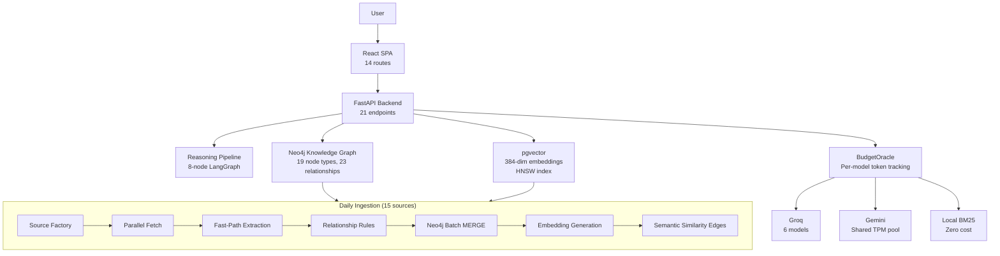
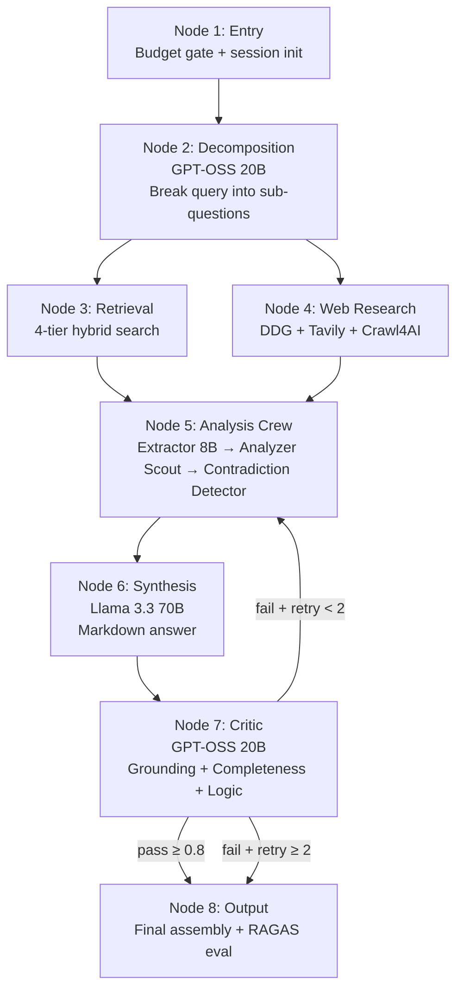
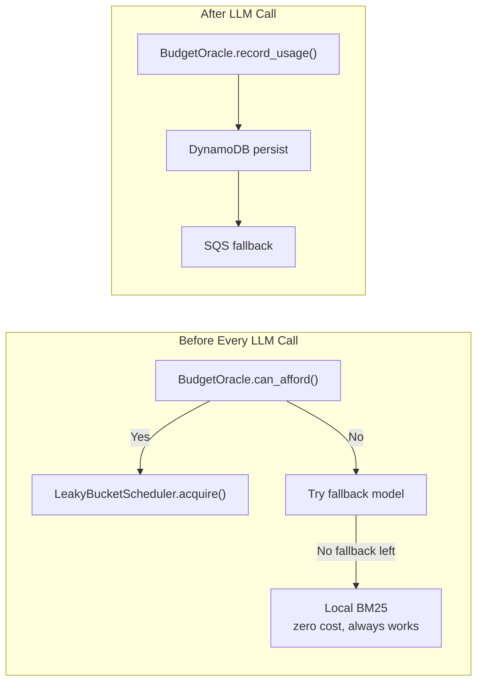
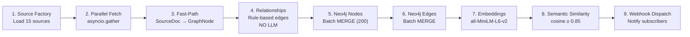
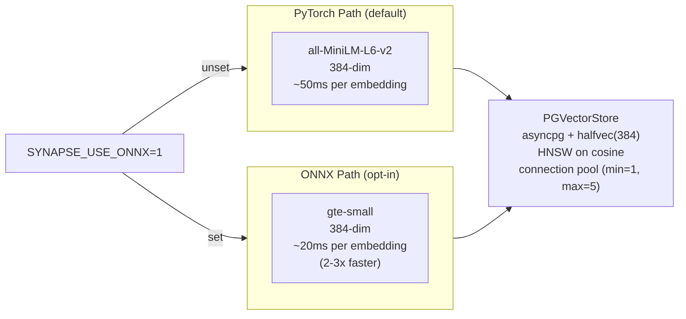

# SYNAPSE — AI Knowledge Graph & Reasoning Engine (Deep Dive)

> **For**: Complete refresher. Understand everything you built.
> **Goal**: Answer any interview question about SYNAPSE's architecture, LangGraph pipeline, ingestion, or budget system.

---

## What is SYNAPSE?

A self-updating AI knowledge graph that ingests from 15+ sources (arXiv, HuggingFace, GitHub, Semantic Scholar) and answers complex reasoning queries via an 8-node LangGraph pipeline.

**User flow**: Ask a question → system searches its knowledge graph + web → runs 8-step reasoning → returns synthesized answer with citations + RAGAS quality scores.

---

## High-Level Architecture



---

## Tech Stack

| Component | Technology | Why |
|-----------|-----------|-----|
| Backend | FastAPI | Async, WebSocket, auto docs |
| Frontend | React 19, Vite 6, Tailwind v4, Sigma.js | Graph visualization, fast builds |
| Knowledge Graph | Neo4j | Graph DB for entity-relationship queries |
| Vector Store | pgvector (Neon Postgres) | halfvec(384), HNSW index on cosine |
| Embeddings | all-MiniLM-L6-v2 (384-dim, PyTorch) | Free, runs on CPU |
| Embeddings (fast) | gte-small via ONNX Runtime | 2-3x faster, opt-in via env var |
| LLM Primary | Groq (multi-key, 6 models) | Fast inference, good free tier |
| Orchestration | LangGraph (StateGraph) | 8-node state machine with conditional edges |
| Storage | Firestore (checkpoints), DynamoDB (budget), SQS (jobs) |
| MCP | Memory, Sequential Thinking, Filesystem servers via stdio |
| CI/CD | GitHub Actions (daily ingest, 2-hourly scrape, weekly eval) |
| Deployment | Cloud Run + Firebase Hosting |

---

## Project Structure

```
synapse/
├── api/                   # FastAPI application
│   ├── main.py           # 114 lines. App creation, lifespan events, routes
│   ├── middleware.py      # 98 lines. CORS, rate limiting (30/min/IP), security headers
│   ├── v1/
│   │   ├── router.py     # 869 lines. 14 data endpoints
│   │   ├── reasoning.py  # 393 lines. 7 reasoning pipeline endpoints
│   │   └── groq_status.py # 72 lines. Admin: key health, model status
│   ├── groq_manager.py   # 476 lines. Multi-key Groq management
│   └── semantic_cache.py # 124 lines. pgvector query cache (0.95 threshold)
├── schema/               # Data models + config
│   ├── config.py         # 140 lines. Pydantic Settings (40+ env vars)
│   ├── models.py         # 88 lines. GraphNode, GraphEdge, FactTier, etc.
│   ├── domain_loader.py  # 29 lines. Load domain packs from domains/<name>/
│   └── setup.py          # 37 lines. Create Neo4j schema from domain pack
├── domains/
│   └── ai/               # AI domain pack
│       ├── schema.yaml   # 19 node types, 23 relationship types
│       ├── sources.yaml  # 15 free-tier data sources
│       └── aliases.jsonl # 213 technique/model name aliases
├── config/thresholds.yaml # 31 lines. Runtime thresholds (confidence, retries, budget)
├── reasoning/            # LangGraph pipeline
│   ├── graph/
│   │   ├── builder.py    # 201 lines. Load YAML → build StateGraph
│   │   ├── state.py      # 55 lines. ReasoningState TypedDict
│   │   ├── checkpoint.py # 84 lines. Firestore checkpointing
│   │   └── definitions/default.yaml # 96 lines. Graph topology
│   ├── nodes/            # 8 node functions
│   │   ├── entry.py           # Budget check, session init
│   │   ├── decomposition.py   # GPT-OSS 20B query breakdown
│   │   ├── retrieval.py       # 4-tier hybrid retrieval
│   │   ├── analysis_crew.py   # Extract + Analyze + Contradict
│   │   ├── synthesis.py       # Llama 3.3 70B answer gen
│   │   ├── critic.py          # GPT-OSS 20B quality eval
│   │   └── output.py          # Final assembly + RAGAS
│   └── subagents/
│       ├── web_research.py    # 254 lines. DDG + Tavily + Crawl4AI
│       └── manager.py         # 71 lines. Subagent spawning
├── ingestion/            # Data pipeline
│   ├── generic_source.py # Universal fetcher (JSON, XML, RSS)
│   ├── source_factory.py # Load YAML config, create fetchers
│   ├── circuit_breaker.py # Per-source, persisted to JSON
│   ├── neo4j/
│   │   ├── client.py     # Neo4j driver singleton
│   │   └── writer.py     # Batch MERGE (200/doc, dedup keys)
│   └── pipeline/
│       └── run.py        # 9-stage orchestrator + relationships + embeddings
├── embedding/
│   ├── generator.py      # all-MiniLM-L6-v2, 384-dim
│   ├── onnx_generator.py # gte-small via ONNX (faster, opt-in)
│   └── qdrant_client.py  # pgvector async client (misnamed, kept for compat)
├── retrieval/
│   ├── query_engines.py  # vector, BM25, graph, hybrid queries
│   └── session_index.py  # Per-session in-memory index
├── budget/
│   ├── oracle.py         # BudgetOracle: gate before every LLM call
│   ├── register.py       # Per-model RPM/TPM/RPD budgets
│   ├── scheduler.py      # LeakyBucketScheduler convoy control
│   ├── fallback_chains.yaml # Per-task fallback model chain
│   ├── dynamodb.py       # Budget state persistence
│   └── sqs_queue.py      # Job queue for async reasoning
├── providers/
│   ├── protocol.py       # InferenceProvider ABC
│   ├── groq_provider.py  # Groq implementation
│   └── local_provider.py # BM25 extractive fallback
├── prompt/
│   ├── assembler.py      # 5-layer prompt builder, budget trimming
│   └── roles/            # 6 role prompts (decomposition, analyzer, critic, etc.)
├── frontend/             # React SPA
│   └── src/
│       ├── pages/        # 14 routes
│       └── components/   # Layout + Reveal animation
├── sync/                 # 2-hourly background scraper (9 sources)
├── eval/                 # RAGAS monitoring
├── webhook/              # Event notification system
├── deploy/               # Cloud Run deployment
└── tests/                # 18 test files, 7 integration guards
```

---

## 8-Node LangGraph Pipeline



### Node 1: Entry
**What**: Budget gate check + session initialization.
- Calls BudgetOracle.can_afford() for estimated tokens
- Generates UUID session_id
- Estimates complexity (low/medium/high from query length)
- If budget insufficient → status = FAILED immediately

### Node 2: Decomposition (GPT-OSS 20B)
**What**: Breaks complex query into simpler sub-questions.

```
Query: "Compare LoRA vs QLoRA for fine-tuning LLMs"
→ Sub-questions:
  1. "How does LoRA work for fine-tuning?"
  2. "How does QLoRA differ from LoRA?"
  3. "What are the memory requirements for each?"
  4. "Which performs better on downstream tasks?"
→ 6 search queries with type + priority
→ retrieval_strategy: hybrid
→ merge_strategy: comparative
```

### Node 3: Retrieval (4-tier)
**What**: Searches across multiple sources, fastest first.

```
Tier 1: Neo4j KG query (0 tokens, O(1) graph traversal)
  → "Find all Techniques related to 'fine-tuning'"
  → Returns: LoRA node, QLoRA node, related papers

Tier 2: Cross-session pgvector cache (1 embedding, 0.85 threshold)
  → "Has someone asked about LoRA vs QLoRA before?"
  → Returns: cached answer if similarity ≥ 0.85

Tier 3: Vector + BM25 hybrid (1 embedding + BM25 scoring)
  → Vector weight 0.6, BM25 weight 0.4
  → Top 30 results, fused by score

Tier 4: Session index (in-memory, zero cost)
  → Documents uploaded in current session
  → Simple substring match
```

### Node 4: Web Research (only if retrieval confidence < 0.65)
**What**: Fetches live data from web. Runs in parallel with retrieval.

**Sources tried in order**:
1. **DuckDuckGo** (AsyncDDGS, free, no API key)
2. **Tavily** (API key, priority-ranked, better quality)
3. **Crawl4AI** (Playwright-based, full JS rendering)
4. **ZenRows** (anti-bot bypass fallback)
5. **aiohttp** (final fallback, simple requests)

**Dedup**: Tavily results preferred. URL dedup. Content stored in SessionIndex.

### Node 5: Analysis Crew (3 sub-phases)

**Phase 1 — Extractor** (llama-3.1-8b):
- Takes retrieved content (text, web pages, KG results)
- Extracts factual claims as JSON list
- Each claim: {claim_text, source, confidence, date}

**Phase 2 — Analyzer** (Llama 4 Scout):
- Maps claims to evidence
- Resolves source conflicts by FactTier (T1=system, T2=cross-verified, T3=single source, T4=inferred)
- Produces structured claim-evidence map

**Phase 3 — Contradiction Detector** (CrewAI agent or fallback):
```
Input: "Source A says LoRA needs 8GB. Source B says 16GB."
Output: {
  "contradictions": [{
    "claim_a": "LoRA requires 8GB VRAM",
    "claim_b": "LoRA requires 16GB VRAM",
    "verdict": "CONTRADICT",
    "conflict_severity": "medium",
    "explanation": "Difference may be due to model size (7B vs 13B)"
  }]
}
```

**Subagent spawning**: For "high" complexity sub-questions, spawns isolated subgraphs (max 3, 45s timeout) using SubagentManager.

### Node 6: Synthesis (Llama 3.3 70B)
**What**: Produces structured Markdown answer.

**Output structure**:
```
## Summary
[1-2 paragraph overview]

## Key Findings
| Finding | Evidence | Confidence |
|---------|----------|------------|
| LoRA uses rank decomposition | Source A, B, C | High |
| QLoRA adds 4-bit quantization | Source D, E | High |

## Contradictions Detected
[if any]

## Knowledge Gaps
[what wasn't found]

## Sources
[deduplicated, top 10]
```

### Node 7: Critic (GPT-OSS 20B)
**What**: Evaluates synthesis quality on 3 axes.

```
Grounding (≥0.8): Are claims traceable to sources?
Completeness (≥0.8): All sub-questions addressed?
Logic (≥0.8): Does reasoning hold together?

Overall: PASS / FAIL
If FAIL: specific feedback for retry
```

**Auto-pass**: If provider fails, auto-pass at minimal score (prevents infinite loop).

### Node 8: Output
**What**: Final assembly.
- Trims sources to top 10
- Drops duplicates
- Runs RAGAS evaluation (faithfulness, relevancy, precision, recall)
- Sets status = COMPLETE
- Returns final answer to user

---

## Budget System



**BudgetOracle** — singleton, consulted before every LLM call:
- `can_afford(task_type, estimated_tokens)` → walks fallback chain, finds first model with remaining budget
- `resolve_model(task_type)` → returns cheapest available model
- `record_usage(model_id, tokens_used)` → deduct from remaining
- **Prompt caching**: GPT-OSS models get 1/4 token cost on cached prefixes
- **Persists to DynamoDB**: Restores budget state on restart

**Fallback chains per task** (from `fallback_chains.yaml`):
```
decomposition: gpt-oss-20b → qwen3-32b → local
synthesis: llama-3.3-70b → gpt-oss-20b → local
critic: gpt-oss-20b → llama-3.1-8b → local
extraction: llama-3.1-8b → local
analysis: llama-4-scout → llama-3.1-8b → local
```

**Local provider**: BM25 extractive summarization. Tokenizes context, scores against task, returns top 3 passages. Zero cost, zero API calls, always works. Quality is lower but system never dead-ends.

---

## 21 API Endpoints

| Method | Route | Purpose |
|--------|-------|---------|
| GET | `/` | Service info + docs link |
| GET | `/health` | Neo4j node/edge counts |
| GET | `/api/v1/whats-new` | Entities from last N days |
| GET | `/api/v1/search` | Full-text search with type filter, cursor |
| GET | `/api/v1/similar` | Top-k pgvector similarity |
| GET | `/api/v1/export` | Subgraph export (JSON-LD, CSV, GraphML) |
| GET | `/api/v1/diff` | Temporal comparison |
| GET | `/api/v1/leaderboard` | Top tools/papers/models |
| GET | `/api/v1/technique/{name}/ecosystem` | 2-hop technique graph |
| GET | `/api/v1/org/{name}/releases` | Organization entities |
| GET | `/api/v1/model/{hf_id}/lineage` | Base model + fine-tunes |
| POST | `/api/v1/query` | NL-to-Cypher translation |
| GET | `/api/v1/query/suggestions` | Query auto-suggest |
| POST | `/api/v1/reason` | Submit reasoning query (async) |
| GET | `/api/v1/reason/{id}` | Poll reasoning result |
| GET | `/api/v1/reason/{id}/stream` | SSE stream of reasoning |
| POST | `/api/v1/ingest` | Upload document for session indexing |
| GET | `/api/v1/budget` | Per-model budget status |
| POST | `/api/v1/webhook/subscribe` | Subscribe to events |
| GET | `/api/v1/eval` | RAGAS evaluation summary |
| GET/POST | `/api/v1/groq/*` | Admin: key status, rotate, reset |

---

## Ingestion Pipeline (9 Stages)



**15 sources**: arxiv, huggingface_daily_papers, huggingface_trending_models, papers_with_code, github_trending, semantic_scholar, dair_ai_ml_papers, towards_data_science, openai_blog, huggingface_blog, marktechpost, openalex, and more.

**Relationship extraction (NO LLM)**: Rule-based from 80-entry topic → technique map:
```
Paper about "transformer attention" → IMPLEMENTS → "Attention Mechanism"
Tool with github_repo containing "llm" → DEPENDS_ON → relevant techniques
Model named "Llama-3-70B" → FINE_TUNED_FROM → "Llama 3"
```

**Circuit breaker per source**: 3 failures → OPEN for 30 mins. Persisted to JSON file with fcntl.flock atomic writes.

---

## Frontend (14 Routes)

| Route | Page | What It Shows |
|-------|------|---------------|
| `/` | Dashboard | Live stats (nodes, edges, embeddings), system status, source ticker |
| `/search` | Search | BM25 + vector search, type filter, entity cards |
| `/ask` | Ask | NL query → shows generated Cypher → typed result cards |
| `/reason` | Reason | 7-stage pipeline viz, SSE streaming, rendered Markdown, RAGAS scores |
| `/graph` | Graph | Sigma.js WebGL interactive graph with node detail panel |
| `/diff` | Diff | Date picker → shows added/removed entities |
| `/leaderboard` | Leaderboard | 4 tabs: Tools/Papers/Techniques/LMArena |
| `/quality` | Quality | RAGAS metrics bars, last 10 evaluations |
| `/export` | Export | Cypher query → format selector → file download |
| `/budget` | Budget | Per-model RPM/RPD/TPM bars (green/amber/red) |
| `/ingest` | Ingest | Drag-and-drop file upload for session indexing |
| `/docs` | Docs | Swagger link + API reference table |
| `/about` | About | Feature highlights + attribution |

---

## Embedding System (Dual Model)



**Three embedding types**:
1. Paper: title + abstract (first 512 chars)
2. Entity: name + description (first 256 chars)
3. Query: raw query text

**PGVectorStore** (in `embedding/qdrant_client.py` — legacy name, but it's pgvector not Qdrant):
- `synapse_vectors` table: id TEXT, label TEXT, name TEXT, domain TEXT, embedding halfvec(384)
- HNSW index on cosine distance
- Connection pool: min=1, max=5
- Async (asyncpg) + sync wrappers for compatibility

---

## NL-to-Cypher Translation (`query/nl_to_cypher.py`)

Translates English questions into read-only Cypher queries.

```
User: "What models were released in 2025?"
→ Cypher: "MATCH (m:Model) WHERE m.release_date CONTAINS '2025' RETURN m.name, m.release_date LIMIT 50"
```

**Security**: Blocks write keywords (CREATE, DELETE, MERGE, DROP, SET, REMOVE) with word-boundary regex. Requires MATCH/WITH/CALL + RETURN. Auto-appends LIMIT 50.

**Schema caching**: Loads Neo4j schema (labels, properties, relationship types) with exponential backoff (3 retries). Formats into prompt with curated property lists per label.

**Cache**: 256 most recent query results. Evicts oldest half when full.

---

## LangGraph Pipeline — With Code

### ReasoningState — Data Flow Contract (`reasoning/graph/state.py`)

```python
class ReasoningState(TypedDict, total=False):
    # Input
    query: str                          # User's original question
    session_id: str                     # UUID for session tracking
    format: str                         # markdown | pdf | latex_report
    
    # Decomposition output (Node 2)
    sub_questions: list[str]            # Broken-down questions
    search_queries: list[dict]          # {query, type, priority}
    retrieval_strategy: str             # "hybrid" | "kg_only" | "web_only"
    complexity_per_subquestion: dict    # {"low" | "medium" | "high"}
    merge_strategy: str                 # "comparative" | "sequential" | "summary"
    
    # Retrieval output (Node 3)
    retrieval_context: list[dict]       # [{title, content, source, score}]
    retrieval_confidence: float         # 0.0 to 1.0
    web_results: list[dict]            # Web search results
    web_research_used: bool             # Whether web was consulted
    
    # Analysis output (Node 5)
    extracted_claims: list[dict]        # [{claim, source, confidence, date}]
    claim_evidence_map: list[dict]      # [{claim, evidence, resolved_conflicts}]
    contradiction_flags: list[dict]     # [{claim_a, claim_b, verdict, severity}]
    
    # Synthesis output (Node 6)
    synthesis_markdown: str             # LLM-generated answer
    
    # Critic output (Node 7)
    critic_result: dict                 # {grounding, completeness, logic}
    critic_pass: bool                   # True if all >= 0.8
    retry_count: int                    # Current retry attempt
    max_retries: int                    # Max retries (default: 2)
    
    # Output (Node 8)
    final_markdown: str                 # Final answer to user
    sources: list[dict]                # Deduplicated top 10
    knowledge_gaps: list[str]           # What wasn't found
    produced_by: str                    # Pipeline version
    
    # Budget tracking
    budget_snapshot: dict               # Current budget state
    model_trace: dict                   # {node_name → model_used}
    total_tokens_used: dict             # Per-model token counts
    model_used: str                     # Primary model
    
    # Status
    status: str            # PENDING | PROCESSING | COMPLETE | FAILED
    current_node: str      # Which node is executing
    error: str             # Error message if FAILED
```

### Graph Builder — How YAML Becomes a LangGraph (`reasoning/graph/builder.py`)

```python
from langgraph.graph import StateGraph

class GraphBuilder:
    """Loads YAML topology → builds LangGraph StateGraph."""
    
    def build(self, graph_id="default") -> StateGraph:
        # Load topology from YAML
        import yaml
        path = Path(__file__).parent / "definitions" / f"{graph_id}.yaml"
        topology = yaml.safe_load(path.read_text())
        
        # Create graph with our state type
        graph = StateGraph(ReasoningState)
        
        # Add all nodes from YAML
        for node in topology["nodes"]:
            # Lazy-import: only loads the node function when needed
            node_fn = self._import_node(node["module"], node["function"])
            graph.add_node(node["name"], node_fn)
        
        # Add edges from YAML
        for edge in topology["edges"]:
            if "condition" in edge:
                # Conditional: route based on state
                graph.add_conditional_edges(
                    edge["from"],
                    self._make_branch_router(edge["condition"]),
                    edge["branches"]
                )
            else:
                # Direct: fixed transition
                graph.add_edge(edge["from"], edge["to"])
        
        # Set entry and finish points
        graph.set_entry_point(topology["entry"])
        graph.set_finish_point(topology["finish"])
        
        return graph.compile()
```

### Graph Topology YAML (`reasoning/graph/definitions/default.yaml`)

```yaml
nodes:
  - name: entry
    module: reasoning.nodes.entry
    function: entry_node
  - name: decomposition
    module: reasoning.nodes.decomposition
    function: decomposition_node
  - name: retrieval
    module: reasoning.nodes.retrieval
    function: retrieval_node
  - name: web_research
    module: reasoning.subagents.web_research
    function: web_research_subagent
  - name: analysis_crew
    module: reasoning.nodes.analysis_crew
    function: analysis_crew_node
  - name: synthesis
    module: reasoning.nodes.synthesis
    function: synthesis_node
  - name: critic
    module: reasoning.nodes.critic
    function: critic_node
  - name: output
    module: reasoning.nodes.output
    function: output_node

edges:
  - from: entry
    to: decomposition
  - from: decomposition
    to: retrieval
  - from: decomposition
    to: web_research
  - from: retrieval
    to: analysis_crew
  - from: web_research
    to: analysis_crew
  - from: analysis_crew
    to: synthesis
  - from: synthesis
    to: critic
  
  # Conditional: critic determines next step
  - from: critic
    condition:
      field: critic_pass
      operator: "=="
      value: true
    branches:
      true: output
      false: analysis_crew  # Retry on failure
  
  - from: output
    to: __end__
```

**Conditional routing logic**: If `critic_pass == True`, proceed to output. If `False` and `retry_count < max_retries`, go back to analysis_crew with feedback. If `retry_count >= max_retries`, force-proceed to output anyway (prevent infinite loop).

---

## CrewAI Contradiction Detection (`reasoning/nodes/contradiction_detector.py`)

Used in Node 5 (Analysis Crew) to find contradictions between sources. Attempts CrewAI first, falls back to direct LLM call:

```python
async def run_contradiction_detector_crewai(claims, context):
    """
    Phase 3 of analysis. Finds contradictions between claims from different sources.
    Uses CrewAI if available, falls back to plain Groq call.
    """
    try:
        # Attempt CrewAI path
        from crewai import Agent, Task, Crew
        
        detector = Agent(
            role="Contradiction Detector",
            goal="Identify factual contradictions across sources",
            backstory="You cross-reference claims from multiple sources "
                      "and flag disagreements with severity ratings.",
            llm="groq/llama-4-scout-17b-16e-instruct",
        )
        
        task = Task(
            description=f"""Analyze these extracted claims for contradictions:
            {json.dumps(claims, indent=2)}
            
            Return JSON: {{
                "contradictions": [
                    {{
                        "claim_a": "...",
                        "claim_b": "...",
                        "verdict": "AGREE|CONTRADICT|UNCERTAIN",
                        "conflict_severity": "low|medium|high",
                        "explanation": "..."
                    }}
                ]
            }}
            Only flag genuine contradictions, not complementary info.""",
            agent=detector,
            expected_output="JSON list of contradictions"
        )
        
        crew = Crew(agents=[detector], tasks=[task])
        result = crew.kickoff()
        return json.loads(result)
        
    except (ImportError, Exception) as e:
        # Fallback: Direct Groq call without CrewAI
        return await _run_plain_node(claims)
```

**Fallback (`_run_plain_node`)**: Same prompt, but calls Groq directly instead of going through CrewAI's agent framework. This ensures contradiction detection always works even if CrewAI isn't installed.

---

## RAGAS Evaluation (`eval/ragas_monitor.py`)

Attached to every reasoning output. Evaluates answer quality using 5 metrics:

```python
from ragas import evaluate, EvaluationDataset, SingleTurnSample
from ragas.metrics import (
    Faithfulness, AnswerRelevancy, 
    ContextPrecision, ContextRecall, FactualCorrectness
)

class RagasMonitor:
    def __init__(self):
        self.scores = []  # Keep last 500 scores
        self._setup_llm()
    
    def _setup_llm(self):
        """RAGAS needs its own LLM and embedding for scoring.
        Uses Groq llama-3.1-8b as judge + gte-small for embeddings."""
        from langchain_groq import ChatGroq
        llm = ChatGroq(model="llama-3.1-8b-instant", temperature=0)
        self._judge_llm = LangchainLLMWrapper(llm)
        embeddings = HuggingFaceEmbeddings(model_name="thenlper/gte-small")
        self._embeddings = LangchainEmbeddingsWrapper(embeddings)
    
    async def evaluate(self, query, answer, contexts):
        """Run all 5 RAGAS metrics on a single answer."""
        sample = SingleTurnSample(
            user_input=query,
            response=answer,
            retrieved_contexts=contexts
        )
        dataset = EvaluationDataset([sample])
        
        result = evaluate(
            dataset=dataset,
            metrics=[
                Faithfulness(),
                AnswerRelevancy(),
                ContextPrecision(),
                ContextRecall(),
                FactualCorrectness(),
            ],
            llm=self._judge_llm,
            embeddings=self._embeddings
        )
        
        score = {
            "faithfulness": result["Faithfulness"],
            "answer_relevancy": result["AnswerRelevancy"],
            "context_precision": result["ContextPrecision"],
            "context_recall": result["ContextRecall"],
            "factual_correctness": result["FactualCorrectness"],
        }
        
        # Keep rolling window of 500
        self.scores.append(score)
        if len(self.scores) > 500:
            self.scores = self.scores[-250:]
        
        return score
    
    def get_summary(self):
        """Average of last N scores — shown on /quality dashboard."""
        if not self.scores:
            return {}
        return {
            metric: round(sum(s[metric] for s in self.scores) / len(self.scores), 3)
            for metric in self.scores[0]
        }
```

**Metrics explained**:
| Metric | What It Measures | Production Score |
|--------|-----------------|-----------------|
| Faithfulness | Are claims supported by context? | 0.889 |
| Answer Relevancy | How relevant is the answer? | 0.875 |
| Context Precision | How much of retrieved data was useful? | 0.892 |
| Context Recall | Did context contain all needed info? | 0.814 |
| FactualCorrectness | Are facts correct against ground truth? | (golden set) |

**Graceful degradation**: If RAGAS library isn't installed, evaluation is skipped silently. The pipeline still returns answers.

---

## Semantic Cache (`api/semantic_cache.py`)

Bypasses the entire reasoning pipeline for similar queries:

```python
class SemanticCache:
    """
    pgvector-based cache. If a new query has cosine similarity ≥ 0.95 
    with a previous query, return the cached result. No LLM call needed.
    """
    def __init__(self):
        # asyncpg connection pool to Neon Postgres
        self.pool = await asyncpg.create_pool(
            settings.postgres_url, min_size=1, max_size=5
        )
    
    async def check_cache(self, query: str, threshold=0.95):
        # Embed the query
        embedding = await embedding_generator.generate_query_embedding(query)
        
        # Search pgvector — cosine distance ≤ (1 - threshold) 
        row = await self.pool.fetchrow("""
            SELECT result_payload 
            FROM synapse_query_cache 
            WHERE embedding <=> $1 <= $2
            ORDER BY embedding <=> $1
            LIMIT 1
        """, embedding, 1 - threshold)
        
        return row["result_payload"] if row else None
    
    async def save_to_cache(self, query: str, result_payload: dict):
        embedding = await embedding_generator.generate_query_embedding(query)
        await self.pool.execute("""
            INSERT INTO synapse_query_cache (id, query_text, embedding, result_payload, created_at)
            VALUES ($1, $2, $3, $4, NOW())
        """, str(uuid4()), query, embedding, json.dumps(result_payload))
```

**Table**: `synapse_query_cache(id TEXT PK, query_text TEXT, embedding halfvec(384), result_payload JSONB, created_at TIMESTAMP)`

---

## BudgetOracle (`budget/oracle.py`)

Consulted before EVERY LLM call. Prevents budget overspend:

```python
class BudgetOracle:
    """Singleton. Tracks per-model remaining RPD/TPM/RPM."""
    
    async def can_afford(self, task_type: str, estimated_tokens: int) -> bool:
        """Walks fallback chain, returns True if ANY model can handle it."""
        chain = fallback_chains[task_type]
        for model_name in chain:
            budget = self.register.get(model_name)
            if budget and budget.tpm_remaining >= estimated_tokens:
                return True
            if model_name == "local":
                return True  # local is always available
        return False
    
    async def resolve_model(self, task_type: str) -> str:
        """Returns the cheapest available model for this task."""
        chain = fallback_chains[task_type]
        for model_name in chain:
            budget = self.register.get(model_name)
            if budget and budget.tpm_remaining > 0:
                return model_name
        return "local"  # ultimate fallback
    
    async def record_usage(self, model_id: str, tokens: int):
        """Deduct from budget. Persist to DynamoDB."""
        if model_id in self.register:
            self.register[model_id].tpm_remaining -= tokens
        # Async persist to DynamoDB
        await dynamodb.save_budget(self.register)
```

**Fallback chains** (from `budget/fallback_chains.yaml`):
```yaml
decomposition: [gpt-oss-20b, qwen3-32b, local]
synthesis: [llama-3.3-70b, gpt-oss-20b, local]
critic: [gpt-oss-20b, llama-3.1-8b, local]
extraction: [llama-3.1-8b, local]
analysis: [llama-4-scout, llama-3.1-8b, local]
```

**"local" fallback**: BM25 extractive summarization. Tokenizes context, scores against task, returns top 3 passages. Zero cost, zero API calls, always works.

---

## Key Architecture Decisions

1. **Neo4j + pgvector dual storage**: Graph DB for relationships (who published what, what implements which technique). Vector DB for similarity search. Different tools for different jobs.

2. **LangGraph over LangChain chains**: Chains are linear. Graphs support cycles (critic → retry), branches (retrieval + web research in parallel), and conditional edges (critic pass/fail routing).

3. **Budget oracle before every LLM call**: Prevents surprise bills. Every call is gated by budget check + model resolution + concurrency enforcement. Combined with fallback chains, the system never overspends and never dead-ends.

4. **Rule-based relationships (NO LLM for ingestion)**: LLMs are expensive and unreliable for structured data. Ingestion relationships are determined by rules (keyword matching, ontology definitions, alias resolution). This is faster and more reliable.

5. **RAGAS evaluation baked into pipeline**: Every answer gets a quality score. This enables monitoring, alerting, and continuous improvement. Without eval, you can't know if changes make things better or worse.
