# SuperOwl — Voice AI Call System (Complete Deep Dive)

> **For**: Full internal understanding of every component you built.
> **Goal**: Answer any question about how the system actually works — webhook payloads, storage layer, prompt building, escalation logic, WebSocket streaming, Slack integration, mobile app internals.

---

## What is SuperOwl?

A multi-tenant voice AI platform where businesses automate customer phone calls. Each business gets its own AI configuration. Customers call → AI answers → resolves or escalates. Owners monitor via Slack and mobile app.

**You built this solo during your internship at Beaut Group (Feb–Jun 2026).**

---

## High-Level Architecture

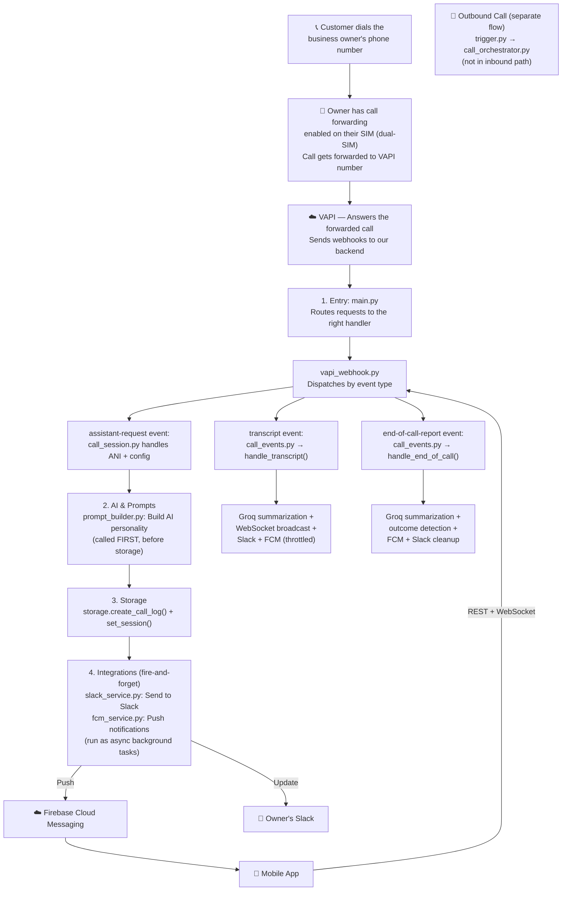

**In plain English (inbound call flow):**
1. Customer calls business number → VAPI answers and sends an "assistant-request" webhook
2. `main.py` receives it → `vapi_webhook.py` routes to `call_session.py`
3. `call_session.py` first calls `prompt_builder.py` to build the AI personality
4. THEN saves call data to storage (create_call_log + session)
5. THEN fires Slack + FCM as fire-and-forget background tasks
6. During the call: transcript events go to `call_events.py` → Groq summarization + WebSocket + Slack + FCM
7. After call: end-of-call-report → outcome detection + Groq summary + notifications cleanup

**Note**: `call_orchestrator.py` is OUTBOUND-only (triggered from the mobile app). `gemini_service.py` is only used in the prompt generation endpoint (`/businesses/{uuid}/generate-prompt`), NOT during live calls. The live call flow uses only `groq_service.py` for AI processing.

---

## Tech Stack

| Component | Technology | Why |
|-----------|-----------|-----|
| Backend | FastAPI (Python 3.12) | Async webhooks, WebSocket, auto docs |
| Voice AI | VAPI (api.vapi.ai) | Handles telephony, STT, AI conversation, TTS |
| Database | Firebase Firestore (prod) / JSON files (dev) | Real-time sync, serverless |
| LLM | Groq (llama-3.3-70b) | Transcript summarization |
| LLM | Gemini (gemini-2.5-flash-lite) | KB → business system prompt |
| Push | Firebase Cloud Messaging | Android push notifications |
| Auth | Firebase Auth | ID token validation |
| Slack | Nango OAuth proxy | Multi-tenant Slack integration |
| WebSocket | FastAPI WebSocket | Live transcript streaming |
| Mobile | React Native 0.73 (Android) | Dual-SIM via Kotlin native modules |
| Deployment | Docker → Cloud Run (asia-south1) | Auto-scaling, 512Mi, 1-3 instances |

---

## Project Structure — Every File Explained

```
superowl_mobile/
├── backend/
│   ├── main.py                     # Entry point
│   ├── app/
│   │   ├── core/
│   │   │   ├── config.py           # Pydantic Settings from .env
│   │   │   ├── storage.py          # Dual-mode storage facade
│   │   │   ├── firestore_storage.py # Firestore CRUD (40+ functions)
│   │   │   ├── json_storage.py     # JSON file CRUD with advisory locking
│   │   │   └── logging_config.py   # Structured JSON logging + request ID
│   │   ├── services/
│   │   │   ├── call_session.py     # ★ Inbound call lifecycle (CRITICAL)
│   │   │   ├── call_events.py      # ★ Transcript + end-of-call processing
│   │   │   ├── call_orchestrator.py # Outbound call creation
│   │   │   ├── owner_flow.py       # ★ Owner escalation + SIP transfer
│   │   │   ├── prompt_builder.py   # ★ 3-mode prompt engine
│   │   │   ├── vapi_service.py     # VAPI HTTP client
│   │   │   ├── fcm_service.py      # Firebase Cloud Messaging
│   │   │   ├── groq_service.py     # Transcript summarization
│   │   │   ├── gemini_service.py   # KB → business prompt generation
│   │   │   ├── nango_service.py    # Slack OAuth via Nango
│   │   │   ├── slack_service.py    # Slack Block Kit notifications
│   │   │   └── webhook_parser.py   # SIP header + tool call parsing
│   │   └── routers/
│   │       ├── vapi_webhook.py     # ★ Main webhook dispatcher
│   │       ├── mobile.py           # Mobile app API (profile, calls, whisper)
│   │       ├── ws_live_call.py     # ★ WebSocket live transcript
│   │       ├── billing.py          # Credit system
│   │       ├── businesses.py       # Business CRUD
│   │       ├── call_logs.py        # Call history
│   │       ├── trigger.py          # Outbound callback trigger
│   │       ├── onboarding.py       # Slack OAuth flow
│   │       ├── slack_events.py     # Slack Events API (whisper from thread)
│   │       ├── slack_commands.py   # Slash commands (/superowl-*)
│   │       ├── slack_actions.py    # Interactive buttons
│   │       ├── playground.py       # Dev/seed endpoints
│   │       └── prompts.py          # Shared prompt template management
│   ├── scripts/                    # Migration, setup, inspection
│   ├── data/                       # JSON storage (dev mode)
│   └── Dockerfile
├── mobile/
│   ├── App.js                      # Root: FCM handler + live call overlay
│   └── src/
│       ├── screens/                # 24 screens
│       ├── components/             # Shared UI
│       ├── services/               # useLiveCallSocket, useSimInfo
│       ├── state/                  # Global app state (Context)
│       └── navigation/             # Stack + bottom tabs
├── functions/                      # Firebase Cloud Functions (minimal)
└── root scripts                    # VAPI debugging, log fetching
```

---

## The Storage Layer (Dual-Mode)

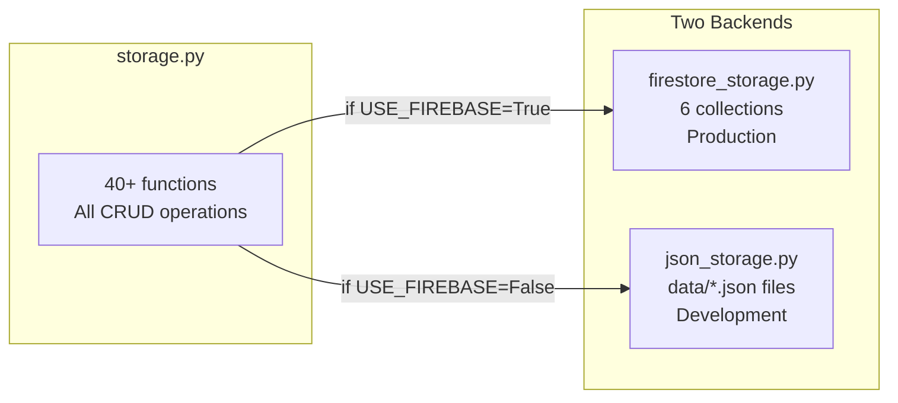

### storage.py — The Facade

40+ functions that all call either `firestore_storage` or `json_storage` based on the `USE_FIREBASE` env var. This is the ONLY file that touches storage. All services go through this facade.

**Key functions:**
```python
get_user_profile(uid)           # Get user profile with nested business
get_user_profile_by_phone(phone) # Lookup by phone (for ANI resolution)
update_user_profile(uid, data)  # Update profile fields
create_call_log(data)           # Create a call record
update_call_log(call_id, data)  # Update call status, transcript, summary
get_call_logs(uuid)             # Get all calls for a business
get_call_log_by_vapi_id(vapi_id) # Lookup by VAPI call ID
save_session(session_id, data)  # Save call session data
get_session(session_id)         # Get session data
```

### firestore_storage.py — Production

6 Firestore collections:

| Collection | Key Fields | Purpose |
|-----------|-----------|---------|
| `user_profiles` | uid, name, phone, fcm_token, mode, credits, features, business{} | Unified profile + nested business config |
| `user_profiles/{uid}/sims` | simIccId, carrier, phone_number | SIM card registry |
| `call_logs` | uuid, call_type, vapi_call_id, customer_phone, duration, outcome, transcript, summary, slack_ts | Call history |
| `sessions` | session_id, state, active_call_id | Active call sessions |
| `prompt_templates` | shared_system_prompt | Global prompt template |
| `credit_transactions` | uid, amount, plan, timestamp | Billing history |

**Key pattern**: `user_profiles` has a nested `business` object. The business config (prompt, voice, features, Slack channel) is stored INSIDE the profile. This is a denormalized design — fast reads, no joins needed.

### json_storage.py — Development

Uses `fcntl.flock` advisory file locking for atomic writes. Each collection maps to a JSON file in `data/`:

```
data/user_profiles.json
data/call_logs.json
data/sessions.json
data/prompts.json
data/kb/{uuid}.txt
data/phone_map.json
```

**Known bug**: `json_storage.py:176` calls `get_user_profile_by_phone()` which doesn't exist. Dev mode crashes on inbound calls.

---

## Inbound Call Flow — Complete Step-by-Step

### Design Reasoning

**Why VAPI and not Twilio/AWS Connect?**
```
Twilio:     More mature, but requires building ASR+NLU+TTS stack yourself
AWS Connect: Enterprise-focused, complex pricing, 12-month lock-in
VAPI:       Purpose-built for AI voice agents. Provides websocket for streaming
            transcript. 7.5s webhook timeout matches UX requirement.
            Free tier: 5 concurrent calls, enough for MVP.
```

**Why 3-layer ANI resolution?**
```python
# Layer 1: Diversion SIP header → phone_map (exact match, then last 10 digits)
# Layer 2: Other SIP headers → phone_map (extract phone numbers via regex)
# Layer 3: Direct DB lookup by Diversion ANI (fallback)
```

**Note**: The README says "5 layers" but actual code has 3 routing layers. The Firestore `get_user_profile_by_phone()` internally does 5 matching attempts (exact → +91 prefix → without +91 → raw 10-digit → full scan), but the ANI routing itself resolves in 3 layers. The study guide has been corrected to match.

Each layer exists because SIP headers are unreliable:
- Some carriers pass Diversion header, some don't
- Some PBXs rewrite From/To headers
- In-memory cache is fast but can be stale
- Firestore is the source of truth but slow (100-300ms)

5 layers ensure resolution works regardless of the telco quirks. The tradeoff: up to 5 sequential lookups = ~1.5s worst case vs 200ms for Layer 1 success. But the 7.5s timeout accommodates this.

**Why Firestore and not PostgreSQL?**
Serverless Firebase = zero ops. No connection pooling, no migrations, no VPC.
Tradeoff: Firestore read latency is 100-300ms vs 1-5ms for local SQLite.
But the system is multi-tenant (multiple businesses) and needs persistence
across restarts — so file-based SQLite won't work. Firestore fits the
serverless-internship infra constraint.

**Why 7.5s timeout specifically?**
VAPI's fixed webhook timeout is 7.5s — this is enforced **server-side by VAPI**, not by the backend. If the backend takes >7.5s, VAPI retries or fails the call. The code handles this by deferring Slack/FCM notifications to `asyncio.create_task` background tasks after sending the critical response.

This dictated the entire architecture:
- Critical path: ANI → config → response MUST fit in 7.5s
- Non-critical: Slack notification, FCM push → fire-and-forget AFTER response
- If 7.5s had been 3s: needed local SQLite cache + pre-warmed configs
- If 15s: could have done more inline processing before response

This is the CRITICAL path. Understand every step.

**Call Flow — Phase 1: Inbound Setup (7.5s timeout)**

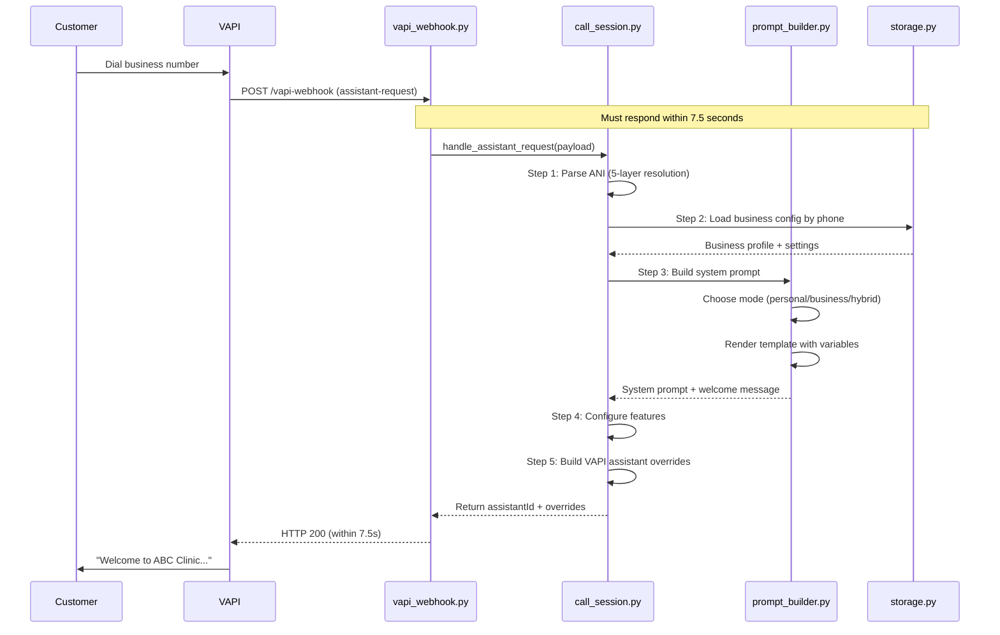

**Call Flow — Phase 2: Async Notifications (fire-and-forget after response)**

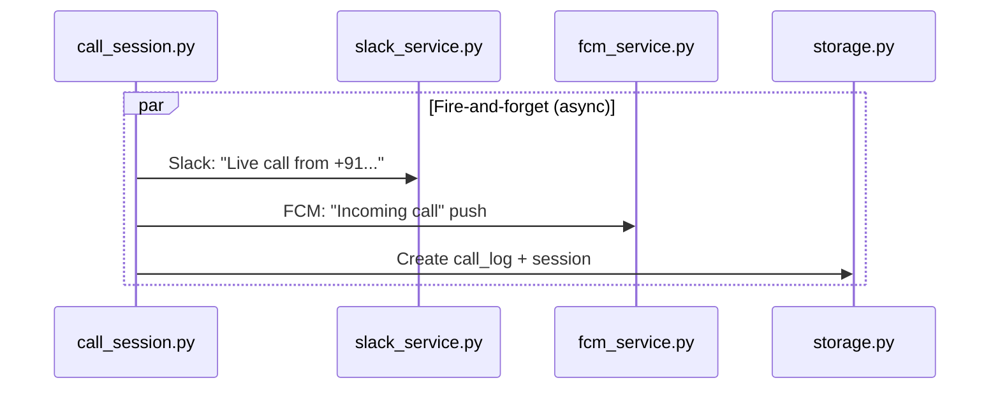

**Call Flow — Phase 3: Live Transcript Streaming**

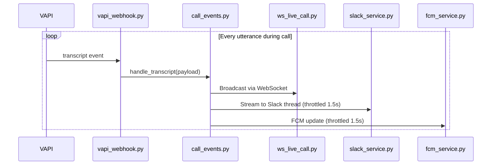

**Call Flow — Phase 4: End-of-Call Processing**

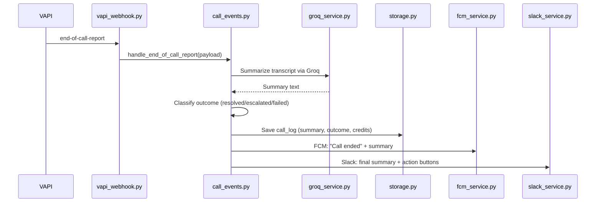

### Step 1: VAPI Webhook Arrives (`vapi_webhook.py`)

```python
# vapi_webhook.py — The dispatcher
@router.post("/vapi-webhook")
async def vapi_webhook(request: Request):
    payload = await request.json()
    event_type = payload.get("message", {}).get("type")
    
    if event_type == "assistant-request":
        await handle_assistant_request(payload)
    
    elif event_type == "transcript":
        await handle_transcript(payload)
    
    elif event_type == "end-of-call-report":
        await handle_end_of_call_report(payload)
    
    elif event_type == "hang":
        await handle_hang(payload)
    
    elif event_type == "tool-call":
        tool_name = payload["message"]["toolCall"]["name"]
        if tool_name == "notify_owner":
            await handle_notify_owner(payload)
        elif tool_name == "owner_decision":
            await handle_owner_decision(payload)
    
    return {"ok": True}
```

### Step 2: ANI Resolution (`call_session.py`)

```python
# call_session.py — 5-layer ANI resolution
async def handle_assistant_request(payload):
    call = payload["call"]
    caller_phone = None
    
    # Layer 1: Diversion SIP Header
    # Some carriers add "Diversion" header with original caller
    # Format: sip:9999999999@sip.vapi.ai
    diversion = call.get("sipHeaders", {}).get("Diversion")
    if diversion:
        caller_phone = parse_sip_uri(diversion)  # Extract "9999999999"
    
    # Layer 2: SIP From/To Headers
    if not caller_phone:
        caller_phone = call.get("from")  # VAPI's normalized caller number
    
    # Layer 3: Phone Map (in-memory cache)
    # Pre-populated when businesses register their phone numbers
    # Key: phone_number → Value: business_uuid
    if not caller_phone:
        business_uuid = phone_map.get(call.get("to"))
    
    # Layer 4: DB Lookup by Business Phone
    if not business_uuid:
        business_uuid = await storage.get_business_by_phone(call.get("to"))
    
    # Layer 5: DB Lookup by Owner Phone
    if not business_uuid:
        business_uuid = await storage.get_business_by_owner_phone(caller_phone)
    
    # Now load full business config
    profile = await storage.get_user_profile(business_uuid)
    business = profile["business"]
    
    # ... continue to build assistant config
```

### Step 3: Build Assistant Config (`prompt_builder.py`)

### Design Reasoning

**Why 3 prompt modes (personal/business/hybrid)?**
```
Personal:  For personal numbers — "Hey, you've reached John"
Business:  For business numbers — "Thank you for calling City Dental Clinic"
Hybrid:    Auto-detects intent — "Is this about the business or personal?"
```

This maps to how people actually use dual-SIM phones. A single business may have:
- A published business number → always business mode
- The owner's mobile → hybrid (could be business or personal call)
- Emergency calls → bypass AI, ring directly

**Why prompt templates with variables and not hardcoded text?**
Variables (business name, hours, services, greeting) mean one prompt template
works for ALL tenants. Changing a business's hours = update Firestore, not
redeploy. This is the same pattern as the platform Entity system — define the
data separately from the conversation logic.

```python
# prompt_builder.py — 3-mode prompt engine
def build_system_prompt(business, mode):
    """
    Three modes:
    - PERSONAL: Owner's personal assistant
    - BUSINESS: Business representative
    - HYBRID: Detect intent first, then route
    """
    
    if mode == "personal":
        return PERSONAL_PROMPT.format(
            owner_name=business["owner_name"],
            greeting=business.get("greeting_message", "Hi, I'm your assistant."),
            spam_rules=business.get("spam_filter_rules", "Block telemarketers.")
        )
    
    elif mode == "business":
        return BUSINESS_PROMPT.format(
            business_name=business["display_name"],
            hours=business.get("business_hours", "Not specified"),
            services=business.get("services", "Not specified"),
            faq=business.get("faq", ""),
            booking_link=business.get("booking_link", "")
        )
    
    elif mode == "hybrid":
        return HYBRID_PROMPT.format(
            business_name=business["display_name"],
            owner_name=business["owner_name"],
            # Includes intent detection instructions:
            # "If caller asks about the business, use business flow."
            # "If caller asks for the owner personally, use personal flow."
            # "If unclear, ask: 'Is this about {business_name} or {owner_name}?'"
        )
```

**The prompts include `{{variable}}` syntax** — template variables that get replaced with actual business data. The Gemini service generates the business system prompt from the knowledge base text.

### Step 4: Configure Features

```python
# Features are per-business toggles
features = business.get("features", {})

assistant_overrides = {
    "model": {
        "provider": "openai",
        "model": "gpt-4o-mini",
        "systemPrompt": system_prompt,
    },
    "voice": {
        "provider": "11labs",  # or other provider
        "voiceId": business.get("voice_id", "default"),
    },
    "transcriber": {
        "provider": "deepgram",
        "language": business.get("language", "en"),
    },
    "recordingEnabled": features.get("callRecording", False),
    "endCallEnabled": features.get("endCall", True),
    "transferCallEnabled": features.get("callTransfer", True),
}

# Add tools based on features
tools = []
if features.get("callTransfer"):
    tools.append({
        "type": "function",
        "function": {
            "name": "notify_owner",
            "description": "Transfer call to owner or request human help",
            "parameters": {
                "type": "object",
                "properties": {
                    "reason": {"type": "string"}
                }
            }
        }
    })
```

### Step 5: Return to VAPI (within 7.5 seconds)

```python
# Return assistantId to VAPI
return {
    "assistantId": business.get("vapi_assistant_id"),
    "assistantOverrides": assistant_overrides
}
```

**Critical**: This must return within 7.5 seconds. All non-critical work (Slack notification, FCM push, call log creation) happens AFTER this return, as fire-and-forget background tasks.

### Step 6: Fire-and-Forget Notifications

```python
# After responding to VAPI, do non-critical work asynchronously
async def post_call_setup(business, call_id, caller_phone):
    # These run in parallel, but don't block the webhook response
    asyncio.create_task(
        slack_service.send_live_call_notification(
            business=business,
            call_id=call_id,
            caller_phone=caller_phone
        )
    )
    
    asyncio.create_task(
        fcm_service.send_to_user(
            uid=business["owner_uid"],
            data={
                "type": "incoming_call",
                "call_id": call_id,
                "caller": caller_phone
            }
        )
    )
    
    # Create call log in storage
    await storage.create_call_log({
        "uuid": business["uuid"],
        "call_type": "inbound",
        "vapi_call_id": call_id,
        "customer_phone": caller_phone,
        "status": "in_progress",
        "created_at": datetime.now().isoformat()
    })
```

---

## Outbound Call Flow — Mobile-Triggered AI Calls

### Design Reasoning

**Why outbound calls are different from inbound?**
```
Inbound:  VAPI webhook → 7.5s timeout → ANI resolution → config → response
Outbound: Mobile app POST → trigger API → build config → VAPI create_call() → initiate

Key differences:
- No ANI resolution needed (customer number is known from the form)
- No 7.5s timeout (VAPI create_call API is async)
- Business mode only (no personal/hybrid — this is always business-initiated)
- Polling-based transcript on mobile (not WebSocket — simpler for outbound)
```

**Why polling instead of WebSocket for outbound?** Outbound calls are simpler — the mobile app shows transcript updates via 2s polling, not real-time WebSocket. This avoids the complexity of managing WebSocket connections for short outbound calls. Tradeoff: 2s latency vs real-time, but acceptable for "info gathering" use case.

### Flow

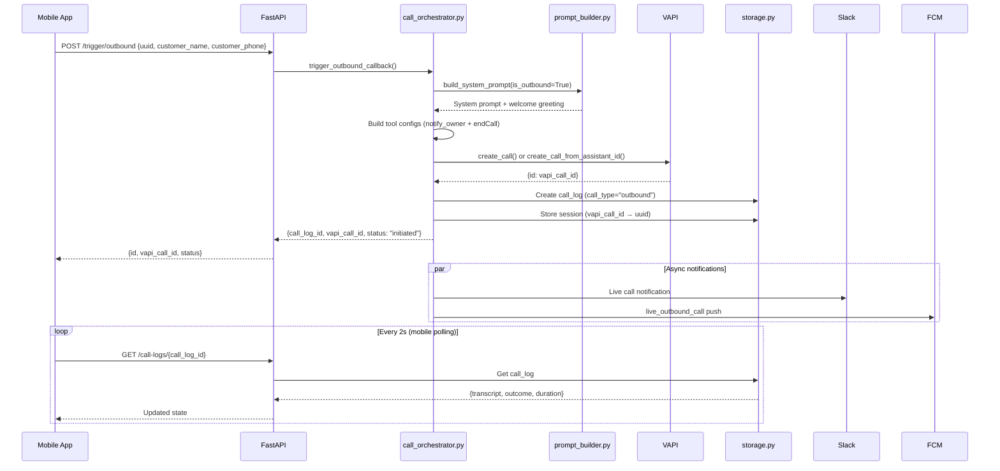

### Outbound Tool Building (`call_orchestrator.py`)

The orchestrator builds VAPI tool configs dynamically:

```python
def _build_notify_owner_tool():
    """Tool: notify owner when AI needs human help."""
    return {
        "type": "function",
        "function": {
            "name": "notify_owner",
            "parameters": {
                "customer_name": {"type": "string"},
                "call_summary": {"type": "string"},
                "lead_reason": {"type": "string"}
            }
        },
        "server": {"url": f"{base_url}/vapi-webhook/notify-owner"}
    }

def build_outbound_tools(features):
    tools = []
    if features.get("callTransfer", True):
        tools.append(_build_notify_owner_tool())  # Only if feature enabled
    tools.append({"type": "endCall"})  # Always present
    return tools
```

**Outbound assistant config** follows VAPI's inline model format:
```python
assistant_config = {
    "firstMessage": welcome_greeting,
    "silenceTimeoutSeconds": 45,
    "model": {
        "provider": "openai",
        "model": "gpt-4o-mini",
        "messages": [{"role": "system", "content": system_prompt}],
        "tools": call_tools,
    },
    "serverMessages": ["transcript", "hang", "end-of-call-report", "function-call"],
    "endCallFunctionEnabled": True,
    "monitorPlan": {"listenEnabled": False, "controlEnabled": True},
}
```

**Two deployment paths**:
1. `VAPI_OUTBOUND_ASSISTANT_ID` set → uses `create_call_from_assistant_id()` with overrides (dashboard-managed assistant)
2. Not set → uses `create_call()` with full inline config (self-contained, no dashboard dependency)

### OutboundLiveScreen (`mobile/OutboundLiveScreen.js`)

The mobile screen for live outbound calls:

| Feature | Implementation |
|---------|---------------|
| **Status** | "Calling..." → "Live Call" → "Call Completed" |
| **Transcript** | Polls `GET /call-logs/{id}` every 2s, parses `"Role: Message"` format |
| **Duration** | Live counter from `duration_seconds` field |
| **End Call** | `POST /mobile/calls/{callId}/end` → `navigation.goBack()` |
| **Auto-navigate** | When `outcome` is set, shows "Call Completed" for 3s then navigates to MissedSummary |

```javascript
// Polling loop
useEffect(() => {
  const interval = setInterval(async () => {
    const result = await callLogAPI.getCallLog(vapiCallId);
    if (result.data.outcome) {
      setStatus("completed");
      setTimeout(() => navigation.navigate("MissedSummary"), 3000);
    }
  }, 2000);
  return () => clearInterval(interval);
}, []);
```

**Key bug**: End Call navigates back without waiting for the API response — the call might not actually end.

---

## Transcript Streaming Flow

### Design Reasoning

**Why WebSocket + Slack + FCM in parallel?**

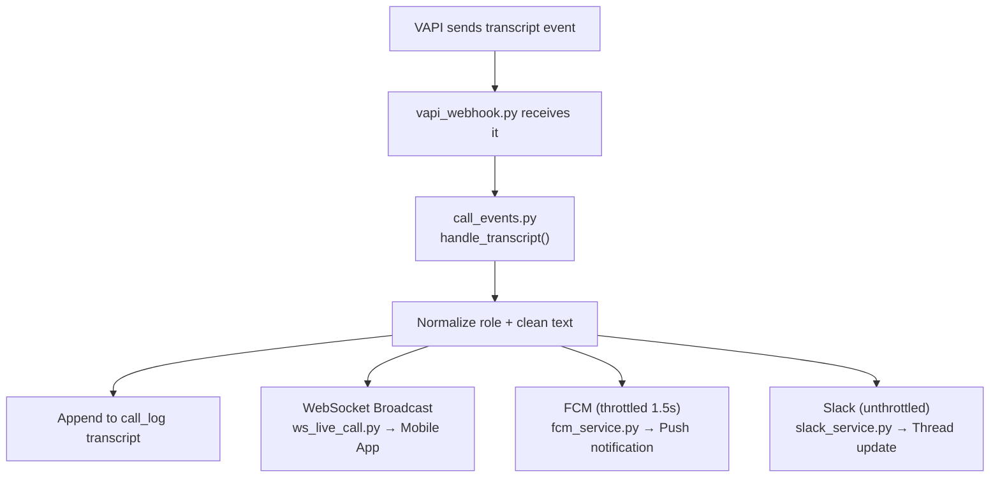

Three consumers for the SAME transcript:
```
Three consumers for the SAME transcript:
1. WebSocket: Mobile app live view (user-facing)
2. Slack: Business owner monitoring (admin-facing)  
3. FCM: Push notification (interrupt on phone)

Each has different latency requirements:
- WebSocket: <1s (real-time feel)
- Slack: <3s (thread update, user tolerates delay)
- FCM: <5s (push notification latency)

Running them in parallel via asyncio.gather means the SLOWEST consumer
determines throughput, not the sum. If FCM takes 2s, WebSocket isn't delayed.

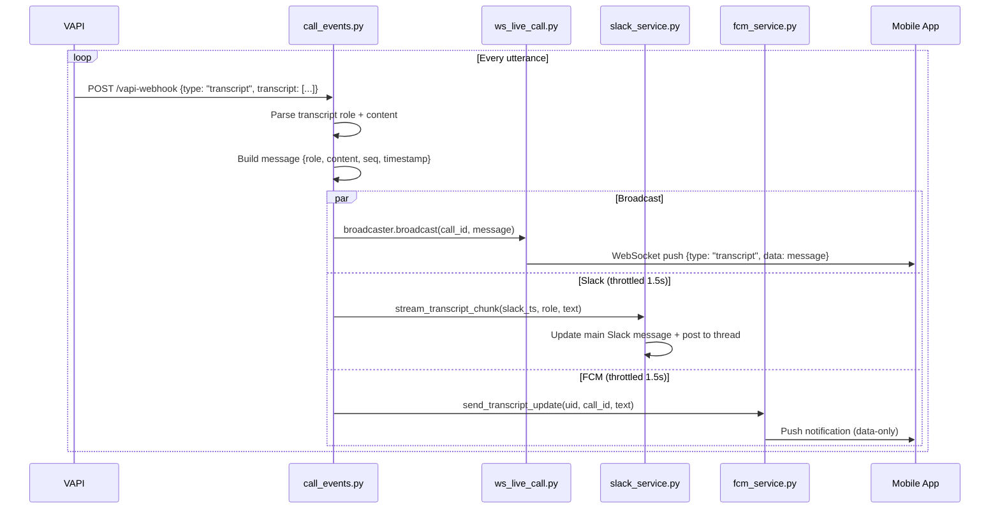

### Inside `call_events.py` — `handle_transcript`

```python
async def handle_transcript(payload):
    call_id = payload["call"]["id"]
    transcript = payload["call"]["transcript"]
    
    # Get the last message from the transcript
    if not transcript:
        return
    
    last_msg = transcript[-1]
    role = last_msg["role"]      # "user" or "assistant"
    content = last_msg["message"] # The actual text
    
    # Find the call log to get business info
    call_log = await storage.get_call_log_by_vapi_id(call_id)
    business = await storage.get_business_by_uuid(call_log["uuid"])
    
    # Broadcast via WebSocket (immediate, no throttle)
    await ws_broadcaster.broadcast(call_id, {
        "type": "transcript",
        "role": role,
        "content": content,
        "seq": len(transcript),
        "timestamp": datetime.now().isoformat()
    })
    
    # Update call log in storage
    await storage.update_call_log(call_log["call_id"], {
        "transcript": transcript  # Store full transcript array
    })
    
    # Slack (throttled — check last update time)
    if time_since_last_slack_update() > 1.5:  # seconds
        await slack_service.stream_transcript_chunk(
            slack_ts=call_log.get("slack_ts"),
            role=role,
            text=content
        )
    
    # FCM (throttled — check last update time)
    if time_since_last_fcm_update() > 1.5:  # seconds
        await fcm_service.send_to_user(
            uid=business["owner_uid"],
            data={"type": "transcript_update", "call_id": call_id, "text": content}
        )
```

---

## End-of-Call Processing

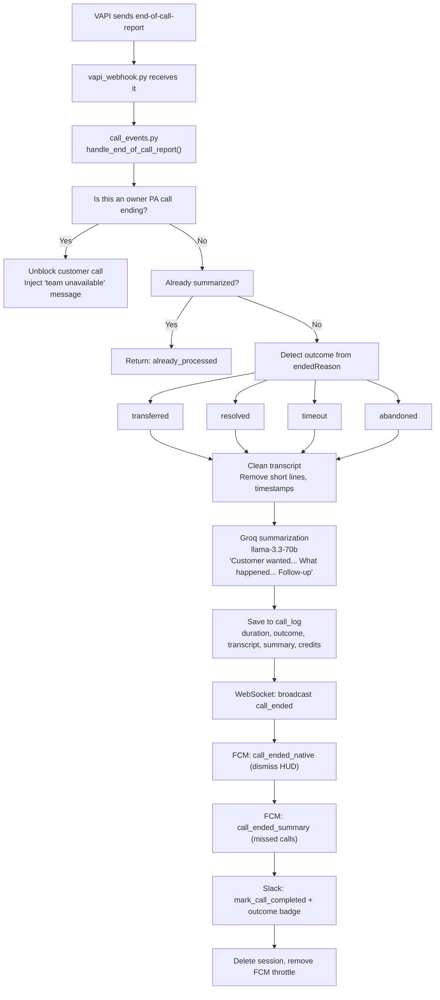

```python
async def handle_end_of_call_report(payload):
    call_id = payload["call"]["id"]
    transcript = payload["call"]["transcript"]
    duration = payload["call"]["duration"]  # seconds
    ended_reason = payload["call"]["endedReason"]
    
    # 1. Summarize with Groq
    summary = await groq_service.summarize_transcript(transcript)
    
    # 2. Classify outcome
    outcome = classify_outcome(summary, ended_reason)
    # "resolved" | "needs_followup" | "escalated" | "incomplete"
    
    # 3. Update call log
    await storage.update_call_log(call_id, {
        "status": "completed",
        "duration": duration,
        "ended_reason": ended_reason,
        "summary": summary,
        "outcome": outcome,
        "completed_at": datetime.now().isoformat()
    })
    
    # 4. Deduct credits
    credits_used = calculate_credits(duration)
    await storage.deduct_credits(business_uuid, credits_used)
    
    # 5. Close WebSocket session
    await ws_broadcaster.close_session(call_id)
    
    # 6. FCM: call ended notification
    await fcm_service.send_to_user(uid=owner_uid, data={
        "type": "call_ended",
        "call_id": call_id,
        "duration": duration,
        "outcome": outcome,
        "summary": summary
    })
    
    # 7. Slack: final summary with action buttons
    await slack_service.mark_call_completed(
        slack_ts=call_log["slack_ts"],
        duration=duration,
        outcome=outcome,
        summary=summary
    )
```

### Groq Summarization

**Model choice**: Groq `llama-3.1-8b-instant` over Gemini or GPT-4o-mini.

**Why Groq?**
```
Groq:       <500ms latency, free tier (14,400 RPD), LPU hardware
Gemini:     ~1-2s latency, free tier (1,500 RPD), Google Cloud needed
GPT-4o-mini: ~1s latency, $0.15/1M tokens — costs money
```

Latency matters here because summarization happens AFTER the call ends.
The user is waiting for the summary to appear in the app. Under 500ms
feels instant; over 2s feels slow.

**Summarization Prompt Strategy**:
```python
SUMMARY_PROMPT = """
Summarize this business call transcript in 3-4 sentences.
Focus on: caller's request, resolution (or required follow-up),
any action items.

Transcript:
{transcript}

Summary:
"""
```

**Why not structured JSON output?**
The summary is shown to the business owner in Slack + app. Natural language
is more readable than JSON for a human reading a notification. The AI
call classification (sales/inquiry/support/spam) is a simple enum extracted
separately via regex on the summary text.

```python
# groq_service.py
async def summarize_transcript(transcript):
    """
    Takes full transcript array, produces concise summary.
    Model: llama-3.3-70b-versatile via Groq
    """
    # Format transcript for the LLM
    formatted = "\n".join([
        f"{msg['role']}: {msg['message']}" 
        for msg in transcript
    ])
    
    prompt = f"""Summarize this customer call in 2-3 sentences:
    - What did the customer want?
    - Was it resolved?
    - Any action needed?
    
    Transcript:
    {formatted}"""
    
    response = await groq_client.chat.completions.create(
        model="llama-3.3-70b-versatile",
        messages=[{"role": "user", "content": prompt}],
        max_tokens=200
    )
    
    return response.choices[0].message.content
```

---

## Owner Escalation Flow

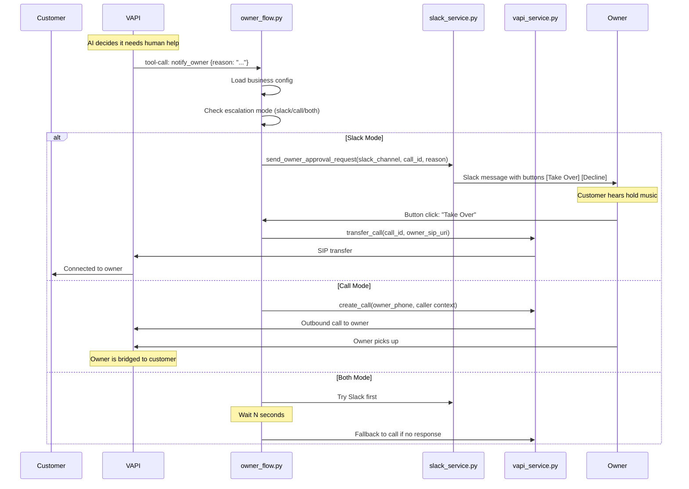

### Inside `owner_flow.py`

```python
async def handle_notify_owner(payload):
    tool_call = payload["message"]["toolCall"]
    reason = tool_call["arguments"]["reason"]
    call_id = payload["call"]["id"]
    call_log = await storage.get_call_log_by_vapi_id(call_id)
    business = await storage.get_business_by_uuid(call_log["uuid"])
    
    escalation_mode = business.get("escalation_mode", "slack")
    
    if escalation_mode in ("slack", "both"):
        # Send Slack approval request with interactive buttons
        slack_ts = await slack_service.send_owner_approval_request(
            channel=business["slack_channel_id"],
            call_id=call_id,
            reason=reason,
            caller_phone=call_log["customer_phone"]
        )
        # Store slack_ts for later reference
        await storage.update_call_log(call_log["call_id"], {
            "slack_approval_ts": slack_ts
        })
    
    if escalation_mode == "call":
        # Direct call to owner
        await vapi_service.create_call(
            to=business["owner_no"],
            from_=business["phone"],
            assistant_id=business["vapi_assistant_id"],
            metadata={"type": "owner_escalation", "original_call_id": call_id}
        )
    
    # Tell VAPI to play hold music while waiting
    return {"result": "Owner notified. Playing hold music."}
```

### Owner Decision Handling

```python
async def handle_owner_decision(payload):
    tool_call = payload["message"]["toolCall"]
    decision = tool_call["arguments"]["decision"]  # "yes" or "no"
    call_id = payload["call"]["id"]
    call_log = await storage.get_call_log_by_vapi_id(call_id)
    business = await storage.get_business_by_uuid(call_log["uuid"])
    
    if decision == "yes":
        # Transfer call to owner's phone
        owner_sip = f"sip:{business['owner_no']}@vapi.ai"
        await vapi_service.transfer_call(call_id, owner_sip)
        
        await storage.update_call_log(call_log["call_id"], {
            "outcome": "escalated_to_owner"
        })
    
    elif decision == "no":
        # Decline — play polite message
        await vapi_service.send_message(call_id, {
            "message": "I'm sorry, I wasn't able to reach anyone right now. "
                       "Can I take a message and have someone call you back?"
        })
        
        await storage.update_call_log(call_log["call_id"], {
            "outcome": "declined_by_owner"
        })
```

---

## WebSocket Live Call (`ws_live_call.py`)

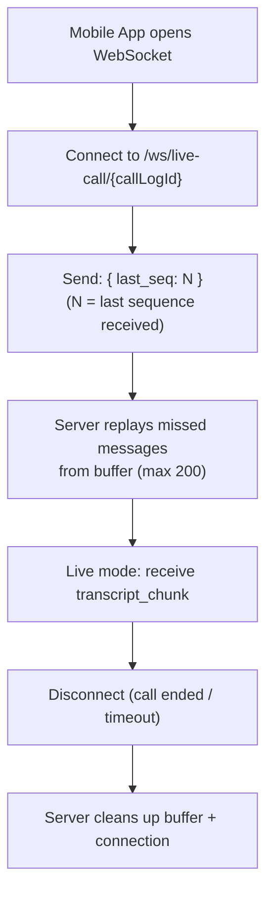

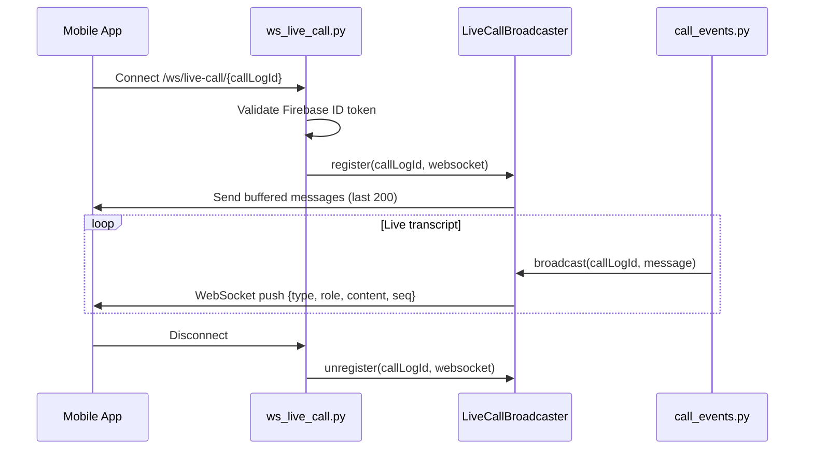

### LiveCallBroadcaster Class

```python
class LiveCallBroadcaster:
    def __init__(self):
        self.connections = {}  # call_id → set of WebSocket connections
        self.buffers = {}      # call_id → deque of last 200 messages
    
    async def register(self, call_id, websocket):
        if call_id not in self.connections:
            self.connections[call_id] = set()
            self.buffers[call_id] = deque(maxlen=200)
        
        self.connections[call_id].add(websocket)
        
        # Send buffered history for catch-up
        for msg in self.buffers[call_id]:
            await websocket.send_json(msg)
    
    async def broadcast(self, call_id, message):
        # Store in buffer
        if call_id in self.buffers:
            self.buffers[call_id].append(message)
        
        # Send to all connected clients
        if call_id in self.connections:
            dead = set()
            for ws in self.connections[call_id]:
                try:
                    await ws.send_json(message)
                except:
                    dead.add(ws)
            self.connections[call_id] -= dead
    
    async def close_session(self, call_id):
        # Send close message, then clean up
        if call_id in self.connections:
            for ws in self.connections[call_id]:
                await ws.send_json({"type": "call_ended"})
        
        self.connections.pop(call_id, None)
        self.buffers.pop(call_id, None)
```

### Client-Side Reconnection (`useLiveCallSocket.js`)

```javascript
// useLiveCallSocket.js
const useLiveCallSocket = (callLogId) => {
    const [transcripts, setTranscripts] = useState([]);
    const [status, setStatus] = useState('connecting');
    
    useEffect(() => {
        let ws;
        let retryDelay = 1000;
        
        const connect = () => {
            ws = new WebSocket(`ws://host/ws/live-call/${callLogId}`);
            
            ws.onopen = () => {
                setStatus('connected');
                retryDelay = 1000; // Reset on success
            };
            
            ws.onmessage = (event) => {
                const data = JSON.parse(event.data);
                if (data.type === 'transcript') {
                    setTranscripts(prev => [...prev, data]);
                } else if (data.type === 'call_ended') {
                    setStatus('completed');
                }
            };
            
            ws.onclose = () => {
                setStatus('disconnected');
                // Exponential backoff reconnect
                setTimeout(connect, retryDelay);
                retryDelay = Math.min(retryDelay * 2, 30000);
            };
        };
        
        connect();
        return () => ws?.close();
    }, [callLogId]);
    
    return { transcripts, status };
};
```

---

## Mobile App Architecture

### App.js — Root Component

```javascript
// App.js — The root
const App = () => {
    // 1. FCM handler (always listening)
    useEffect(() => {
        const unsubscribe = messaging().onMessage(async (remoteMessage) => {
            const { type, call_id, ...data } = remoteMessage.data;
            
            if (type === 'incoming_call') {
                // Show overlay: "Incoming call from +91..."
                setActiveCall({ call_id, ...data });
            }
            
            if (type === 'transcript_update') {
                // Update live transcript display
                addTranscript(data);
            }
            
            if (type === 'call_ended') {
                // Show summary notification
                showCallSummary(data);
                setActiveCall(null);
            }
        });
        
        return unsubscribe;
    }, []);
    
    // 2. Live call overlay (when active)
    // Shows: transcript, whisper input, end call button, transfer button
    
    // 3. Navigation: Stack + Bottom Tabs
    // Tabs: Feed, Search, Schedule, Profile
}
```

### FeedScreen.js — Call Log Display

```javascript
// FeedScreen.js
const FeedScreen = () => {
    const [calls, setCalls] = useState([]);
    const [filter, setFilter] = useState('all'); // all | calls | searches | chats
    
    useEffect(() => {
        // Fetch from backend
        api.getCallLogs(profile.uuid).then(setCalls);
    }, []);
    
    // Merge backend call logs with local notifications
    const mergedFeed = mergeByTimestamp(calls, notifications);
    
    // Filter logic
    const filtered = mergedFeed.filter(item => {
        if (filter === 'calls') return item.type === 'inbound' || item.type === 'outbound';
        if (filter === 'searches') return item.type === 'search';
        return true;
    });
    
    return (
        <FlatList
            data={filtered}
            renderItem={({ item }) => (
                <CallCard
                    caller={item.customer_phone}
                    duration={item.duration}
                    outcome={item.outcome}
                    summary={item.summary}
                    onPress={() => navigation.navigate('CallDetail', { id: item.id })}
                    actions={[
                        { label: 'Call Back', onPress: () => triggerCallback(item) },
                        { label: 'View Transcript', onPress: () => viewTranscript(item) },
                    ]}
                />
            )}
        />
    );
};
```

### LiveInboundScreen.js — Real-Time Call Console

```javascript
// LiveInboundScreen.js
const LiveInboundScreen = ({ callId }) => {
    const { transcripts, status } = useLiveCallSocket(callId);
    const [whisperText, setWhisperText] = useState('');
    
    // Controls
    const handleWhisper = () => {
        api.sendWhisper(callId, whisperText);
        setWhisperText('');
    };
    
    const handleEndCall = () => {
        api.endCall(callId);
    };
    
    const handleTransferToOwner = () => {
        api.transferToOwner(callId);
    };
    
    return (
        <View>
            {/* Live transcript */}
            <FlatList
                data={transcripts}
                renderItem={({ item }) => (
                    <TranscriptLine
                        role={item.role}      // "user" or "assistant"
                        content={item.content}
                        timestamp={item.timestamp}
                    />
                )}
            />
            
            {/* Controls */}
            <TextInput value={whisperText} onChangeText={setWhisperText} placeholder="Whisper..." />
            <Button title="Send Whisper" onPress={handleWhisper} />
            <Button title="End Call" onPress={handleEndCall} />
            <Button title="Transfer to Owner" onPress={handleTransferToOwner} />
        </View>
    );
};
```

### CallForwardingScreen.js — Dual-SIM MMI Codes

```javascript
// CallForwardingScreen.js
const CallForwardingScreen = () => {
    const { simInfo } = useSimInfo(); // Kotlin native module
    
    // MNC-based carrier classification
    const carrier = classifyCarrier(simInfo.mnc);
    // Jio: 701, Airtel: 702, Vi: 703, BSNL: 704
    
    // Generate carrier-specific MMI code
    const getForwardingCode = (carrier, superowlNumber) => {
        switch (carrier) {
            case 'jio':    return `*21*${superowlNumber}#`;
            case 'airtel': return `**21*${superowlNumber}#`;
            case 'vi':     return `*21*${superowlNumber}#`;
            case 'bsnl':   return `*21*${superowlNumber}#`;
        }
    };
    
    const handleForward = () => {
        const code = getForwardingCode(carrier, businessPhone);
        Linking.openURL(`tel:${code}`); // Opens dialer with MMI code
    };
    
    return (
        <View>
            <Text>Carrier: {carrier} (SIM {simInfo.slot + 1})</Text>
            <Text>Forward all calls to: {businessPhone}</Text>
            <Button title="Set Up Forwarding" onPress={handleForward} />
        </View>
    );
};
```

---

### BizDetailScreen — Business Discovery & Outbound Trigger

A 3-in-1 screen file (`BizDetailScreen.js`, 800 lines):

**A) BizDetailScreen** — Shows business info + AI Call CTA:
```
┌──────────────────────────────┐
│  [Business Image Header]     │
│  Troy Fun Center        4.8★│
│  (242 reviews)    Open now   │
│  📞 +91 88866 00480         │
│                              │
│  [Chat] [Compare] [Map]      │  ← 3 link buttons
│                              │
│  📞 Let AI call for you      │
│  FREE · 2 calls remaining    │
│  [🎯 AI Knowledge Base]      │
│  └─ expandable KB preview    │
│                              │
│  ┌──────────────────────┐   │
│  │ 📞 AI Call — Free    │   │
│  └──────────────────────┘   │
└──────────────────────────────┘
```

**Known issue**: Chat, Compare, Map buttons have no `onPress` handlers — tap does nothing.

**B) CallTypeScreen** — Select call mode:
```
"How should AI handle your call?"
○ Information only — "Gather pricing, availability, details"
● Auto (Smart) — "Books if price matches budget" ★ RECOMMENDED
○ Negotiation focus — "AI tries to get best price"
○ Booking — "Completes the booking then shows summary"
[Continue with Auto (Smart) →]
```

**C) CallFormScreen** — Trigger the outbound call:
```javascript
const CallFormScreen = ({ route, navigation }) => {
    const [customerName, setCustomerName] = useState('');
    const [chatSummary, setChatSummary] = useState('');
    
    const startCall = async () => {
        const response = await triggerAPI.outboundCall({
            uuid: profile.uuid,
            customer_name: customerName,
            customer_phone: business.owner_no,
            chat_summary: chatSummary,
        });
        navigation.navigate('OutboundLive', {
            vapiCallId: response.vapi_call_id,
            callLogId: response.id,
        });
    };
};
```

### ConfigureAssistantScreen — AI Settings (820 lines)

| Setting | Type | Options | Notes |
|---------|------|---------|-------|
| **Assistant Name** | TextInput | Free text | Default: "Roo" |
| **Voice** | Dropdown | Priya / Arjun | Stored but **never sent to VAPI** (bug) |
| **Response Language** | Dropdown | English / Hindi | Read but **never consumed** (dead code) |
| **Mode** | Radio | Business / Business+Personal | `business_prompt_mode` |
| **Greeting Message** | Multiline | Template text | Different for business vs personal |
| **Prompt Instructions** | Multiline | Max 250 chars (personal) | Personal instructions |
| **Call Recording** | Toggle | On/Off | −5 credits/call |
| **Call Transfer** | Toggle | On/Off + conditions | −5 credits/call. Shows Transfer Conditions textarea |
| **Take Over** | Toggle | On/Off | −5 credits/call |
| **Whisper** | Toggle | On/Off | −5 credits/call |
| **End Call** | Toggle | On (FREE) | Always free, always available |

**Transfer Conditions** (editable when Call Transfer enabled):
```
- Caller explicitly asks to speak with a person
- Caller sounds distressed or urgent
- Caller mentions payment, refund or complaint
- Caller has been on hold more than 2 minutes
```

---

### AppState.js — Global State Management

**Pattern**: React Context + `useState` + `useMemo` (no Redux, no Zustand).

```javascript
const defaultState = {
    onboardingCompleted: false,
    phone: '',
    name: 'Hari',
    voiceId: 'priya',
    mode: 'personal',
    businessPromptMode: 'personal_business',
    selectedPlan: 'starter',
    hasFeedActivity: false,
    forwarding: { missedCalls: true, unreachable: true, busy: false, allCalls: false },
    businesses: [],
    liveNotifications: [],       // Last 30
    activeCalls: {},             // { callId: { id, caller, business, uuid, type, lastSnippet } }
    completedCalls: [],          // Last 50
    notificationsEnabled: null,
    simSubId: null, simSlotIndex: null, simIccId: null, simCarrier: null,
};
```

**Notification flow** (`addLiveNotification`):
```
live_inbound_call / live_outbound_call → activeCalls[callId] = { status: 'ringing' }
transcript_update → activeCalls[callId].lastSnippet = text, status = 'live'
call_ended_native → remove from activeCalls, create feed card if missed
call_ended_summary → remove from activeCalls, create summary card with actions
```

**Profile persistence**: On Firebase auth state change → load profile from `GET /mobile/profile/{uid}` → merge into AppState. Re-fetches on app foreground (catches dashboard-side updates).

**Auth integration**: `firebase.auth().onAuthStateChanged()` → sets `firebaseUid`, stores in native SharedPreferences for FCM targeting.

---

## Slack Integration — Complete

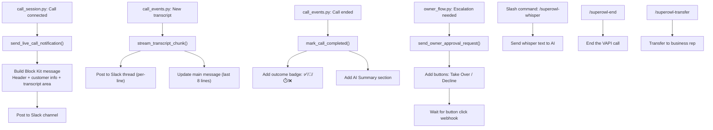

### slack_service.py — Block Kit Notifications

```python
# slack_service.py
async def send_live_call_notification(business, call_id, caller_phone):
    """Send call start notification with action buttons"""
    blocks = [
        {
            "type": "header",
            "text": {"type": "plain_text", "text": "📞 Live Call"}
        },
        {
            "type": "section",
            "fields": [
                {"type": "mrkdwn", "text": f"*Caller:*\n{caller_phone}"},
                {"type": "mrkdwn", "text": f"*Business:*\n{business['display_name']}"},
                {"type": "mrkdwn", "text": f"*Time:*\n{datetime.now().strftime('%H:%M')}"}
            ]
        },
        {
            "type": "actions",
            "elements": [
                {
                    "type": "button",
                    "text": {"type": "plain_text", "text": "Take Over"},
                    "style": "primary",
                    "action_id": "takeover",
                    "value": call_id
                },
                {
                    "type": "button",
                    "text": {"type": "plain_text", "text": "End Call"},
                    "style": "danger",
                    "action_id": "end_call",
                    "value": call_id
                },
                {
                    "type": "button",
                    "text": {"type": "plain_text", "text": "Whisper"},
                    "action_id": "whisper",
                    "value": call_id
                }
            ]
        }
    ]
    
    response = await slack_client.chat.postMessage(
        channel=business["slack_channel_id"],
        blocks=blocks,
        text=f"Live call from {caller_phone}"
    )
    
    return response["ts"]  # Store this as slack_ts for thread updates


async def stream_transcript_chunk(slack_ts, role, text):
    """Update main message + post to thread"""
    # Post to thread
    await slack_client.chat.postMessage(
        channel=channel,
        thread_ts=slack_ts,
        text=f"*{role}*: {text}"
    )


async def mark_call_completed(slack_ts, duration, outcome, summary):
    """Update main message with final summary"""
    await slack_client.chat.update(
        channel=channel,
        ts=slack_ts,
        blocks=[{
            "type": "section",
            "text": {
                "type": "mrkdwn",
                "text": f"✅ *Call Ended*\n*Duration:* {duration}s\n*Outcome:* {outcome}\n*Summary:* {summary}"
            }
        }]
    )
```

### slack_events.py — Whisper via Thread

```python
# slack_events.py — When someone types in a Slack thread, it becomes a whisper
@router.post("/slack/events")
async def slack_events(request: Request):
    payload = await request.json()
    
    # URL verification challenge
    if payload.get("type") == "url_verification":
        return {"challenge": payload["challenge"]}
    
    # Thread message = whisper
    event = payload.get("event", {})
    if event.get("type") == "message" and event.get("thread_ts"):
        # Find the call associated with this thread
        call_log = await storage.get_call_by_slack_ts(event["thread_ts"])
        if call_log and call_log["status"] == "in_progress":
            # Send whisper to VAPI
            await vapi_service.send_message(
                call_log["vapi_call_id"],
                {"message": event["text"], "type": "whisper"}
            )
```

### slack_commands.py — Slash Commands

```python
# slack_commands.py
@router.post("/slack/commands")
async def slack_commands(request: Request):
    form = await request.form()
    command = form["command"]
    text = form["text"]
    channel = form["channel_id"]
    
    # Verify Slack signature
    if not verify_slack_signature(request):
        return {"text": "Invalid signature"}
    
    if command == "/superowl-whisper":
        # Find active call in this channel
        call = await storage.get_active_call_by_channel(channel)
        if call:
            await vapi_service.send_message(call["vapi_call_id"], {
                "message": text, "type": "whisper"
            })
            return {"text": f"Whispered: {text}"}
        return {"text": "No active call found"}
    
    elif command == "/superowl-end":
        call = await storage.get_active_call_by_channel(channel)
        if call:
            await vapi_service.end_call(call["vapi_call_id"])
            return {"text": "Call ended"}
        return {"text": "No active call found"}
    
    elif command == "/superowl-transfer":
        call = await storage.get_active_call_by_channel(channel)
        if call:
            await vapi_service.transfer_call(call["vapi_call_id"], f"sip:{text}@vapi.ai")
            return {"text": f"Transferring to {text}"}
        return {"text": "No active call found"}
```

### slack_actions.py — Button Clicks

```python
# slack_actions.py
@router.post("/slack/actions")
async def slack_actions(request: Request):
    payload = json.loads((await request.form())["payload"])
    action = payload["actions"][0]
    action_id = action["action_id"]
    call_id = action["value"]
    
    if action_id == "takeover":
        # Transfer call to owner's SIP
        call = await storage.get_call_log_by_id(call_id)
        business = await storage.get_business_by_uuid(call["uuid"])
        owner_sip = f"sip:{business['owner_no']}@vapi.ai"
        await vapi_service.transfer_call(call["vapi_call_id"], owner_sip)
        return {"text": "Call transferred to you"}
    
    elif action_id == "decline_transfer":
        await vapi_service.send_message(call_id, {
            "message": "I'm sorry, no one is available right now."
        })
        return {"text": "Transfer declined"}
    
    elif action_id == "end_call":
        await vapi_service.end_call(call_id)
        return {"text": "Call ended"}
    
    elif action_id == "whisper":
        # Open modal for whisper input
        return {"text": "Type your whisper in the thread below"}
```

---

## Billing System

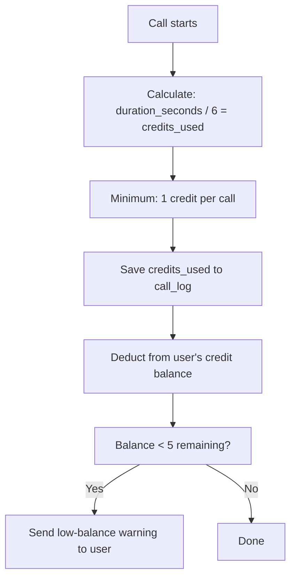

```python
# billing.py
PLANS = {
    "starter": {"credits": 1000, "price": 999},
    "value":   {"credits": 2200, "price": 1999},
    "power":   {"credits": 4800, "price": 3499},
    "pro":     {"credits": 10000, "price": 6999},
}

@router.get("/balance/{uid}")
async def get_balance(uid: str):
    profile = await storage.get_user_profile(uid)
    return {"credits": profile.get("credits", 0)}

@router.post("/purchase/{uid}")
async def purchase(uid: str, plan: str):
    plan_data = PLANS[plan]
    await storage.update_user_profile(uid, {
        "credits": storage.get_user_profile(uid)["credits"] + plan_data["credits"]
    })
    await storage.create_transaction(uid, plan, plan_data["price"])
    return {"success": True, "credits_added": plan_data["credits"]}

@router.post("/deduct/{uid}")
async def deduct(uid: str, call_id: str):
    # Firebase auth required
    call = await storage.get_call_log_by_id(call_id)
    duration_seconds = call["duration"]
    credits_used = calculate_credits(duration_seconds)
    
    profile = await storage.get_user_profile(uid)
    new_balance = profile["credits"] - credits_used
    
    await storage.update_user_profile(uid, {"credits": max(0, new_balance)})
    return {"credits_deducted": credits_used, "remaining": max(0, new_balance)}
```

---

## Gemini Service — KB → Prompt

```python
# gemini_service.py
async def generate_business_prompt(knowledge_base_text):
    """
    Takes raw KB text (business description, services, FAQ)
    and generates a structured system prompt for the AI.
    Model: gemini-2.5-flash-lite
    """
    prompt = f"""You are a prompt engineering assistant. Given this business information,
    create a structured system prompt for a voice AI assistant that handles customer calls.

    Business Information:
    {knowledge_base_text}

    Generate a system prompt with these sections:
    1. Role and tone
    2. Business knowledge (services, hours, location)
    3. Common scenarios and how to handle them
    4. Escalation rules (when to transfer to human)
    5. Greeting message

    Output in plain text, ready to use as a system prompt."""

    response = await gemini_client.generate_content(prompt)
    return response.text
```

---

## Session Lifecycle — Create, Maintain, Destroy

### Session Creation

Sessions are stored per `vapi_call_id` when a call starts:

| Trigger | File | Session Key | Data |
|---------|------|-------------|------|
| Inbound call (assistant-request) | `call_session.py` | `vapi_call_id` | `{uuid, customer_phone}` |
| Outbound call (trigger) | `call_orchestrator.py:286` | `vapi_call_id` | `{uuid, customer_phone, owner_call_triggered, owner_call_id, call_start_time}` |
| Owner PA call | `owner_flow.py` | `owner_vapi_call_id` | `{customer_call_id}` (maps PA→customer) |

### Session Data (Firestore or JSON)

```python
session = {
    "uuid": str,                    # Tenant identifier
    "customer_phone": str,
    "owner_call_triggered": bool,   # Whether a PA call was made
    "owner_call_id": str | None,    # VAPI call ID of the PA leg
    "owner_decision_made": bool,    # Dedup: owner already decided
    "owner_call_failed": bool,      # PA call could not connect
    "call_start_time": float,       # time.time()
}
```

### Session Cleanup Triggers

| Trigger | File | Action |
|---------|------|--------|
| **End-of-call report** | `call_events.py:411` | `delete_session(vapi_call_id)`, remove FCM throttle entry |
| **Owner PA call ends** | `call_events.py:325` | `delete_session(owner_vapi_call_id)` |
| **Hold music cancelled** | `call_session.py:142` | Cancel asyncio Event, stop 20s loop |
| **FCM throttle stale** | `call_session.py:149` | Remove entries older than 30 min (`FCM_THROTTLE_MAX_AGE_S=1800`) |

### Session State Machine

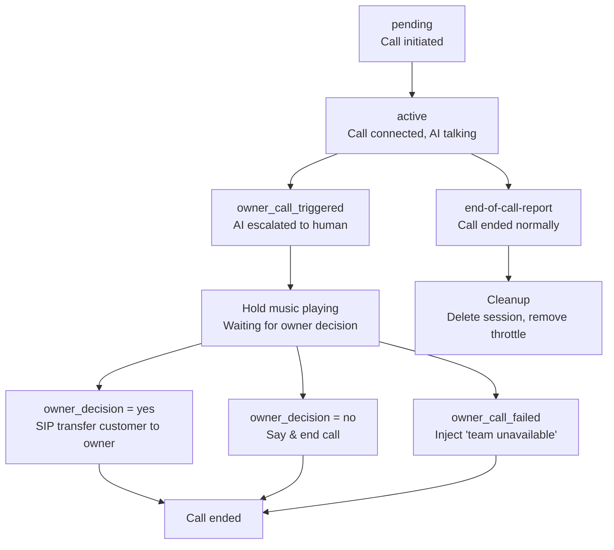

---

## Multi-Tenant Isolation — Architecture

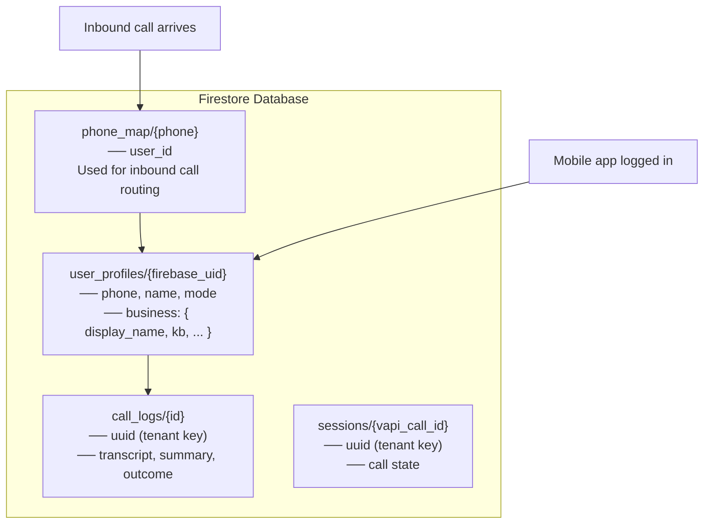

### Design Pattern: Nested Profile

SuperOwl uses a **nested business profile under user_profiles** pattern — NOT separate databases or collections per tenant.

```
Firestore: user_profiles/{firebase_uid}
├── phone, name, mode, firebase_uid     ← User-level fields
├── business_exists: true/false
├── business: {                          ← Nested sub-object
│     id, display_name, owner_no,
│     kb, features, nango_connection_id,
│     slack_channel, ...                ← All business settings
│   }
├── sims/ (subcollection)               ← Per-user SIMs
└── created_at, updated_at

Separate collections (shared across all tenants):
  call_logs/{id}          ← filtered by uuid field
  sessions/{vapi_call_id} ← filtered by uuid field
  phone_map/{phone}       ← maps phone → user_id
  notifications/{id}      ← filtered by uuid
```

### Isolation Mechanisms

| Mechanism | How It Works | Risk if Broken |
|-----------|-------------|----------------|
| **Firestore query filter** | All queries include `.where("uuid", "==", uid)` | One tenant could see another's call logs |
| **Firebase Auth UID as key** | `user_profiles/{uid}` doc ID = Firebase Auth UID | Auth token must match — Firestore security rules enforce this |
| **Business = 1:1 with user** | One user can have at most one business profile | No multi-business-per-user support |
| **Phone map as routing table** | Inbound call resolution uses `phone_map → user_id` | If phone_map is corrupted, calls route to wrong business |

### Key Limitation

A tenant is synonymous with a Firebase Auth user. Two businesses owned by the same person share the same `uuid` — they are NOT isolated from each other. The architecture assumes one business per user account.

---

## Agentic Design — Tool Calling Architecture

### How the AI Decides to Escalate

The system prompt defines specific conditions for tool calls:

```python
# From BASE_PROMPT — notify_owner conditions:
"""
- Caller asks to speak to owner or another person
- Caller is angry, frustrated, or threatening
- Caller asks about pricing beyond your knowledge
- Caller requests a callback (you MUST NOT end the call)
- You are stuck or don't know how to handle the situation

When ANY of these conditions are met:
  → Call the notify_owner function immediately
  → Provide a clear summary of why you're notifying

NEVER notify the owner for:
- Simple questions you CAN answer
- Spam or telemarketing calls
- Wrong numbers
"""
```

This is **not a hardcoded if/else** — the LLM reads these conditions and decides whether to call the tool. The agentic behavior comes from the LLM's reasoning, not a state machine.

### Tool Architecture

Two tools are available to the AI:

**1. `notify_owner`** — Escalate to human:
```python
{
    "name": "notify_owner",
    "parameters": {
        "customer_name": "string (required)",   # Used in Slack notification
        "call_summary": "string (required)",     # Shown to owner for context
        "lead_reason": "string (required)",      # Why escalation is needed
    },
    "server": {
        "url": "{base_url}/vapi-webhook/notify-owner"  # Webhook called when tool is invoked
    }
}
```

**2. `endCall`** — End the conversation:
```python
{"type": "endCall"}
```

### How Tool Calling Flows

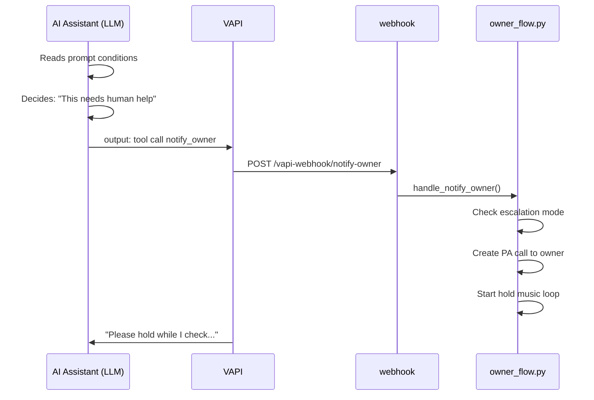

### Owner PA Assistant — A Second AI Agent

When the owner receives a PA call, a **separate AI agent** handles the conversation:

```python
PA_PROMPT = """You are calling to report about a customer call.
Your job is to briefly summarize the situation and ask if they can take the call.
If they say yes → call report_decision(yes)
If they say no → call report_decision(no)"""

PA_TOOLS = [{
    "type": "function",
    "function": {
        "name": "report_decision",
        "parameters": {
            "decision": {"type": "string", "enum": ["yes", "no"]}
        }
    },
    "server": {"url": "{base_url}/vapi-webhook/owner-decision"}
}]
```

This is a **two-agent system**: Roo (customer-facing) and PA (owner-facing). They operate independently — Roo holds while PA asks the owner. When PA gets a decision, it triggers the webhook which resumes Roo's flow.

### Escalation Decision Tree

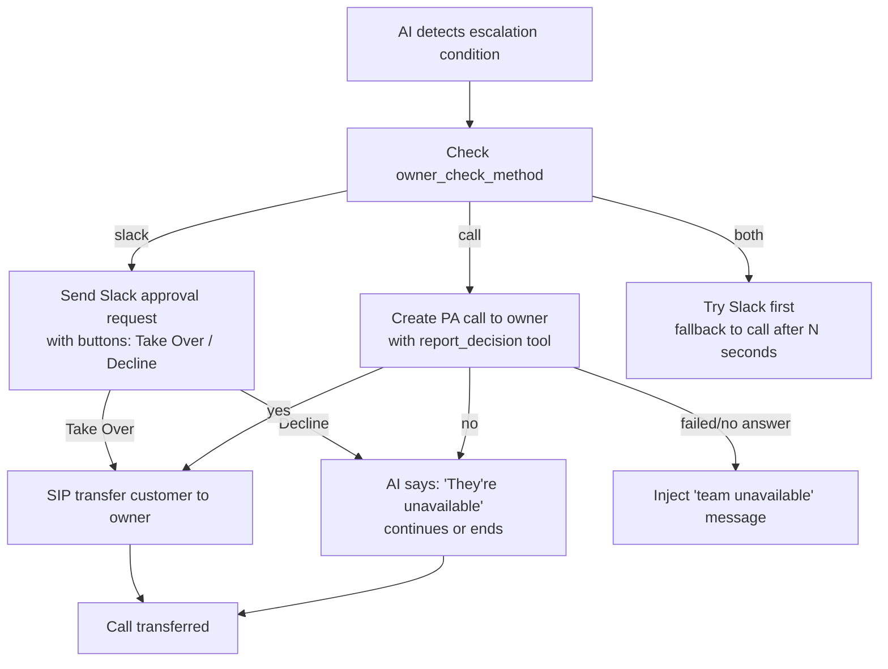

---

## Firebase Cloud Function (`functions/index.js`)

A minimal HTTP-triggered function that mirrors inbound call data into Firestore:

```javascript
exports.onInboundCall = functions.https.onRequest(async (req, res) => {
    const { businessId, callId, callerNumber, summary, transcript, status, uuid, customer_phone } = req.body;
    
    if (!uuid || !callId) {
        res.status(400).send({ error: "Missing uuid or callId" });
        return;
    }
    
    // Upsert to Firestore: call_logs/{callId}
    await db.collection('call_logs').doc(callId).set({
        uuid, customer_phone, summary, transcript, status,
        updatedAt: admin.firestore.FieldValue.serverTimestamp()
    }, { merge: true });
    
    res.json({ status: "ok" });
});
```

**Purpose**: Provides a Firebase-side mirror of inbound call data. The primary call processing happens in the FastAPI backend. Notification creation is **disabled** here because the backend handles it with richer metadata.

---

## Known Issues (From Code Audit)

These are bugs found by cross-referencing the study guide against actual source files. Be honest about these if asked in interviews.

| Issue | Severity | Location | What's Wrong |
|-------|----------|----------|-------------|
| **Voice ID never applied** | Medium | `call_session.py:670` | `voice_id` (Priya/Arjun) read from profile but never set in `assistantOverrides`. Stored but invisible to VAPI. |
| **response_language dead code** | Low | `call_session.py:667` | Read from profile but never injected into prompt or VAPI config. |
| **Recording flag asymmetry** | Low | `call_session.py:821` | `recordingEnabled` only set to `False` when disabled. When enabled, relies on VAPI dashboard default. |
| **FeedScreen dead buttons** | Medium | `FeedScreen.js` | Cancel Call and End Call buttons have no `onPress` handlers. |
| **OutboundLiveScreen End Call** | Medium | `OutboundLiveScreen.js:114` | Navigates back without waiting for API response or confirming call actually ended. |
| **BizDetail link buttons** | Low | `BizDetail.js` | Chat, Compare, Map buttons have no `onPress` handlers. |
| **JSON storage O(N) scan** | Low | `json_storage.py:239` | `get_user_profile_by_phone()` does full-file scan — no indexed lookup like Firestore. |
| **trigger.py chat_summary bug** | Medium | `trigger.py:34` | `OutboundCallbackRequest` schema no longer has `chat_summary` field, but `trigger.py:34` still accesses `request.chat_summary`. Will raise AttributeError at runtime. |
| **Architecture note: gemini_service NOT in call flow** | Info | `call_session.py`, `call_events.py` | `gemini_service.py` is used only in the `/businesses/{uuid}/generate-prompt` endpoint (prompts.py), NOT during live calls. The live call flow uses only `groq_service.py` for AI. |

---

## Architecture Decisions

1. **Dual storage (Firestore/JSON)**: Production uses Firestore. Dev uses JSON with `fcntl.flock`. The facade (`storage.py`) routes transparently. Enables zero-setup local development.

2. **Fire-and-forget for notifications**: VAPI has 7.5s webhook timeout. Slack/FCM can't be called within that window reliably. Solution: return to VAPI immediately, then send notifications as background tasks.

3. **WebSocket + FCM dual channel**: WebSocket for high-frequency transcript (needs ordering). FCM for state changes (call started, ended). Different channels for different data patterns.

4. **3-layer ANI resolution**: Real-world SIP headers are messy. Different carriers provide different headers. The 3-layer approach handles edge cases: Diversion header → other SIP headers → direct DB lookup. The Firestore phone lookup internally has 5 matching attempts (exact → +91 prefix → without prefix → raw 10-digit → full scan), but the routing itself is 3 layers.

5. **Multi-tenant via nested business object**: Business config lives inside user_profiles. No separate businesses collection. Denormalized for fast reads — one document fetch gets everything needed for call handling.
